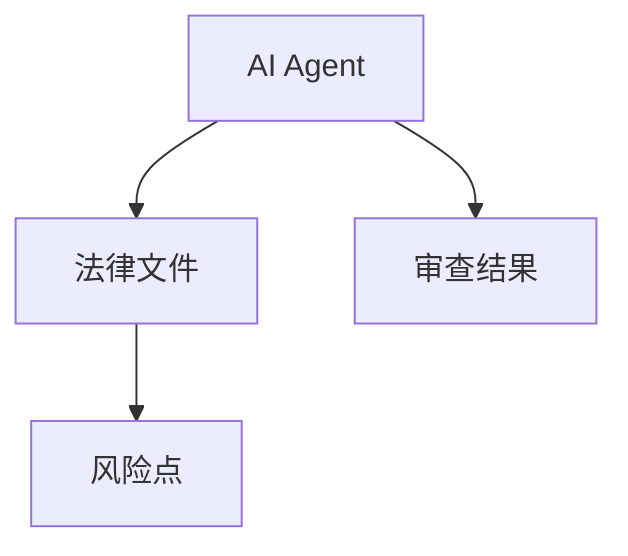
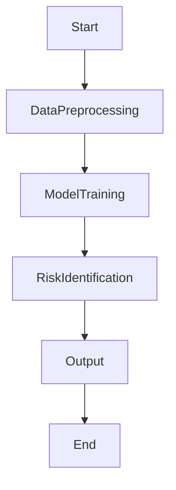
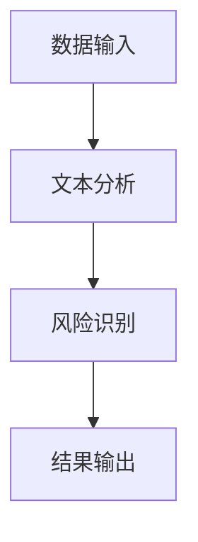
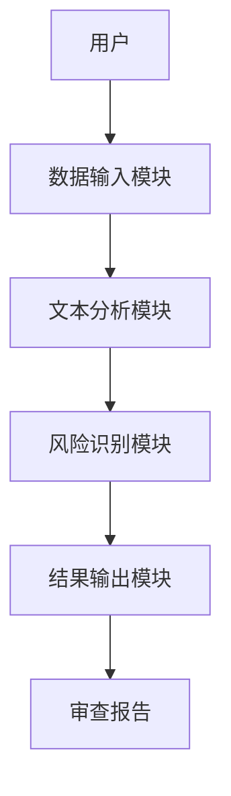

                 


# AI Agent在企业法律文件审查与风险识别中的自动化应用

> **关键词**：AI Agent, 法律文件审查, 风险识别, 自然语言处理, 深度学习, 企业合规  
> **摘要**：本文探讨了AI Agent在企业法律文件审查与风险识别中的应用，详细介绍了其背景、核心概念、算法原理及系统架构设计，并通过实际案例展示了其在提高效率和准确性方面的优势。

---

## 第1章 AI Agent与企业法律文件审查的背景介绍

### 1.1 问题背景与描述

#### 1.1.1 企业法律文件审查的痛点

企业日常运营中涉及大量法律文件，如合同、协议、合规性文件等。传统的法律文件审查主要依赖人工操作，存在以下痛点：

1. **效率低**：人工审查需要逐字逐句阅读，耗时长，难以处理大量文件。
2. **成本高**：需要大量专业律师参与，人工成本高昂。
3. **易出错**：人为疏忽可能导致关键条款遗漏，带来法律风险。

#### 1.1.2 AI Agent的引入与目标

AI Agent（人工智能代理）是一种能够自主感知环境、执行任务并做出决策的智能系统。引入AI Agent的目标是通过自动化技术提升法律文件审查的效率和准确性，降低企业的法律风险和运营成本。

#### 1.1.3 问题解决与边界

AI Agent在法律文件审查中的应用边界主要在于其技术能力的限制。目前，AI Agent可以有效处理标准化的法律文件，但对于复杂的法律问题仍需结合人工审查。

---

### 1.2 AI Agent与法律文件审查的核心概念

#### 1.2.1 AI Agent的基本原理

AI Agent通过自然语言处理（NLP）技术对法律文件进行文本分析，提取关键信息并识别潜在风险点。其核心原理包括：

1. **数据预处理**：清洗文本数据，去除噪音。
2. **特征提取**：提取文本中的关键词和短语。
3. **模型训练**：使用机器学习算法训练分类模型。
4. **风险识别**：基于模型预测潜在法律风险。

#### 1.2.2 法律文件审查的关键要素

法律文件审查的关键要素包括：

1. **合同条款**：如违约责任、付款条件等。
2. **合规性要求**：如反垄断法、劳动法等。
3. **风险点**：如隐藏的法律责任、不合理的条款等。

#### 1.2.3 实体关系图（ER图）

通过ER图展示AI Agent与法律文件审查之间的关系：



---

## 第2章 AI Agent的算法原理与实现

### 2.1 算法原理概述

AI Agent的算法实现主要依赖以下技术：

1. **自然语言处理（NLP）**：用于文本分析和信息提取。
2. **机器学习**：用于训练分类模型，识别风险点。

#### 2.1.1 数据预处理

数据预处理是AI Agent工作的基础，包括：

1. **文本清洗**：去除停用词、标点符号等。
2. **分词处理**：将文本分割成词语或短语。
3. **向量化**：将文本转换为向量表示（如词袋模型、TF-IDF）。

#### 2.1.2 模型训练

使用深度学习模型（如LSTM）进行训练，目标是将文本分类为“高风险”或“低风险”。

#### 2.1.3 风险识别

基于训练好的模型，AI Agent可以快速识别法律文件中的潜在风险点。

### 2.2 算法实现流程

#### 2.2.1 算法流程图



#### 2.2.2 数学模型与公式

1. **概率论基础**：贝叶斯定理用于分类任务。
   $$ P(A|B) = \frac{P(B|A)P(A)}{P(B)} $$

2. **深度学习模型**：如LSTM的前向传播。
   $$ y = f(x; \theta) $$

---

## 第3章 系统分析与架构设计

### 3.1 问题场景分析

#### 3.1.1 典型场景

企业法律文件审查的典型场景包括：

1. **合同审查**：识别违约条款、付款条件等。
2. **合规性检查**：确保文件符合相关法律法规。

#### 3.1.2 系统目标

设计一个高效的AI Agent系统，能够自动审查法律文件并识别潜在风险。

### 3.2 系统功能设计

#### 3.2.1 领域模型

领域模型展示了AI Agent在法律文件审查中的核心功能模块：



#### 3.2.2 系统架构设计

系统架构设计包括以下几个部分：

1. **数据输入模块**：接收法律文件。
2. **文本分析模块**：提取关键信息。
3. **风险识别模块**：识别潜在风险点。
4. **结果输出模块**：生成审查报告。

#### 3.2.3 系统架构图



---

## 第4章 项目实战

### 4.1 环境安装

安装必要的Python库：

```bash
pip install tensorflow keras numpy
```

### 4.2 核心代码实现

```python
import tensorflow as tf
from tensorflow.keras import layers

# 定义模型
model = tf.keras.Sequential()
model.add(layers.Embedding(input_dim=10000, output_dim=16))
model.add(layers.LSTM(64))
model.add(layers.Dense(1, activation='sigmoid'))

# 编译模型
model.compile(optimizer='adam', loss='binary_crossentropy', metrics=['accuracy'])

# 训练模型
model.fit(x_train, y_train, epochs=10, batch_size=32)
```

### 4.3 实际案例分析

以一份合同为例，展示AI Agent如何识别潜在风险：

1. **输入合同文本**：提取关键词如“违约责任”、“付款条件”。
2. **模型预测**：预测合同的风险等级。
3. **输出结果**：生成审查报告，指出潜在风险点。

---

## 第5章 最佳实践与小结

### 5.1 最佳实践

1. **数据质量**：确保训练数据的多样性和代表性。
2. **模型优化**：定期更新模型，提升准确率。
3. **人机结合**：AI Agent辅助人工审查，确保复杂问题的处理。

### 5.2 小结

AI Agent在企业法律文件审查中的应用显著提升了效率和准确性，为企业合规运营提供了有力支持。未来，随着技术的不断进步，AI Agent将在更多领域发挥重要作用。

---

**作者**：AI天才研究院/AI Genius Institute & 禅与计算机程序设计艺术 /Zen And The Art of Computer Programming

