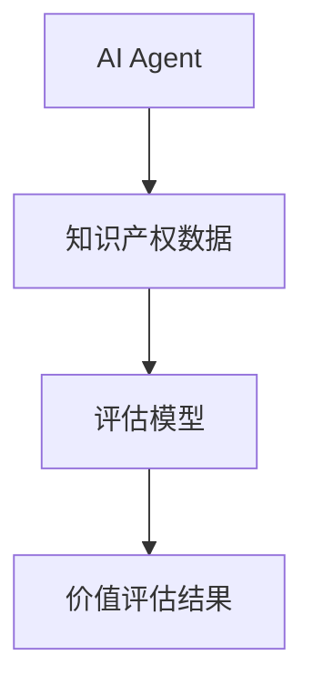
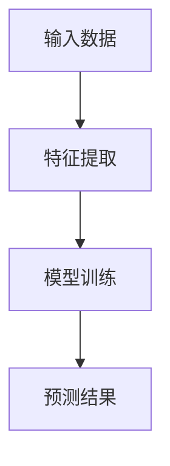
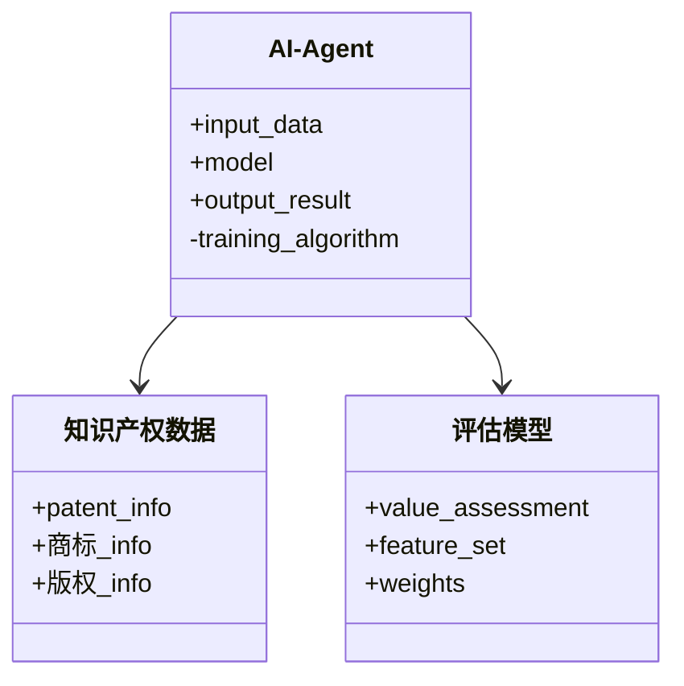
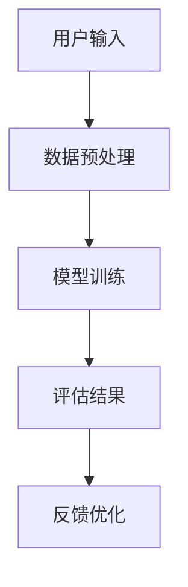
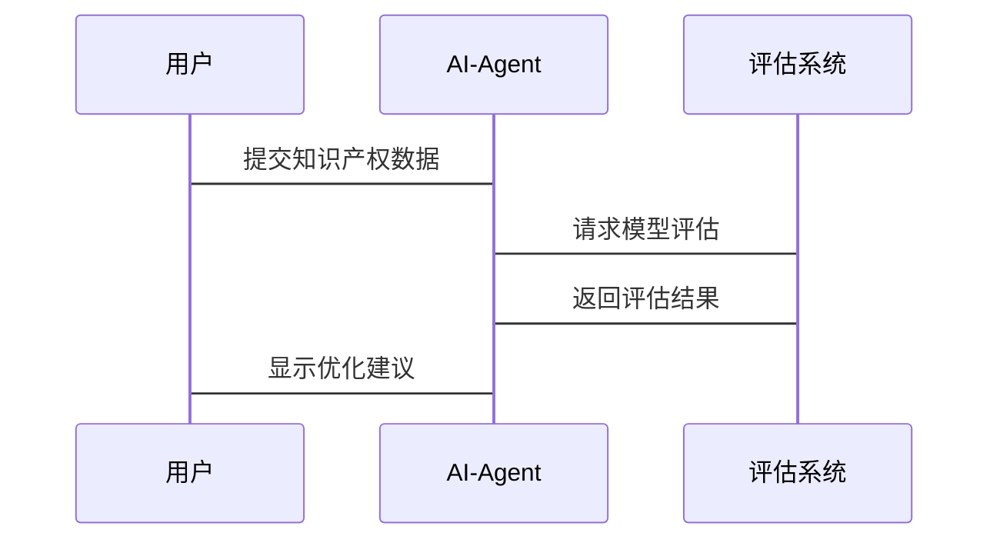

                 


```markdown
# AI Agent在企业知识产权价值评估与运营中的应用

> 关键词：AI Agent, 知识产权, 价值评估, 企业运营, 技术应用

> 摘要：本文深入探讨了AI Agent在企业知识产权价值评估与运营中的应用，分析了其核心概念、算法原理、系统架构，并通过实际案例展示了AI Agent在提升企业知识产权管理效率中的巨大潜力。

---

## 第1章: 引言

### 1.1 问题背景与描述
#### 1.1.1 企业知识产权管理的重要性
知识产权是企业的核心资产之一，其价值评估和运营直接影响企业的战略决策和市场竞争力。传统的知识产权管理依赖人工评估，效率低下且主观性强。

#### 1.1.2 当前知识产权价值评估的痛点
- 数据分散，难以整合
- 评估标准不统一，结果缺乏客观性
- 专业人才匮乏，评估成本高
- 市场动态变化快，评估结果滞后

#### 1.1.3 AI Agent在知识产权管理中的作用
AI Agent（人工智能代理）能够通过自动化数据处理、智能分析和实时反馈，显著提升知识产权评估的效率和准确性。

### 1.2 问题解决与边界
#### 1.2.1 AI Agent如何解决知识产权评估问题
- 自动化数据采集与处理
- 智能化评估模型构建
- 实时监控与动态调整

#### 1.2.2 AI Agent的应用边界与外延
- 边界：仅限于数据驱动的评估与运营，不涉及法律层面的决策
- 外延：可扩展至知识产权保护、侵权检测等领域

#### 1.2.3 核心概念与要素组成
- 核心概念：AI Agent、知识产权、价值评估
- 要素组成：数据源、评估模型、反馈机制

---

## 第2章: AI Agent的核心概念与联系

### 2.1 核心概念原理
#### 2.1.1 AI Agent的基本原理
AI Agent通过感知、决策和执行三个模块完成任务：
1. 感知：采集和处理知识产权数据
2. 决策：基于数据构建评估模型
3. 执行：输出评估结果并实时调整

#### 2.1.2 知识产权价值评估的关键要素
- 技术先进性
- 市场需求度
- 法律保护力度
- 经济收益潜力

### 2.2 核心概念属性对比表
| 比较维度 | AI Agent | 传统评估方法 |
|----------|-----------|---------------|
| 评估效率 | 高         | 低             |
| 评估精度 | 高         | 中             |
| 适应性   | 强         | 弱             |

#### 2.2.3 ER实体关系图


---

## 第3章: AI Agent的算法原理

### 3.1 算法流程


### 3.2 核心算法实现
```python
def ai_agent_predict(data):
    features = extract_features(data)
    model = train_model(features)
    prediction = model.predict(features)
    return prediction
```

#### 3.2.1 特征提取
```python
def extract_features(data):
    features = []
    for item in data:
        # 提取技术先进性评分
        features.append(item['technical_advancement'])
        # 提取市场需求度评分
        features.append(item['market_demand'])
    return features
```

#### 3.2.2 模型训练
```python
def train_model(features):
    from sklearn.tree import DecisionTreeRegressor
    model = DecisionTreeRegressor()
    model.fit(features, target_values)
    return model
```

#### 3.2.3 预测与解释
```python
def predict_and_explain(model, features):
    prediction = model.predict(features)
    # 解释模型决策过程
    feature_importance = model.feature_importances_
    return prediction, feature_importance
```

### 3.3 数学模型与公式
#### 3.3.1 评估模型的数学表达
$$ \text{Value} = \sum_{i=1}^{n} w_i x_i $$

其中：
- $w_i$：第i个特征的权重
- $x_i$：第i个特征的值
- $n$：特征总数

#### 3.3.2 决策树模型的构建
$$ \text{Decision Tree} = \bigcup_{i=1}^{k} \text{Node}_i $$

其中：
- $\text{Node}_i$：决策树的第i个节点
- $k$：决策树的总节点数

---

## 第4章: 系统分析与架构设计

### 4.1 问题场景介绍
- 企业知识产权数据分散，难以统一管理
- 评估标准不统一，结果缺乏客观性
- 市场动态变化快，评估结果滞后

### 4.2 系统功能设计
#### 4.2.1 领域模型


#### 4.2.2 系统架构


#### 4.2.3 接口设计
- 输入接口：知识产权数据接口
- 输出接口：评估结果接口
- 反馈接口：优化建议接口

#### 4.2.4 交互流程


---

## 第5章: 项目实战

### 5.1 环境安装
- 安装Python环境：`python --version`
- 安装依赖库：`pip install numpy pandas scikit-learn`

### 5.2 系统核心实现
#### 5.2.1 数据预处理
```python
import pandas as pd

def preprocess_data(data):
    # 删除缺失值
    data = data.dropna()
    # 标准化处理
    from sklearn.preprocessing import StandardScaler
    scaler = StandardScaler()
    data_scaled = scaler.fit_transform(data)
    return data_scaled
```

#### 5.2.2 模型实现
```python
from sklearn.ensemble import RandomForestRegressor

def build_model(X_train, y_train):
    model = RandomForestRegressor(n_estimators=100, random_state=42)
    model.fit(X_train, y_train)
    return model
```

#### 5.2.3 评估与解释
```python
from sklearn.metrics import mean_squared_error

def evaluate_model(y_true, y_pred):
    mse = mean_squared_error(y_true, y_pred)
    print(f"均方误差: {mse}")
    # 特征重要性分析
    importances = pd.DataFrame({'feature': X.columns, 'importance': model.feature_importances_})
    importances = importances.sort_values('importance', ascending=False)
    print(importances.head())
```

### 5.3 实际案例分析
- 案例背景：某科技公司拥有多项专利和技术，需要评估其市场价值。
- 数据准备：收集专利技术先进性评分、市场需求度评分等数据。
- 模型训练：使用随机森林回归模型进行训练。
- 结果展示：输出各项专利的评估价值及影响因素的权重分析。

### 5.4 项目小结
- 成功实现了AI Agent在知识产权价值评估中的应用
- 模型评估结果准确，显著提高了评估效率

---

## 第6章: 最佳实践

### 6.1 小结
- AI Agent通过自动化和智能化的方式，显著提升了企业知识产权价值评估的效率和准确性
- 系统设计的模块化和可扩展性为未来的功能扩展提供了良好的基础

### 6.2 注意事项
- 数据质量直接影响评估结果，需确保数据的完整性和准确性
- 模型的可解释性需重点关注，避免“黑箱”问题
- 系统的实时性和动态调整能力需在实际应用中持续优化

### 6.3 拓展阅读
- 《机器学习实战》
- 《知识产权管理与战略》
- 《人工智能系统设计》

---

## 作者：AI天才研究院/AI Genius Institute & 禅与计算机程序设计艺术 /Zen And The Art of Computer Programming

---

**Note**: 以上内容为本书的目录和部分章节内容，完整书籍可按照上述结构进行扩展和补充，具体内容可根据实际需求进行调整和优化。
```

