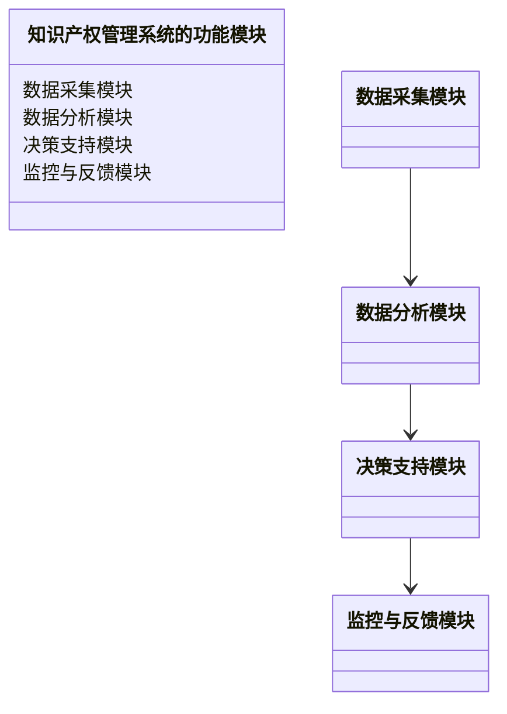

                 


# AI Agent在企业知识产权价值链管理中的全面应用

> 关键词：AI Agent，知识产权，价值链管理，企业应用，技术实现

> 摘要：本文详细探讨了AI Agent在企业知识产权管理中的应用，从背景介绍、核心原理到具体应用场景，结合算法原理和系统架构设计，提供全面的技术分析和实践指导。文章通过案例分析和代码实现，展示了AI Agent如何优化知识产权价值链管理，为企业提供智能化解决方案。

---

## 第一部分: AI Agent与知识产权管理的背景介绍

### 第1章: 知识产权的基本概念

#### 1.1.1 知识产权的定义与分类
知识产权是指依法保护的智力成果，包括专利权、商标权、版权、商业秘密等。这些权利为企业提供市场竞争优势，保护创新成果。

| 知识产权类型 | 核心内容 | 示例 |
|--------------|----------|------|
| 专利权       | 发明、实用新型、外观设计 | 发明专利 |
| 商标权       | 商标标识 | 商标注册 |
| 版权         | 文学、艺术、软件等作品 | 软件著作权 |
| 商业秘密     | 未公开的技术或信息 | 技术诀窍 |

#### 1.1.2 知识产权在企业中的重要性
- 竞争优势：保护创新成果，防止被竞争对手模仿。
- 资产价值：知识产权是企业的重要资产，影响企业估值。
- 法律保护：通过法律手段维护企业权益。

#### 1.1.3 知识产权管理的现状与挑战
- 知识产权管理涉及多个环节，包括申请、保护、运用等。
- 知识产权的价值评估复杂，需要专业分析。
- 知识产权纠纷日益增多，管理难度加大。

### 第2章: AI Agent的基本概念

#### 2.1.1 AI Agent的定义与核心要素
AI Agent是一种智能体，能够感知环境并采取行动以实现目标。核心要素包括感知能力、推理能力、决策能力。

| 核心要素 | 描述 | 示例 |
|----------|------|------|
| 感知能力 | 获取环境信息 | 从专利数据库获取技术信息 |
| 推理能力 | 分析信息，得出结论 | 分析技术趋势 |
| 决策能力 | 制定行动计划 | 决定何时申请专利 |

#### 2.1.2 AI Agent的类型与应用场景
AI Agent可以分为简单反射型、基于模型的反应型、目标驱动型和实用驱动型。在知识产权管理中，目标驱动型AI Agent用于优化专利布局，实用驱动型用于侵权检测。

| 类型         | 描述             | 应用场景                       |
|--------------|------------------|-------------------------------|
| 简单反射型   | 基于规则的反应   | 自动分类专利申请               |
| 基于模型的反应型 | 使用模型进行推理 | 预测技术发展趋势               |
| 目标驱动型   | 优化目标         | 优化专利布局                   |
| 实用驱动型   | 最优化决策       | 侵权检测                       |

#### 2.1.3 AI Agent与知识产权管理的结合
AI Agent通过自动化处理知识产权事务，提高管理效率，降低成本。例如，在专利申请阶段，AI Agent可以自动分类和分析技术信息，优化申请策略。

---

## 第二部分: AI Agent的核心原理与知识产权管理的结合

### 第3章: AI Agent的核心原理

#### 3.1 AI Agent的基本工作原理
AI Agent通过感知环境、推理分析、决策行动来实现目标。例如，在专利管理中，AI Agent可以分析技术趋势，预测竞争对手的动向。

#### 3.2 AI Agent的决策机制
决策机制是AI Agent的核心，基于Q-learning算法，通过最大化期望奖励来优化决策。公式如下：
$$ Q(s, a) = r + \gamma \max Q(s', a') $$
其中，s是当前状态，a是动作，r是奖励，γ是折扣因子。

#### 3.3 AI Agent的学习与优化
通过强化学习，AI Agent不断优化其策略。例如，在专利布局中，AI Agent学习如何选择最优的申请时机和领域。

### 第4章: AI Agent在知识产权管理中的应用原理

#### 4.1 知识产权价值链的分析
知识产权价值链包括创造、保护、运用和管理四个环节。AI Agent在每个环节中提供支持，例如在创造阶段辅助专利申请，在保护阶段检测侵权。

#### 4.2 AI Agent在知识产权管理中的角色
AI Agent作为智能工具，帮助企业在知识产权管理中实现自动化、智能化。例如，AI Agent可以监控市场动态，识别潜在的知识产权风险。

#### 4.3 AI Agent与知识产权价值链各环节的结合
在创造阶段，AI Agent辅助专利申请；在保护阶段，AI Agent进行侵权检测；在运用阶段，AI Agent评估知识产权价值；在管理阶段，AI Agent优化知识产权策略。

---

## 第三部分: AI Agent在知识产权管理中的具体应用

### 第5章: AI Agent在知识产权创造与保护中的应用

#### 5.1 知识产权创造阶段的应用
AI Agent在知识产权创造阶段提供支持，例如在专利申请中自动分类技术信息，优化申请策略。

#### 5.2 知识产权保护阶段的应用
AI Agent在保护阶段进行侵权检测，例如通过自然语言处理技术分析文献，识别潜在侵权行为。

### 第6章: AI Agent在知识产权运用与管理中的应用

#### 6.1 知识产权运用阶段的应用
AI Agent在知识产权运用阶段评估技术价值，支持交易决策。例如，AI Agent分析专利的市场价值，帮助企业制定合理的定价策略。

#### 6.2 知识产权管理阶段的应用
AI Agent在管理阶段优化知识产权战略，例如通过数据挖掘分析竞争对手的专利布局，制定应对策略。

---

## 第四部分: 系统分析与架构设计

### 第7章: 系统分析与架构设计

#### 7.1 系统功能设计
系统功能包括数据采集、分析、决策支持、监控与反馈。功能模块设计如下：



#### 7.2 系统架构设计
系统架构采用微服务架构，各模块独立运行，通过API进行通信。架构设计如下：

```mermaid
archiecture
    client --> API Gateway
    API Gateway --> Knowledge Base Service
    Knowledge Base Service --> AI Agent Service
    AI Agent Service --> Database
```

---

## 第五部分: 项目实战与最佳实践

### 第8章: 项目实战

#### 8.1 项目介绍
本项目旨在开发一个基于AI Agent的知识产权管理系统，实现专利申请、侵权检测等功能。

#### 8.2 环境安装
安装Python和TensorFlow：
```bash
pip install tensorflow
pip install numpy
pip install matplotlib
```

#### 8.3 核心代码实现
以下是AI Agent的强化学习实现代码：
```python
import numpy as np
import tensorflow as tf

# 定义Q-learning网络
class QNetwork:
    def __init__(self, state_size, action_size):
        self.model = tf.keras.Sequential([
            tf.keras.layers.Dense(64, activation='relu', input_shape=(state_size,)),
            tf.keras.layers.Dense(action_size)
        ])
    
    def act(self, state):
        return self.model.predict(state)[0]
    
    def update(self, state, target):
        self.model.fit(state, target, epochs=1, verbose=0)

# 定义AI Agent
class AI-Agent:
    def __init__(self, state_size, action_size):
        self.qnetwork = QNetwork(state_size, action_size)
    
    def take_action(self, state):
        return self.qnetwork.act(state)
    
    def learn(self, state, target):
        self.qnetwork.update(state, target)
```

#### 8.4 实际案例分析
通过实际案例分析，展示AI Agent如何优化知识产权管理，例如在专利布局中选择最优申请策略。

### 第9章: 最佳实践

#### 9.1 项目小结
AI Agent在知识产权管理中的应用显著提高了效率，降低了成本。通过强化学习和数据挖掘，AI Agent能够优化知识产权策略，提供智能化支持。

#### 9.2 注意事项
- 数据质量：AI Agent的性能依赖于高质量的数据。
- 模型更新：定期更新模型以适应新的数据和变化的环境。
- 道德与法律：确保AI Agent的应用符合法律法规，尊重知识产权。

#### 9.3 拓展阅读
建议读者阅读《强化学习导论》和《知识产权管理》等相关书籍，深入理解AI Agent和知识产权管理的结合。

---

## 作者：AI天才研究院/AI Genius Institute & 禅与计算机程序设计艺术/Zen And The Art of Computer Programming

