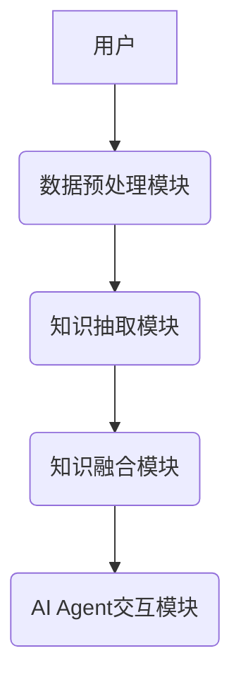
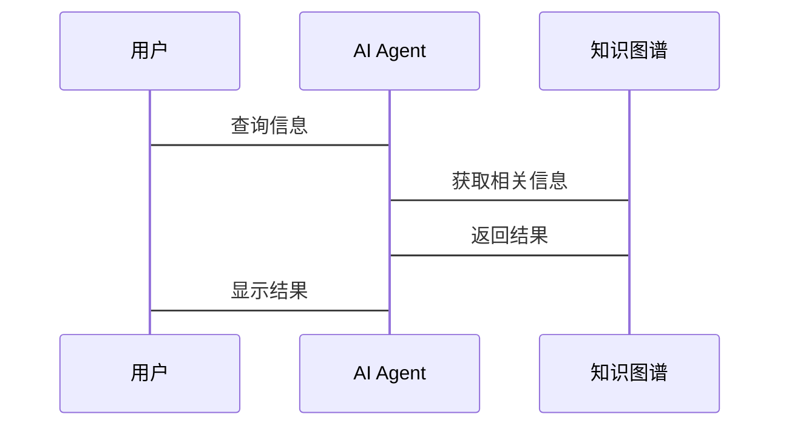

                 


# AI Agent在企业知识图谱构建与应用中的作用

> 关键词：知识图谱，AI Agent，企业应用，算法原理，系统架构，项目实战

> 摘要：本文深入探讨AI Agent在企业知识图谱构建与应用中的关键作用，涵盖知识图谱基础、AI Agent基础、两者结合的核心概念、算法原理、系统架构设计、项目实战以及最佳实践等内容，为企业智能化转型提供理论支持和实践指导。

---

## 第1章 知识图谱基础

### 1.1 知识图谱的定义与特点

#### 1.1.1 知识图谱的定义
知识图谱是一种以图结构形式表示知识的数据模型，由实体（节点）和关系（边）组成，用于描述现实世界中的概念及其联系。例如，知识图谱可以表示“苹果是水果的一种”这样的语义信息。

#### 1.1.2 知识图谱的核心特点
- **语义化**：通过关系和属性描述实体间的语义联系。
- **结构化**：数据以结构化的形式组织，便于计算机理解和处理。
- **动态更新**：能够根据实时数据动态更新和扩展。

#### 1.1.3 知识图谱的构建流程
知识图谱的构建通常包括以下步骤：
1. 数据收集：从多种数据源（如数据库、文本、API等）获取数据。
2. 数据清洗：去除噪声数据，确保数据质量。
3. 实体识别：通过NLP技术从文本中提取实体。
4. 实体链接：将提取的实体进行唯一标识，并建立实体间的关联。
5. 知识融合：将多个来源的数据进行整合，消除冗余和冲突。
6. 知识存储：将构建的知识图谱存储在图数据库中。

### 1.2 知识图谱的表示与存储

#### 1.2.1 知识图谱的表示方法
知识图谱常用的表示方法包括：
- **RDF（Resource Description Framework）**：三元组（主语-谓词-宾语）表示法。
- **N-Triples**：基于文本的三元组表示法。
- **JSON-LD**：基于JSON的轻量级数据交换格式。

#### 1.2.2 知识图谱的存储技术
- **图数据库**：如Neo4j，支持高效的图结构查询。
- **关系型数据库**：如MySQL，适合结构化数据存储。
- **分布式存储系统**：如Hadoop，适合大规模数据存储。

#### 1.2.3 知识图谱的标准化表示
知识图谱的标准化表示有助于不同系统之间的互操作性，常用的标准包括：
- **Schema.org**：定义网页结构的标准化模式。
- **Wikidata**：基于知识图谱的开放知识库。

---

## 第2章 AI Agent基础

### 2.1 AI Agent的定义与特点

#### 2.1.1 AI Agent的定义
AI Agent是一种智能实体，能够感知环境、自主决策并执行任务，以实现特定目标。例如，智能助手Siri可以理解用户的指令并执行相应的操作。

#### 2.1.2 AI Agent的核心特点
- **自主性**：能够在没有外部干预的情况下独立运行。
- **反应性**：能够根据环境变化实时调整行为。
- **学习能力**：能够通过经验改进性能。

#### 2.1.3 AI Agent与传统AI的区别
| 特性 | 传统AI | AI Agent |
|------|---------|----------|
| 运行模式 | 执行预定义任务 | 自主决策和行动 |
| 适应性 | 有限 | 强大 |
| 应用场景 | 数据分析、模式识别 | 机器人控制、智能推荐 |

### 2.2 AI Agent的分类与应用场景

#### 2.2.1 AI Agent的分类
- **基于规则的AI Agent**：通过预定义的规则进行决策，适用于任务简单且规则明确的场景。
- **基于模型的AI Agent**：利用数学模型进行决策，适用于复杂动态环境。
- **基于学习的AI Agent**：通过机器学习算法进行训练，能够从经验中学习和改进。

#### 2.2.2 AI Agent的主要应用场景
- **智能客服**：通过自然语言处理技术为用户提供咨询服务。
- **自动化决策**：在金融、医疗等领域进行智能决策。
- **个性化推荐**：根据用户行为推荐相关内容或产品。

#### 2.2.3 AI Agent在企业中的潜在价值
- 提高效率：自动化处理重复性任务。
- 降低成本：通过智能决策优化资源配置。
- 增强决策能力：利用知识图谱提供更精准的信息支持。

---

## 第3章 知识图谱与AI Agent的核心概念与联系

### 3.1 知识图谱与AI Agent的核心概念
知识图谱提供丰富的语义信息，AI Agent则利用这些信息进行智能推理和决策。

### 3.2 知识图谱与AI Agent的概念属性特征对比

| 特性 | 知识图谱 | AI Agent |
|------|---------|----------|
| 表示形式 | 图结构 | 行为逻辑 |
| 动态性 | 静态 | 动态 |
| 交互性 | 单向 | 双向 |
| 目标 | 描述知识 | 实现目标 |

### 3.3 知识图谱与AI Agent的ER实体关系图

```mermaid
er
actor: 用户
agent: AI Agent
knowledge_graph: 知识图谱
action: 行为
```

---

## 第4章 知识图谱与AI Agent的算法原理

### 4.1 知识图谱构建算法

#### 4.1.1 基于规则的实体识别
```python
def extract_entities(text):
    # 使用正则表达式提取实体
    pattern = r'\b[A-Z][a-z]+\b'
    entities = re.findall(pattern, text)
    return entities
```

#### 4.1.2 基于统计的实体链接
```python
def link_entities(entities, knowledge_base):
    # 使用统计模型进行实体链接
    linked_entities = []
    for entity in entities:
        max_count = 0
        most_likely_entity = entity
        for candidate in knowledge_base:
            if entity == candidate['name']:
                if candidate['count'] > max_count:
                    max_count = candidate['count']
                    most_likely_entity = candidate['id']
        linked_entities.append(most_likely_entity)
    return linked_entities
```

#### 4.1.3 知识图谱的融合与对齐
通过将多个来源的数据进行匹配和合并，消除冗余和冲突。

### 4.2 AI Agent相关算法

#### 4.2.1 Q-learning算法
```python
def q_learning(state, action, reward, next_state):
    # 更新Q值表
    alpha = 0.1  # 学习率
    gamma = 0.9  # 折扣因子
    current_q = q_table[state][action]
    next_max_q = max(q_table[next_state].values())
    new_q = current_q + alpha * (reward + gamma * next_max_q - current_q)
    q_table[state][action] = new_q
```

#### 4.2.2 DQN（深度Q网络）
使用深度神经网络近似Q值函数，适用于高维状态空间。

---

## 第5章 系统分析与架构设计

### 5.1 问题场景介绍
企业知识图谱构建需要解决数据异构、语义理解、动态更新等问题，同时AI Agent需要具备语义理解、智能推理和自主决策能力。

### 5.2 系统功能设计
- 数据预处理模块：清洗和转换数据。
- 知识抽取模块：从数据中提取实体和关系。
- 知识融合模块：合并多个数据源的信息。
- AI Agent交互模块：与用户进行自然语言交互。

### 5.3 系统架构设计


### 5.4 系统接口设计
- 数据接口：与数据库、API交互。
- 用户接口：图形化界面或命令行接口。

### 5.5 系统交互流程


---

## 第6章 项目实战

### 6.1 环境安装与配置
- Python 3.8+
- 图数据库：Neo4j
- 机器学习库：TensorFlow、Scikit-learn
- 自然语言处理库：spaCy、NLTK

### 6.2 核心代码实现

#### 知识图谱构建代码
```python
from neo4j import GraphDatabase
from neo4j.exceptions import ServiceUnavailable

class KnowledgeGraph:
    def __init__(self, uri, user, password):
        self.driver = GraphDatabase.driver(uri, auth=(user, password))
    
    def add_entity(self, entity_name):
        with self.driver.session() as session:
            session.run("CREATE (:Entity {name: $entity})", entity=entity_name)
    
    def add_relation(self, entity1, relation, entity2):
        with self.driver.session() as session:
            session.run("MATCH (e1:Entity {name: $e1}), (e2:Entity {name: $e2}) "
                        "CREATE (e1)-[r:$relation]->(e2)",
                        e1=entity1, relation=relation, e2=entity2)
```

#### AI Agent代码实现
```python
class AIAssistant:
    def __init__(self, knowledge_graph):
        self.kg = knowledge_graph
    
    def query_knowledge(self, question):
        # 简单的基于关键词的问答
        entities = extract_entities(question)
        if entities:
            for entity in entities:
                self.kg.add_entity(entity)
            return "已更新知识库，请重新提问。"
        else:
            return "未能提取有效信息，请重新提问。"
```

### 6.3 项目案例分析
以企业客户关系管理为例，构建客户信息的知识图谱，并通过AI Agent进行智能查询和分析。

---

## 第7章 最佳实践与小结

### 7.1 最佳实践
- 数据质量管理：确保数据的准确性和多样性。
- 知识图谱更新：定期更新以保持信息的时效性。
- AI Agent设计：注重可解释性和透明性，便于用户理解和信任。

### 7.2 小结
AI Agent在企业知识图谱构建与应用中具有重要意义，能够提升企业的智能化水平，优化决策流程，为企业创造更大的价值。

### 7.3 展望
未来，随着AI技术的不断发展，知识图谱与AI Agent的结合将更加紧密，为企业带来更智能化、个性化的服务。

---

## 附录：参考文献和扩展阅读

- [1] 知识图谱相关文献
- [2] AI Agent相关文献
- [3] 图数据库相关文献
- [4] 机器学习相关文献
- [5] 自然语言处理相关文献

---

## 作者信息

作者：AI天才研究院/AI Genius Institute & 禅与计算机程序设计艺术 /Zen And The Art of Computer Programming

