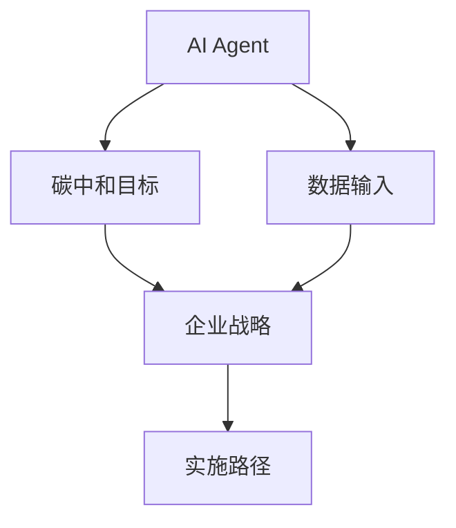
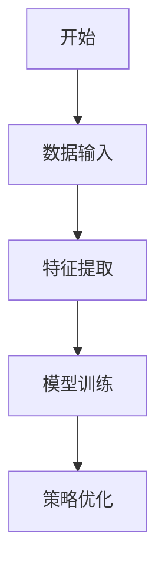
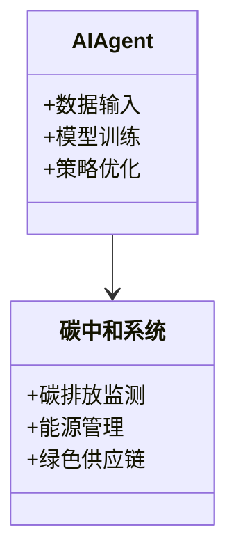
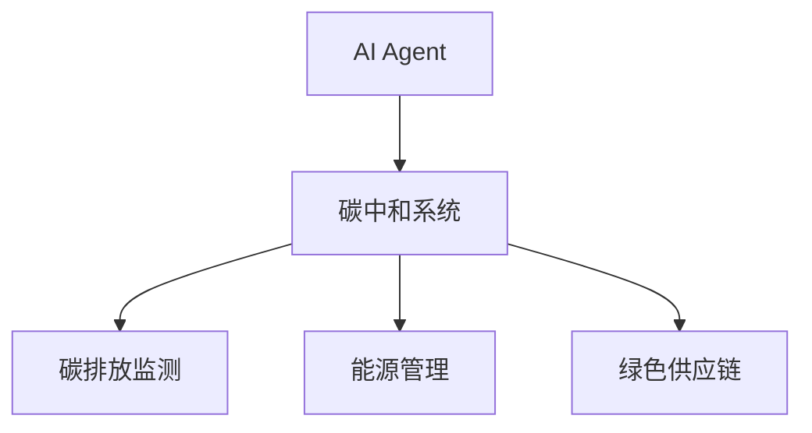
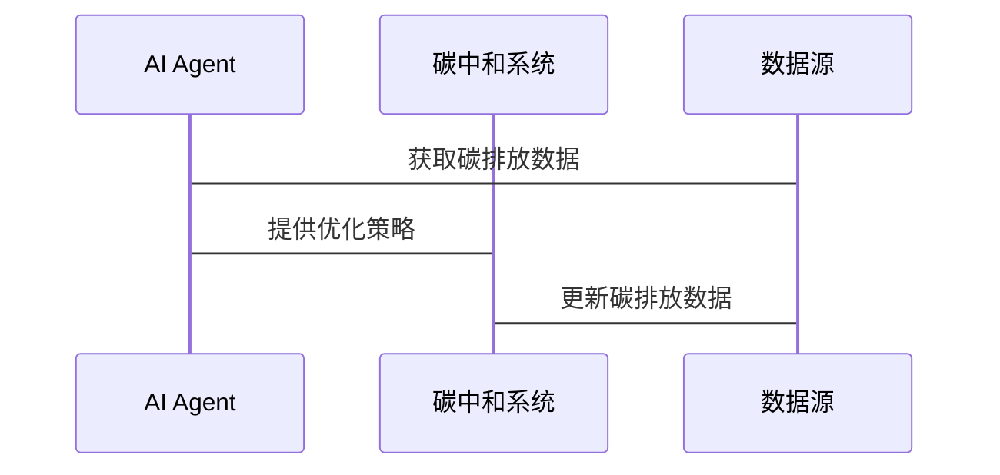

                 


```markdown
# AI Agent在企业碳中和战略规划与实施中的全面应用

> 关键词：AI Agent，碳中和，企业战略，算法原理，系统架构

> 摘要：本文详细探讨了AI Agent在企业碳中和战略规划与实施中的全面应用。通过分析AI Agent的核心概念、算法原理、系统架构设计以及实际案例，展示了AI技术在企业碳中和中的巨大潜力和实际价值。文章从理论到实践，结合技术细节和实际应用，为企业制定和实施碳中和战略提供了有力的技术支持和实践指导。

---

## 第一部分: AI Agent在企业碳中和战略规划与实施中的应用概述

### 第1章: 企业碳中和与AI Agent的背景介绍

#### 1.1 企业碳中和的目标与意义
企业碳中和的目标是通过减少温室气体排放，实现企业在生产、运营和供应链中的碳中和。这不仅是企业履行社会责任的重要途径，也是企业实现可持续发展的重要战略。AI Agent在其中扮演着关键角色，它能够通过数据驱动的方式优化企业碳中和的规划和实施过程。

#### 1.2 AI Agent的基本概念
AI Agent是一种智能体，能够感知环境、自主决策并执行任务。它具备智能性、自主性和适应性等特点，能够在复杂环境中优化资源分配和决策过程。

#### 1.3 企业碳中和与AI Agent的结合背景
随着碳中和目标的提出，企业需要更加高效和智能的工具来优化其碳排放管理。AI Agent通过数据驱动的方式，能够帮助企业制定更科学的碳中和战略，并实时监控和调整实施过程。

### 第2章: AI Agent在企业碳中和中的核心概念与联系

#### 2.1 AI Agent的核心概念原理
AI Agent的核心原理包括强化学习、机器学习和多智能体协作机制。这些技术使其能够根据实时数据和环境变化，动态调整策略，实现最优决策。

#### 2.2 核心概念属性特征对比表格
| 概念       | 属性特征             |
|------------|----------------------|
| AI Agent   | 智能性、自主性、适应性 |
| 碳中和     | 减碳目标、数据驱动、系统性 |

#### 2.3 ER实体关系图架构


### 第3章: AI Agent在企业碳中和中的算法原理

#### 3.1 算法原理概述
AI Agent在企业碳中和中的算法主要包括强化学习、机器学习和多智能体协作机制。这些算法能够帮助企业优化碳排放管理，预测碳排放趋势，并制定最优的碳中和策略。

#### 3.2 算法流程图


#### 3.3 算法数学模型
强化学习的数学模型可以表示为：
$$
Q(s, a) = r + \gamma \max_{a'} Q(s', a')
$$
其中，$Q$ 表示状态-动作值函数，$s$ 表示状态，$a$ 表示动作，$\gamma$ 表示折扣因子。

---

## 第二部分: AI Agent在企业碳中和中的系统架构设计

### 第4章: 系统架构设计

#### 4.1 问题场景介绍
企业碳中和涉及复杂的系统架构，包括数据采集、模型训练、决策优化和实施监控等多个环节。AI Agent需要在这些环节中协同工作，实现整体优化。

#### 4.2 项目介绍
本项目旨在设计一个基于AI Agent的企业碳中和管理系统，涵盖碳排放监测、能源管理、绿色供应链优化等功能。

#### 4.3 系统功能设计
##### 4.3.1 领域模型


#### 4.4 系统架构设计
##### 4.4.1 系统架构


#### 4.5 系统接口设计
系统接口包括数据输入接口、模型训练接口和策略优化接口。这些接口需要与企业现有的系统无缝集成。

#### 4.6 系统交互设计
##### 4.6.1 交互流程


---

## 第三部分: 项目实战

### 第5章: 项目实战

#### 5.1 环境安装
安装必要的工具和库，例如Python、TensorFlow、Keras等。

#### 5.2 核心代码实现
##### 5.2.1 数据预处理
```python
import pandas as pd

data = pd.read_csv('carbon_emission.csv')
data.head()
```

##### 5.2.2 模型训练
```python
import tensorflow as tf
from tensorflow.keras import layers

model = tf.keras.Sequential([
    layers.Dense(64, activation='relu'),
    layers.Dense(1, activation='linear')
])
model.compile(optimizer='adam', loss='mean_squared_error')
model.fit(data, labels, epochs=100, batch_size=32)
```

#### 5.3 案例分析
通过实际案例分析，展示AI Agent在企业碳中和中的具体应用和效果。

#### 5.4 项目总结
总结项目的实施过程和成果，提出改进建议和未来展望。

---

## 第四部分: 总结与展望

### 第6章: 总结与展望

#### 6.1 总结
本文详细探讨了AI Agent在企业碳中和战略规划与实施中的应用，通过理论分析和实际案例，展示了AI技术在碳中和中的巨大潜力。

#### 6.2 展望
未来，随着AI技术的不断发展，AI Agent在企业碳中和中的应用将更加广泛和深入。我们需要进一步研究和探索，以实现更高效、更智能的碳中和管理。

---

## 附录

### 附录A: 工具安装指南
列出安装Python、TensorFlow等工具的步骤。

### 附录B: 数据集
提供碳排放数据集的描述和获取方式。

### 附录C: 参考文献
列出本文参考的相关文献和资料。

---

## 作者

作者：AI天才研究院/AI Genius Institute & 禅与计算机程序设计艺术 /Zen And The Art of Computer Programming
```

