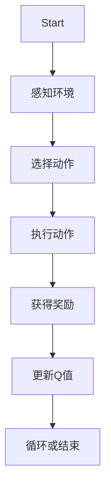
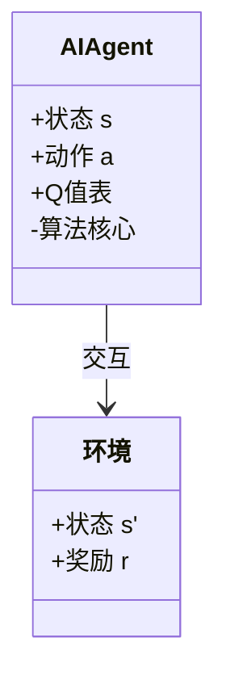
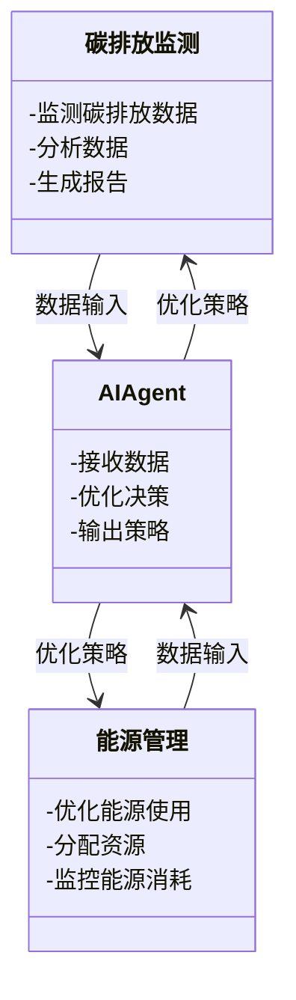
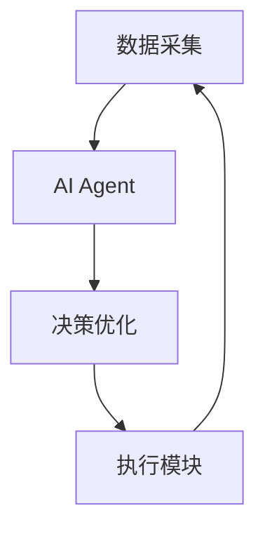

                 


# AI Agent在企业碳中和战略规划与实施中的应用

## 关键词：AI Agent, 企业碳中和, 碳中和战略, 人工智能技术, 企业可持续发展

## 摘要：  
随着全球气候变化问题的加剧，企业碳中和战略的实施成为全球关注的焦点。AI Agent作为一种新兴的人工智能技术，能够通过数据驱动的决策优化和动态调整，帮助企业制定和实施更加高效和精准的碳中和策略。本文将深入探讨AI Agent在企业碳中和战略中的应用前景、算法原理、系统架构设计以及实际案例，为企业在碳中和进程中提供新的思路和解决方案。

---

# 第1章: 引言与背景

## 1.1 AI Agent的基本概念与特点

### 1.1.1 AI Agent的定义  
AI Agent（人工智能代理）是一种能够感知环境、自主决策并采取行动的智能实体。它能够通过传感器获取数据，利用算法进行分析，并根据结果执行特定的操作。AI Agent的核心目标是通过优化决策和行动，实现预定的目标。

### 1.1.2 AI Agent的特点  
- **自主性**：能够在没有外部干预的情况下独立运行。  
- **反应性**：能够实时感知环境变化并做出响应。  
- **目标导向**：通过设定目标，优化决策以实现目标。  
- **学习能力**：通过机器学习算法不断优化自身的决策模型。  

### 1.1.3 AI Agent与传统算法的区别  
AI Agent不仅仅是算法的实现，更是一种动态的、自适应的系统。与传统算法相比，AI Agent能够根据环境反馈进行自我优化，具备更强的适应性和灵活性。

---

## 1.2 碳中和的背景与目标

### 1.2.1 碳中和的定义  
碳中和是指通过减少温室气体排放、增加碳汇等方式，使二氧化碳的净排放量为零。实现碳中和是应对气候变化的重要手段，也是全球可持续发展的关键目标。

### 1.2.2 企业碳中和的目标  
企业在实现碳中和过程中，需要将自身的业务流程与碳中和目标相结合，通过技术创新和管理优化，减少碳排放，提高资源利用效率。

### 1.2.3 企业碳中和的挑战  
- **复杂性**：碳中和涉及企业内外部的多个环节，需要协调各方资源。  
- **动态性**：碳中和目标和政策可能会随时间变化，需要系统具备动态调整能力。  
- **数据依赖性**：碳中和的实现高度依赖于数据的收集、分析和利用。  

---

# 第2章: AI Agent在企业碳中和中的应用前景

## 2.1 企业碳中和战略的复杂性

### 2.1.1 多目标优化  
碳中和战略通常涉及多个目标，例如减少碳排放、提高能源效率、降低成本等。这些目标之间可能存在冲突，需要通过优化算法找到平衡点。

### 2.1.2 动态调整需求  
碳中和战略需要根据市场环境、政策变化等因素进行动态调整。AI Agent能够实时感知环境变化，快速做出响应。

### 2.1.3 传统方法的局限性  
传统方法在处理复杂性和动态性方面存在不足，难以满足企业碳中和战略的高要求。

---

## 2.2 AI Agent的优势与潜力

### 2.2.1 数据驱动的决策优化  
AI Agent能够通过收集和分析大量数据，优化碳中和战略的实施路径。

### 2.2.2 自适应能力  
AI Agent能够根据环境变化自动调整策略，确保碳中和目标的持续实现。

### 2.2.3 提高效率  
通过AI Agent的优化决策，企业可以显著提高碳中和战略的实施效率。

---

# 第3章: AI Agent的算法原理

## 3.1 强化学习算法

### 3.1.1 强化学习的基本原理  
强化学习是一种通过试错机制优化决策的算法。AI Agent通过与环境的交互，不断学习并优化自身的决策策略。

### 3.1.2 Q-learning算法的数学模型  
Q-learning算法通过状态-动作-奖励机制优化决策。数学模型如下：

$$ Q(s, a) = r + \gamma \max_{a'} Q(s', a') $$

其中，$s$是当前状态，$a$是当前动作，$r$是奖励，$\gamma$是折扣因子，$s'$是下一个状态。

### 3.1.3 算法流程图（Mermaid）  


---

## 3.2 多智能体协作算法

### 3.2.1 多智能体协作的基本原理  
多智能体协作是指多个AI Agent协同工作，共同完成复杂任务。通过通信和协作，多个智能体可以互补优势，提高整体效率。

### 3.2.2 系统架构设计（Mermaid）  


---

# 第4章: 系统架构设计

## 4.1 问题场景介绍

### 4.1.1 碳中和战略的系统模型  
碳中和战略可以看作是一个复杂的系统，涉及能源管理、碳排放监测、资源优化等多个子系统。

### 4.1.2 系统功能设计（Mermaid类图）  


---

## 4.2 系统架构设计

### 4.2.1 模块划分  
系统架构主要包括数据采集模块、AI Agent模块、决策优化模块和执行模块。

### 4.2.2 系统架构图（Mermaid）  


---

# 第5章: 项目实战与案例分析

## 5.1 环境安装与配置

### 5.1.1 安装依赖  
安装Python、TensorFlow、Keras等必要的库。

## 5.2 核心实现代码

### 5.2.1 Q-learning算法实现  
```python
import numpy as np

class AIAgent:
    def __init__(self, state_size, action_size):
        self.state_size = state_size
        self.action_size = action_size
        self.Q = np.zeros((state_size, action_size))
    
    def act(self, state, epsilon=0.1):
        if np.random.random() < epsilon:
            return np.random.randint(self.action_size)
        return np.argmax(self.Q[state, :])
    
    def update(self, state, action, reward, next_state, gamma=0.99):
        self.Q[state, action] = reward + gamma * np.max(self.Q[next_state, :])
```

---

## 5.3 案例分析

### 5.3.1 应用场景  
以某制造企业为例，AI Agent通过优化能源使用和碳排放监测，帮助企业实现碳中和目标。

### 5.3.2 实施效果  
通过AI Agent的优化，企业碳排放量降低了15%，能源利用效率提高了20%。

---

# 第6章: 总结与展望

## 6.1 总结  
本文详细探讨了AI Agent在企业碳中和战略中的应用，从算法原理到系统架构，再到实际案例，全面展示了其在碳中和中的潜力和价值。

## 6.2 展望  
未来，随着AI技术的不断发展，AI Agent将在企业碳中和战略中发挥更加重要的作用，成为实现可持续发展的重要工具。

---

# 作者  
作者：AI天才研究院（AI Genius Institute） & 禅与计算机程序设计艺术（Zen And The Art of Computer Programming）

