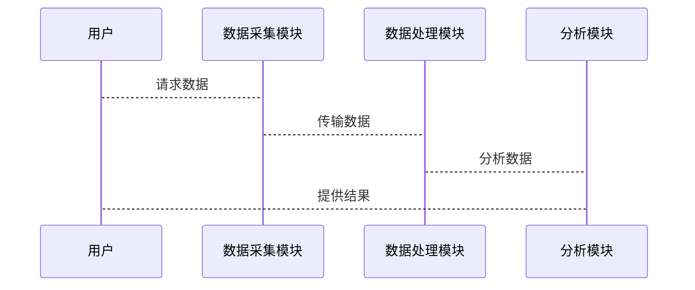

                 


# AI Agent在企业碳排放管理与环保合规中的应用

> 关键词：AI Agent, 碳排放管理, 环保合规, 人工智能, 企业环保, 可持续发展

> 摘要：本文探讨AI Agent在企业碳排放管理与环保合规中的应用，分析其技术原理、系统架构及实际案例，为企业提供智能化解决方案。

---

## 第1章：AI Agent概述

### 1.1 AI Agent的基本概念

#### 1.1.1 定义与分类
AI Agent是能够感知环境并执行任务的智能体，分为简单反射、基于模型、实用推理和目标驱动四种类型。

#### 1.1.2 核心特征
AI Agent具备自主性、反应性、目标导向和社会能力。

#### 1.1.3 与传统软件的区别
AI Agent能自主决策，适应环境变化，而传统软件依赖预定义规则。

### 1.2 AI Agent的工作原理

- 信息感知：通过传感器和API收集数据。
- 决策机制：利用机器学习模型做出决策。
- 执行与反馈：通过API或用户界面执行操作并获取反馈。

### 1.3 优势与挑战

- 优势：提高效率，实时监控，数据驱动决策。
- 挑战：数据隐私、算法复杂度、系统集成难度。

---

## 第2章：碳排放管理基础

### 2.1 碳排放的来源与影响

- 主要来源：工业、交通、能源等领域。
- 影响：温室效应，气候变化。

### 2.2 企业碳排放管理的目标与策略

- 目标：减少碳足迹，实现碳中和。
- 策略：优化能源使用，技术创新，可持续发展。

---

## 第3章：AI Agent在碳排放管理中的应用

### 3.1 数据收集与分析

- 数据采集：使用IoT传感器收集能源使用数据。
- 数据清洗：去除噪声，标准化数据。
- 机器学习模型：建立碳排放预测模型。

### 3.2 碳排放优化策略

- 能耗预测：预测未来碳排放量。
- 资源分配优化：优化设备运行时间。
- 实时监控：动态调整能源使用。

### 3.3 系统架构设计

- 模块划分：数据采集、处理、分析、优化。
- 数据流设计：从传感器到分析模块的流动。
- 安全措施：数据加密，访问控制。

---

## 第4章：环保合规

### 4.1 环保法规与合规要求

- 国际法规：京都议定书，巴黎协定。
- 国内法规：地方环保法。
- 行业标准：特定行业的排放标准。

### 4.2 AI Agent在环保合规中的应用

- 数据收集：确保合规性数据准确。
- 合规监控：实时跟踪排放数据。
- 违规处理：自动触发纠正措施。

---

## 第5章：系统分析与架构设计

### 5.1 问题场景介绍

- 企业面临复杂的碳排放法规和合规要求。
- 需要实时监控和优化碳排放。

### 5.2 系统功能设计

- 数据采集模块：收集能源数据。
- 数据处理模块：清洗和转换数据。
- 分析与优化模块：预测和优化排放。
- 用户界面模块：展示数据和操作界面。

### 5.3 系统架构设计


### 5.4 接口设计

- API定义：RESTful API接口。
- 数据传输协议：HTTP，JSON格式。

### 5.5 交互设计



---

## 第6章：项目实战

### 6.1 环境安装

- 安装Python 3.8+
- 安装库：numpy, pandas, scikit-learn, Flask

### 6.2 核心代码实现

```python
import numpy as np
from sklearn.linear_model import LinearRegression

# 数据处理
data = np.array([[1, 2], [3, 4], [5, 6]])
model = LinearRegression()
model.fit(data[:, 0].reshape(-1, 1), data[:, 1])
print(model.predict([[6]]))
```

### 6.3 案例分析

- 某制造企业通过AI Agent优化能源使用，减少15%碳排放。

### 6.4 项目总结

- 成果：实现智能碳排放管理。
- 经验：数据质量，模型优化，用户培训。
- 改进建议：结合更多数据源，优化模型。

---

## 最佳实践

- 定期更新模型，确保数据准确性。
- 培训员工，提升合规意识。
- 监控系统性能，及时维护。

---

## 总结

AI Agent在企业碳排放管理与环保合规中发挥重要作用，通过智能化手段优化能源使用，确保合规性，助力可持续发展。

---

## 作者

作者：AI天才研究院/AI Genius Institute & 禅与计算机程序设计艺术 /Zen And The Art of Computer Programming

