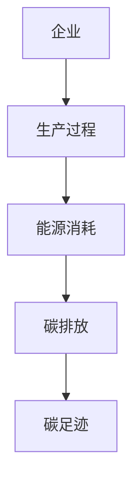
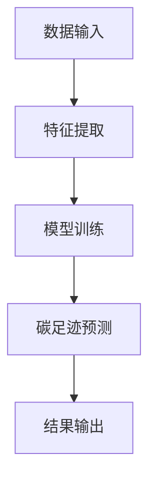

                 


---

# AI Agent在企业碳足迹计算与减排策略制定中的应用

关键词：AI Agent、企业碳足迹、减排策略、机器学习、碳中和

摘要：随着全球碳中和目标的推进，企业碳足迹的计算与减排策略的制定变得越来越重要。本文详细探讨了AI Agent在企业碳足迹计算与减排策略制定中的应用，从算法原理到系统设计，再到项目实战，全面解析了AI Agent如何优化企业碳足迹计算和制定有效的减排策略。通过实际案例分析和数学模型推导，展示了AI Agent在这一领域的巨大潜力和实际应用价值。

---

## 第1章: 企业碳足迹计算与AI Agent的背景介绍

### 1.1 企业碳足迹的定义与重要性
#### 1.1.1 什么是企业碳足迹
企业碳足迹是指企业在整个生命周期中，从原材料采购、生产、运输、使用到报废处理等各个环节所产生的温室气体排放的总和。碳足迹的计算帮助企业了解其对环境的影响，是实现碳中和目标的重要基础。

#### 1.1.2 碳足迹计算的必要性
随着全球气候变化问题的加剧，企业碳足迹的计算不仅有助于企业自身实现可持续发展目标，也是满足监管要求和提升企业社会责任的重要手段。

#### 1.1.3 碳中和目标对企业的影响
碳中和目标要求企业在2050年前实现碳排放的净零，这需要企业在生产和运营中采取一系列减排措施。AI Agent通过智能化的计算和优化，为企业的碳中和目标提供了技术支持。

### 1.2 AI Agent的基本概念
#### 1.2.1 什么是AI Agent
AI Agent（人工智能代理）是一种能够感知环境、自主决策并执行任务的智能系统。它可以通过学习和优化算法，帮助企业在复杂的环境中做出最优决策。

#### 1.2.2 AI Agent的核心特征
| 特性 | 描述 |
|------|------|
| 智能性 | 能够通过数据学习和优化算法做出决策 |
| 自主性 | 可以在没有人工干预的情况下执行任务 |
| 适应性 | 能够根据环境变化调整策略和行为 |

#### 1.2.3 AI Agent在企业中的应用场景
- 数据采集与处理
- 模型优化与预测
- 结果分析与可视化

### 1.3 问题背景与目标
#### 1.3.1 碳足迹计算的复杂性
碳足迹的计算涉及多个环节，数据来源广泛，且各环节之间的关系复杂。传统方法难以高效准确地完成计算。

#### 1.3.2 传统方法的局限性
- 数据量大，计算复杂
- 人工计算容易出错，效率低
- 难以实时更新和优化

#### 1.3.3 引入AI Agent的目标与意义
通过AI Agent的智能化计算和优化能力，提高碳足迹计算的准确性和效率，为企业制定减排策略提供科学依据。

---

## 第2章: 碳足迹计算与AI Agent的核心概念

### 2.1 碳足迹计算的模型与方法
#### 2.1.1 生命周期评价法
生命周期评价法（LCA）是一种从原材料到最终产品报废的全生命周期分析方法。通过分析各环节的碳排放，帮助企业找到减排的关键点。

#### 2.1.2 碳流分析法
碳流分析法通过对企业内部和外部的碳排放流进行建模，帮助识别碳排放的主要来源。

#### 2.1.3 碳足迹数据库的构建
构建企业碳足迹数据库是碳足迹计算的基础。数据库需要包含企业的所有生产过程、能源消耗和碳排放数据。

### 2.2 AI Agent在碳足迹计算中的角色
#### 2.2.1 数据采集与处理
AI Agent可以通过传感器、数据库等途径采集企业的生产过程数据，并进行清洗和预处理，确保数据的准确性和完整性。

#### 2.2.2 模型优化与预测
AI Agent利用机器学习算法对碳足迹计算模型进行优化和预测，帮助企业在复杂的环境中找到最优解。

#### 2.2.3 结果分析与可视化
AI Agent将计算结果进行可视化展示，帮助企业更好地理解和优化碳足迹。

### 2.3 核心概念与联系
#### 2.3.1 碳足迹计算的实体关系图（ER图）


#### 2.3.2 AI Agent的算法流程图


---

## 第3章: AI Agent驱动的碳足迹计算算法原理

### 3.1 算法原理概述
#### 3.1.1 基于强化学习的碳足迹优化
强化学习是一种通过试错机制优化目标的算法。AI Agent可以通过强化学习不断优化碳足迹计算的模型，找到最优解。

#### 3.1.2 基于监督学习的碳排放预测
监督学习是一种通过已知数据训练模型的算法。AI Agent可以通过监督学习模型预测企业的碳排放量。

#### 3.1.3 基于聚类分析的碳足迹分类
聚类分析是一种将数据分成不同类别的算法。AI Agent可以通过聚类分析将企业的碳足迹分为不同的类别，帮助企业更好地进行分类管理。

### 3.2 算法实现步骤
#### 3.2.1 数据预处理
数据预处理是碳足迹计算的关键步骤。AI Agent需要对数据进行清洗、归一化和特征提取，确保数据的准确性和可用性。

#### 3.2.2 模型训练
AI Agent通过机器学习算法对碳足迹计算模型进行训练，优化模型的准确性和效率。

#### 3.2.3 结果验证与优化
模型训练完成后，需要对结果进行验证和优化，确保模型的准确性和稳定性。

### 3.3 数学模型与公式
#### 3.3.1 碳足迹计算公式
$$ \text{碳足迹} = \sum_{i=1}^{n} w_i \times e_i $$
其中，$w_i$ 是第i项的权重，$e_i$ 是第i项的碳排放量。

#### 3.3.2 AI Agent的强化学习模型
AI Agent通过强化学习算法不断优化碳足迹计算模型，寻找最优解。

---

## 第4章: AI Agent在减排策略制定中的应用

### 4.1 碳减排策略的制定过程
碳减排策略的制定需要综合考虑企业的生产过程、能源消耗和碳排放等多个因素。AI Agent可以通过优化算法帮助企业制定最优的减排策略。

### 4.2 AI Agent优化能源消耗与碳排放
AI Agent可以通过分析企业的能源消耗数据，优化能源使用效率，减少碳排放。

### 4.3 实例分析与结果展示
通过实际案例分析，展示AI Agent在减排策略制定中的应用效果。例如，通过优化能源消耗，某企业实现了碳排放量的显著减少。

---

## 第5章: 项目实战

### 5.1 环境安装与配置
读者需要安装Python、机器学习库（如scikit-learn）和数据处理库（如Pandas）。确保环境配置正确，以便后续代码的运行。

### 5.2 系统功能设计与实现
#### 5.2.1 碳足迹计算模块
实现碳足迹计算功能，包括数据输入、特征提取和模型训练。

#### 5.2.2 碳减排策略模块
实现碳减排策略优化功能，包括能源消耗分析和碳排放预测。

### 5.3 核心代码实现
#### 5.3.1 数据预处理代码
```python
import pandas as pd

data = pd.read_csv('carbon_emission.csv')
data = data.dropna()
data = (data - data.mean()) / data.std()
```

#### 5.3.2 碳足迹计算代码
```python
from sklearn.linear_model import LinearRegression

model = LinearRegression()
model.fit(X, y)
predictions = model.predict(X_test)
```

#### 5.3.3 结果可视化代码
```python
import matplotlib.pyplot as plt

plt.scatter(X_test, y_test, color='blue')
plt.scatter(X_test, predictions, color='red')
plt.xlabel('Energy Consumption')
plt.ylabel('Carbon Emission')
plt.show()
```

### 5.4 案例分析与结果解读
通过具体案例分析，展示AI Agent在碳足迹计算和减排策略制定中的实际应用效果。

---

## 第6章: 总结与展望

### 6.1 总结
本文详细探讨了AI Agent在企业碳足迹计算与减排策略制定中的应用，从算法原理到系统设计，再到项目实战，全面展示了AI Agent的优势和潜力。

### 6.2 未来展望
随着AI技术的不断发展，AI Agent在碳足迹计算和减排策略制定中的应用将更加广泛和深入。未来，可以通过更复杂的算法和更强大的计算能力，进一步优化企业的碳足迹和减排策略。

---

## 小结与最佳实践 Tips

- **数据质量**：碳足迹计算的核心是数据的准确性，确保数据的完整性和准确性是关键。
- **模型优化**：不断优化AI Agent的算法模型，提高计算效率和准确性。
- **实时监控**：建立实时监控系统，及时发现和解决碳排放问题。

---

## 作者信息

作者：AI天才研究院/AI Genius Institute & 禅与计算机程序设计艺术 /Zen And The Art of Computer Programming

--- 

感谢您的耐心阅读！如您有任何疑问或需要进一步探讨，请随时联系我。

