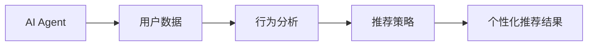

                 


# AI Agent在企业精准营销与个性化推荐中的应用

**关键词**：AI Agent、精准营销、个性化推荐、推荐系统、协同过滤、深度学习

**摘要**：随着人工智能技术的快速发展，AI Agent（人工智能代理）在企业营销领域中的应用日益广泛。本文将从AI Agent的基本概念出发，探讨其在企业精准营销与个性化推荐中的核心作用。通过分析AI Agent的算法原理、系统架构以及实际案例，本文将详细阐述AI Agent如何通过数据驱动的方式优化营销策略，提升用户转化率和满意度。同时，本文还将总结AI Agent在实际应用中的优势与挑战，并展望其未来的发展方向。

---

# 第一部分: AI Agent的基本概念与背景

## 第1章: AI Agent的基本概念与特点

### 1.1 AI Agent的定义与特点
AI Agent是一种能够感知环境并自主决策的智能体，其核心特点是具备学习能力、自适应能力和自主决策能力。与传统的自动化工具不同，AI Agent能够通过数据反馈不断优化自身行为，从而实现更加智能的任务执行。

### 1.2 AI Agent在营销中的应用价值
AI Agent能够通过分析用户行为数据、市场趋势和竞争对手信息，帮助企业实现精准营销和个性化推荐。其主要价值体现在提高营销效率、降低营销成本以及提升用户体验等方面。

---

## 第2章: 企业精准营销的背景与挑战

### 2.1 精准营销的定义与目标
精准营销是指通过分析用户数据，识别目标用户群体，并针对其需求提供个性化的产品和服务。其目标是提高用户转化率和客户满意度。

### 2.2 传统营销模式的局限性
传统营销模式往往基于经验或粗放式数据，难以实现真正的个性化服务。其主要局限性包括用户需求难以精准匹配、营销效果难以量化以及成本高等问题。

### 2.3 数据驱动营销的时代特点
在大数据时代，企业可以通过收集和分析海量用户数据，实现精准营销。AI Agent作为数据驱动营销的核心工具，能够帮助企业高效处理和利用这些数据。

---

## 第3章: 个性化推荐的背景与发展

### 3.1 个性化推荐的定义与作用
个性化推荐是指根据用户的兴趣和行为，为其推荐相关的产品或服务。其主要作用是提高用户满意度、增加用户粘性和提升销售转化率。

### 3.2 个性化推荐技术的演进历程
个性化推荐技术经历了从简单的基于规则的推荐到复杂的深度学习推荐的演进过程。每一代技术都有其独特的优势和局限性。

### 3.3 当前个性化推荐的应用场景
当前，个性化推荐广泛应用于电子商务、社交媒体、视频平台等领域。通过AI Agent实现的个性化推荐已成为企业提升用户体验的重要手段。

---

## 第4章: AI Agent在精准营销与推荐中的应用价值

### 4.1 提高营销效率的潜力
AI Agent能够通过自动化处理和分析海量数据，快速识别目标用户群体，从而提高营销效率。

### 4.2 优化用户体验的可能性
通过实时分析用户行为数据，AI Agent能够为用户提供更加个性化的推荐，从而提升用户体验。

### 4.3 降低营销成本的优势
AI Agent可以通过数据驱动的精准营销，减少无效营销投入，从而降低营销成本。

---

# 第二部分: AI Agent的核心概念与原理

## 第5章: AI Agent的核心概念与联系

### 5.1 AI Agent的核心概念
AI Agent的核心概念包括感知、决策和执行三个主要部分。感知部分负责收集环境信息，决策部分负责制定行动策略，执行部分负责实施决策。

### 5.2 精准营销与个性化推荐的核心要素
精准营销的核心要素包括用户数据采集、数据分析和推荐策略制定。个性化推荐的核心要素包括用户画像、推荐算法和推荐结果优化。

### 5.3 AI Agent与精准营销的实体关系图


---

## 第6章: AI Agent的算法原理

### 6.1 推荐系统的算法原理
推荐系统的算法主要包括协同过滤、聚类和深度学习三种类型。协同过滤是基于用户相似性进行推荐，聚类是基于用户行为进行分组推荐，深度学习是基于神经网络进行推荐。

### 6.2 协同过滤算法的实现
协同过滤算法通过计算用户之间的相似度，找到相似用户的推荐列表。其核心公式为：
$$相似度 = \frac{\sum_{i=1}^{n}(r_{ui} - \bar{r_u})(r_{vi} - \bar{r_v})}{\sqrt{\sum_{i=1}^{n}(r_{ui} - \bar{r_u})^2} \sqrt{\sum_{i=1}^{n}(r_{vi} - \bar{r_v})^2}}$$

### 6.3 基于深度学习的推荐算法
深度学习推荐算法通过构建神经网络模型，学习用户和物品的特征表示，实现更加精准的推荐。其核心流程包括数据输入、特征提取和推荐结果输出。

---

## 第7章: 系统分析与架构设计

### 7.1 系统功能设计
系统功能设计包括用户数据采集、数据分析、推荐策略制定和推荐结果展示四个主要部分。

### 7.2 系统架构设计
系统架构设计包括数据层、算法层和应用层三个主要层次。数据层负责存储和管理用户数据，算法层负责实现推荐算法，应用层负责展示推荐结果。

### 7.3 系统交互设计
系统交互设计包括用户行为数据采集、推荐结果展示和用户反馈处理三个主要环节。

---

## 第8章: 项目实战与案例分析

### 8.1 项目背景介绍
项目背景介绍包括项目目标、数据来源和系统设计等内容。

### 8.2 核心代码实现
核心代码实现包括数据预处理、推荐算法实现和结果展示三个部分。以下是协同过滤算法的Python代码示例：
```python
import numpy as np

def compute_similarity(user_items, item_items):
    similarity = np.zeros((len(user_items), len(item_items)))
    for i in range(len(user_items)):
        for j in range(len(item_items)):
            numerator = np.sum((user_items[i] - np.mean(user_items[i])) * (item_items[j] - np.mean(item_items[j])))
            denominator = np.sqrt(np.sum((user_items[i] - np.mean(user_items[i]))**2)) * np.sqrt(np.sum((item_items[j] - np.mean(item_items[j]))**2))
            similarity[i][j] = numerator / denominator
    return similarity
```

### 8.3 案例分析与总结
案例分析包括实际应用中的具体案例和经验总结。通过案例分析，可以验证AI Agent在精准营销与个性化推荐中的实际效果。

---

## 第9章: 总结与展望

### 9.1 AI Agent的优势与挑战
AI Agent的优势包括提高营销效率、优化用户体验和降低营销成本。其挑战包括数据隐私问题、算法复杂性和技术实现难度。

### 9.2 未来发展方向
未来，AI Agent在精准营销与个性化推荐中的发展方向包括算法优化、数据隐私保护和多模态推荐。

### 9.3 最佳实践与注意事项
在实际应用中，需要注意数据质量和算法选择，同时要关注用户体验和数据隐私保护。

---

**作者：AI天才研究院/AI Genius Institute & 禅与计算机程序设计艺术 /Zen And The Art of Computer Programming**

