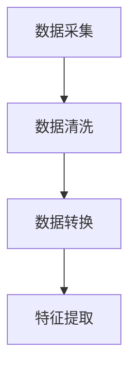

                 


# AI Agent在企业网络安全威胁情报分析中的应用

## 关键词：AI Agent, 网络安全, 威胁情报, 机器学习, 深度学习, 数据分析, 安全自动化

## 摘要

随着企业网络安全威胁的日益复杂化和智能化，传统的安全防御手段逐渐显露出其局限性。本文深入探讨了AI Agent在企业网络安全威胁情报分析中的应用，系统地分析了AI Agent的核心原理、技术实现、系统架构，并结合实际案例，展示了如何利用AI Agent提升企业网络安全威胁情报的分析能力。本文首先介绍了AI Agent和网络安全威胁情报的基本概念，然后从感知、决策、执行三个层面详细阐述了AI Agent的核心技术，接着分析了AI Agent与网络安全威胁情报的结合方式，最后通过系统设计与架构、项目实战等部分，详细探讨了AI Agent在企业网络安全中的具体应用。本文内容丰富，结构清晰，旨在为企业网络安全威胁情报分析提供理论指导和实践参考。

---

## 第1章: AI Agent与网络安全威胁情报概述

### 1.1 AI Agent的基本概念

#### 1.1.1 AI Agent的定义与特点

**定义**：AI Agent（人工智能代理）是一种能够感知环境、自主决策并执行任务的智能实体。它能够通过数据输入做出反应，执行预设的目标。

**特点**：
1. **自主性**：AI Agent能够在没有人工干预的情况下自主运作。
2. **反应性**：能够实时感知环境变化并做出相应的反应。
3. **学习能力**：通过机器学习等技术不断提升自身的识别和决策能力。
4. **社会能力**：能够与其他系统、设备或人进行交互和协同工作。

#### 1.1.2 网络安全威胁情报的基本概念

**定义**：网络安全威胁情报是指与网络安全威胁相关的数据、信息和知识，用于帮助组织识别、防御和响应网络安全威胁。

**分类**：
1. **已知威胁**：已经识别并有已知特征的威胁，如已知的恶意软件、病毒等。
2. **未知威胁**：尚未被发现或定义的新威胁，通常具有隐蔽性和复杂性。
3. **内部威胁**：来自企业内部员工或合作伙伴的威胁。
4. **外部威胁**：来自企业外部的攻击者，如黑客、竞争对手等。

**特征**：
1. **实时性**：威胁情报需要实时更新和分析。
2. **准确性**：威胁情报的准确性和可靠性直接影响防御效果。
3. **关联性**：能够将不同来源的威胁信息进行关联分析，发现潜在的攻击链。

### 1.2 AI Agent在网络安全中的应用背景

#### 1.2.1 网络安全面临的挑战

**主要威胁**：
1. **网络攻击**：包括DDoS攻击、钓鱼攻击、恶意软件等。
2. **数据泄露**：由于内部或外部攻击导致的数据泄露。
3. **高级持续性威胁（APT）**：复杂的、长期的攻击活动，通常针对特定目标。

**传统安全方法的局限性**：
1. **静态规则**：传统防火墙和入侵检测系统基于固定的规则，难以应对新型攻击。
2. **人工分析**：依赖人工分析大量日志数据，效率低且容易出错。
3. **滞后性**：无法实时响应新的威胁。

**AI技术在网络安全中的优势**：
1. **实时分析**：能够实时处理大量数据，快速识别异常行为。
2. **智能学习**：通过机器学习不断优化识别模型，提升检测准确率。
3. **自动化响应**：能够根据识别的威胁自动采取防御措施。

#### 1.2.2 威胁情报分析的现状与需求

**威胁情报分析的重要性**：
- 帮助企业识别潜在威胁，提前采取防御措施。
- 通过分析历史威胁数据，发现攻击模式，预测未来攻击。

**当前威胁情报分析的主要方法**：
1. **基于规则的方法**：根据预定义的规则匹配日志数据，识别异常行为。
2. **统计分析方法**：通过统计分析发现数据中的异常点。
3. **机器学习方法**：利用机器学习模型训练威胁特征，识别未知威胁。

**借助AI Agent提升威胁情报分析的必要性**：
- AI Agent能够自动化处理大量数据，提高分析效率。
- 通过深度学习技术，AI Agent能够识别复杂的攻击模式，发现未知威胁。
- AI Agent能够实现威胁情报的实时更新和动态分析，提升防御的实时性。

---

## 第2章: AI Agent的核心原理

### 2.1 AI Agent的感知机制

#### 2.1.1 数据采集与处理

**多源数据采集**：
- 网络流量数据：包括IP地址、端口号、数据包大小等。
- 系统日志数据：包括操作系统日志、应用日志等。
- 用户行为数据：包括用户的登录行为、操作记录等。

**数据预处理**：
- 数据清洗：去除噪声数据，处理缺失值。
- 数据转换：将数据转换为适合模型输入的格式。
- 数据特征提取：提取关键特征，如时间戳、用户ID、操作类型等。

**流程图**：


#### 2.1.2 感知模型的构建

**基于机器学习的感知模型**：
- 使用监督学习训练分类模型，识别正常与异常行为。
- 使用无监督学习发现数据中的异常模式。

**基于深度学习的感知模型**：
- 利用神经网络处理复杂的数据模式。
- 使用循环神经网络（RNN）或卷积神经网络（CNN）进行序列分析或图像识别。

**模型训练与优化**：
- 使用训练数据训练模型，并通过验证数据调整模型参数。
- 采用交叉验证等方法优化模型性能。

**数学模型**：
- 机器学习分类模型：$$ y = \text{sign}(w \cdot x + b) $$
- 深度学习模型：$$ \text{输出} = \text{激活函数}(\text{权重} \cdot \text{输入} + \text{偏置}) $$

#### 2.1.3 感知模型的实现

**Python代码示例**：
```python
import numpy as np
from sklearn.svm import OneClassSVM

# 假设X为输入特征矩阵
X = np.array([[1, 2], [3, 4], [5, 6]])

# 初始化模型
model = OneClassSVM(gamma='auto')

# 训练模型
model.fit(X)

# 预测异常点
y_pred = model.predict(X)
print(y_pred)
```

---

### 2.2 AI Agent的决策机制

#### 2.2.1 决策算法的选择

**基于概率的决策模型**：
- 使用贝叶斯定理计算条件概率，做出决策。
- 示例：$$ P(A|B) = \frac{P(B|A)P(A)}{P(B)} $$

**基于规则的决策模型**：
- 根据预定义的规则集进行匹配，做出决策。
- 示例规则：如果检测到多个异常登录尝试，标记为潜在攻击。

#### 2.2.2 决策过程的优化

**反馈机制**：
- 根据执行结果调整决策策略。
- 示例：如果误报，则调整阈值；如果漏报，则增加检测频率。

**动态优化**：
- 使用在线学习技术，实时更新决策模型。
- 示例：$$ \text{新权重} = \text{旧权重} + \alpha \cdot (\text{目标值} - \text{预测值}) $$

---

## 第3章: AI Agent与网络安全威胁情报的结合

### 3.1 数据融合技术

**多源数据融合**：
- 综合分析网络流量、日志、用户行为等多种数据源。
- 使用数据融合算法，如D-S证据理论，进行综合判断。

**时空关联分析**：
- 分析威胁在时间和空间上的关联性，识别攻击链。
- 示例：发现某个时间段内多个IP地址的异常访问行为，判断可能的DDoS攻击。

---

通过以上分析，AI Agent在企业网络安全威胁情报分析中的应用具有重要意义。它能够提升威胁情报的分析效率和准确性，为企业提供智能化的安全防御手段。未来，随着AI技术的不断发展，AI Agent在网络安全中的应用将更加广泛和深入。

