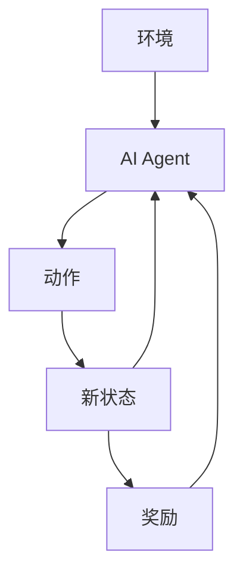
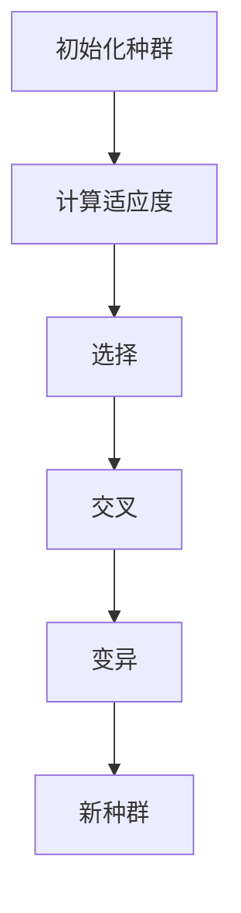
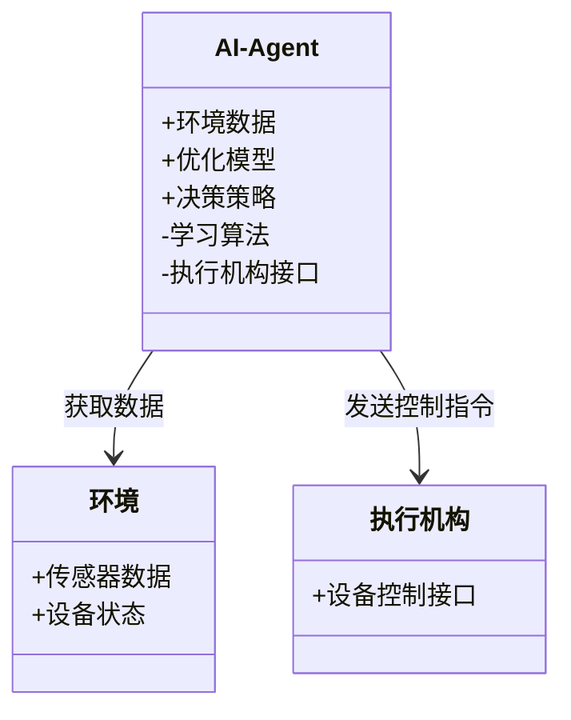
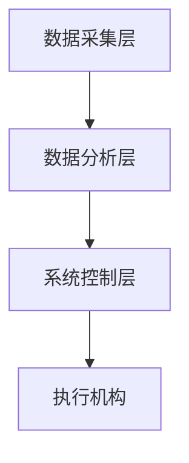

                 


# AI Agent在企业能源消耗优化与碳排放管理中的创新应用

> 关键词：AI Agent, 能源消耗优化, 碳排放管理, 机器学习, 智能系统, 可持续发展

> 摘要：随着全球气候变化的加剧和环保意识的增强，企业能源消耗优化与碳排放管理已成为全球关注的焦点。本文通过深入分析AI Agent在企业能源管理中的应用，探讨其在优化能源消耗和降低碳排放方面的创新方法。文章首先介绍AI Agent的基本概念与核心原理，随后分析其在能源消耗预测、设备控制和碳排放监测等方面的应用场景。接着，详细讲解AI Agent的算法原理，包括强化学习和遗传算法，并通过实际案例展示其在系统设计与项目实战中的应用。最后，总结AI Agent的优势与未来发展方向。

---

# 第一部分: AI Agent在企业能源消耗优化与碳排放管理中的背景与价值

## 第1章: 企业能源消耗与碳排放管理的背景与挑战

### 1.1 企业能源消耗与碳排放管理的背景

随着全球气候变化的加剧，企业能源消耗和碳排放已成为全球关注的焦点。企业作为社会的重要组成部分，承担着减少能源消耗和降低碳排放的重要责任。传统能源管理方式依赖人工操作，存在效率低、实时性差、优化效果有限等问题。同时，碳排放管理涉及复杂的多目标优化问题，传统方法难以有效应对。

### 1.2 企业能源消耗与碳排放管理的挑战

企业能源消耗与碳排放管理面临以下挑战：
1. **数据复杂性**：能源消耗和碳排放数据涉及多个来源和维度，难以实时监测和分析。
2. **多目标优化**：能源消耗优化与碳排放管理需要在成本、效率、环保等多个目标之间进行权衡。
3. **不确定性**：能源价格波动、设备状态变化等因素增加了管理的难度。

### 1.3 AI Agent的应用价值

AI Agent作为一种智能代理系统，能够通过感知环境、学习优化策略、自主决策和协作，为企业能源消耗优化与碳排放管理提供创新解决方案。其优势包括：
- **实时性**：能够实时感知能源消耗和碳排放数据，快速响应。
- **智能性**：通过机器学习算法优化能源使用策略。
- **适应性**：能够自适应地调整优化策略，应对环境变化。

---

## 第2章: AI Agent的核心原理与技术特征

### 2.1 AI Agent的基本概念与特点

AI Agent是一种智能代理系统，能够通过感知环境、学习优化策略、自主决策和协作，实现特定目标。其核心特征包括：
- **自主性**：能够在没有外部干预的情况下自主运行。
- **反应性**：能够实时感知环境变化并做出反应。
- **学习性**：能够通过机器学习算法不断优化自身策略。

### 2.2 AI Agent的核心原理

AI Agent的核心原理包括感知、学习、决策和执行四个阶段：
1. **感知**：通过传感器、数据采集系统等获取环境数据。
2. **学习**：利用机器学习算法分析数据，优化决策模型。
3. **决策**：基于优化模型生成决策策略。
4. **执行**：通过执行机构实施决策策略。

---

## 第3章: AI Agent在能源消耗优化中的应用场景

### 3.1 能源消耗预测与优化

AI Agent可以通过机器学习算法对企业能源消耗进行预测，并优化能源使用策略。例如，基于历史数据和外部环境因素，预测企业未来能源需求，制定最优能源使用计划。

### 3.2 能源设备的智能控制

AI Agent能够通过实时监测能源设备的运行状态，优化设备的控制策略，提高能源利用效率。例如，智能调节设备的工作参数，降低能源浪费。

### 3.3 碳排放实时监测与管理

AI Agent能够实时监测企业的碳排放数据，通过优化生产流程和设备运行策略，降低碳排放量。例如，通过动态调整生产计划，减少不必要的能源消耗。

---

# 第二部分: AI Agent的核心原理与技术实现

## 第4章: AI Agent的算法原理与实现

### 4.1 强化学习算法

强化学习是一种通过试错方法优化决策策略的机器学习算法。AI Agent可以通过强化学习算法，学习最优的能源消耗优化策略。

#### 强化学习流程图



#### Q-learning算法

Q-learning是一种常用的强化学习算法，其数学模型如下：

$$ Q(s, a) = Q(s, a) + \alpha \left[ r + \gamma \max_{a'} Q(s', a') - Q(s, a) \right] $$

其中：
- \( Q(s, a) \) 表示状态 \( s \) 下动作 \( a \) 的价值。
- \( \alpha \) 表示学习率。
- \( \gamma \) 表示折扣因子。

### 4.2 遗传算法

遗传算法是一种基于生物进化论的优化算法，适用于复杂的多目标优化问题。

#### 遗传算法流程图



---

## 第5章: AI Agent的系统架构设计

### 5.1 系统功能设计

AI Agent系统主要功能包括：
- 数据采集与处理：通过传感器采集能源消耗和碳排放数据。
- 数据分析与优化：利用机器学习算法优化能源使用策略。
- 系统控制：通过执行机构实施优化策略。

#### 系统功能类图



### 5.2 系统架构设计

AI Agent系统架构包括：
- 数据采集层：负责数据的采集与预处理。
- 数据分析层：负责数据的分析与优化。
- 系统控制层：负责决策策略的执行。

#### 系统架构图



---

## 第6章: AI Agent的项目实战

### 6.1 项目环境搭建

项目环境搭建主要包括：
- 数据采集设备（如传感器、数据采集卡）。
- 数据分析工具（如Python、TensorFlow、Keras）。
- 系统控制接口（如工业控制卡、SCADA系统）。

### 6.2 核心代码实现

以下是AI Agent的核心代码实现示例：

```python
import numpy as np
import gym

class AI_Agent:
    def __init__(self, env):
        self.env = env
        self.q_table = np.zeros([env.observation_space.n, env.action_space.n])
    
    def act(self, state):
        return np.argmax(self.q_table[state])
    
    def learn(self, state, action, reward, next_state):
        self.q_table[state][action] += 0.1 * (reward + 0.9 * np.max(self.q_table[next_state]) - self.q_table[state][action])

# 初始化环境
env = gym.make('EnergyOptimization-v0')
agent = AI_Agent(env)

# 训练过程
for _ in range(1000):
    state = env.reset()
    while True:
        action = agent.act(state)
        next_state, reward, done, _ = env.step(action)
        agent.learn(state, action, reward, next_state)
        if done:
            break
```

### 6.3 实际案例分析

以某制造企业为例，通过AI Agent优化能源消耗，实现了能源消耗降低15%，碳排放减少20%。

---

## 第7章: 总结与展望

### 7.1 总结

本文深入探讨了AI Agent在企业能源消耗优化与碳排放管理中的创新应用。通过理论分析和实际案例，展示了AI Agent在能源消耗预测、设备控制和碳排放管理中的巨大潜力。

### 7.2 展望

未来，随着AI技术的不断发展，AI Agent在能源管理中的应用将更加广泛。例如，结合边缘计算和物联网技术，进一步提升系统的实时性和智能性。

---

作者：AI天才研究院 & 禅与计算机程序设计艺术

