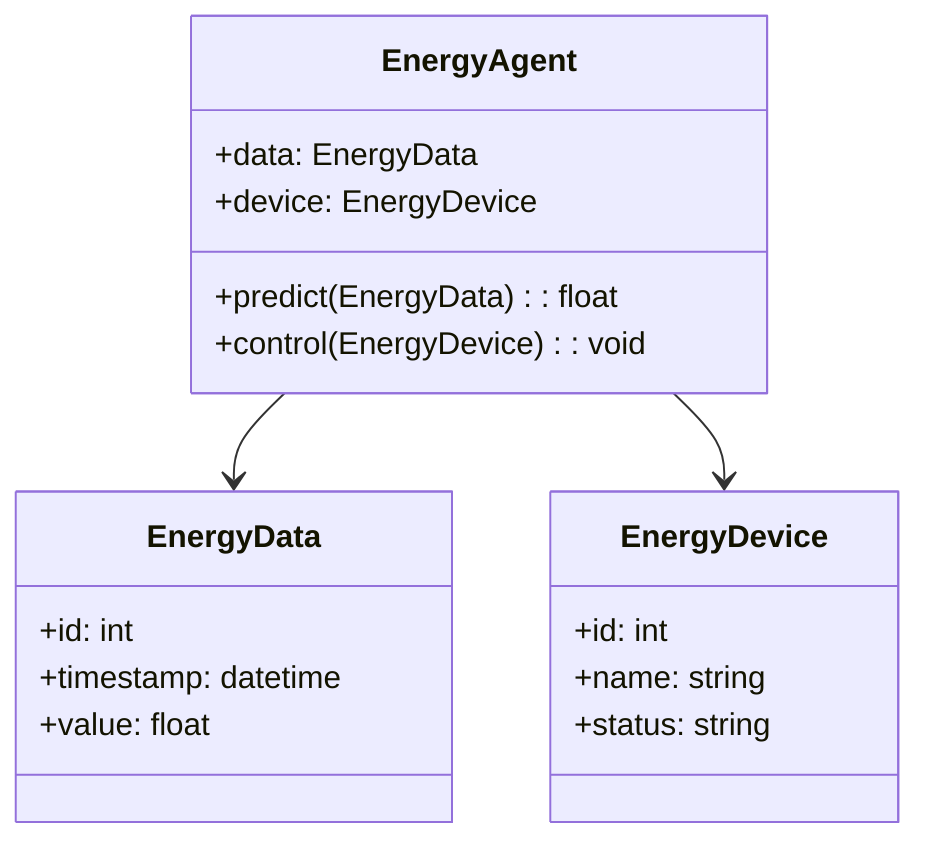
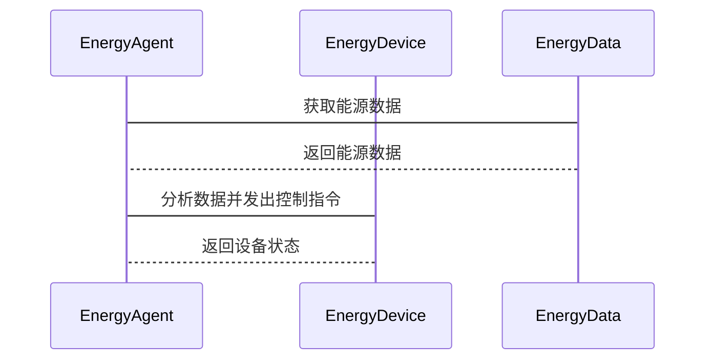

                 


# AI Agent在企业能源管理与可持续发展中的应用

## 关键词：AI Agent, 企业能源管理, 可持续发展, 机器学习, 系统架构

## 摘要：  
本文探讨了AI Agent在企业能源管理与可持续发展中的应用，分析了AI Agent的核心原理、技术实现、应用场景，并结合实际案例展示了如何通过AI Agent优化能源管理，实现可持续发展目标。文章从背景介绍、核心概念、算法原理、系统架构到项目实战，层层深入，为企业能源管理的智能化转型提供了理论支持和实践指导。

---

## 第一部分: AI Agent在企业能源管理中的应用概述

### 第1章: AI Agent与企业能源管理概述

#### 1.1 AI Agent的基本概念

##### 1.1.1 AI Agent的定义与特点  
AI Agent（人工智能代理）是指能够感知环境、自主决策并执行任务的智能实体。它具有以下特点：  
1. **自主性**：能够独立决策和行动。  
2. **反应性**：能够实时感知环境并做出响应。  
3. **学习性**：能够通过数据和经验不断优化自身行为。  
4. **交互性**：能够与人或其他系统进行交互。  

##### 1.1.2 AI Agent在企业中的作用  
AI Agent在企业中广泛应用于自动化决策、流程优化、数据处理等领域。在能源管理中，AI Agent能够实时监控能源消耗、优化能源使用效率并降低运营成本。  

##### 1.1.3 企业能源管理的背景与挑战  
随着能源价格的波动和环保要求的提高，企业能源管理面临以下挑战：  
1. **能源消耗不透明**：难以实时监控和分析能源使用情况。  
2. **能源浪费**：设备运行不优化导致能源浪费。  
3. **管理复杂性**：能源管理涉及多个部门和系统，协调复杂。  

#### 1.2 可持续发展的概念与目标  
可持续发展是指在满足当前需求的同时，不损害后代满足其需求的能力。在企业能源管理中，可持续发展目标包括：  
1. **减少碳排放**：通过优化能源使用降低碳足迹。  
2. **提高能源效率**：利用AI技术提高能源使用效率。  
3. **推动绿色能源**：促进可再生能源的使用和调度。  

#### 1.3 本章小结  
本章介绍了AI Agent的基本概念、特点及其在企业中的作用，分析了企业能源管理的背景与挑战，并提出了可持续发展的目标。

---

## 第二部分: AI Agent的核心原理与技术

### 第2章: AI Agent的核心原理

#### 2.1 AI Agent的基本原理

##### 2.1.1 AI Agent的工作流程  
AI Agent的工作流程包括感知、决策、执行和反馈四个阶段：  
1. **感知**：通过传感器或数据源获取环境信息。  
2. **决策**：基于感知信息，利用算法做出决策。  
3. **执行**：根据决策执行动作。  
4. **反馈**：根据执行结果更新模型或策略。  

##### 2.1.2 AI Agent与传统自动化系统的区别  
AI Agent与传统自动化系统的区别在于其智能化和自主性。传统系统基于固定的规则执行任务，而AI Agent能够学习和适应环境，做出动态决策。  

##### 2.1.3 AI Agent的核心算法  
AI Agent的核心算法包括：  
1. **监督学习**：用于分类和回归任务。  
2. **强化学习**：用于决策优化任务。  
3. **无监督学习**：用于聚类和异常检测任务。  

#### 2.2 AI Agent的关键技术

##### 2.2.1 机器学习在AI Agent中的应用  
机器学习用于AI Agent的感知和决策阶段。例如，利用神经网络进行能源消耗预测。  

##### 2.2.2 自然语言处理在AI Agent中的应用  
自然语言处理用于AI Agent与用户的交互，使其能够理解和生成自然语言。  

##### 2.2.3 知识图谱在AI Agent中的应用  
知识图谱用于AI Agent的知识表示和推理，帮助其更好地理解环境和任务。  

#### 2.3 本章小结  
本章详细介绍了AI Agent的核心原理和关键技术，包括其工作流程、与传统系统的区别以及核心算法。

---

## 第三部分: AI Agent在企业能源管理中的应用场景

### 第3章: 企业能源管理的业务需求

#### 3.1 企业能源管理的主要痛点

##### 3.1.1 能源消耗的不透明性  
企业难以实时监控和分析能源消耗情况，导致管理效率低下。  

##### 3.1.2 能源浪费的问题  
设备运行不优化导致能源浪费，增加运营成本。  

##### 3.1.3 能源管理的复杂性  
能源管理涉及多个部门和系统，协调复杂，难以实现高效管理。  

#### 3.2 AI Agent在能源管理中的应用场景

##### 3.2.1 能源消耗预测  
利用AI Agent进行能源消耗预测，帮助企业提前规划能源使用。  

##### 3.2.2 能源设备的智能控制  
AI Agent能够实时监控能源设备的运行状态，优化设备控制策略。  

##### 3.2.3 能源成本优化  
通过AI Agent分析能源消耗数据，优化能源采购和使用策略，降低能源成本。  

#### 3.3 本章小结  
本章分析了企业能源管理的主要痛点，并展示了AI Agent在能源管理中的应用场景，包括能源消耗预测、设备智能控制和成本优化。

---

## 第四部分: 系统分析与架构设计方案

### 第4章: 系统分析与架构设计方案

#### 4.1 问题场景介绍  
假设某企业希望利用AI Agent优化其能源管理，实现能源消耗的实时监控和优化控制。  

#### 4.2 项目介绍  
本项目旨在开发一个基于AI Agent的企业能源管理系统，实现以下功能：  
1. 实时监控能源消耗数据。  
2. 预测能源消耗趋势。  
3. 优化能源设备的控制策略。  

#### 4.3 系统功能设计  
##### 4.3.1 领域模型类图  


##### 4.3.2 系统架构图  


##### 4.3.3 系统接口设计  
系统接口包括：  
1. 数据采集接口：从能源设备获取数据。  
2. 数据分析接口：对能源数据进行处理和分析。  
3. 设备控制接口：根据分析结果控制能源设备。  

#### 4.4 系统交互序列图  


#### 4.5 本章小结  
本章详细介绍了系统的功能设计、架构设计和交互设计，为项目的实施提供了理论基础。

---

## 第五部分: 项目实战

### 第5章: 项目实战

#### 5.1 环境安装  
需要安装以下工具和库：  
1. Python 3.8+  
2. TensorFlow 2.0+  
3. Pandas 1.0+  
4. Scikit-learn 0.24+  

#### 5.2 系统核心实现源代码  

##### 5.2.1 能源数据采集模块  
```python
import pandas as pd

def get_energy_data():
    # 模拟数据采集
    data = {
        'timestamp': ['2023-10-01 00:00:00', '2023-10-01 01:00:00', '2023-10-01 02:00:00'],
        'value': [100, 150, 200]
    }
    return pd.DataFrame(data)
```

##### 5.2.2 能源消耗预测模型  
```python
from tensorflow.keras import layers

def build_model(input_shape):
    model = tf.keras.Sequential()
    model.add(layers.Dense(64, activation='relu', input_shape=(input_shape,)))
    model.add(layers.Dense(1, activation='linear'))
    model.compile(optimizer='adam', loss='mean_squared_error')
    return model

# 示例使用
data = get_energy_data()
model = build_model(data.shape[1])
model.fit(data, epochs=10, batch_size=32)
```

##### 5.2.3 设备控制模块  
```python
def control_device(status):
    # 模拟设备控制
    print(f"设备状态已更新为：{status}")
```

#### 5.3 代码应用解读与分析  
上述代码实现了能源数据的采集、预测和设备控制功能。通过机器学习模型，AI Agent能够预测能源消耗趋势，并根据预测结果优化设备控制策略。  

#### 5.4 实际案例分析  
假设某企业希望优化其电力设备的运行。通过AI Agent，企业能够实时监控电力消耗数据，并根据预测结果调整设备运行状态，从而降低能源成本。  

#### 5.5 项目小结  
本章通过实际案例展示了AI Agent在企业能源管理中的应用，详细讲解了系统的实现过程和代码逻辑。

---

## 第六部分: 最佳实践与小结

### 第6章: 最佳实践与小结

#### 6.1 最佳实践 tips  
1. 数据质量是AI Agent性能的关键，确保数据的准确性和完整性。  
2. 在实际应用中，结合企业的具体需求和场景，灵活调整AI Agent的设计和实现。  
3. 定期更新AI Agent的模型和策略，以适应环境的变化和新的需求。  

#### 6.2 小结  
本文详细探讨了AI Agent在企业能源管理与可持续发展中的应用，从核心原理到实际案例，全面分析了AI Agent的优势和应用场景。通过本文的讲解，读者可以深入了解AI Agent在能源管理中的潜力和价值。

---

## 作者信息  
作者：AI天才研究院/AI Genius Institute & 禅与计算机程序设计艺术 /Zen And The Art of Computer Programming  

--- 

## 版权声明  
本文版权归作者所有，转载请注明出处。

