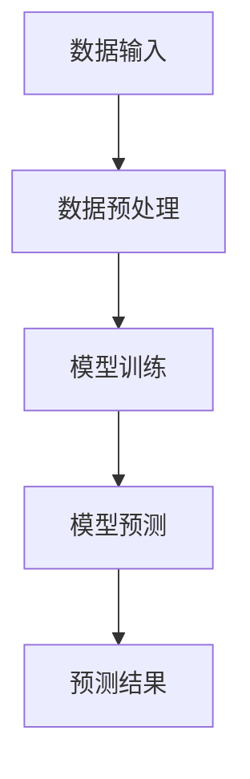
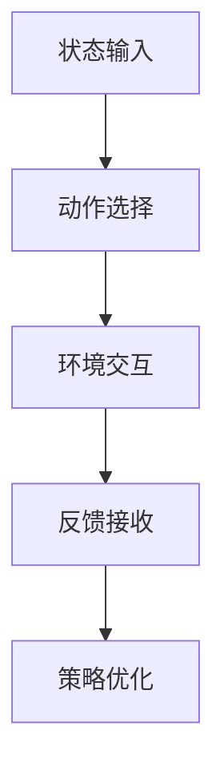
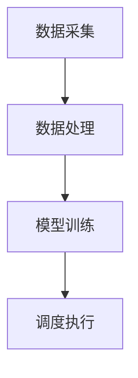
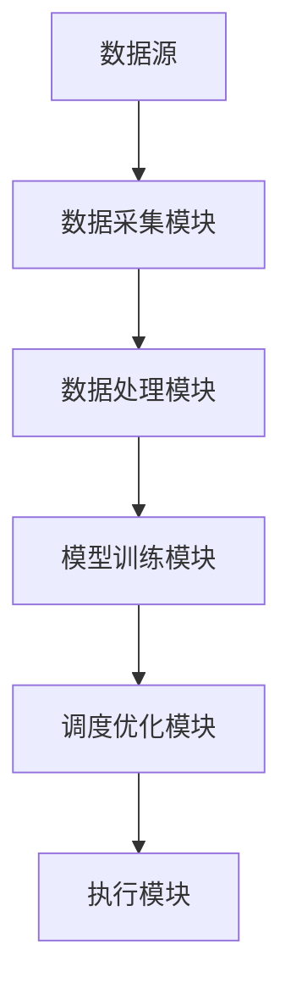

                 


---

# AI Agent在企业能源需求预测与智能调度中的应用

> 关键词：AI Agent, 能源需求预测, 智能调度, 机器学习, 时间序列分析, 强化学习

> 摘要：本文详细探讨了AI Agent在企业能源需求预测与智能调度中的应用，从基本概念到算法原理，再到系统架构和项目实战，全面分析了AI Agent在能源管理中的潜力和实际应用价值。通过结合数学模型、算法流程图和实际案例，本文为读者提供了从理论到实践的完整指导。

---

## 第一部分: AI Agent与企业能源管理概述

### 第1章: AI Agent的基本概念与应用背景

#### 1.1 AI Agent的定义与核心特征

##### 1.1.1 AI Agent的基本定义
AI Agent（人工智能代理）是指能够感知环境并采取行动以实现目标的智能实体。它通过接收输入数据、分析信息、制定决策并执行操作来实现特定任务。AI Agent的核心特征包括自主性、反应性、目标导向性和学习能力。

##### 1.1.2 AI Agent的核心特征与优势
- **自主性**：AI Agent能够独立执行任务，无需外部干预。
- **反应性**：能够实时感知环境变化并做出响应。
- **目标导向性**：通过优化目标函数来实现最优决策。
- **学习能力**：通过机器学习算法不断优化自身模型。

##### 1.1.3 AI Agent与传统算法的区别
AI Agent不仅仅是简单的算法，它是一个动态的、自适应的系统，能够根据环境反馈不断调整策略。与传统算法相比，AI Agent更加注重自主性和适应性，能够处理复杂动态的环境。

#### 1.2 企业能源管理的现状与挑战

##### 1.2.1 企业能源管理的基本概念
企业能源管理是指通过对能源的生产、分配和消耗进行优化，以降低能源成本、提高能源利用效率的过程。传统的能源管理依赖于人工操作和静态模型，难以应对能源需求的波动性和不确定性。

##### 1.2.2 当前能源管理的主要挑战
- **需求波动性**：能源需求受时间、天气和经济活动等多种因素影响，具有高度波动性。
- **数据复杂性**：能源数据涉及多种类型和来源，数据处理和分析的难度较高。
- **优化难度**：能源调度需要在多个约束条件下实现最优解，优化问题复杂。

##### 1.2.3 AI Agent在能源管理中的应用潜力
AI Agent能够通过实时感知环境、分析数据、制定决策并执行操作，帮助企业在复杂动态的环境中实现能源管理的优化。其自主性和反应性使其成为解决能源管理问题的理想选择。

---

### 第2章: AI Agent在能源管理中的应用背景

#### 2.1 能源需求预测的必要性

##### 2.1.1 能源需求预测的基本概念
能源需求预测是指通过分析历史数据和相关因素，预测未来能源需求量的过程。准确的需求预测是优化能源调度和资源配置的基础。

##### 2.1.2 能源需求预测的常见方法
- **时间序列分析**：基于历史数据的趋势进行预测。
- **机器学习模型**：利用神经网络、随机森林等算法进行预测。
- **混合模型**：结合多种方法的优势，提高预测精度。

##### 2.1.3 AI Agent在能源需求预测中的优势
AI Agent能够实时更新模型，适应环境变化，提高预测的准确性和实时性。

#### 2.2 智能调度系统的核心作用

##### 2.2.1 智能调度系统的定义与功能
智能调度系统是一种基于AI技术的能源调度系统，能够根据实时数据和优化目标，动态调整能源分配策略。

##### 2.2.2 智能调度系统的关键技术
- **强化学习**：通过试错和反馈优化调度策略。
- **遗传算法**：用于全局优化问题的求解。
- **模糊逻辑**：处理不确定性问题。

##### 2.2.3 AI Agent在智能调度中的应用场景
- **实时调度**：根据实时需求调整能源分配。
- **异常处理**：在紧急情况下快速制定应急策略。
- **长期优化**：基于长期预测优化能源使用计划。

#### 2.3 本章小结
AI Agent在能源管理中的应用背景主要体现在能源需求预测和智能调度两个方面。AI Agent通过其自主性和适应性，能够有效应对能源管理中的复杂问题。

---

## 第二部分: AI Agent的核心概念与原理

### 第3章: AI Agent的核心概念与原理

#### 3.1 AI Agent的基本原理

##### 3.1.1 知识表示与推理
知识表示是AI Agent进行推理的基础。常见的知识表示方法包括逻辑推理和语义网络。通过知识表示，AI Agent能够理解和分析复杂问题。

##### 3.1.2 行为规划与决策
行为规划是指AI Agent根据当前状态和目标，制定行动计划的过程。决策过程需要考虑多个因素，包括当前状态、目标和环境约束。

##### 3.1.3 多智能体协作机制
在复杂的能源管理场景中，通常需要多个AI Agent协作完成任务。多智能体协作机制通过协调各个智能体的行动，实现整体目标的最优。

#### 3.2 能源需求预测的数学模型

##### 3.2.1 时间序列分析模型
时间序列分析是一种常用的需求预测方法。ARIMA模型是一种经典的时序预测模型，其数学表达式为：

$$
ARIMA(p, d, q) = \frac{1}{(1 - \phi_1 B - \cdots - \phi_p B^p)(1 - \theta_1 B - \cdots - \theta_q B^q)}(1 - B)^d X_t
$$

其中，$p$ 是自回归阶数，$d$ 是差分阶数，$q$ 是移动平均阶数。

##### 3.2.2 机器学习模型
机器学习模型，如LSTM（长短期记忆网络），能够捕捉时间序列中的长期依赖关系。LSTM的结构包括输入门、遗忘门和输出门，其数学表达式为：

$$
f_t = \sigma(W_f \cdot [h_{t-1}, x_t] + b_f)
$$

$$
i_t = \sigma(W_i \cdot [h_{t-1}, x_t] + b_i)
$$

$$
o_t = \sigma(W_o \cdot [h_{t-1}, x_t] + b_o)
$$

$$
h_t = f_t \cdot c_{t-1} + i_t \cdot x_t
$$

$$
c_t = h_t \cdot o_t
$$

##### 3.2.3 混合模型与优化方法
混合模型结合了多种预测方法的优势，能够提高预测精度。优化方法，如贝叶斯优化，用于调整模型参数，提高预测性能。

#### 3.3 本章小结
AI Agent的核心原理包括知识表示与推理、行为规划与决策，以及多智能体协作机制。能源需求预测的数学模型包括时间序列分析、机器学习模型和混合模型。

---

### 第4章: AI Agent在能源调度中的应用原理

#### 4.1 智能调度系统的算法原理

##### 4.1.1 基于强化学习的调度算法
强化学习是一种通过试错和反馈优化调度策略的方法。经典的强化学习算法包括Q-learning和深度强化学习（Deep RL）。

##### 4.1.2 基于遗传算法的优化方法
遗传算法是一种全局优化方法，通过模拟自然选择和遗传机制，找到最优解。

##### 4.1.3 基于模糊逻辑的决策机制
模糊逻辑能够处理不确定性问题，适用于复杂的调度场景。

#### 4.2 能源调度的数学模型与公式

##### 4.2.1 能源需求预测的数学公式
能源需求预测的数学公式可以根据具体场景选择不同的模型，如ARIMA、LSTM等。

##### 4.2.2 调度优化的目标函数
调度优化的目标函数通常包括能源成本最小化、碳排放最小化等。例如，能源成本最小化的目标函数可以表示为：

$$
\min \sum_{t=1}^{T} c_t x_t
$$

其中，$c_t$ 是时间 $t$ 的能源成本，$x_t$ 是能源使用量。

##### 4.2.3 约束条件与求解方法
调度优化需要考虑多种约束条件，如电力平衡、设备容量限制等。求解方法包括线性规划、非线性规划和启发式算法。

#### 4.3 算法流程图

##### 4.3.1 时间序列预测流程图


##### 4.3.2 强化学习调度流程图


#### 4.4 本章小结
AI Agent在能源调度中的应用原理包括强化学习、遗传算法和模糊逻辑等多种算法。能源调度的数学模型和公式为优化问题提供了理论基础。

---

### 第5章: 系统架构与设计

#### 5.1 系统架构设计

##### 5.1.1 系统整体架构
系统整体架构包括数据采集层、数据处理层、模型训练层和调度执行层。



##### 5.1.2 功能模块划分
功能模块包括数据采集模块、需求预测模块、调度优化模块和结果展示模块。

##### 5.1.3 系统交互流程
系统交互流程包括数据采集、数据处理、模型训练、调度优化和结果展示。

#### 5.2 系统功能设计

##### 5.2.1 数据采集与处理模块
数据采集模块负责从多种数据源获取能源数据，数据处理模块对数据进行清洗和预处理。

##### 5.2.2 模型训练与预测模块
模型训练模块利用历史数据训练AI Agent，预测模块基于实时数据进行需求预测。

##### 5.2.3 调度优化与执行模块
调度优化模块根据预测结果和优化目标制定调度策略，执行模块将策略转化为具体操作。

#### 5.3 系统架构图

##### 5.3.1 系统架构图


#### 5.4 本章小结
系统架构与设计部分介绍了系统的整体架构、功能模块划分和交互流程，为后续的实现提供了指导。

---

### 第6章: 项目实战

#### 6.1 智能调度系统案例分析

##### 6.1.1 项目背景与目标
本项目旨在利用AI Agent技术实现企业能源的智能调度，降低能源成本和提高利用效率。

##### 6.1.2 环境配置与数据准备
环境配置包括安装必要的软件和库，如Python、TensorFlow、Keras等。数据准备包括数据采集、清洗和预处理。

##### 6.1.3 核心代码实现
以下是AI Agent的核心代码实现：

```python
import numpy as np
from keras.models import Sequential
from keras.layers import LSTM, Dense

# 模型构建
model = Sequential()
model.add(LSTM(50, input_shape=(timesteps, features)))
model.add(Dense(1))
model.compile(loss='mean_squared_error', optimizer='adam')

# 模型训练
model.fit(x_train, y_train, epochs=100, batch_size=32)
```

##### 6.1.4 案例分析与结果展示
通过实际案例分析，展示了AI Agent在能源调度中的应用效果，包括预测精度和调度优化结果。

#### 6.2 项目小结
本项目通过实际案例展示了AI Agent在能源调度中的应用，验证了其有效性和优势。

---

## 第三部分: 总结与展望

### 第7章: 总结与展望

#### 7.1 总结
本文详细探讨了AI Agent在企业能源需求预测与智能调度中的应用，从基本概念到算法原理，再到系统架构和项目实战，全面分析了AI Agent在能源管理中的潜力和实际应用价值。

#### 7.2 展望
未来，随着AI技术的不断发展，AI Agent在能源管理中的应用将更加广泛和深入。研究方向包括更复杂的多智能体协作、更高效的优化算法和更智能的决策机制。

---

## 第四部分: 最佳实践与参考文献

### 第8章: 最佳实践

#### 8.1 最佳实践 tips
- 数据质量是预测精度的关键，需注重数据清洗和特征工程。
- 算法选择需根据具体场景和数据特点进行，避免盲目使用热门算法。
- 系统设计需注重可扩展性和可维护性，便于后续优化和升级。

#### 8.2 小结
AI Agent在能源管理中的应用前景广阔，但实际应用中需结合具体场景和需求，选择合适的算法和系统架构。

---

## 附录

### 附录A: 参考文献

1. Brown, T. (2020). *Deep Learning for Time Series Forecasting*. 
2. Zhang, G. (2019). *Artificial Intelligence in Energy Management*. 
3. 李明. (2021). *基于强化学习的能源调度算法研究*.

---

## 作者信息

作者：AI天才研究院/AI Genius Institute & 禅与计算机程序设计艺术 /Zen And The Art of Computer Programming

---

以上是《AI Agent在企业能源需求预测与智能调度中的应用》的完整文章内容，涵盖了从理论到实践的各个方面，内容详实且结构清晰，适合技术人员和相关领域的读者阅读和参考。

