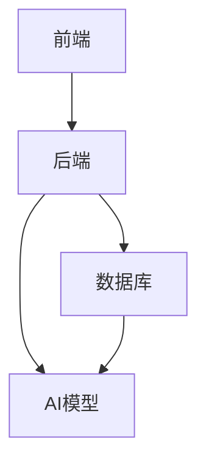

                 


# AI Agent在企业质量控制与产品追溯中的应用

## 关键词：AI Agent，企业质量控制，产品追溯，机器学习，计算机视觉，自然语言处理

## 摘要：  
随着人工智能技术的快速发展，AI Agent（智能体）在企业质量控制与产品追溯中的应用越来越广泛。本文将深入探讨AI Agent的核心技术、应用场景以及实际案例，分析其在质量控制和产品追溯中的优势，并结合算法原理和系统架构设计，为企业提供实用的解决方案。通过本文的阐述，读者将能够全面理解AI Agent在企业中的重要性及其在质量控制与产品追溯中的具体应用。

---

# 第1章：AI Agent概述

## 1.1 AI Agent的基本概念  
AI Agent（人工智能代理）是指能够感知环境、自主决策并执行任务的智能实体。与传统自动化系统相比，AI Agent具有更强的适应性和学习能力，能够根据实时数据和环境变化动态调整行为。  

### 1.1.1 AI Agent的核心特征  
1. **自主性**：能够独立决策和执行任务。  
2. **反应性**：能够实时感知环境并做出响应。  
3. **学习能力**：通过数据和经验不断优化自身性能。  
4. **协作性**：能够与其他系统或人类协同工作。  

## 1.2 企业质量控制与产品追溯的背景  
### 1.2.1 企业质量控制的重要性  
质量控制是企业生产过程中的关键环节，直接影响产品性能、客户满意度和企业声誉。传统的质量控制方法依赖人工检查，效率低且容易出错。  

### 1.2.2 产品追溯的必要性  
产品追溯是指通过记录和追踪产品的生产、运输和销售信息，确保出现问题时能够快速定位并采取措施。在食品药品、汽车制造等领域，产品追溯尤为重要。  

### 1.2.3 当前质量控制与追溯中的挑战  
1. **效率低下**：人工检查耗时且成本高。  
2. **精度不足**：传统方法难以检测复杂问题。  
3. **数据孤岛**：信息分散，难以整合分析。  

## 1.3 AI Agent在质量控制与追溯中的作用  
AI Agent能够通过机器学习、计算机视觉和自然语言处理等技术，实现对生产过程的实时监控和数据分析，从而提高质量控制的效率和精度。  

---

# 第2章：AI Agent的核心技术

## 2.1 机器学习基础  
### 2.1.1 机器学习的基本概念  
机器学习是一种通过数据训练模型的技术，广泛应用于分类、回归和聚类等任务。  

### 2.1.2 常见的机器学习算法  
1. **监督学习**：如支持向量机（SVM）和随机森林（Random Forest）。  
2. **无监督学习**：如K-means聚类和t-SNE。  
3. **深度学习**：如卷积神经网络（CNN）和循环神经网络（RNN）。  

### 2.1.3 机器学习在质量控制中的应用  
例如，利用CNN对产品表面缺陷进行检测，通过SVM对产品分类。  

## 2.2 自然语言处理  
### 2.2.1 NLP的基本概念  
NLP是研究人类语言理解与生成的交叉学科，广泛应用于文本分类、情感分析和实体识别。  

### 2.2.2 NLP在产品追溯中的应用  
例如，通过NLP分析生产记录文本，提取关键信息以实现产品追溯。  

### 2.2.3 常用的NLP工具与库  
1. **Python库**：如spaCy和NLTK。  
2. **深度学习框架**：如BERT和GPT。  

## 2.3 计算机视觉  
### 2.3.1 计算机视觉的基本概念  
计算机视觉是通过算法分析图像或视频的技术，广泛应用于目标检测和图像分割。  

### 2.3.2 计算机视觉在质量检测中的应用  
例如，利用YOLO算法对产品进行实时检测，或通过图像分割技术识别产品缺陷。  

## 2.4 本章小结  
本章介绍了AI Agent的核心技术，包括机器学习、NLP和计算机视觉，以及这些技术在质量控制与追溯中的具体应用。

---

# 第3章：AI Agent在企业质量控制中的应用

## 3.1 质量控制的定义与分类  
### 3.1.1 质量控制的基本概念  
质量控制是指通过一系列方法确保产品或服务符合预定标准的过程。  

### 3.1.2 质量控制的主要分类  
1. **过程控制**：实时监控生产过程，确保每一步符合标准。  
2. **最终检验**：对成品进行最终检查，确保其符合要求。  

## 3.2 AI Agent在质量控制中的应用场景  
### 3.2.1 实时质量监控  
AI Agent可以通过传感器数据实时监控生产过程，预测潜在问题并提前预警。  

### 3.2.2 缺陷检测  
利用计算机视觉技术，AI Agent可以自动检测产品表面的缺陷，减少人工检查的误差。  

### 3.2.3 质量数据分析与预测  
通过机器学习模型分析历史数据，预测未来可能出现的质量问题，并优化生产参数。  

## 3.3 AI Agent在质量控制中的优势  
### 3.3.1 高效性  
AI Agent能够快速处理大量数据，显著提高质量控制效率。  
### 3.3.2 准确性  
通过深度学习模型，AI Agent能够实现高精度的缺陷检测和分类。  
### 3.3.3 可扩展性  
AI Agent可以根据需求灵活扩展，适用于不同规模和复杂度的生产环境。  

---

# 第4章：AI Agent在产品追溯中的应用

## 4.1 产品追溯的定义与分类  
### 4.1.1 产品追溯的基本概念  
产品追溯是指通过记录和追踪产品的生产、运输和销售信息，确保出现问题时能够快速定位并采取措施。  

### 4.1.2 产品追溯的主要分类  
1. **批次追溯**：根据批次号追踪产品的来源和流向。  
2. **个体追溯**：对每个产品进行唯一标识，实现单个产品的全生命周期管理。  

## 4.2 AI Agent在产品追溯中的应用场景  
### 4.2.1 生产过程中的实时追踪  
AI Agent可以通过传感器和物联网设备实时记录产品的生产信息，并通过区块链技术确保数据的不可篡改性。  

### 4.2.2 供应链管理  
通过AI Agent对供应链中的物流信息进行实时监控，确保产品在运输过程中的安全性和可追溯性。  

### 4.2.3 消费者查询  
消费者可以通过扫描产品上的二维码，借助AI Agent快速查询产品的生产信息和质量数据。  

## 4.3 AI Agent在产品追溯中的优势  
### 4.3.1 实时性  
AI Agent能够实时记录和更新产品信息，确保追溯数据的准确性。  
### 4.3.2 安全性  
通过区块链技术，AI Agent可以实现数据的不可篡改，确保追溯信息的安全性和可靠性。  
### 4.3.3 便捷性  
消费者可以通过简单的操作快速查询产品信息，提升用户体验。  

---

# 第5章：AI Agent的算法原理与实现

## 5.1 机器学习算法原理  
### 5.1.1 分类算法  
$$\text{分类模型} = \arg\max_{i} P(y=i | x)$$  
### 5.1.2 聚类算法  
$$\text{聚类结果} = \text{K-means}(X, k)$$  
### 5.1.3 回归算法  
$$y = \beta_0 + \beta_1x + \epsilon$$  

## 5.2 计算机视觉算法实现  
### 5.2.1 目标检测  
使用YOLO算法实现产品缺陷的实时检测：  
```python
def detect_defects(image):
    # 使用YOLO模型进行检测
    boxes, labels, _ = yolo.detect(image)
    # 绘制检测结果
    for box, label in zip(boxes, labels):
        cv2.rectangle(image, box[0], box[1], color=(0, 255, 0))
    return image
```

### 5.2.2 图像分割  
使用U-Net模型对产品表面进行分割：  
$$\text{分割结果} = \text{U-Net}(X)$$  

---

# 第6章：AI Agent的系统架构设计

## 6.1 系统功能设计  
### 6.1.1 领域模型  
```mermaid
classDiagram
    class Product {
        id
        name
        status
    }
    class Sensor {
        id
        value
        timestamp
    }
    class Model {
        id
        name
        parameters
    }
    Product --> Sensor
    Product --> Model
```

### 6.1.2 系统架构  


### 6.1.3 接口设计  
API接口示例：  
1. `GET /api/sensor-data`：获取传感器数据。  
2. `POST /api/model-predict`：调用AI模型进行预测。  

---

# 第7章：AI Agent的项目实战

## 7.1 环境安装  
1. 安装Python和相关库：`pip install numpy, pandas, cv2, etc.`  
2. 安装深度学习框架：`pip install tensorflow, keras, etc.`  

## 7.2 核心代码实现  
### 7.2.1 质量检测代码  
```python
import cv2
import numpy as np

def detect_defects(image_path):
    # 读取图像
    image = cv2.imread(image_path)
    # 转换为灰度图
    gray = cv2.cvtColor(image, cv2.COLOR_BGR2GRAY)
    # 使用Sobel算子检测边缘
    sobel_x = cv2.Sobel(gray, cv2.CV_64F, 1, 0)
    sobel_y = cv2.Sobel(gray, cv2.CV_64F, 0, 1)
    # 合并边缘
    edges = np.sqrt(sobel_x**2 + sobel_y**2)
    # 二值化
    edges[edges > 1e10] = 1e10
    edges[edges <= 1e10] = 0
    # 绘制结果
    cv2.imwrite('result.jpg', edges)
    return 'result.jpg'
```

## 7.3 案例分析  
例如，利用AI Agent对汽车零件的表面缺陷进行检测，通过图像分割技术实现精准识别。  

---

# 第8章：最佳实践与总结

## 8.1 最佳实践  
1. **数据质量**：确保训练数据的多样性和代表性。  
2. **模型优化**：定期更新模型，提升准确率和效率。  
3. **系统集成**：与企业现有系统无缝对接，确保数据流畅传输。  

## 8.2 小结  
本文详细探讨了AI Agent在企业质量控制与产品追溯中的应用，从技术原理到系统设计，再到实际案例，全面展示了其优势和价值。

## 8.3 注意事项  
1. **数据隐私**：确保数据的安全性和隐私性。  
2. **系统稳定性**：确保AI Agent的稳定运行，避免因系统故障导致生产中断。  

---

# 附录

## 附录A：参考文献  
1. 书籍：《机器学习实战》  
2. 论文：《基于深度学习的产品缺陷检测方法》  

## 附录B：工具与库  
1. Python库：numpy, pandas, cv2, etc.  
2. 深度学习框架：TensorFlow, Keras, etc.  

---

# 作者：AI天才研究院 & 禅与计算机程序设计艺术

