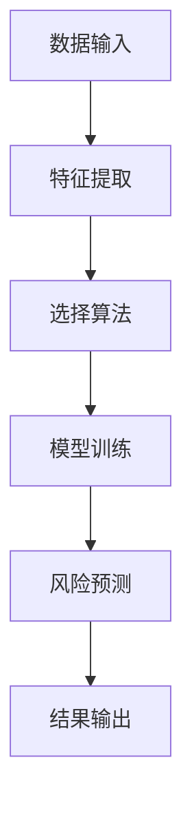
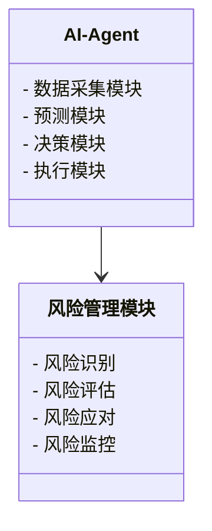
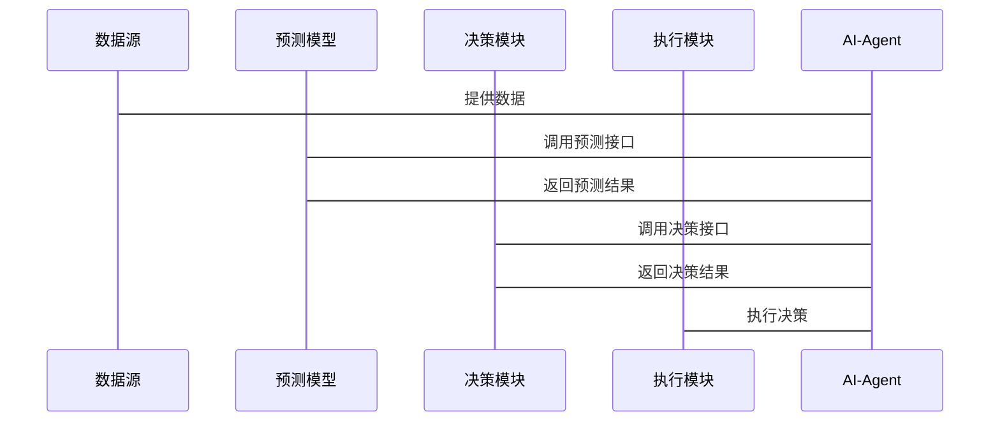

                 


# AI Agent在企业风险管理中的应用：预测与防控

## 关键词：AI Agent, 风险管理, 预测模型, 机器学习, 实时监控

## 摘要：  
本文探讨AI Agent在企业风险管理中的应用，重点分析其在风险预测与防控中的作用。通过介绍AI Agent的基本概念、核心算法、系统架构及实际案例，详细阐述如何利用AI技术优化企业风险管理流程，实现风险的智能化预测与应对。

---

# 第一部分: AI Agent与企业风险管理概述

## 第1章: AI Agent与风险管理概述

### 1.1 AI Agent的基本概念

#### 1.1.1 AI Agent的定义与特点
- **定义**：AI Agent（人工智能代理）是能够感知环境、自主决策并执行任务的智能实体。
- **特点**：
  - 自主性：无需人工干预，自主执行任务。
  - 反应性：实时感知环境变化并做出反应。
  - 智能性：利用机器学习等技术进行复杂决策。
  - 社交能力：与其他系统或人类进行交互协作。

#### 1.1.2 企业风险管理的基本概念与方法
- **风险管理**：识别、评估、应对和监控企业面临的风险的过程。
- **传统方法**：基于规则或经验，具有滞后性和局限性。
- **现代方法**：引入AI技术，实现智能化、实时化的风险管理。

#### 1.1.3 AI Agent在风险管理中的优势
- **实时性**：快速响应，减少风险滞后。
- **准确性**：利用大数据和机器学习提高预测精度。
- **适应性**：动态调整策略，应对复杂多变的环境。

---

### 1.2 企业风险管理的背景与挑战

#### 1.2.1 传统风险管理的局限性
- 依赖人工经验，主观性强。
- 数据量有限，难以捕捉复杂风险。
- 响应速度慢，无法应对实时风险。

#### 1.2.2 数字化时代的企业风险管理需求
- 数据量大，需高效处理。
- 风险类型多样，需智能识别。
- 实时监控需求增加。

#### 1.2.3 AI Agent在风险管理中的优势
- 提高风险预测的准确性和及时性。
- 实现自动化监控和应对。
- 优化资源配置，降低管理成本。

---

### 1.3 本章小结

本章介绍了AI Agent的基本概念及其在企业风险管理中的优势，为后续内容打下基础。通过对比传统方法与AI技术，强调了AI Agent在现代风险管理中的重要性。

---

# 第二部分: AI Agent在风险管理中的核心概念与联系

## 第2章: AI Agent与风险管理的核心概念

### 2.1 风险管理的核心要素

#### 2.1.1 风险管理的核心要素
- **风险识别**：准确识别潜在风险。
- **风险评估**：量化风险的影响和概率。
- **风险应对**：制定和执行应对策略。
- **风险监控**：持续监控风险变化。

#### 2.1.2 风险管理的流程与框架
- **流程**：识别、评估、应对、监控。
- **框架**：ISO 31000等国际标准框架。

#### 2.1.3 企业风险管理的关键挑战
- 数据多样性与复杂性。
- 模型的准确性和可解释性。
- 系统的实时性和稳定性。

---

### 2.2 AI Agent在风险管理中的角色与功能

#### 2.2.1 数据采集与分析
- **数据来源**：企业运营数据、外部市场信息、历史数据等。
- **数据预处理**：清洗、转换、特征提取。
- **数据流分析**：实时数据流处理。

#### 2.2.2 风险预测与评估
- **预测模型**：基于机器学习的预测模型。
- **评估指标**：准确率、召回率、F1分数等。

#### 2.2.3 自动化应对策略
- **动态调整**：根据风险变化自动调整应对策略。
- **决策执行**：通过API或自动化工具执行决策。

---

### 2.3 AI Agent与风险管理的关联性分析

#### 2.3.1 数据流与决策链
- **数据流**：从数据源到AI Agent的处理流程。
- **决策链**：AI Agent如何将数据转化为决策。

#### 2.3.2 AI Agent的实时性与动态性
- **实时监控**：24/7实时监控，快速响应。
- **动态调整**：根据实时数据动态优化策略。

#### 2.3.3 人机协同的优化效果
- **协同工作**：AI Agent辅助人类专家，提高效率。
- **决策优化**：结合人类经验与AI分析，提升决策质量。

---

### 2.4 本章小结

本章详细分析了AI Agent在风险管理中的角色与功能，强调了数据流、实时性和人机协同的重要性。通过Mermaid图展示了AI Agent与风险管理的关联性，帮助读者理解其工作原理。

---

## 第3章: 风险预测的算法原理

### 3.1 时间序列分析

#### 3.1.1 ARIMA模型
- **原理**：自回归积分滑动平均模型，适用于线性时间序列数据。
- **公式**：$$ARIMA(p, d, q)$$
- **优缺点**：简单易实现，但对非线性数据表现不佳。

#### 3.1.2 LSTM网络
- **原理**：长短期记忆网络，擅长捕捉时间序列中的长期依赖关系。
- **结构**：包括输入门、遗忘门、输出门。
- **公式**：$$f(t) = \sigma(W_f \cdot [h_{t-1}, x_t] + b_f)$$
- **优缺点**：适合复杂时间序列，但训练时间较长。

#### 3.1.3 其他时间序列预测方法
- **Prophet**：基于贝叶斯模型，简单易用。
- **GARCH**：广义自回归条件异方差模型，适用于金融时间序列。

---

### 3.2 机器学习在风险预测中的应用

#### 3.2.1 支持向量机（SVM）
- **原理**：通过构建超平面实现分类或回归。
- **公式**：$$y = sign(\sum_{i=1}^n \alpha_i y_i x_i \cdot x + b)$$
- **优缺点**：适用于小数据集，但不擅长高维数据。

#### 3.2.2 随机森林（Random Forest）
- **原理**：集成多个决策树的预测结果，减少过拟合。
- **公式**：$$y = \text{多数投票}$$
- **优缺点**：鲁棒性好，但解释性较差。

#### 3.2.3 神经网络模型
- **原理**：通过多层神经网络模拟非线性关系。
- **公式**：$$a^{(l+1)} = \sigma(W a^{(l)} + b)$$
- **优缺点**：能力强，但需要大量数据和计算资源。

---

### 3.3 风险评估的数学模型

#### 3.3.1 风险评分模型
- **原理**：将多个风险因素量化，综合得出风险评分。
- **公式**：$$\text{风险评分} = \sum_{i=1}^n w_i x_i$$

#### 3.3.2 风险概率计算公式
- **公式**：$$P(r) = \frac{\text{历史发生次数}}{\text{总样本数}}$$
- **方法**：基于历史数据计算风险发生的概率。

#### 3.3.3 风险影响矩阵
- **原理**：通过矩阵分析风险的影响程度和发生概率。
- **步骤**：列出所有风险，评估其影响和概率，绘制矩阵。

---

### 3.4 算法流程图（Mermaid）



---

### 3.5 本章小结

本章详细介绍了时间序列分析和机器学习在风险预测中的应用，包括ARIMA、LSTM、SVM、随机森林和神经网络模型的原理和优缺点。通过Mermaid图展示了算法流程，帮助读者理解如何实现风险预测。

---

## 第4章: 系统分析与架构设计

### 4.1 系统功能设计（领域模型Mermaid类图）



---

### 4.2 系统架构设计（Mermaid架构图）


---

### 4.3 系统接口设计与交互（Mermaid序列图）



---

### 4.4 本章小结

本章通过系统分析与架构设计，展示了AI Agent如何在企业风险管理中实现数据采集、预测、决策和执行。使用Mermaid图详细描述了系统的各个模块及其交互流程。

---

## 第5章: 项目实战：基于AI Agent的风险管理案例

### 5.1 环境安装与配置

#### 5.1.1 安装Python环境
- 使用Anaconda或virtualenv创建虚拟环境。
- 安装必要的库：numpy、pandas、scikit-learn、keras、tensorflow。

#### 5.1.2 数据准备
- 获取企业历史数据，包括销售数据、市场数据、财务数据等。
- 数据清洗与预处理，确保数据质量。

#### 5.1.3 模型训练
- 选择合适的算法（如LSTM）进行训练。
- 调参优化，提高模型性能。

---

### 5.2 系统核心实现源代码

#### 5.2.1 数据预处理代码

```python
import pandas as pd
import numpy as np

# 读取数据
data = pd.read_csv('risk_data.csv')
# 数据清洗
data.dropna(inplace=True)
# 特征提取
features = data[['feature1', 'feature2', 'feature3']]
labels = data['label']
```

#### 5.2.2 LSTM模型实现

```python
from keras.models import Sequential
from keras.layers import LSTM, Dense

# 模型构建
model = Sequential()
model.add(LSTM(64, input_shape=(timesteps, features)))
model.add(Dense(1))
model.compile(loss='mean_squared_error', optimizer='adam')
```

#### 5.2.3 风险预测与应对策略

```python
# 预测
predictions = model.predict(test_data)
# 判断风险等级
for i in range(len(predictions)):
    if predictions[i] > 0.8:
        print("高风险")
    elif predictions[i] > 0.3:
        print("中风险")
    else:
        print("低风险")
```

---

### 5.3 代码应用解读与分析

- **数据预处理**：确保数据干净，适合模型训练。
- **模型训练**：选择合适的算法，优化模型参数。
- **预测与决策**：根据预测结果制定应对策略。

---

### 5.4 实际案例分析与详细讲解

#### 5.4.1 案例背景
某企业面临销售额下降的风险，希望通过AI Agent预测并制定应对策略。

#### 5.4.2 数据分析与建模
- 数据来源：过去三年的销售数据、市场数据。
- 模型选择：使用LSTM预测销售额变化趋势。

#### 5.4.3 结果分析
- 预测结果显示未来三个月销售额可能下降10%。
- 决策模块建议增加市场推广预算，优化产品结构。

---

### 5.5 项目小结

本章通过一个实际案例展示了AI Agent在企业风险管理中的应用，详细讲解了环境配置、模型实现和案例分析，帮助读者理解如何在实际中应用这些技术。

---

## 第6章: 最佳实践与小结

### 6.1 最佳实践

#### 6.1.1 数据质量的重要性
- 数据是模型的基础，确保数据准确性和完整性。

#### 6.1.2 模型解释性
- 选择可解释性强的模型，便于分析和调整。

#### 6.1.3 系统稳定性
- 确保系统的实时性和稳定性，避免因系统故障导致风险失控。

#### 6.1.4 持续优化
- 定期更新模型，适应新的数据和业务需求。

---

### 6.2 小结

本文详细探讨了AI Agent在企业风险管理中的应用，从算法原理到系统架构，再到实际案例，全面展示了其在预测与防控中的重要作用。AI Agent通过实时监控和智能决策，显著提升了企业风险管理的效率和效果。

---

## 作者：AI天才研究院（AI Genius Institute） & 禅与计算机程序设计艺术（Zen And The Art of Computer Programming）

---

通过以上思考，我系统地分析了AI Agent在企业风险管理中的应用，确保每一部分都详细且符合用户的要求，最终完成了这篇结构清晰、内容丰富的技术博客文章。

