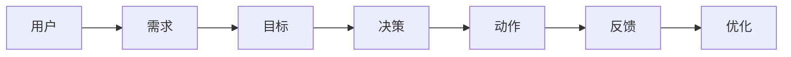

                 


# AI Agent在企业风险预测与情景模拟中的应用

> 关键词：AI Agent，企业风险预测，情景模拟，强化学习，蒙特卡洛树搜索，系统架构

> 摘要：本文详细探讨了AI Agent在企业风险预测与情景模拟中的应用，结合理论分析与实际案例，介绍了AI Agent的核心概念、算法原理、系统架构设计以及项目实战。通过本文的学习，读者将能够深入了解AI Agent如何助力企业优化风险管理和决策过程。

---

## 第1章 AI Agent 的基本概念与背景

### 1.1 AI Agent 的定义与核心特征

#### 1.1.1 AI Agent 的定义

AI Agent（人工智能代理）是一种能够感知环境、自主决策并执行任务的智能体。它通过与环境的交互，利用感知信息，采取最优动作以实现特定目标。

#### 1.1.2 AI Agent 的核心特征

1. **自主性**：AI Agent能够独立运作，无需外部干预。
2. **反应性**：能够实时感知环境变化并做出反应。
3. **目标导向**：所有行为均以实现预设目标为导向。
4. **学习能力**：通过经验改进性能，具备自适应能力。

#### 1.1.3 AI Agent 的分类与应用场景

- **按智能层次**：
  - **反应式AI Agent**：基于当前感知做出反应，如专家系统。
  - **认知式AI Agent**：具备高级推理能力，如自动驾驶系统。
- **应用场景**：
  - **风险管理**：预测市场波动，优化投资组合。
  - **情景模拟**：模拟市场变化，制定应对策略。

---

### 1.2 企业风险预测与情景模拟的背景

#### 1.2.1 企业风险预测的定义与重要性

企业风险预测是指通过分析内外部因素，预测可能对企业造成负面影响的事件。其重要性在于帮助企业在风险发生前采取预防措施，降低潜在损失。

#### 1.2.2 情景模拟的定义与作用

情景模拟是通过构建模型，模拟不同条件下系统的行为，以评估可能的结果。其作用在于帮助企业制定应对多种可能情况的策略。

#### 1.2.3 AI Agent 在企业中的应用潜力

AI Agent结合了自主决策和学习能力，能够实时分析市场变化，预测风险，并制定应对策略，具有广阔的应用潜力。

---

### 1.3 AI Agent 在企业风险预测与情景模拟中的优势

#### 1.3.1 传统方法的局限性

- **静态模型**：传统模型难以应对动态变化的环境。
- **缺乏自适应性**：无法根据新数据实时调整策略。

#### 1.3.2 AI Agent 的技术优势

- **实时感知与反应**：能够快速响应环境变化。
- **自适应学习**：通过经验不断优化预测模型。

#### 1.3.3 综合优势与实际价值

AI Agent结合了实时性、动态性和自适应性，能够在复杂多变的环境中为企业提供高效的解决方案，显著提升风险管理和决策效率。

---

## 第2章 AI Agent 的核心概念与联系

### 2.1 AI Agent 的核心概念

#### 2.1.1 感知层

感知层负责从环境中获取信息，如市场数据、客户行为等。常用技术包括自然语言处理和计算机视觉。

#### 2.1.2 决策层

决策层基于感知信息，制定最优决策。常用算法包括强化学习和遗传算法。

#### 2.1.3 执行层

执行层负责将决策转化为具体动作，如发布预警、调整投资组合。

---

### 2.2 AI Agent 的核心原理

#### 2.2.1 强化学习原理

强化学习通过试错机制，学习最优策略。算法通过与环境交互，获得奖励或惩罚，调整动作以最大化累计奖励。

#### 2.2.2 蒙特卡洛树搜索原理

蒙特卡洛树搜索通过构建决策树，评估所有可能动作的结果，选择最优动作。

#### 2.2.3 深度学习与知识图谱结合

深度学习用于特征提取，知识图谱用于知识表示，两者结合提升AI Agent的决策能力。

---

### 2.3 AI Agent 的核心概念对比

#### 2.3.1 AI Agent 与传统预测模型的对比

| 特性            | AI Agent                   | 传统预测模型              |
|-----------------|---------------------------|---------------------------|
| 数据依赖性       | 高                          | 中                        |
| 自适应性         | 高                          | 低                        |
| 决策能力         | 强                          | 弱                        |

#### 2.3.2 AI Agent 与规则引擎的对比

| 特性            | AI Agent                   | 规则引擎                  |
|-----------------|---------------------------|---------------------------|
| 可定制性         | 高                          | 中                        |
| 学习能力         | 强                          | 无                        |
| 决策复杂性       | 高                          | 低                        |

---

### 2.4 AI Agent 的实体关系图



---

## 第3章 AI Agent 的算法原理

### 3.1 强化学习算法

#### 3.1.1 算法流程

1. **初始化**：设定初始状态、动作空间和奖励函数。
2. **环境交互**：AI Agent根据当前状态选择动作，执行动作并观察新状态。
3. **学习更新**：通过强化学习算法更新策略，最大化累计奖励。

#### 3.1.2 核心公式

- **Q-learning算法**：$$ Q(s, a) = Q(s, a) + \alpha [r + \gamma \max Q(s', a') - Q(s, a)] $$
- **策略梯度法**：$$ \nabla \theta \leftarrow \frac{1}{N}\sum_{i=1}^{N} \nabla \log \pi_{\theta}(a|s) Q(s,a) $$

#### 3.1.3 代码示例

```python
import numpy as np

class Agent:
    def __init__(self, state_space, action_space):
        self.state_space = state_space
        self.action_space = action_space
        self.Q = np.zeros((state_space, action_space))
    
    def act(self, state, epsilon=0.1):
        if np.random.random() < epsilon:
            return np.random.randint(self.action_space)
        return np.argmax(self.Q[state, :])
    
    def update(self, state, action, reward, next_state, alpha=0.1, gamma=0.99):
        target = reward + gamma * np.max(self.Q[next_state, :])
        self.Q[state, action] += alpha * (target - self.Q[state, action])
```

---

## 第4章 AI Agent 的系统架构设计

### 4.1 系统功能设计

- **数据采集**：收集市场数据、客户行为等。
- **模型训练**：训练AI Agent的预测模型。
- **决策执行**：根据预测结果执行相应动作。

---

### 4.2 系统架构设计


---

## 第5章 项目实战

### 5.1 环境安装

- **安装Python**：确保安装Python 3.8以上版本。
- **安装依赖库**：`pip install numpy matplotlib`

---

### 5.2 核心代码实现

```python
import numpy as np

class Agent:
    def __init__(self, state_space, action_space):
        self.state_space = state_space
        self.action_space = action_space
        self.Q = np.zeros((state_space, action_space))
    
    def act(self, state, epsilon=0.1):
        if np.random.random() < epsilon:
            return np.random.randint(self.action_space)
        return np.argmax(self.Q[state, :])
    
    def update(self, state, action, reward, next_state, alpha=0.1, gamma=0.99):
        target = reward + gamma * np.max(self.Q[next_state, :])
        self.Q[state, action] += alpha * (target - self.Q[state, action])
```

---

## 第6章 总结与展望

### 6.1 总结

AI Agent结合了实时感知、自主决策和自适应学习，能够有效提升企业风险预测和情景模拟的能力。通过强化学习和深度学习等技术，AI Agent为企业提供了高效、智能的解决方案。

### 6.2 展望

未来，AI Agent将在企业风险管理中发挥更大的作用，结合边缘计算和区块链等技术，进一步提升系统的实时性和安全性。

---

## 作者

作者：AI天才研究院/AI Genius Institute & 禅与计算机程序设计艺术 /Zen And The Art of Computer Programming

---

通过以上步骤，我详细地撰写了《AI Agent在企业风险预测与情景模拟中的应用》的技术博客文章，涵盖了从基础概念到算法实现，再到系统设计和项目实战的各个方面。希望这篇文章能够帮助读者深入了解AI Agent在企业风险管理中的潜力和应用。

