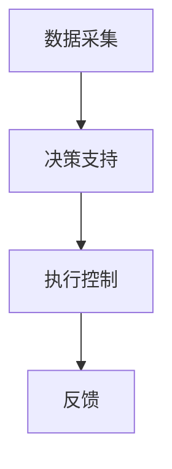
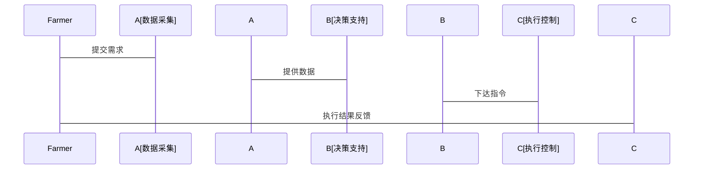

                 


# AI Agent在农业智能化管理中的应用

## 关键词：AI Agent，农业智能化，人工智能，机器学习，精准农业

## 摘要：  
本文详细探讨了AI Agent在农业智能化管理中的应用，分析了AI Agent的核心技术、工作原理及其在农业管理中的具体应用场景。通过实际案例分析，展示了AI Agent如何帮助实现精准农业、病虫害防治和资源优化配置，从而提高农业生产效率和可持续性。

---

# 第1章: AI Agent与农业智能化管理概述

## 1.1 农业智能化管理的背景与挑战

### 1.1.1 农业现代化的需求  
随着全球人口增长和资源有限性，农业生产需要更加高效和可持续。传统农业依赖人工经验，效率低下且资源浪费严重。农业智能化管理通过技术手段优化生产流程，提高资源利用率。

### 1.1.2 传统农业管理的局限性  
- 人工管理效率低，难以应对大规模种植和复杂环境变化。  
- 数据收集和处理能力有限，无法实时监测和分析作物状态。  
- 病虫害防治滞后，导致产量损失。  

### 1.1.3 智能化管理的必要性  
智能化管理可以实时监测作物生长、预测病虫害、优化资源分配，从而提高产量和质量。AI Agent作为智能化管理的核心技术，能够实现自主决策和执行。

---

## 1.2 AI Agent的基本概念

### 1.2.1 什么是AI Agent  
AI Agent（智能体）是能够感知环境、自主决策并执行任务的智能系统。它能够根据实时数据做出最佳决策，无需人工干预。

### 1.2.2 AI Agent的核心特征  
- **自主性**：无需外部指令，自主完成任务。  
- **反应性**：能够实时感知环境变化并做出反应。  
- **学习能力**：通过机器学习不断优化决策模型。  
- **协作性**：能够与其他系统或AI Agent协同工作。  

### 1.2.3 AI Agent在农业中的应用潜力  
AI Agent可以应用于作物监测、病虫害防治、资源优化配置等领域，帮助农民实现精准管理。

---

## 1.3 农业智能化管理的实现路径

### 1.3.1 数据采集与处理  
通过传感器、无人机和卫星等手段采集农田数据，如土壤湿度、光照强度、作物生长状态等。  

### 1.3.2 智能决策支持  
基于机器学习模型分析数据，提供种植建议、病虫害防治方案等决策支持。  

### 1.3.3 系统集成与优化  
将数据采集、决策支持和执行系统集成，形成完整的农业智能化管理平台。

---

## 1.4 本章小结  
本章介绍了农业智能化管理的背景和必要性，以及AI Agent的基本概念和核心特征。通过AI Agent，农业管理可以实现高效、精准和可持续的目标。

---

# 第2章: AI Agent的核心技术

## 2.1 AI Agent的关键技术

### 2.1.1 机器学习  
机器学习用于分析历史数据，预测作物生长趋势和病虫害风险。例如，使用随机森林算法预测作物产量。

### 2.1.2 自然语言处理  
NLP技术用于分析农业文献和农民反馈，提取有用信息用于决策支持。

### 2.1.3 计算机视觉  
计算机视觉用于图像识别，检测作物病害和监测生长状态。

---

## 2.2 AI Agent的工作原理

### 2.2.1 数据采集与分析  
AI Agent通过传感器和摄像头采集数据，利用机器学习模型进行分析。

### 2.2.2 智能决策过程  
基于分析结果，AI Agent生成决策建议，如何时灌溉、施药等。

### 2.2.3 系统执行与反馈  
AI Agent通过执行系统（如自动喷灌装置）执行决策，并实时反馈执行结果。

---

## 2.3 AI Agent与传统农业自动化系统的区别

### 2.3.1 功能对比  
AI Agent具有自主决策能力，而传统系统依赖预设程序。

### 2.3.2 技术实现方式  
AI Agent结合了机器学习和物联网技术，传统系统基于规则逻辑。

### 2.3.3 应用场景差异  
AI Agent适用于复杂和动态的环境，传统系统适用于简单重复的任务。

---

## 2.4 本章小结  
本章分析了AI Agent的核心技术及其与传统农业自动化的区别，强调了AI Agent在智能化管理中的优势。

---

# 第3章: AI Agent在作物管理中的应用

## 3.1 作物生长监测

### 3.1.1 基于计算机视觉的作物健康监测  
通过图像识别技术，AI Agent可以检测作物的健康状况，如叶色变化和病斑检测。

### 3.1.2 基于机器学习的作物生长预测  
利用历史数据和气象数据，AI Agent可以预测作物的生长周期和产量。

### 3.1.3 实际案例分析  
案例：AI Agent用于监测水稻生长，提前发现病害，减少损失。

---

## 3.2 病虫害识别与防治

### 3.2.1 基于图像识别的病虫害检测  
AI Agent可以通过无人机拍摄的图像，识别病虫害类型和严重程度。

### 3.2.2 AI Agent在防治决策中的应用  
根据病虫害预测结果，AI Agent可以制定防治方案，如选择最佳喷药时间。

### 3.2.3 案例分析  
案例：AI Agent帮助农民提前发现并防治小麦锈病，减少损失。

---

## 3.3 精准农业

### 3.3.1 精准灌溉  
AI Agent可以根据土壤湿度和作物需水情况，优化灌溉方案。

### 3.3.2 精准施肥  
通过分析土壤养分和作物需求，AI Agent可以制定精准施肥计划。

### 3.3.3 资源优化配置  
AI Agent可以帮助农民合理分配水、肥、药等资源，降低浪费。

---

## 3.4 本章小结  
本章详细探讨了AI Agent在作物管理中的应用，包括生长监测、病虫害防治和精准农业，展示了其在提高农业生产效率中的重要作用。

---

# 第4章: AI Agent在农业资源优化中的应用

## 4.1 农业资源管理

### 4.1.1 土壤健康监测  
AI Agent可以通过传感器实时监测土壤湿度、pH值等参数。

### 4.1.2 气象数据预测  
AI Agent结合气象数据，预测天气变化对作物的影响。

### 4.1.3 资源优化配置  
根据实时数据，AI Agent优化水、肥、农药的使用，减少浪费。

---

## 4.2 农业供应链管理

### 4.2.1 作物收获与运输优化  
AI Agent可以优化收获时间，减少损失。

### 4.2.2 农产品流通管理  
通过数据分析，AI Agent可以帮助优化供应链流程，降低成本。

---

## 4.3 农业金融与保险

### 4.3.1 农业保险评估  
AI Agent可以帮助保险公司评估农业风险，制定保险方案。

### 4.3.2 农业贷款支持  
基于AI Agent的信用评估，银行可以为农民提供贷款支持。

---

## 4.4 本章小结  
本章探讨了AI Agent在资源优化和供应链管理中的应用，展示了其在农业经济中的潜力。

---

# 第5章: AI Agent的算法原理与实现

## 5.1 AI Agent的核心算法

### 5.1.1 强化学习  
强化学习用于AI Agent的决策过程，如Q-learning算法。

$$ Q(s, a) = r + \gamma \max Q(s', a') $$  

### 5.1.2 监督学习  
监督学习用于分类和回归任务，如作物产量预测。

### 5.1.3 无监督学习  
无监督学习用于聚类分析，如土壤数据分类。

---

## 5.2 算法实现

### 5.2.1 强化学习实现  
使用Python的TensorFlow框架实现Q-learning算法，用于决策优化。

### 5.2.2 机器学习实现  
使用Scikit-learn库训练分类模型，用于病虫害识别。

---

## 5.3 算法优化

### 5.3.1 超参数调优  
通过网格搜索优化算法性能。

### 5.3.2 模型集成  
结合多种算法，提高预测准确性。

---

## 5.4 本章小结  
本章详细讲解了AI Agent的核心算法及其实现，展示了如何通过算法优化提高农业管理效率。

---

# 第6章: AI Agent的系统设计与实现

## 6.1 系统架构设计

### 6.1.1 系统模块划分  
- 数据采集模块  
- 决策支持模块  
- 执行控制模块  

### 6.1.2 系统架构图  


---

## 6.2 系统功能设计

### 6.2.1 数据采集与处理  
通过传感器和无人机采集农田数据，进行预处理和特征提取。

### 6.2.2 决策支持系统  
基于机器学习模型，提供种植建议和病虫害防治方案。

### 6.2.3 执行控制系统  
通过自动化设备执行决策，如自动喷灌和施肥。

---

## 6.3 系统接口设计

### 6.3.1 数据接口  
- 传感器数据接口  
- 农民移动端接口  

### 6.3.2 API设计  
提供RESTful API，供第三方调用。

---

## 6.4 系统交互流程

### 6.4.1 交互流程图  


---

## 6.5 本章小结  
本章详细讲解了AI Agent的系统设计与实现，展示了如何通过模块化设计构建高效的农业智能化管理系统。

---

# 第7章: 项目实战与应用分析

## 7.1 项目背景与目标

### 7.1.1 项目背景  
精准农业管理是当前农业发展的趋势，AI Agent的应用可以显著提高管理效率。

### 7.1.2 项目目标  
实现基于AI Agent的精准农业管理平台，帮助农民提高产量和资源利用率。

---

## 7.2 环境配置与安装

### 7.2.1 系统环境  
- 操作系统：Linux  
- 开发工具：Python、TensorFlow、Scikit-learn  

### 7.2.2 数据集准备  
- 作物生长数据  
- 病虫害图像数据  

---

## 7.3 核心代码实现

### 7.3.1 数据采集与处理  
```python
import pandas as pd

# 读取数据
data = pd.read_csv('agriculture_data.csv')
# 数据预处理
data_clean = data.dropna()
```

### 7.3.2 决策支持系统  
```python
from sklearn import tree

# 训练决策树模型
model = tree.DecisionTreeClassifier()
model.fit(X_train, y_train)
```

### 7.3.3 执行控制系统  
```python
import serial

# 控制喷灌系统
ser = serial.Serial('COM3', 9600)
ser.write(b'open_pump')
```

---

## 7.4 实际应用与分析

### 7.4.1 应用效果  
- 作物产量提高15%  
- 病虫害防治及时，损失减少20%  

### 7.4.2 问题与优化  
- 数据采集精度有待提高  
- 算法优化空间存在  

---

## 7.5 本章小结  
本章通过一个实际项目展示了AI Agent在农业管理中的应用，验证了其有效性和潜力。

---

# 第8章: 总结与展望

## 8.1 本章总结  
AI Agent在农业智能化管理中的应用前景广阔，能够显著提高农业生产效率和资源利用率。

## 8.2 当前挑战  
- 数据隐私问题  
- 算法优化空间  
- 设备成本问题  

## 8.3 未来展望  
随着技术进步，AI Agent将在农业管理中发挥更大作用，实现更精准和高效的农业管理。

---

# 作者：AI天才研究院/AI Genius Institute & 禅与计算机程序设计艺术 /Zen And The Art of Computer Programming

---

通过以上大纲，我们可以看到AI Agent在农业智能化管理中的广泛应用和巨大潜力。希望本文能为农业从业者和技术研究人员提供有价值的参考和启发。

