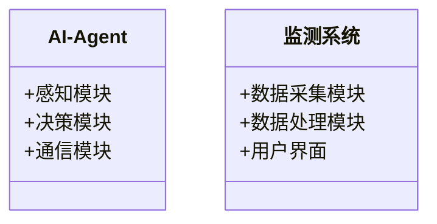
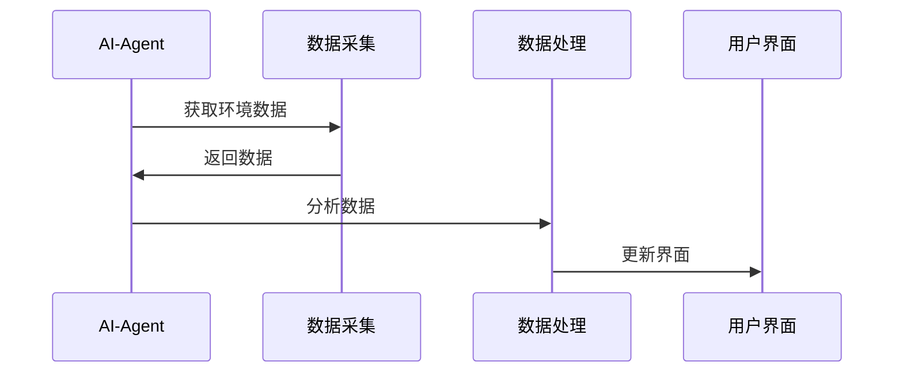

                 


```markdown
# AI Agent在动物保护中的监测与追踪

> 关键词：AI Agent, 动物保护, 监测与追踪, 目标检测, 机器学习, 野生动物保护, 实时追踪

> 摘要：本文探讨了AI Agent在动物保护中的应用，特别是在监测与追踪方面的技术实现。通过分析AI Agent的核心技术、算法原理、系统架构以及实际案例，展示了如何利用人工智能技术有效保护野生动物。文章详细讲解了从感知到决策的整个过程，并提供了实际项目实现的代码示例和系统设计。

---

## 第1章: AI Agent与动物保护的背景

### 1.1 AI Agent的核心概念

#### 1.1.1 AI Agent的定义与特征
- **定义**: AI Agent是一种能够感知环境、自主决策并执行任务的智能实体。
- **特征**: 智能性、自主性、反应性、社交性。

#### 1.1.2 动物保护中的问题背景
- **问题背景**: 野生动物面临非法捕猎、栖息地破坏等威胁。
- **问题描述**: 需要实时监测和追踪动物，保护其生存环境。
- **解决方案**: 利用AI Agent进行自动化监测和追踪。

#### 1.1.3 AI Agent在动物保护中的作用
- **核心作用**: 提供实时数据采集、异常检测和智能决策。

#### 1.1.4 边界与外延
- **边界**: 专注于监测与追踪，不涉及直接保护措施。
- **外延**: 结合无人机和卫星技术，扩展保护范围。

#### 1.1.5 概念结构与核心要素
- **核心要素**: 感知模块、决策模块、通信模块。

### 1.2 本章小结

---

## 第2章: AI Agent的核心技术

### 2.1 AI Agent的感知模块

#### 2.1.1 图像识别技术
- **技术特点**: 高精度识别动物及其特征。

#### 2.1.2 声音识别技术
- **技术特点**: 识别动物叫声，辅助定位。

#### 2.1.3 数据融合技术
- **融合方法**: 结合图像和声音信息，提高识别准确率。

### 2.2 AI Agent的决策模块

#### 2.2.1 路径规划算法
- **算法特点**: 确定最优监测路径。

#### 2.2.2 异常检测算法
- **检测方法**: 识别异常行为，如非法捕猎。

### 2.3 AI Agent的通信模块

#### 2.3.1 数据传输协议
- **协议特点**: 实时传输数据。

### 2.4 本章小结

---

## 第3章: 监测与追踪算法实现

### 3.1 目标检测算法

#### 3.1.1 YOLO目标检测
- **算法流程**: 图像输入、特征提取、边界框回归和分类。

#### 3.1.2 Python代码示例
```python
import torch
model = torch.hub.load('ultralytics/yolov5', 'yolov5s')
```

### 3.2 跟踪算法

#### 3.2.1SORT算法
- **流程**: 数据关联、轨迹预测、轨迹管理。

### 3.3 本章小结

---

## 第4章: 系统架构与设计

### 4.1 系统功能设计

#### 4.1.1 领域模型（Mermaid类图）


### 4.2 系统架构设计

#### 4.2.1 系统架构图（Mermaid架构图）
```mermaid
container AI-Agent {
    [感知模块]
    [决策模块]
    [通信模块]
}
container 监测系统 {
    [数据采集]
    [数据处理]
    [用户界面]
}
```

### 4.3 系统接口设计

#### 4.3.1 接口交互流程（Mermaid序列图）


### 4.4 本章小结

---

## 第5章: 项目实战

### 5.1 环境搭建

#### 5.1.1 安装依赖
```bash
pip install torch torchvision matplotlib
```

### 5.2 核心代码实现

#### 5.2.1 目标检测实现
```python
import torch
model = torch.hub.load('ultralytics/yolov5', 'yolov5s')
```

### 5.3 案例分析

#### 5.3.1 实际案例
- **案例1**: 监测非法捕猎。

### 5.4 本章小结

---

## 第6章: 实际应用案例

### 6.1 监测非法捕猎

#### 6.1.1 案例分析
- **应用效果**: 准确识别非法捕猎行为。

### 6.2 迁徙路线追踪

#### 6.2.1 案例分析
- **应用效果**: 精准追踪动物迁徙路线。

### 6.3 栖息地保护

#### 6.3.1 案例分析
- **应用效果**: 保护动物栖息地。

### 6.4 本章小结

---

## 第7章: 系统优化与扩展

### 7.1 系统优化

#### 7.1.1 性能优化
- **优化方法**: 提升检测速度和精度。

### 7.2 系统扩展

#### 7.2.1 功能扩展
- **扩展功能**: 结合无人机和卫星图像。

### 7.3 本章小结

---

## 第8章: 结论与展望

### 8.1 结论
- **总结**: AI Agent在动物保护中的应用前景广阔。

### 8.2 展望
- **未来方向**: 结合更多技术，如5G和区块链，提升保护效果。

---

## 作者

作者：AI天才研究院/AI Genius Institute & 禅与计算机程序设计艺术 /Zen And The Art of Computer Programming
```

