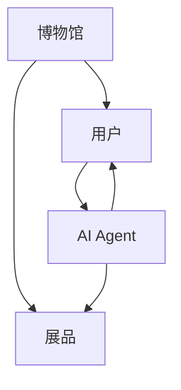
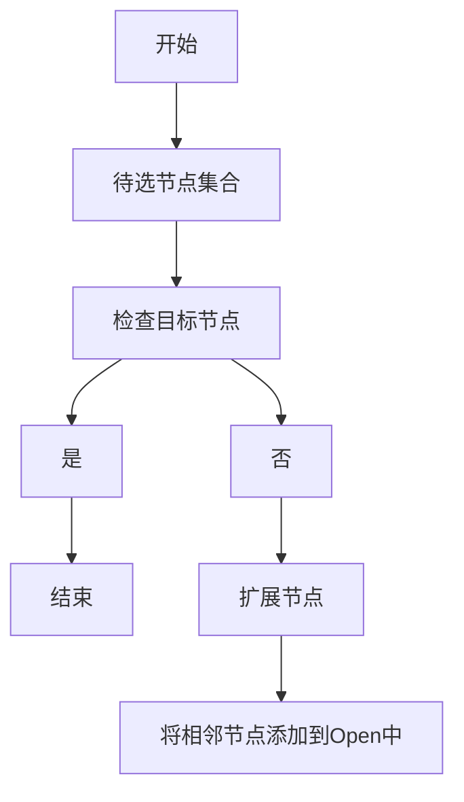
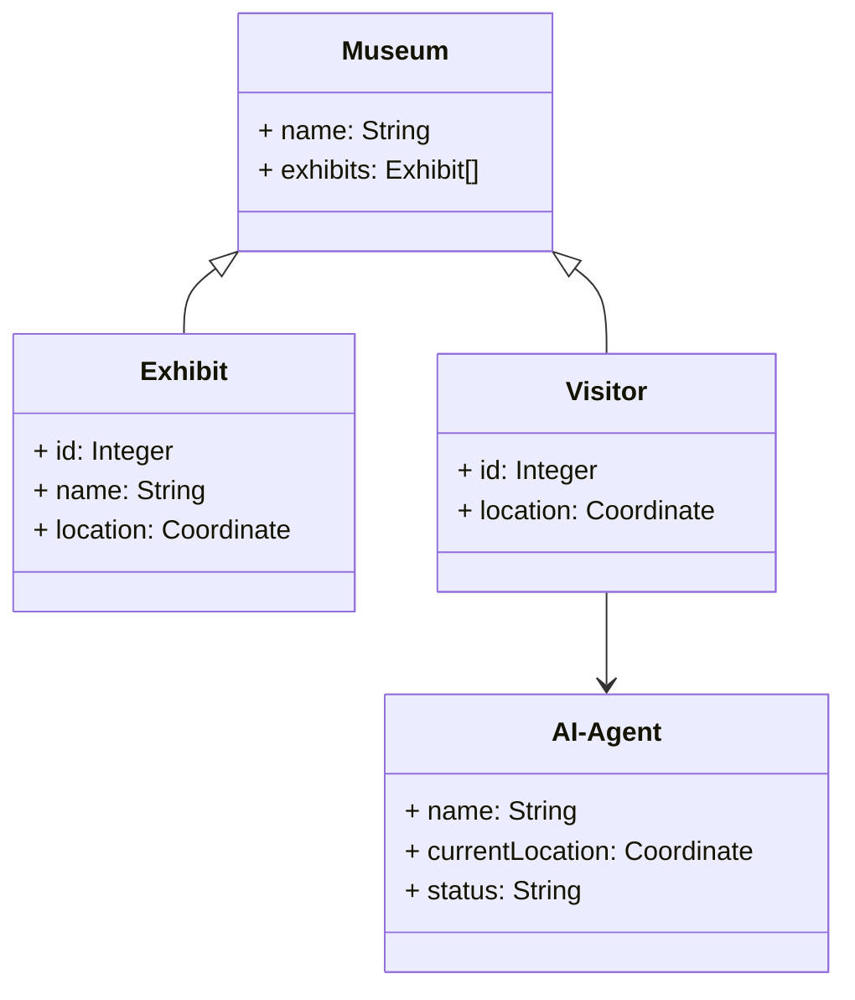
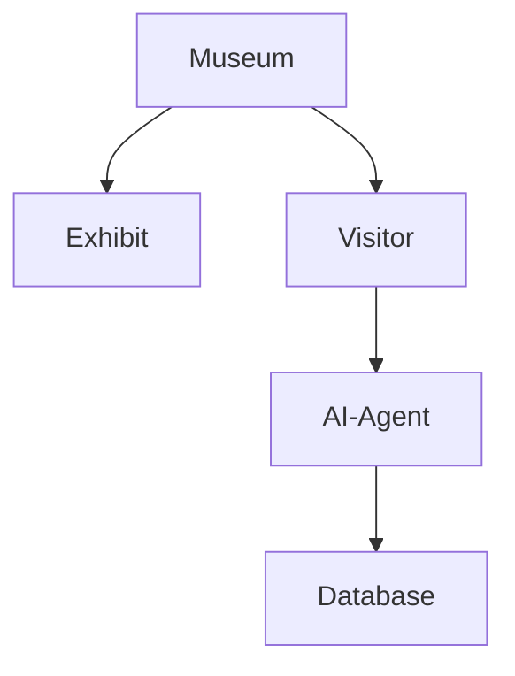

                 


# AI Agent在博物馆中的应用：智能导览与展品解说

## 关键词：AI Agent, 智能导览, 博物馆, 展品解说, 路径规划, 自然语言处理

## 摘要

随着人工智能技术的飞速发展，AI Agent（人工智能代理）在各个领域的应用越来越广泛。在博物馆场景中，AI Agent可以通过智能导览和展品解说，为用户提供更加便捷、个性化的体验。本文将详细探讨AI Agent在博物馆中的应用场景、技术实现、系统架构以及实际案例。通过理论与实践相结合的方式，本文旨在为博物馆智能化提供一种新的解决方案，同时为AI技术的应用提供更多可能性。

---

## 第一部分：背景与核心概念

### 第1章：AI Agent与博物馆智能化

#### 1.1 AI Agent的基本概念

AI Agent是一种智能体，能够在特定环境中感知信息、执行任务并做出决策。在博物馆场景中，AI Agent可以以虚拟助手或实体设备的形式出现，帮助用户完成导览、展品解说等任务。与传统导览服务相比，AI Agent具有以下特点：

- **智能性**：能够理解用户需求并提供个性化服务。
- **实时性**：基于当前环境信息快速响应用户请求。
- **可扩展性**：能够集成多种技术（如NLP、计算机视觉）以提升服务能力。

#### 1.2 博物馆中的AI Agent应用场景

AI Agent在博物馆中的主要应用场景包括：

1. **智能导览**：为用户提供基于当前位置的展品推荐和路径规划。
2. **展品解说**：通过自然语言处理技术，为用户提供展品的详细信息。
3. **互动体验**：支持用户与展品的交互，增强参观体验。

#### 1.3 问题背景与目标

传统博物馆导览服务存在以下问题：

- **效率低**：依赖人工导览员，成本高且覆盖面有限。
- **个性化不足**：难以满足不同用户的个性化需求。
- **信息更新慢**：展品信息更新不及时，影响用户体验。

引入AI Agent的目标是：

- 提供高效、个性化的导览服务。
- 实现实时信息更新与交互。
- 提升用户体验，降低运营成本。

---

## 第二部分：核心概念与技术原理

### 第2章：AI Agent的核心原理

#### 2.1 AI Agent的定义与分类

AI Agent可以根据功能和应用场景分为以下几类：

| 类型       | 特点                                                                 |
|------------|----------------------------------------------------------------------|
| 交互型     | 支持与用户的自然语言对话，提供实时反馈。                       |
| 导览型     | 专注于路径规划和展品推荐。                                     |
| 综合型     | 结合多种功能，如导览、解说、互动体验等。                       |

#### 2.2 博物馆AI Agent的实体关系图

以下是博物馆、展品、用户和AI Agent之间的关系图：



---

## 第三部分：算法原理与实现

### 第3章：AI Agent的路径规划算法

#### 3.1 简单路径规划算法

路径规划是AI Agent的重要功能之一。常用的路径规划算法包括Dijkstra算法和A*算法。本文以A*算法为例进行讲解。

**A*算法流程图：**



**A*算法的数学模型：**

$$\text{cost}(n) = \text{g}(n) + \text{h}(n)$$

其中：
- $\text{g}(n)$ 表示从起点到节点$n$的已知成本。
- $\text{h}(n)$ 表示从节点$n$到目标的估算成本。

---

## 第四部分：系统分析与架构设计

### 第4章：AI Agent的系统架构

#### 4.1 项目背景与需求分析

本项目旨在通过AI Agent实现博物馆的智能导览功能。用户需求包括：

1. 实时位置识别。
2. 展品信息查询。
3. 个性化路线规划。

#### 4.2 系统功能设计

##### 领域模型类图



##### 系统架构设计



---

## 第五部分：项目实战

### 第5章：AI Agent的实现与应用

#### 5.1 环境配置与核心代码实现

##### 环境配置

```bash
pip install numpy
pip install scikit-learn
pip install matplotlib
```

##### 核心代码实现

```python
import math

class Coordinate:
    def __init__(self, x, y):
        self.x = x
        self.y = y

def a_star(start, goal, grid):
    open_set = [start]
    came_from = {}
    g_score = {node: float('inf') for node in grid.nodes}
    g_score[start] = 0
    f_score = {node: float('inf') for node in grid.nodes}
    f_score[start] = heuristic(start, goal)

    while open_set:
        current = open_set[0]
        current_cost = f_score[current]

        if current == goal:
            return reconstruct_path(came_from, current)

        open_set.pop(0)

        neighbors = grid.get_neighbors(current)
        for neighbor in neighbors:
            tentative_g_score = g_score[current] + heuristic(current, neighbor)
            if tentative_g_score < g_score[neighbor]:
                came_from[neighbor] = current
                g_score[neighbor] = tentative_g_score
                f_score[neighbor] = g_score[neighbor] + heuristic(neighbor, goal)
                if neighbor not in open_set:
                    open_set.append(neighbor)

    return []

def heuristic(a, b):
    return abs(a.x - b.x) + abs(a.y - b.y)

def reconstruct_path(came_from, current):
    path = [current]
    while current in came_from:
        current = came_from[current]
        path.append(current)
    return path[::-1]
```

#### 5.2 代码实现与分析

上述代码实现了A*算法的路径规划功能。通过计算起点和目标点之间的最短路径，AI Agent可以为用户提供最优的导览路线。

---

## 第六部分：优化与未来展望

### 第6章：优化策略与未来趋势

#### 6.1 系统优化

1. **性能优化**：通过优化算法减少路径规划的计算时间。
2. **功能扩展**：集成计算机视觉技术，支持展品的图像识别功能。
3. **用户体验优化**：引入多语言支持，满足不同用户的需求。

#### 6.2 未来趋势

随着AI技术的不断进步，AI Agent在博物馆中的应用将更加智能化和个性化。未来，AI Agent可能会集成更多先进技术，如增强现实（AR）和区块链，进一步提升用户体验。

---

## 附录

### 参考文献

1. [书籍]《人工智能：一种现代的方法》
2. [论文]《基于A*算法的路径规划研究》
3. [技术文档]《Python路径规划算法实现》

### 扩展阅读

- [GitHub仓库] AI Agent在博物馆中的实现代码：[https://github.com/ai-genius/ai-agent-museum](https://github.com/ai-genius/ai-agent-museum)

---

## 作者

作者：AI天才研究院/AI Genius Institute & 禅与计算机程序设计艺术/Zen And The Art of Computer Programming

