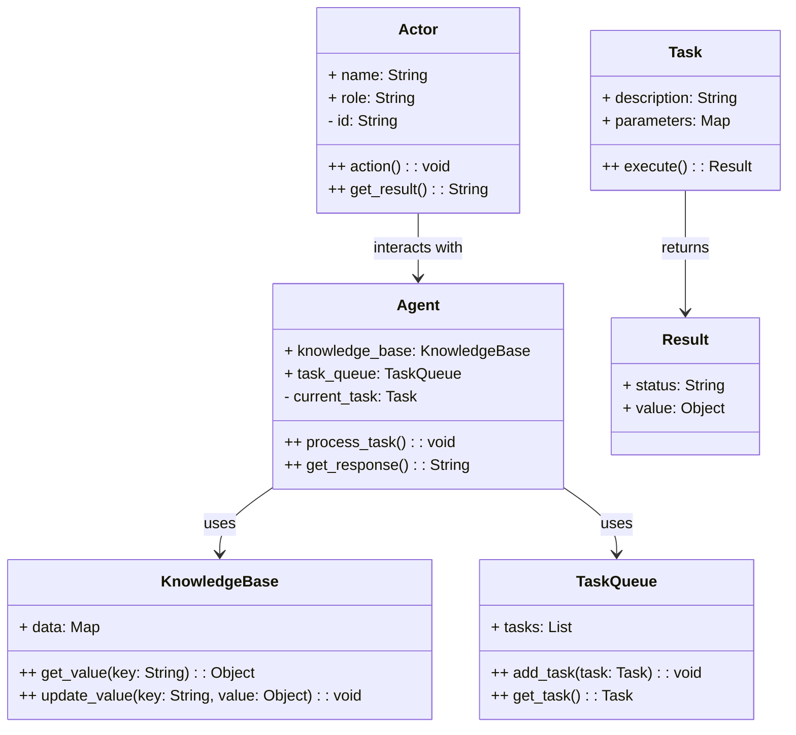

                 


# AI Agent在各行业中的应用场景

## 关键词：
AI Agent，人工智能，行业应用，算法原理，系统架构，项目实战

## 摘要：
本文系统地探讨了AI Agent在各行业中的应用场景，从概念、技术基础、算法原理到系统架构设计，再到实际项目实战和最佳实践，全面解析了AI Agent如何在金融、医疗、教育等行业中实现智能化应用。通过详细的技术分析和实际案例，本文旨在为读者提供AI Agent领域的深入见解，帮助他们理解如何在实际业务中有效应用AI Agent技术。

---

# 第1章: AI Agent 的背景与概念

## 1.1 AI Agent 的定义与技术基础

### 1.1.1 什么是 AI Agent
AI Agent（人工智能代理）是一种能够感知环境、自主决策并执行任务的智能实体。它通过接收输入、分析数据、做出决策并输出结果，帮助用户完成特定任务或提供解决方案。

### 1.1.2 AI Agent 的核心特征
- **自主性**：能够自主决策，无需外部干预。
- **反应性**：能够实时感知环境并做出反应。
- **目标导向**：基于目标驱动行动。
- **学习能力**：能够通过数据和经验不断优化自身能力。

### 1.1.3 AI Agent 与传统 AI 的区别
| 特性      | 传统 AI                | AI Agent              |
|-----------|-----------------------|------------------------|
| 行为模式    | 静态计算，无自主行动   | 动态交互，自主行动     |
| 应用场景    | 数据分析、模式识别     | 任务执行、动态交互     |
| 交互方式    | 单向输入输出           | 双向交互，持续反馈     |

### 1.1.4 AI Agent 的技术基础
1. **机器学习**：用于模式识别和数据处理。
2. **自然语言处理**：支持文本理解和生成。
3. **知识图谱**：构建领域知识库，辅助推理。

---

## 1.2 AI Agent 在各行业的应用现状

### 1.2.1 金融行业
- **应用案例**：智能投顾、风险评估。
- **优势**：快速分析数据，提供个性化服务。

### 1.2.2 医疗行业
- **应用案例**：疾病诊断、药物研发。
- **优势**：提高诊断准确率，优化治疗方案。

### 1.2.3 教育行业
- **应用案例**：智能辅导系统、学习推荐。
- **优势**：个性化教学，提升学习效率。

---

## 1.3 AI Agent 的挑战与未来趋势

### 1.3.1 当前的主要挑战
1. **数据隐私**：如何保护用户数据不被滥用。
2. **技术瓶颈**：复杂场景下的决策能力有限。
3. **成本问题**：高计算资源需求带来高昂成本。

### 1.3.2 未来的发展方向
1. **多模态交互**：结合视觉、听觉等多种感官。
2. **强化学习**：提升自主决策能力。
3. **人机协作**：增强人机协作效率。

---

# 第2章: AI Agent 的核心概念与联系

## 2.1 AI Agent 的核心概念

### 2.1.1 智能体模型
AI Agent 的模型包括感知层、决策层和执行层。

### 2.1.2 任务类型
- **推理任务**：基于知识库进行推理。
- **生成任务**：生成文本或图像。
- **交互任务**：与用户进行实时对话。

### 2.1.3 知识表示
知识表示是AI Agent理解世界的基础，常用的表示方法包括：
1. **符号表示**：使用符号逻辑表示知识。
2. **向量表示**：使用向量空间模型表示知识。

---

## 2.2 AI Agent 的核心原理

### 2.2.1 知识表示与推理
AI Agent通过知识图谱构建领域知识库，并基于图结构进行推理。

### 2.2.2 任务规划与执行
AI Agent根据目标分解任务，并制定执行计划。

### 2.2.3 人机交互
AI Agent通过自然语言处理技术与用户进行实时对话。

---

## 2.3 AI Agent 的 ER 实体关系图

```mermaid
er
    actor: 用户
    agent: AI Agent
    task: 任务
    knowledge: 知识库
    interaction: 交互记录
    actor --> task: 提交任务
    agent --> task: 执行任务
    agent --> knowledge: 查询知识
    interaction --> actor: 返回结果
```

---

# 第3章: AI Agent 的算法原理

## 3.1 AI Agent 的生成模型

### 3.1.1 Transformer 模型
Transformer模型通过自注意力机制实现高效的文本生成。

### 3.1.2 GAN 网络
GAN网络通过生成对抗训练生成高质量的图像或文本。

### 3.1.3 深度强化学习
深度强化学习通过强化学习算法优化决策策略。

---

## 3.2 AI Agent 的推理算法

### 3.2.1 基于规则的推理
基于预定义的规则进行推理。

### 3.2.2 基于概率的推理
基于概率论进行推理，如贝叶斯网络。

### 3.2.3 知识图谱推理
基于知识图谱进行推理，如RDF图推理。

---

## 3.3 AI Agent 的优化方法

### 3.3.1 参数优化
通过梯度下降优化模型参数。

### 3.3.2 模型压缩
通过剪枝、量化等技术压缩模型体积。

### 3.3.3 资源分配优化
优化计算资源的分配，提高效率。

---

# 第4章: AI Agent 的系统架构设计

## 4.1 系统设计原则

### 4.1.1 可扩展性
系统应支持功能扩展。

### 4.1.2 可维护性
系统应易于维护和更新。

### 4.1.3 可靠性
系统应具备高可用性和容错能力。

---

## 4.2 系统功能模块

### 4.2.1 知识库管理模块
负责知识库的存储和管理。

### 4.2.2 任务处理模块
负责任务的接收和执行。

### 4.2.3 人机交互模块
负责与用户的交互。

---

## 4.3 系统架构设计

### 4.3.1 领域模型类图



### 4.3.2 系统架构图


### 4.3.3 系统接口设计
- **输入接口**：接收用户的请求。
- **输出接口**：返回处理结果。

### 4.3.4 系统交互序列图

```mermaid
sequenceDiagram
    participant Actor
    participant Agent
    participant KnowledgeBase
    Actor -> Agent: 提交任务
    Agent -> KnowledgeBase: 查询知识
    KnowledgeBase --> Agent: 返回知识
    Agent -> Agent: 执行任务
    Agent -> Actor: 返回结果
```

---

# 第5章: AI Agent 的项目实战

## 5.1 项目背景与目标
本项目旨在开发一个智能客服AI Agent，用于处理用户的咨询请求。

## 5.2 环境安装
- **Python**：3.8+
- **框架**：Transformers库、Flask框架。

## 5.3 核心实现代码

### 5.3.1 知识库管理
```python
class KnowledgeBase:
    def __init__(self):
        self.data = {}

    def get_value(self, key):
        return self.data.get(key, None)

    def update_value(self, key, value):
        self.data[key] = value
```

### 5.3.2 任务处理
```python
class Task:
    def __init__(self, description, parameters):
        self.description = description
        self.parameters = parameters

    def execute(self):
        # 处理任务并返回结果
        return Result(status="success", value="Task completed")
```

### 5.3.3 人机交互
```python
from flask import Flask
from flask_restful import Resource, Api

app = Flask(__name__)
api = Api(app)

class Agent(Resource):
    def post(self):
        # 处理请求
        return "AI Agent Response"

api.add_resource(Agent, '/agent')

if __name__ == '__main__':
    app.run(debug=True)
```

## 5.4 实际案例分析
- **案例**：智能客服处理用户咨询。
- **效果**：提高了响应速度和准确性。

## 5.5 项目小结
通过本项目，我们掌握了AI Agent的核心实现方法和系统设计思路。

---

# 第6章: AI Agent 的最佳实践

## 6.1 最佳实践 tips
1. **数据质量管理**：确保数据的准确性和完整性。
2. **模型优化**：定期更新模型，提升性能。
3. **用户隐私保护**：严格遵守数据隐私法规。

## 6.2 小结
AI Agent在各行业中的应用前景广阔，但仍需克服技术挑战。

## 6.3 注意事项
- 避免过度依赖AI Agent，确保人类监督。
- 定期更新知识库，保持信息准确性。

## 6.4 拓展阅读
推荐阅读《人工智能：现代方法》和《深度学习》。

---

# 作者：AI天才研究院 & 禅与计算机程序设计艺术

