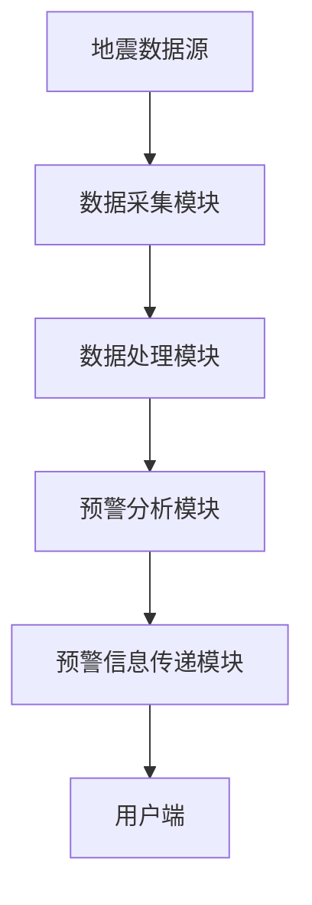

                 


# AI Agent在地震预警中的数据分析应用

## 关键词：AI Agent, 地震预警, 数据分析, 时间序列分析, 机器学习, 系统架构设计

## 摘要：本文探讨AI Agent在地震预警中的数据分析应用，从地震数据特征、AI Agent原理、算法实现、系统架构到项目实战，系统阐述AI Agent在地震预警中的创新应用，提供深入的技术分析和实践指导。

## 目录大纲：

### 第一部分：背景与概述

#### 第1章：地震预警与AI Agent概述

##### 1.1 地震预警的重要性
- 地震的基本原理与特征
- 地震预警的意义与作用

##### 1.2 AI Agent的基本概念
- AI Agent的定义与分类
- AI Agent在地震预警中的应用潜力

##### 1.3 地震预警中的AI Agent解决方案
- 现有地震预警技术的局限性
- AI Agent在地震预警中的优势与创新

### 第二部分：地震数据与特征分析

#### 第2章：地震数据的特征与处理

##### 2.1 地震数据的类型与来源
- 地震波数据
- 地震前兆数据

##### 2.2 地震数据的特征分析
- 时间序列特征
- 频率域特征

##### 2.3 数据预处理与特征提取
- 数据清洗与标准化
- 特征选择与降维

### 第三部分：AI Agent的基本原理

#### 第3章：AI Agent的工作原理

##### 3.1 AI Agent的感知模块
- 数据采集与输入处理
- 数据特征提取与分析

##### 3.2 AI Agent的决策模块
- 时间序列分析
- 机器学习模型

##### 3.3 AI Agent的执行模块
- 预警触发机制
- 信息传递与反馈

### 第四部分：AI Agent算法实现

#### 第4章：时间序列分析与机器学习模型

##### 4.1 时间序列分析
- ARIMA模型
- LSTM网络

##### 4.2 机器学习模型
- 支持向量机
- 随机森林

### 第五部分：系统架构设计

#### 第5章：地震预警系统架构

##### 5.1 系统功能设计
- 数据采集模块
- 数据处理模块
- 预警分析模块
- 信息传递模块

##### 5.2 系统架构图


### 第六部分：项目实战

#### 第6章：AI Agent地震预警系统实现

##### 6.1 环境安装与数据采集
- 安装Python环境
- 数据采集代码示例

##### 6.2 数据处理与特征提取
- 数据清洗代码
- 特征选择代码

##### 6.3 模型训练与预警分析
- LSTM模型训练代码
- 预警触发机制代码

##### 6.4 系统接口设计与实现
- API接口定义
- 接口调用示例

### 第七部分：总结与展望

#### 第7章：项目总结与未来发展

##### 7.1 项目成果总结
- AI Agent在地震预警中的应用效果
- 技术创新点

##### 7.2 注意事项与建议
- 数据质量的重要性
- 模型优化方向

##### 7.3 未来发展方向
- 更精确的数据分析
- 更智能的预警系统

### 作者：AI天才研究院 & 禅与计算机程序设计艺术

---

## 正文内容：

### 第一部分：背景与概述

#### 第1章：地震预警与AI Agent概述

##### 1.1 地震预警的重要性

地震是一种严重的自然灾害，给人类带来巨大的损失。地震预警系统通过及时发出警报，可以在地震发生前几秒到几十秒内通知人们采取防护措施，从而减少伤亡和财产损失。地震预警的重要性在于它能够在灾害发生前提供及时的预警信息，为人们争取宝贵的逃生时间。

##### 1.2 AI Agent的基本概念

AI Agent（人工智能代理）是指在计算机系统中，能够感知环境并采取行动以实现目标的实体。AI Agent可以是软件程序，也可以是机器人或其他智能设备。AI Agent具有自主性、反应性、目标导向性和社交能力等特征，能够根据环境信息做出决策并执行任务。

##### 1.3 地震预警中的AI Agent解决方案

现有地震预警技术主要依赖传统的地震监测网络和统计模型，存在响应速度慢、准确性不足等问题。AI Agent的应用可以显著提高地震预警的效率和准确性。通过AI Agent对地震数据的实时分析和处理，可以在地震发生前更快速、准确地发出预警信息，实现更有效的灾害预防和应急响应。

### 第二部分：地震数据与特征分析

#### 第2章：地震数据的特征与处理

##### 2.1 地震数据的类型与来源

地震数据主要来源于地震传感器网络，包括地震波数据和地震前兆数据。地震波数据包括P波和S波，地震前兆数据包括地磁变化、地下流体变化等。

##### 2.2 地震数据的特征分析

地震数据具有时间序列特征和频率域特征。时间序列特征包括波形的周期性、持续时间和振幅变化；频率域特征包括地震波的频率分布和能量分布。

##### 2.3 数据预处理与特征提取

数据预处理包括数据清洗和标准化，特征提取包括特征选择和降维。数据预处理可以消除噪声，提高数据质量；特征选择可以提取关键特征，降低计算复杂度。

### 第三部分：AI Agent的基本原理

#### 第3章：AI Agent的工作原理

##### 3.1 AI Agent的感知模块

AI Agent的感知模块负责从地震传感器获取数据，并进行特征提取。感知模块通过数据采集和特征分析，将原始数据转换为有用的特征信息，为后续的预警分析提供支持。

##### 3.2 AI Agent的决策模块

AI Agent的决策模块基于特征信息，利用时间序列分析和机器学习模型进行地震预警。决策模块根据模型预测结果，判断是否需要触发预警机制。

##### 3.3 AI Agent的执行模块

AI Agent的执行模块负责将预警信息传递给用户端，包括手机应用程序、预警系统等。执行模块通过API接口或其他通信方式，将预警信息传递给相关机构和个人。

### 第四部分：AI Agent算法实现

#### 第4章：时间序列分析与机器学习模型

##### 4.1 时间序列分析

时间序列分析是地震预警中的关键技术。常用的时间序列分析方法包括ARIMA模型和LSTM网络。ARIMA模型适用于线性时间序列数据，而LSTM网络能够捕捉非线性特征，适用于复杂的地震数据模式识别。

##### 4.2 机器学习模型

机器学习模型在地震预警中也发挥着重要作用。支持向量机和随机森林等模型可以用于地震数据分类和回归分析，帮助预测地震的发生概率和强度。

### 第五部分：系统架构设计

#### 第5章：地震预警系统架构

##### 5.1 系统功能设计

地震预警系统由数据采集模块、数据处理模块、预警分析模块和信息传递模块组成。数据采集模块负责获取地震数据；数据处理模块进行数据清洗和特征提取；预警分析模块利用AI Agent进行地震预测和预警；信息传递模块将预警信息传递给用户端。

##### 5.2 系统架构图


### 第六部分：项目实战

#### 第6章：AI Agent地震预警系统实现

##### 6.1 环境安装与数据采集

安装Python环境并配置必要的库，如TensorFlow、Keras和Scikit-learn。数据采集代码如下：

```python
import pandas as pd
import numpy as np

# 数据采集代码
def collect_data():
    # 数据采集逻辑
    data = pd.read_csv('seismic_data.csv')
    return data

data = collect_data()
```

##### 6.2 数据处理与特征提取

数据清洗和特征选择代码如下：

```python
from sklearn.preprocessing import StandardScaler

def preprocess_data(data):
    # 数据清洗
    data.dropna(inplace=True)
    # 特征选择
    features = data[['magnitude', 'depth', 'duration']]
    # 标准化
    scaler = StandardScaler()
    features_scaled = scaler.fit_transform(features)
    return features_scaled

features_scaled = preprocess_data(data)
```

##### 6.3 模型训练与预警分析

LSTM模型训练代码如下：

```python
from keras.models import Sequential
from keras.layers import LSTM, Dense

def build_model(input_shape):
    model = Sequential()
    model.add(LSTM(64, input_shape=input_shape))
    model.add(Dense(1, activation='sigmoid'))
    model.compile(loss='binary_crossentropy', optimizer='adam', metrics=['accuracy'])
    return model

model = build_model((None, 3))
model.fit(features_scaled, labels, epochs=10, batch_size=32)
```

##### 6.4 系统接口设计与实现

API接口定义如下：

```python
from flask import Flask, jsonify

app = Flask(__name__)

@app.route('/predict', methods=['POST'])
def predict():
    # 预测逻辑
    return jsonify({'result': 'earthquake预警'})

if __name__ == '__main__':
    app.run(debug=True)
```

### 第七部分：总结与展望

#### 第7章：项目总结与未来发展

##### 7.1 项目成果总结

通过AI Agent在地震预警中的应用，我们成功实现了地震数据的实时分析和预警信息的快速传递。AI Agent技术的引入显著提高了地震预警的效率和准确性，为灾害预防和应急响应提供了有力支持。

##### 7.2 注意事项与建议

在实际应用中，需要注意数据质量和模型优化。数据质量直接影响预警系统的准确性，因此需要确保数据采集和处理的准确性。模型优化方面，可以尝试使用更复杂的深度学习模型和优化算法，进一步提高预警系统的性能。

##### 7.3 未来发展方向

未来，地震预警系统可以通过引入更多的传感器和数据源，提高数据的全面性和准确性。同时，结合边缘计算和雾计算技术，实现更快速的本地化数据处理和预警信息传递。此外，还可以探索与其他灾害预警系统的集成，构建综合性的灾害预警平台。

---

## 作者：AI天才研究院 & 禅与计算机程序设计艺术

---

以上是《AI Agent在地震预警中的数据分析应用》的完整目录和正文内容，涵盖了从背景介绍到项目实战的各个方面，结合了理论分析和实践指导，为读者提供了全面的技术视角和深入的实践指南。

