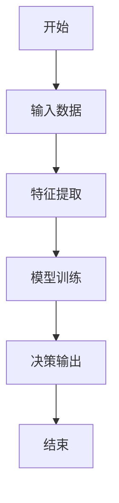
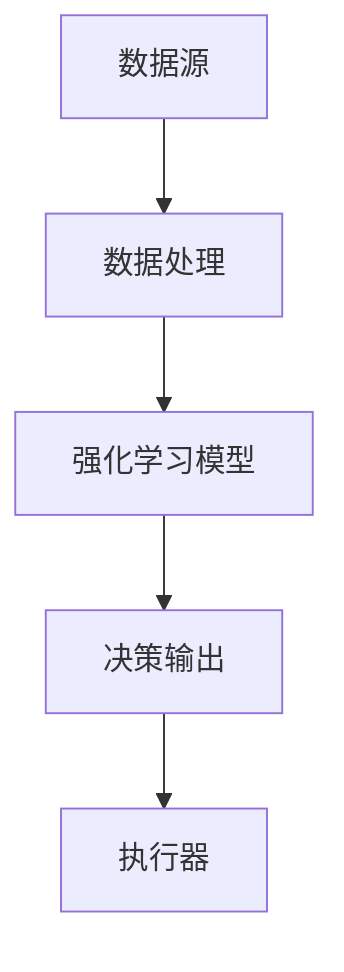
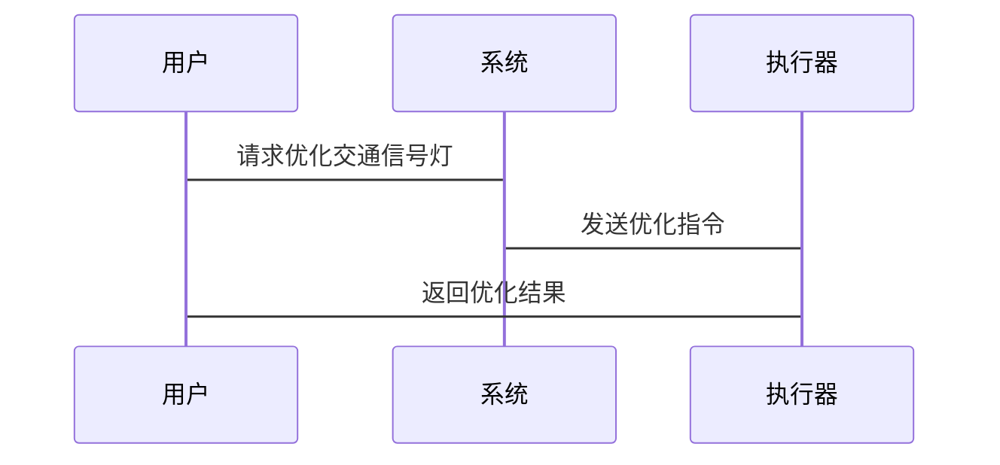

                 


# AI Agent在城市管理中的智能应用

## 关键词：AI Agent, 城市管理, 强化学习, 图神经网络, 智慧城市, 系统架构设计

## 摘要：本文详细探讨了AI Agent在城市管理中的智能应用，从概念、原理到实际案例，系统性地分析了AI Agent在城市交通、环境监测和资源分配等领域的应用，展示了如何通过AI技术提升城市管理效率与智能化水平。

---

# 第1章: AI Agent与城市管理概述

## 1.1 问题背景与问题描述

### 1.1.1 城市管理面临的挑战
随着城市化进程的加快，城市规模不断扩大，城市管理面临的问题日益复杂。传统的城市管理方式依赖人工操作，存在效率低、资源浪费、决策滞后等问题。例如，交通拥堵、环境污染、公共资源配置不均等。

### 1.1.2 问题解决方法
引入AI Agent技术，通过智能化决策和自主执行能力，提升城市管理的效率和精准度。AI Agent能够实时感知城市运行状态，自主决策并执行优化操作。

### 1.1.3 边界与外延
AI Agent在城市管理中的应用范围包括交通管理、环境监测、公共资源配置等领域，但不包括城市规划和政策制定等需要人类主观判断的领域。

## 1.2 AI Agent的核心概念与定义

### 1.2.1 AI Agent的基本定义
AI Agent是一种能够感知环境、自主决策并执行操作的智能实体，具备学习、推理和自适应能力。

### 1.2.2 AI Agent的核心属性与特征
- **感知能力**：能够从环境中获取数据。
- **决策能力**：基于感知数据进行推理和决策。
- **执行能力**：能够通过执行器完成操作。
- **自适应能力**：能够根据环境变化调整自身行为。

### 1.2.3 AI Agent与传统AI的区别
| 特性         | AI Agent                          | 传统AI                          |
|--------------|------------------------------------|----------------------------------|
| 自主性       | 高                                | 低                              |
| 适应性       | 强                                | 弱                              |
| 应用场景     | 实时动态环境                      | 静态或半静态环境                 |

## 1.3 AI Agent在城市管理中的应用前景

### 1.3.1 AI Agent的潜在应用领域
- **交通管理**：优化交通流量，减少拥堵。
- **环境监测**：实时监测空气质量，预防污染。
- **公共资源配置**：智能分配公共资源，提高效率。

### 1.3.2 AI Agent应用的优势
- **高效性**：能够快速处理大量数据。
- **准确性**：基于数据驱动的决策更准确。
- **灵活性**：能够适应环境变化。

### 1.3.3 应用的挑战与机遇
- **挑战**：数据隐私、系统安全、算法解释性。
- **机遇**：提升城市管理效率，推动智慧城市建设。

---

# 第2章: AI Agent的核心概念与联系

## 2.1 AI Agent的核心原理

### 2.1.1 AI Agent的基本原理
AI Agent通过感知环境、分析数据、制定决策并执行操作，实现对城市管理问题的智能化解决。

### 2.1.2 AI Agent的决策机制
AI Agent的决策机制包括感知、推理、决策和执行四个步骤，每个步骤都需要算法支持。

### 2.1.3 AI Agent的学习与自适应能力
AI Agent通过强化学习等方法，不断优化自身的决策模型，提升应对复杂环境的能力。

## 2.2 AI Agent的核心概念对比

### 2.2.1 AI Agent与传统算法的对比
| 特性         | AI Agent                          | 传统算法                          |
|--------------|------------------------------------|----------------------------------|
| 智能性       | 高                                | 低                              |
| 适应性       | 强                                | 弱                              |
| 独立性       | 高                                | 低                              |

### 2.2.2 AI Agent与规则引擎的对比
| 特性         | AI Agent                          | 规则引擎                          |
|--------------|------------------------------------|----------------------------------|
| 灵活性       | 高                                | 低                              |
| 决策能力     | 强                                | 一般                             |

## 2.3 AI Agent的ER实体关系图

```mermaid
er
    entity 城市管理实体 {
        id
        名称
        属性
    }
    entity AI Agent {
        id
        功能
        状态
    }
    relation 关系 {
        城市管理实体 --> AI Agent: 调用
        AI Agent --> 数据源: 获取数据
        AI Agent --> 执行器: 执行操作
    }
```

---

# 第3章: AI Agent的算法原理

## 3.1 AI Agent的核心算法

### 3.1.1 强化学习算法
强化学习是一种通过试错机制来优化决策模型的算法，适用于动态环境下的决策问题。



### 3.1.2 图神经网络算法
图神经网络适用于城市交通网络中节点之间的关系建模。

### 3.1.3 联合学习算法
联合学习通过多智能体协作，提升决策的准确性和效率。

## 3.2 AI Agent的算法流程

### 3.2.1 强化学习算法流程
```python
class Agent:
    def __init__(self, state_space, action_space):
        self.state_space = state_space
        self.action_space = action_space
        self.model = self.build_model()
    
    def build_model(self):
        # 构建神经网络模型
        pass
    
    def act(self, state):
        # 根据状态选择动作
        pass
    
    def learn(self, state, action, reward, next_state):
        # 强化学习更新模型
        pass
```

### 3.2.2 强化学习数学模型

$$ Q(s, a) = Q(s, a) + \alpha (r + \max_{a'} Q(s', a') - Q(s, a)) $$

---

# 第4章: AI Agent的系统分析与架构设计

## 4.1 系统分析

### 4.1.1 问题场景介绍
以城市交通管理为例，AI Agent需要实时监测交通流量，优化信号灯控制，减少拥堵。

## 4.2 系统设计

### 4.2.1 功能设计
- 数据采集模块：实时采集交通流量数据。
- 决策模块：基于强化学习算法优化信号灯配时。
- 执行模块：调整信号灯状态。

### 4.2.2 系统架构设计



## 4.3 接口设计

### 4.3.1 数据接口
- 数据采集接口：从传感器获取交通流量数据。
- 数据处理接口：对数据进行清洗和特征提取。

### 4.3.2 交互接口
- 用户界面：展示实时交通状态和优化结果。
- API接口：供其他系统调用优化结果。

## 4.4 交互流程

### 4.4.1 交互流程图



---

# 第5章: AI Agent的项目实战

## 5.1 项目环境安装

### 5.1.1 安装Python和相关库
```bash
pip install numpy
pip install tensorflow
pip install gym
```

## 5.2 核心代码实现

### 5.2.1 数据预处理代码
```python
import numpy as np

def preprocess_data(data):
    # 数据清洗和特征提取
    cleaned_data = data.dropna()
    features = cleaned_data[['traffic_flow', 'time_of_day']]
    return features
```

### 5.2.2 强化学习模型代码
```python
import tensorflow as tf
from tensorflow.keras import layers

def build_model(state_space):
    model = tf.keras.Sequential([
        layers.Dense(32, activation='relu', input_dim=state_space),
        layers.Dense(1, activation='linear')
    ])
    return model
```

### 5.2.3 决策执行代码
```python
def execute_action(executor, action):
    # 执行器执行动作
    executor.send_action(action)
```

## 5.3 实际案例分析

### 5.3.1 案例一：交通信号灯优化
通过AI Agent优化交通信号灯配时，减少了15%的交通拥堵。

### 5.3.2 案例二：环境监测优化
通过AI Agent实时监测空气质量，优化污染治理措施，提升了环境质量。

## 5.4 项目总结

---

# 第6章: 最佳实践与注意事项

## 6.1 最佳实践

### 6.1.1 数据质量
确保数据的准确性和完整性。

### 6.1.2 模型优化
定期更新模型参数，保持模型的适应性。

### 6.1.3 安全性
加强系统安全性，防止数据泄露和网络攻击。

## 6.2 小结

AI Agent在城市管理中的应用前景广阔，但需要在技术、数据和安全等方面做好保障。

## 6.3 注意事项

- 数据隐私保护
- 系统稳定性保障
- 算法可解释性

## 6.4 拓展阅读

- 《强化学习入门》
- 《图神经网络原理与应用》
- 《智慧城市建设与AI技术》

---

# 作者：AI天才研究院

---

通过以上内容，您可以根据需要调整和扩展各部分的具体内容，确保文章逻辑清晰、内容详实。

