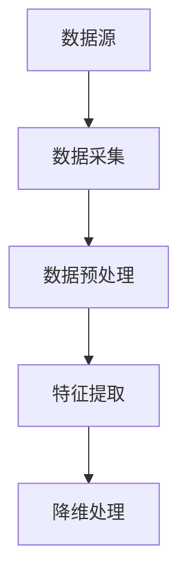
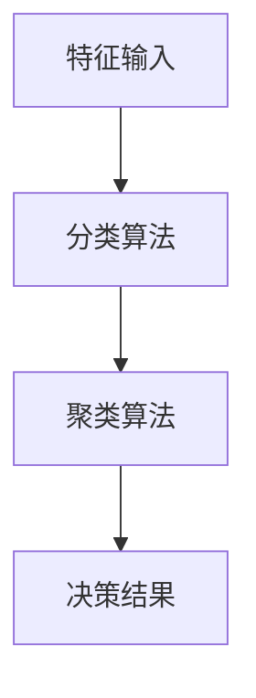
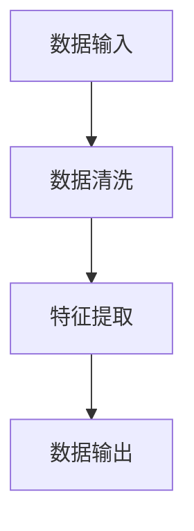
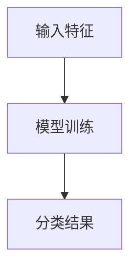
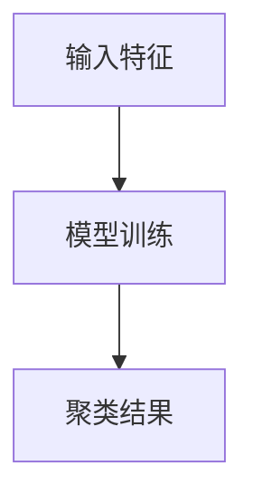
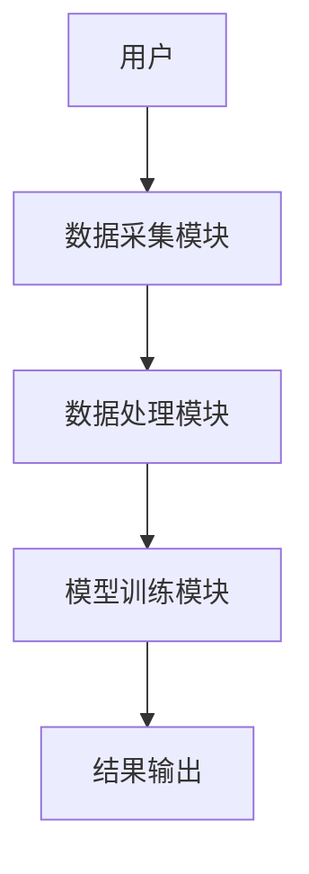

                 


# AI Agent在天文学中的应用：数据处理与模式识别

## 关键词：AI Agent，天文学，数据处理，模式识别，机器学习，深度学习

## 摘要

本文探讨AI Agent在天文学中的应用，特别是数据处理与模式识别方面的技术细节。通过详细分析AI Agent的基本原理，结合天文学数据的特点，提出了一套完整的解决方案。文章从背景介绍、核心概念、算法实现到系统架构设计，再到项目实战，层层递进，为读者提供全面的技术指导。

---

# 第1章: AI Agent与天文学的结合

## 1.1 AI Agent的基本概念

### 1.1.1 什么是AI Agent

AI Agent，即人工智能代理，是一种能够感知环境、自主决策并执行任务的智能实体。它具备以下核心特征：

1. **自主性**：无需外部干预，自主完成任务。
2. **反应性**：能够实时感知环境变化并做出响应。
3. **目标导向**：基于目标驱动行为。
4. **学习能力**：通过数据和经验优化自身性能。

### 1.1.2 AI Agent在天文学中的应用背景

天文学数据具有高维性、稀疏性和复杂性等特点，传统方法难以高效处理。AI Agent凭借其强大的数据处理和模式识别能力，成为天文学研究的重要工具。

### 1.1.3 AI Agent的优势

- **高效性**：能够快速处理海量数据。
- **准确性**：通过机器学习算法提高分析精度。
- **适应性**：能够根据数据变化自适应调整模型。

---

## 1.2 天文学中的数据处理与模式识别

### 1.2.1 天文学数据的特点

天文学数据通常具有以下特点：

- **多样性**：包括光谱数据、图像数据等。
- **稀疏性**：观测数据可能不完整。
- **高维性**：数据维度较高，难以直接处理。

### 1.2.2 模式识别在天文学中的重要性

模式识别能够帮助天文学家发现隐藏的规律和结构，例如星系分类、恒星光谱分析等。

### 1.2.3 AI Agent在天文学中的优势

AI Agent能够高效处理复杂数据，提供准确的模式识别结果，辅助天文学家进行科学决策。

---

## 1.3 本章小结

本章介绍了AI Agent的基本概念及其在天文学中的应用背景，强调了其在数据处理与模式识别方面的优势。

---

# 第2章: AI Agent的基本原理

## 2.1 AI Agent的感知机制

### 2.1.1 数据采集与预处理

数据采集是AI Agent感知环境的第一步，预处理包括数据清洗和标准化。

### 2.1.2 特征提取与降维

特征提取通过提取关键特征，降低数据维度，提高处理效率。

### 2.1.3 感知机制流程图



---

## 2.2 AI Agent的决策机制

### 2.2.1 分类算法

- **支持向量机（SVM）**：适用于小规模数据分类。
- **神经网络（CNN）**：适用于图像数据分类。

### 2.2.2 聚类算法

- **K-means**：简单高效，适用于均匀分布的数据。
- **DBSCAN**：基于密度的算法，适用于复杂数据。

### 2.2.3 决策机制流程图



---

## 2.3 AI Agent的执行机制

### 2.3.1 动作规划

根据决策结果，制定具体的执行动作。

### 2.3.2 执行反馈

通过反馈机制，优化执行过程。

---

## 2.4 本章小结

本章详细介绍了AI Agent的基本原理，包括感知、决策和执行机制，并通过流程图展示了各部分的协作关系。

---

# 第3章: 天文学数据处理的AI Agent实现

## 3.1 数据获取与预处理

### 3.1.1 数据源的选择

选择合适的天文学数据库，如 Sloan Digital Sky Survey (SDSS)。

### 3.1.2 数据清洗与标准化

去除噪声数据，标准化处理，确保数据一致性。

### 3.1.3 数据增强与扩展

通过数据增强技术，扩展数据集，提高模型泛化能力。

---

## 3.2 数据特征提取

### 3.2.1 基于深度学习的特征提取

使用CNN提取图像特征，捕捉深层次特征。

### 3.2.2 基于传统算法的特征提取

利用主成分分析（PCA）进行降维。

---

## 3.3 数据处理的流程图



---

## 3.4 本章小结

本章详细介绍了天文学数据处理的流程，从数据获取到特征提取，每一步都进行了详细说明。

---

# 第4章: 天文学模式识别的AI Agent实现

## 4.1 分类算法实现

### 4.1.1 支持向量机（SVM）

$$
\text{SVM目标函数} = \min \frac{1}{2}||w||^2 + C\sum_{i=1}^n \xi_i
$$

### 4.1.2 神经网络（CNN）

$$
\text{损失函数} = \text{交叉熵损失} = -\sum_{i} y_i \log p_i + (1-y_i)\log (1-p_i)
$$

### 4.1.3 分类流程图



---

## 4.2 聚类算法实现

### 4.2.1 K-means算法

$$
\text{目标函数} = \min \sum_{i=1}^k \sum_{j=1}^n (x_{ij} - c_j)^2
$$

### 4.2.2 DBSCAN算法

基于密度的聚类算法，适用于噪声数据。

### 4.2.4 聚类流程图



---

## 4.3 模型评估与优化

### 4.3.1 准确率与召回率

准确率 = 正确分类数 / 总分类数  
召回率 = 正确分类数 / 真实类别数

### 4.3.2 模型调参与优化

通过交叉验证和网格搜索，优化模型参数。

---

## 4.4 本章小结

本章详细介绍了天文学模式识别的算法实现，包括分类和聚类算法，并通过流程图展示了整个过程。

---

# 第5章: 系统架构设计

## 5.1 系统模块划分

### 5.1.1 数据采集模块

负责数据的获取和预处理。

### 5.1.2 数据处理模块

负责特征提取和降维。

### 5.1.3 模型训练模块

负责模型的训练和优化。

---

## 5.2 系统交互流程

### 5.2.1 用户输入

用户输入数据请求。

### 5.2.2 系统处理

系统处理数据并返回结果。

### 5.2.3 结果输出

输出处理结果。

---

## 5.3 系统架构图



---

## 5.4 本章小结

本章详细介绍了系统的架构设计，包括模块划分和交互流程。

---

# 第6章: 项目实战

## 6.1 环境配置

### 6.1.1 Python版本要求

Python 3.8+

### 6.1.2 依赖库安装

安装numpy、pandas、scikit-learn等库。

---

## 6.2 核心代码实现

### 6.2.1 数据预处理代码

```python
import numpy as np
import pandas as pd

# 数据加载
data = pd.read_csv('astronomy_data.csv')

# 数据清洗
data = data.dropna()
data = (data - data.mean()) / data.std()
```

### 6.2.2 模型训练代码

```python
from sklearn.svm import SVC
from sklearn.model_selection import train_test_split

# 数据分割
X_train, X_test, y_train, y_test = train_test_split(data.drop('label', axis=1), data['label'], test_size=0.2)

# 模型训练
model = SVC()
model.fit(X_train, y_train)

# 模型预测
print(model.score(X_test, y_test))
```

### 6.2.3 模型预测代码

```python
# 预测结果
y_pred = model.predict(X_test)
print(y_pred)
```

---

## 6.3 代码解读与分析

### 6.3.1 代码结构分析

代码分为数据加载、预处理、模型训练和预测四个部分。

### 6.3.2 代码实现细节

使用SVM进行分类，通过交叉验证优化模型参数。

---

## 6.4 本章小结

本章通过实际项目展示了AI Agent在天文学中的应用，从环境配置到代码实现，详细介绍了每一步的操作。

---

# 作者：AI天才研究院/AI Genius Institute & 禅与计算机程序设计艺术 /Zen And The Art of Computer Programming

---

通过本文，读者可以全面了解AI Agent在天文学中的应用，从理论到实践，逐步掌握相关技术。希望本文能为天文学研究者和AI技术爱好者提供有价值的参考。

