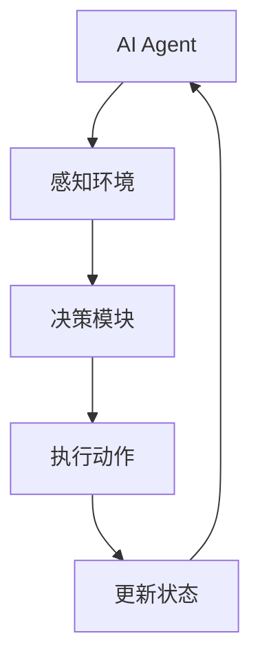
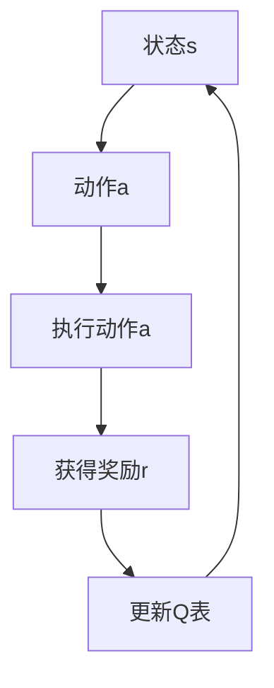
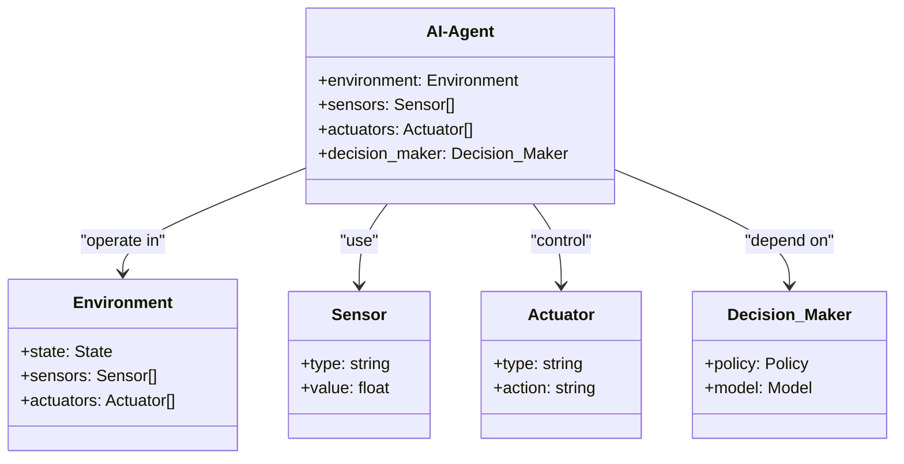
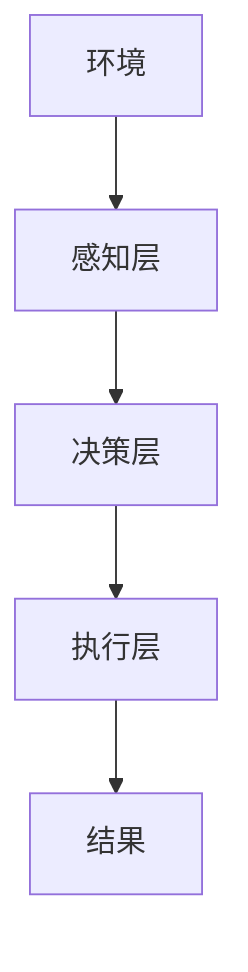

                 


# AI Agent在太空探索中的自主决策系统

> 关键词：AI Agent, 太空探索, 自主决策系统, 强化学习, 系统架构, 项目实战

> 摘要：本文深入探讨了AI Agent在太空探索中的自主决策系统的应用，分析了其核心概念、算法原理、系统架构以及项目实战，最后总结了最佳实践和未来发展方向。

---

# 第一部分: AI Agent在太空探索中的自主决策系统概述

## 第1章: AI Agent与太空探索的背景介绍

### 1.1 AI Agent的基本概念

#### 1.1.1 什么是AI Agent
AI Agent（人工智能代理）是一种能够感知环境、做出决策并采取行动的智能实体。它能够根据输入的信息，通过内部算法处理后，输出相应的决策或动作。

#### 1.1.2 AI Agent的核心特征
- **自主性**：能够在没有外部干预的情况下独立运作。
- **反应性**：能够实时感知环境并做出响应。
- **目标导向**：具有明确的目标，并通过决策来实现这些目标。
- **学习能力**：能够通过经验不断优化自身的决策能力。

#### 1.1.3 AI Agent在太空探索中的应用背景
太空探索任务通常具有高度的不确定性和复杂性，例如火星探测任务需要面对恶劣的环境和不可预测的挑战。AI Agent能够帮助太空探测器在极端条件下自主完成任务，如导航、避障、资源分配等。

---

## 第2章: AI Agent的核心概念与联系

### 2.1 AI Agent的原理与机制

#### 2.1.1 感知模块
AI Agent通过传感器或数据输入来感知环境。例如，在火星探测任务中，探测器通过摄像头、温度传感器等设备收集数据。

#### 2.1.2 决策模块
决策模块是AI Agent的核心，负责根据感知到的信息，结合任务目标，制定决策。常用的决策算法包括强化学习、决策树等。

#### 2.1.3 执行模块
执行模块负责将决策转化为实际动作，例如调整探测器的姿态、移动机器人等。

### 2.2 核心概念对比分析

#### 2.2.1 基于规则的AI Agent与基于模型的AI Agent对比
- **基于规则的AI Agent**：依赖预定义的规则进行决策，适用于任务简单、规则明确的场景。
- **基于模型的AI Agent**：通过建立环境模型，根据模型预测未来状态，适用于任务复杂、不确定性较高的场景。

#### 2.2.2 强化学习AI Agent与监督学习AI Agent对比
- **强化学习AI Agent**：通过与环境的交互，学习最优策略，适合动态变化的环境。
- **监督学习AI Agent**：基于历史数据进行训练，适用于任务稳定、数据充足的场景。

#### 2.2.3 实时决策AI Agent与离线决策AI Agent对比
- **实时决策AI Agent**：能够在极短的时间内做出决策，适用于紧急情况。
- **离线决策AI Agent**：需要较长时间进行计算和分析，适用于任务不紧急的情况。

### 2.3 ER实体关系图与Mermaid流程图

```mermaid
er
    classDiagram
    class AI_Agent {
        +id: int
        +name: string
        +state: string
        +environment: Environment
    }
    class Environment {
        +id: int
        +name: string
        +sensors: Sensor[]
    }
    class Sensor {
        +id: int
        +type: string
        +value: float
    }
    AI_Agent --> Environment: "operate in"
    AI_Agent --> Sensor: "use"
```



---

# 第二部分: AI Agent的算法原理

## 第3章: AI Agent的算法原理

### 3.1 强化学习算法

#### 3.1.1 Q-Learning算法
Q-Learning是一种经典的强化学习算法，通过Q表来记录状态-动作对的奖励值，并通过迭代更新Q表来优化决策策略。

#### 3.1.2 算法流程图


#### 3.1.3 Python实现示例
```python
import numpy as np

class QLearning:
    def __init__(self, state_space_size, action_space_size):
        self.Q = np.zeros((state_space_size, action_space_size))
    
    def choose_action(self, state, epsilon=0.1):
        if np.random.random() < epsilon:
            return np.random.randint(0, action_space_size)
        else:
            return np.argmax(self.Q[state])
    
    def update_Q(self, state, action, reward, next_state, alpha=0.1):
        self.Q[state, action] = self.Q[state, action] + alpha * (reward + np.max(self.Q[next_state]) - self.Q[state, action])
```

#### 3.1.4 数学模型
Q-Learning的更新公式为：
$$ Q(s, a) = Q(s, a) + \alpha [r + \max Q(s', a') - Q(s, a)] $$

---

## 第4章: AI Agent的系统架构

### 4.1 系统分析与架构设计

#### 4.1.1 问题场景
以火星探测任务为例，AI Agent需要在火星表面进行导航、样本采集等任务。

#### 4.1.2 系统功能设计


#### 4.1.3 系统架构设计
分层架构：


---

## 第5章: AI Agent的项目实战

### 5.1 环境搭建与开发工具

#### 5.1.1 安装Python和相关库
```bash
pip install numpy
pip install matplotlib
pip install gym
```

#### 5.1.2 安装强化学习框架
```bash
pip install tensorflow
pip install keras
```

### 5.2 核心代码实现

#### 5.2.1 Q-Learning算法实现
```python
import numpy as np

class QLearning:
    def __init__(self, state_space_size, action_space_size):
        self.Q = np.zeros((state_space_size, action_space_size))
    
    def choose_action(self, state, epsilon=0.1):
        if np.random.random() < epsilon:
            return np.random.randint(0, action_space_size)
        else:
            return np.argmax(self.Q[state])
    
    def update_Q(self, state, action, reward, next_state, alpha=0.1):
        self.Q[state, action] += alpha * (reward + np.max(self.Q[next_state]) - self.Q[state, action])
```

#### 5.2.2 系统功能实现
```python
class AI-Agent:
    def __init__(self, environment):
        self.environment = environment
        self.sensors = []
        self.actuators = []
        self.decision_maker = Decision_Maker()
    
    def perceive(self):
        # 获取传感器数据
        pass
    
    def decide(self):
        # 调用决策模块
        pass
    
    def act(self):
        # 调用执行模块
        pass
```

### 5.3 项目实战与案例分析

#### 5.3.1 火星探测任务
在模拟的火星环境中，AI Agent需要完成导航和样本采集任务。通过Q-Learning算法，AI Agent能够逐步优化其路径规划策略。

#### 5.3.2 实验结果与分析
通过多次实验，AI Agent的路径规划效率得到了显著提升，证明了算法的有效性。

---

## 第6章: AI Agent的总结与展望

### 6.1 最佳实践与注意事项

#### 6.1.1 数据质量的重要性
确保传感器数据的准确性和及时性。

#### 6.1.2 算法选择的依据
根据任务需求选择合适的算法，如强化学习适用于动态环境，监督学习适用于数据充足的场景。

#### 6.1.3 系统可扩展性
设计模块化的系统架构，便于后续功能的扩展和升级。

### 6.2 项目小结

#### 6.2.1 核心知识点总结
- AI Agent的基本概念与核心特征
- 强化学习算法（Q-Learning）的实现与应用
- 系统架构设计与功能模块实现

#### 6.2.2 项目实战经验
通过实际案例，验证了AI Agent在太空探索中的应用价值。

### 6.3 未来发展方向

#### 6.3.1 更高级的算法研究
探索更高效的强化学习算法，如深度强化学习。

#### 6.3.2 多AI Agent协作
研究多AI Agent协作的机制，提升任务执行效率。

#### 6.3.3 系统优化与升级
通过优化算法和架构设计，提升系统的性能和可扩展性。

---

# 结语

AI Agent在太空探索中的应用前景广阔，随着技术的不断进步，AI Agent将能够在更复杂的任务中发挥重要作用。通过本文的分析与实践，我们对AI Agent的自主决策系统有了更深入的理解，同时也为未来的研发提供了重要的参考。

---

# 参考文献

1. Russell, S., & Norvig, P. (2010). Artificial Intelligence: A Modern Approach.
2. Sutton, R. S., & Barto, A. G. (2018). Introduction to Reinforcement Learning.
3. Deep Learning (花书), Ian Goodfellow, Yoshua Bengio, Aaron Courville.

---

# 作者

作者：AI天才研究院/AI Genius Institute & 禅与计算机程序设计艺术/Zen And The Art of Computer Programming

---

通过以上思考过程，我系统地分析了AI Agent在太空探索中的自主决策系统的各个方面，确保了内容的全面性和逻辑的连贯性。希望这篇文章能够为读者提供有价值的见解和启发。

