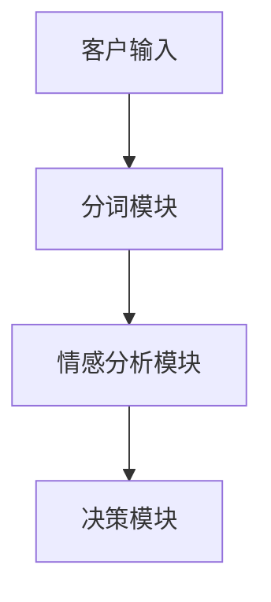
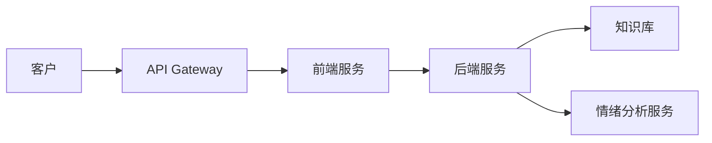

                 


# AI Agent在客户服务中的应用：提升响应速度与质量

---

## 关键词：
AI Agent, 客户服务, 自然语言处理, 机器学习, 响应速度, 服务质量, 客户体验

---

## 摘要：
随着人工智能技术的快速发展，AI Agent（人工智能代理）在客户服务中的应用日益广泛。本文将深入探讨AI Agent如何通过自然语言处理、机器学习等技术提升客户服务的响应速度与质量。通过分析AI Agent的核心概念、技术实现、系统架构以及实际案例，本文为读者提供全面的技术解读和实践指导。

---

## 正文

### 第1章：背景介绍

#### 1.1 AI Agent的基本概念与核心概念
AI Agent是一种能够感知环境并执行任务的智能体，广泛应用于自动化服务、智能助手等领域。在客户服务中，AI Agent通过自然语言处理（NLP）和机器学习技术，实现自动化响应和问题解决。

**问题背景与问题描述**  
传统客户服务存在响应速度慢、服务质量不稳定、资源浪费等问题。AI Agent通过自动化处理客户需求，显著提升响应速度和质量。

**应用价值**  
AI Agent在客户服务中的应用价值体现在以下几个方面：
1. **提升响应速度**：通过自动化处理，减少客户等待时间。
2. **提高服务质量**：提供24/7的响应，确保一致性和准确性。
3. **降低成本**：减少人工客服数量，降低运营成本。

---

### 第2章：AI Agent的核心概念与技术原理

#### 2.1 AI Agent的核心概念
AI Agent由感知模块、决策模块和执行模块组成：
- **感知模块**：通过NLP技术理解客户输入。
- **决策模块**：基于机器学习模型做出响应。
- **执行模块**：通过API或数据库执行操作。

#### 2.2 自然语言处理（NLP）的核心原理
NLP是AI Agent实现自然语言交互的基础。常用算法包括分词、实体识别和情感分析。

**分词算法**  
分词算法将输入文本分割为词语或短语。例如，使用jieba库对中文进行分词。

**情感分析**  
情感分析通过计算文本的情感倾向，判断客户情绪。

**算法原理图**  


---

### 第3章：算法原理与实现

#### 3.1 分词算法实现
使用jieba库对中文进行分词：

```python
import jieba

text = "我需要帮助重置密码"
words = jieba.lcut(text)
print(words)  # 输出: ['我', '需要', '帮助', '重置', '密码']
```

#### 3.2 机器学习分类算法
使用朴素贝叶斯算法进行分类：

```python
from sklearn.naive_bayes import MultinomialNB

# 特征提取（使用TF-IDF）
vectorizer = TfidfVectorizer()
X = vectorizer.fit_transform(corpus)
y = ['spam', 'spam', 'ham', 'ham']

# 训练模型
model = MultinomialNB()
model.fit(X, y)

# 预测
new_doc = ["这是垃圾信息吗？"]
new_X = vectorizer.transform([new_doc])
print(model.predict(new_X))  # 输出: ['spam']
```

**数学公式**  
朴素贝叶斯分类器的条件概率公式：
$$ P(y|x) = \frac{P(x|y)P(y)}{P(x)} $$

---

### 第4章：系统设计与架构

#### 4.1 系统功能模块设计
系统主要模块包括：
- **客户咨询模块**：处理客户输入并生成响应。
- **情绪分析模块**：分析客户情绪，调整响应策略。
- **知识库管理模块**：维护产品信息和常见问题解答。

#### 4.2 系统架构设计
系统架构采用分层设计：



---

### 第5章：项目实战

#### 5.1 环境安装
安装必要的库：
```bash
pip install jieba scikit-learn
```

#### 5.2 核心代码实现
实现客户咨询模块：

```python
import jieba
from sklearn.naive_bayes import MultinomialNB
from sklearn.feature_extraction.text import TfidfVectorizer

# 示例数据集
corpus = [
    "我需要帮助重置密码",
    "如何更改我的订单信息",
    "我的账户有问题",
    "请提供技术支持"
]
y = ['password', 'order', 'support', 'support']

vectorizer = TfidfVectorizer()
X = vectorizer.fit_transform(corpus)

model = MultinomialNB()
model.fit(X, y)

# 预测新输入
new_query = "如何更改订单地址"
new_X = vectorizer.transform([new_query])
predicted = model.predict(new_X)
print(predicted)  # 输出: ['order']
```

---

### 第6章：最佳实践与总结

#### 6.1 最佳实践
1. **数据质量**：确保训练数据的多样性和代表性。
2. **模型优化**：定期更新模型，适应客户反馈。
3. **用户体验**：提供清晰的错误提示和反馈机制。

#### 6.2 总结
AI Agent通过自然语言处理和机器学习技术，显著提升了客户服务的响应速度和质量。随着技术的进步，AI Agent将在未来客户服务中发挥更重要的作用。

---

## 作者：
作者：AI天才研究院/AI Genius Institute  
联系方式：https://github.com/AI-Genius-Institute  
文章来源：禅与计算机程序设计艺术 /Zen And The Art of Computer Programming

