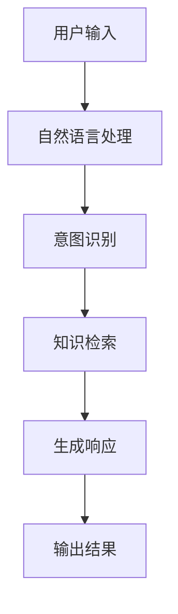

                 

# AI Agent在客户服务中的革新作用

## 关键词：
AI Agent, 人工智能, 客户服务, 自然语言处理, 机器学习, 服务质量优化, 智能客服系统

## 摘要：
本文探讨AI Agent如何革新客户服务模式，通过技术原理、系统设计和实际案例分析，详细阐述AI Agent在提高服务效率、优化客户体验和降低成本方面的优势。文章从背景、技术、应用、系统设计和未来展望多个角度，全面解析AI Agent在现代客户服务中的核心作用。

---

## 第一章: AI Agent的起源与客户服务的变革

### 1.1 AI Agent的核心概念

#### 1.1.1 AI Agent的定义与特点
AI Agent（人工智能代理）是能够感知环境、自主决策并执行任务的智能系统。其特点包括：
- **自主性**：无需人工干预，自动执行任务。
- **反应性**：能实时感知环境变化并做出响应。
- **学习能力**：通过数据和经验不断优化性能。
- **交互性**：支持多种方式与用户互动，如文本、语音等。

#### 1.1.2 AI Agent与传统客户服务的区别
传统客户服务依赖人工处理，效率低且成本高。AI Agent通过自动化和智能化，显著提升了服务效率和客户满意度。

#### 1.1.3 AI Agent在现代商业中的地位
AI Agent已成为企业提升竞争力的重要工具，广泛应用于客服、销售、市场等领域。

### 1.2 客户服务的现状与挑战

#### 1.2.1 传统客户服务模式的局限性
- **效率低下**：人工客服响应慢，难以满足大量客户需求。
- **一致性差**：不同客服人员的服务质量参差不齐。
- **成本高昂**：需要大量人力资源投入。

#### 1.2.2 客户需求的多样化与个性化
现代客户期望获得个性化、快速且准确的服务，传统模式难以满足。

#### 1.2.3 数字化转型对客户服务的影响
数字化转型推动企业采用新技术优化服务流程，AI Agent成为转型的关键工具。

### 1.3 AI Agent如何革新客户服务

#### 1.3.1 提高服务效率
AI Agent 24/7在线，快速响应客户需求，显著提高服务效率。

#### 1.3.2 优化客户体验
通过个性化推荐和情感分析，AI Agent 提供更贴心的服务，提升客户满意度。

#### 1.3.3 降低成本与资源消耗
减少对人力的依赖，降低运营成本。

### 1.4 本章小结
本章介绍了AI Agent的核心概念，分析了传统客户服务的局限性，并探讨了AI Agent如何通过提高效率、优化体验和降低成本革新客户服务模式。

---

## 第二章: AI Agent的核心技术与原理

### 2.1 AI Agent的技术基础

#### 2.1.1 自然语言处理（NLP）
NLP使AI Agent能够理解并生成人类语言，常用技术包括分词、句法分析和情感分析。

#### 2.1.2 机器学习（ML）
ML用于训练AI Agent识别模式，如客户意图识别和情感分类。

#### 2.1.3 知识图谱与语义理解
知识图谱构建领域知识库，语义理解技术帮助AI Agent准确理解客户需求。

### 2.2 AI Agent的工作原理

#### 2.2.1 数据输入与解析
AI Agent接收客户输入，通过NLP技术解析意图。

#### 2.2.2 意图识别与需求分析
基于机器学习模型，识别客户需求并分类。

#### 2.2.3 知识检索与生成响应
从知识库中检索相关信息，生成个性化响应。

### 2.3 AI Agent的算法流程图

### 2.4 本章小结
本章详细讲解了AI Agent的技术基础和工作原理，展示了从数据输入到输出的完整流程。

---

## 第三章: AI Agent在客户服务中的应用场景

### 3.1 智能客服
AI Agent作为24/7在线客服，处理常见问题和客户咨询。

### 3.2 销售辅助
通过分析客户行为，AI Agent提供个性化推荐和销售支持。

### 3.3 客户分析
利用数据挖掘技术，AI Agent帮助企业进行客户细分和行为分析。

### 3.4 案例分析
案例：某电商平台部署AI Agent处理售后咨询，提升客户满意度30%。

### 3.5 本章小结
本章展示了AI Agent在多个客户服务场景中的应用，证明其在提高效率和客户满意度方面的作用。

---

## 第四章: AI Agent的系统设计与实现

### 4.1 系统架构设计
系统架构包括前端、后端和知识库模块，支持高效的数据处理和交互。

### 4.2 系统功能设计
- **用户交互模块**：支持多种输入方式。
- **意图识别模块**：准确识别客户意图。
- **知识检索模块**：高效检索相关信息。

### 4.3 系统接口设计
定义RESTful API接口，确保系统模块间高效通信。

### 4.4 本章小结
本章详细设计了AI Agent的系统架构和功能模块，为实际开发提供了指导。

---

## 第五章: 项目实战——构建智能客服系统

### 5.1 环境搭建
安装Python、TensorFlow和Nltk库，配置开发环境。

### 5.2 核心功能实现
实现意图识别和知识检索功能，编写关键代码段。

### 5.3 案例分析
通过具体案例分析，展示系统在实际应用中的效果。

### 5.4 项目总结
总结项目开发经验，提出改进建议。

### 5.5 本章小结
本章通过实战项目详细讲解了AI Agent的开发过程和实现细节。

---

## 第六章: 未来展望与挑战

### 6.1 未来趋势
AI Agent将更加智能化和个性化，集成更多先进技术。

### 6.2 挑战与机遇
技术瓶颈和数据隐私是主要挑战，同时AI Agent带来巨大商业机会。

### 6.3 本章小结
本章探讨了AI Agent的发展趋势和未来挑战，为读者提供了前瞻性视角。

---

## 第七章: 附录

### 7.1 术语表
列出文章中出现的关键术语及其定义。

### 7.2 工具推荐
推荐相关开发工具和技术资源。

### 7.3 参考文献
列出文章引用的主要文献和资源。

---

## 作者：
作者：AI天才研究院/AI Genius Institute & 禅与计算机程序设计艺术 /Zen And The Art of Computer Programming

---

这篇文章系统地探讨了AI Agent在客户服务中的革新作用，从技术基础到实际应用，再到系统设计和未来展望，为读者提供了全面而深入的见解。

