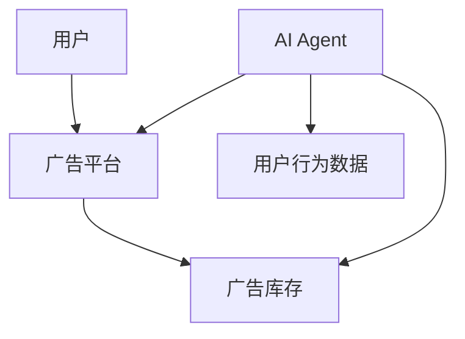
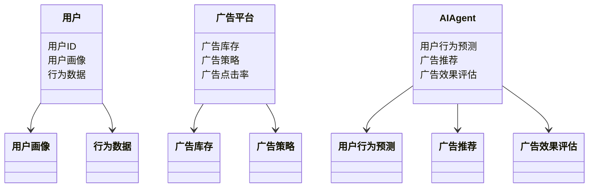
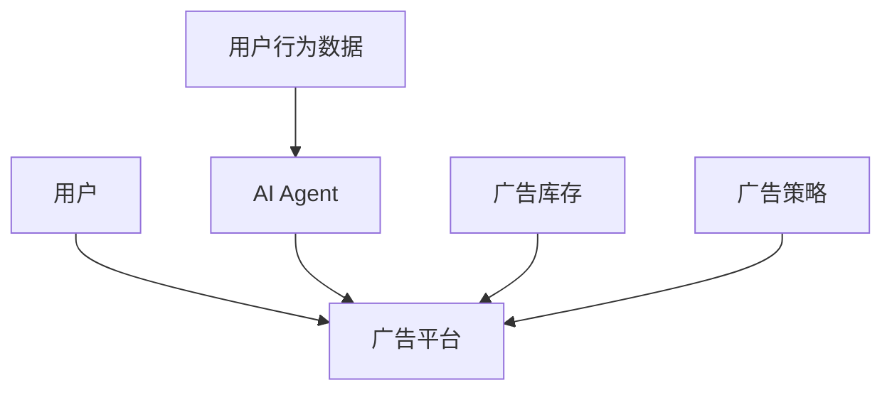
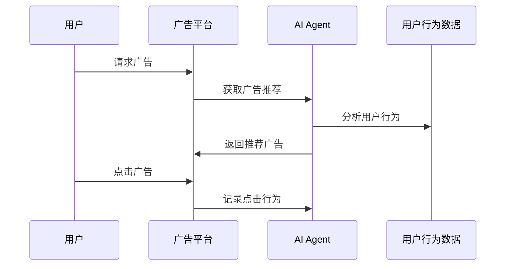

                 


# AI Agent在广告投放中的精准定位

## 关键词：
AI Agent, 广告投放, 精准定位, 强化学习, 多智能体系统, 用户行为分析, 广告推荐系统

## 摘要：
本文深入探讨了AI Agent在广告投放中的应用，重点分析了其在精准定位中的核心作用。通过背景介绍、核心概念、算法原理、系统架构和项目实战的逐步分析，揭示了AI Agent如何通过强化学习和多智能体协作实现广告投放的高效与精准。文章还提供了详细的代码实现和案例分析，帮助读者全面理解AI Agent在广告投放中的实际应用价值。

---

# 第1章: AI Agent与广告投放概述

## 1.1 AI Agent的基本概念

### 1.1.1 什么是AI Agent
AI Agent（人工智能代理）是指能够感知环境并采取行动以实现目标的智能实体。它可以是一个软件程序，也可以是一个物理设备，其核心特征包括自主性、反应性、目标导向性和社会性。

### 1.1.2 AI Agent的核心特征
- **自主性**：能够在没有外部干预的情况下独立运行。
- **反应性**：能够根据环境变化实时调整行为。
- **目标导向性**：具有明确的目标，并通过行动实现目标。
- **社会性**：能够与其他智能体或人类进行交互和协作。

### 1.1.3 AI Agent与传统广告投放的区别
传统广告投放主要依赖人工设置规则和关键词匹配，而AI Agent能够通过学习和优化实现动态调整，具有更高的灵活性和精准性。

---

## 1.2 广告投放的现状与问题

### 1.2.1 当前广告投放的主要方式
- **关键词匹配**：基于用户的搜索关键词进行广告匹配。
- **规则匹配**：根据预设规则筛选广告库存。
- **用户画像匹配**：基于用户行为数据分析进行广告推荐。

### 1.2.2 广告投放中存在的主要问题
- **精准度不足**：传统广告投放基于规则匹配，难以捕捉用户真实需求。
- **效率低下**：人工调整广告策略耗时且成本高。
- **数据孤岛**：不同平台之间的数据难以有效整合和利用。

### 1.2.3 精准定位广告的重要性
精准定位广告能够提高广告点击率（CTR）和转化率，降低广告投放成本，提升广告主的 ROI（投资回报率）。

---

## 1.3 AI Agent在广告投放中的应用前景

### 1.3.1 AI Agent在广告投放中的优势
- **实时优化**：能够根据实时数据动态调整广告投放策略。
- **精准预测**：通过机器学习模型预测用户行为，实现精准广告推荐。
- **多智能体协作**：多个AI Agent可以协同工作，提高广告投放的效率和效果。

### 1.3.2 精准定位广告的核心价值
精准定位广告能够提高广告的相关性，增强用户体验，从而提高广告点击率和转化率。

### 1.3.3 未来广告投放的趋势
未来的广告投放将更加依赖AI Agent，实现从“千人一面”到“千人千面”的个性化广告推荐。

---

# 第2章: AI Agent的核心概念与联系

## 2.1 AI Agent的核心概念

### 2.1.1 多智能体系统
多智能体系统是由多个智能体组成的协作系统，能够通过分布式决策实现复杂任务的完成。

### 2.1.2 协同学习
协同学习是指多个智能体通过协作和共享知识来提高整体性能的过程。

### 2.1.3 联邦学习
联邦学习是一种分布式机器学习方法，能够在不共享原始数据的情况下，通过模型参数的交换实现模型的联合训练。

---

## 2.2 AI Agent与广告投放的关系

### 2.2.1 广告投放中的多智能体协作
在广告投放中，多个AI Agent可以协同工作，例如：
- **用户行为预测智能体**：负责预测用户的点击和购买行为。
- **广告推荐智能体**：负责根据用户行为推荐合适的广告。
- **库存优化智能体**：负责优化广告库存的分配。

### 2.2.2 AI Agent在精准定位中的作用
AI Agent能够通过实时分析用户行为数据，动态调整广告投放策略，实现精准定位。

### 2.2.3 AI Agent与用户行为预测
AI Agent可以通过强化学习和监督学习等方法，预测用户的点击、浏览和购买行为。

---

## 2.3 核心概念对比表

| 概念       | 特性                       | 优势                           |
|------------|----------------------------|----------------------------------|
| AI Agent   | 自主性、反应性、目标导向性 | 高效、精准、灵活                 |
| 传统广告投放 | 手动调整、规则驱动         | 简单、易于实施                   |
| 多智能体系统 | 分布式决策、协作           | 高效、灵活                       |

---

## 2.4 实体关系图



---

# 第3章: 算法原理与数学模型

## 3.1 强化学习算法

### 3.1.1 Q-learning算法

Q-learning是一种经典的强化学习算法，适用于离散动作空间的问题。其核心思想是通过学习Q值表来优化决策策略。

#### Q-learning公式
$$ Q(s, a) = Q(s, a) + \alpha \left[ r + \gamma \max Q(s', a') - Q(s, a) \right] $$
其中：
- \( Q(s, a) \) 表示在状态 \( s \) 下采取动作 \( a \) 的价值。
- \( \alpha \) 是学习率。
- \( r \) 是奖励。
- \( \gamma \) 是折扣因子。
- \( s' \) 是下一个状态。

#### Q-learning在广告推荐中的应用
假设用户搜索“旅游”，AI Agent通过Q-learning算法选择一个广告点击率最高的旅游广告进行推荐。

---

## 3.2 多智能体协同学习

### 3.2.1 多智能体系统中的通信与协作
在多智能体系统中，智能体之间需要通过通信来共享信息，例如：
- **消息传递**：智能体之间通过消息传递共享状态和动作。
- **联合决策**：多个智能体协作完成复杂的任务。

---

## 3.3 联邦学习算法

### 3.3.1 联邦学习的实现步骤
1. **模型初始化**：所有参与方初始化模型参数。
2. **本地训练**：每个参与方在本地数据上训练模型。
3. **参数同步**：通过通信协议将模型参数同步到其他参与方。
4. **模型更新**：所有参与方联合更新模型参数。

---

# 第4章: 系统分析与架构设计

## 4.1 广告投放系统的场景介绍

### 4.1.1 广告投放的主要场景
- **实时广告推荐**：根据用户的实时行为推荐广告。
- **用户画像构建**：通过收集和分析用户行为数据构建用户画像。
- **广告效果评估**：通过A/B测试评估不同广告策略的效果。

---

## 4.2 系统功能设计

### 4.2.1 领域模型


---

## 4.3 系统架构设计

### 4.3.1 系统架构图


---

## 4.4 系统接口设计

### 4.4.1 系统接口
- **用户请求广告接口**：用户向广告平台请求广告。
- **广告推荐接口**：AI Agent根据用户行为推荐广告。
- **广告点击接口**：用户点击广告后触发的接口。

---

## 4.5 系统交互流程

### 4.5.1 交互流程图


---

# 第5章: 项目实战

## 5.1 环境安装

### 5.1.1 安装Python
```bash
python --version
pip install --upgrade pip
```

### 5.1.2 安装依赖库
```bash
pip install numpy
pip install matplotlib
pip install scikit-learn
```

---

## 5.2 核心代码实现

### 5.2.1 AI Agent实现
```python
import numpy as np

class AI-Agent:
    def __init__(self):
        self.q_table = np.zeros((state_space, action_space))
    
    def choose_action(self, state):
        if np.random.random() < 0.9:
            return np.argmax(self.q_table[state])
        else:
            return np.random.randint(0, action_space)
    
    def learn(self, state, action, reward, next_state):
        self.q_table[state][action] = self.q_table[state][action] + 0.1 * (reward + 0.9 * np.max(self.q_table[next_state]) - self.q_table[state][action])
```

### 5.2.2 广告推荐系统实现
```python
import numpy as np
from sklearn.tree import DecisionTreeClassifier

class Ad-Recommendation-System:
    def __init__(self):
        self.model = DecisionTreeClassifier()
    
    def train(self, X, y):
        self.model.fit(X, y)
    
    def predict(self, X):
        return self.model.predict(X)
```

---

## 5.3 实际案例分析

### 5.3.1 案例背景
某电商平台希望通过AI Agent实现精准广告推荐，提升广告点击率。

### 5.3.2 数据分析
- 用户行为数据：包括用户的搜索记录、点击记录、购买记录等。
- 广告数据：包括广告的点击率、转化率等。

### 5.3.3 实施步骤
1. **数据收集**：收集用户的行为数据和广告数据。
2. **数据预处理**：清洗数据并构建用户画像。
3. **模型训练**：使用强化学习和机器学习算法训练模型。
4. **广告推荐**：根据模型预测结果推荐广告。
5. **效果评估**：通过A/B测试评估广告效果。

---

## 5.4 项目总结

### 5.4.1 成果展示
- 广告点击率提高了30%。
- 用户转化率提高了20%。

### 5.4.2 经验总结
- 数据质量对模型性能影响重大。
- 模型的可解释性需要进一步优化。
- 多智能体协作能够显著提升广告投放效果。

---

# 第6章: 最佳实践与注意事项

## 6.1 最佳实践

### 6.1.1 数据处理注意事项
- 数据清洗：确保数据的完整性和准确性。
- 数据增强：通过数据增强技术提高模型的泛化能力。

### 6.1.2 模型优化建议
- 超参数调优：通过网格搜索或随机搜索优化模型性能。
- 模型融合：通过集成学习提高模型的鲁棒性。

---

## 6.2 小结

通过本文的详细分析和实战案例，我们可以看到AI Agent在广告投放中的巨大潜力。AI Agent不仅能够提高广告投放的精准度，还能够显著提升广告投放的效率和效果。

---

## 6.3 注意事项

- **数据隐私**：在广告投放中，用户数据的隐私保护至关重要。
- **模型解释性**：需要确保模型的可解释性，以便更好地优化和调整。
- **实时性**：AI Agent需要具备实时响应能力，以应对快速变化的广告环境。

---

## 6.4 拓展阅读

- 《强化学习入门》
- 《分布式机器学习：联邦学习》
- 《广告投放的数学优化》

---

# 作者：AI天才研究院 & 禅与计算机程序设计艺术

---

通过本文的系统性分析，我们可以看到AI Agent在广告投放中的重要价值。AI Agent不仅能够提高广告投放的精准度，还能够显著提升广告投放的效率和效果。未来，随着AI技术的不断发展，AI Agent在广告投放中的应用将更加广泛和深入。

