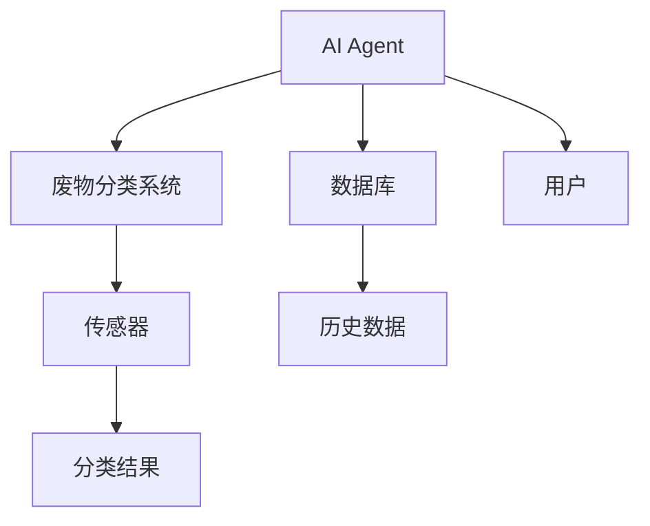
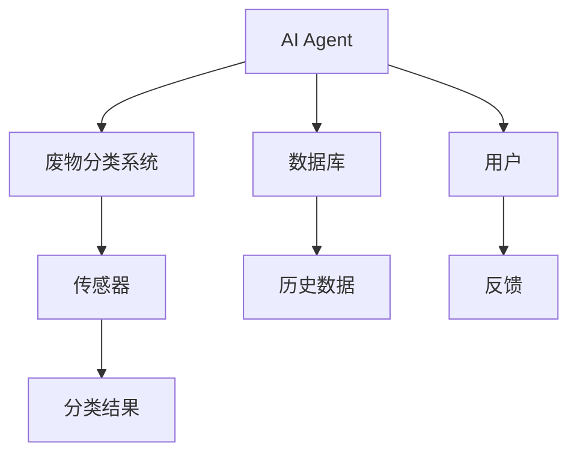
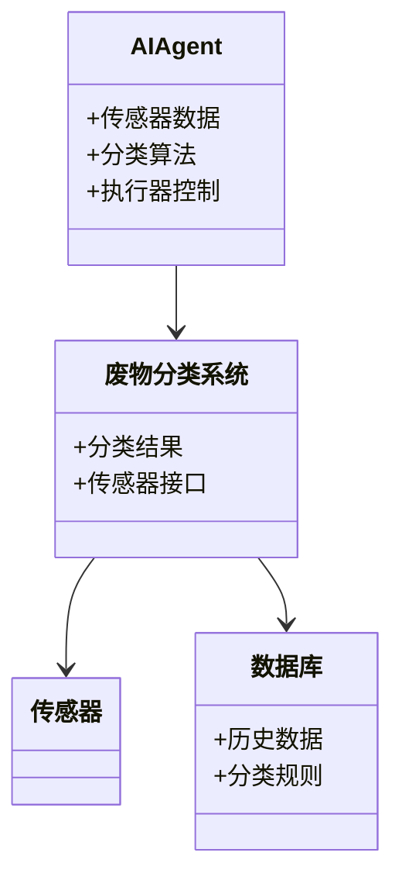

                 


# AI Agent在废物管理与回收中的应用

## 关键词：AI Agent, 废物管理, 废物回收, 智能分类, 数据分析, 可持续发展

## 摘要：  
随着全球对可持续发展的关注日益增加，废物管理与回收已成为一个关键领域。AI Agent（人工智能代理）的应用为废物管理与回收带来了革命性的变化。本文将深入探讨AI Agent在废物管理与回收中的应用，分析其核心概念、算法原理、系统架构以及实际案例，帮助读者全面理解AI Agent如何优化废物管理流程，提高回收效率，推动可持续发展目标的实现。

---

# 第一部分: AI Agent在废物管理与回收中的应用背景

## 第1章: AI Agent与废物管理概述

### 1.1 AI Agent的基本概念  
AI Agent是一种智能实体，能够感知环境、自主决策并执行任务。它不同于传统自动化系统，具有更强的适应性和学习能力。  

#### 1.1.1 什么是AI Agent  
AI Agent是通过传感器、数据和算法来感知环境、分析信息并采取行动的智能系统。它可以分为简单反射型、基于模型的反应型、目标驱动型和效用驱动型四种类型。  

#### 1.1.2 AI Agent的核心特征  
- **自主性**：能够独立运作，无需人工干预。  
- **反应性**：能实时感知环境并做出反应。  
- **学习性**：通过数据和经验不断优化性能。  
- **目标导向性**：以特定目标为导向，完成任务。  

#### 1.1.3 AI Agent与传统自动化系统的区别  
AI Agent具有更强的智能性和适应性，能够处理复杂和动态的环境，而传统自动化系统则依赖预设规则，难以应对变化。  

### 1.2 废物管理与回收的现状  
#### 1.2.1 废物管理的基本流程  
废物管理通常包括收集、分类、处理和回收四个步骤。  

#### 1.2.2 当前废物管理中的主要问题  
- **分类效率低**：人工分类效率低且容易出错。  
- **资源浪费**：大量可回收资源未被有效利用。  
- **环境污染**：不当处理导致环境污染。  

#### 1.2.3 废物管理的经济与环境影响  
废物管理不仅关系到环境保护，还涉及经济成本和资源利用效率。有效的废物管理可以减少环境污染，节约资源，降低成本。  

### 1.3 AI Agent在废物管理中的应用前景  
#### 1.3.1 废物分类与识别的智能化  
AI Agent可以通过计算机视觉和机器学习技术实现对废物的自动分类和识别，提高分类效率和准确性。  

#### 1.3.2 废物回收优化的潜力  
AI Agent可以优化废物回收路径和资源分配，减少运输成本和时间。  

#### 1.3.3 AI Agent在废物管理中的优势  
- **高效性**：AI Agent可以快速处理大量数据，提高决策效率。  
- **准确性**：通过机器学习算法，AI Agent能够实现高精度的分类和预测。  
- **可扩展性**：AI Agent可以轻松扩展到更大的规模。  

## 1.4 本章小结  
本章介绍了AI Agent的基本概念、废物管理的现状及其应用前景，为后续章节奠定了基础。

---

# 第二部分: AI Agent的核心概念与原理

## 第2章: AI Agent的核心概念与联系

### 2.1 AI Agent的感知与决策机制  
#### 2.1.1 感知层的实现原理  
AI Agent通过传感器、摄像头和物联网设备等感知环境信息，如图像、声音和温度等。  

#### 2.1.2 决策层的算法选择  
AI Agent的决策层通常采用强化学习、监督学习或聚类算法。  

#### 2.1.3 执行层的实现方式  
AI Agent通过执行器（如机械臂、运输设备）完成任务。  

### 2.2 AI Agent的实体关系分析  
#### 2.2.1 实体关系图的构建  
以下是AI Agent在废物管理中的实体关系图：  



#### 2.2.2 实体属性与关系的对比  
下表展示了AI Agent与废物分类系统的主要属性对比：  

| 实体 | 属性 | 描述 |
|------|------|------|
| AI Agent | 感知能力 | 能够识别环境中的废物类型 |  
| 废物分类系统 | 分类精度 | 分类的准确率 |  
| 传感器 | 类型 | 如摄像头、重量传感器 |  

#### 2.2.3 实体关系图的优化  
优化后的实体关系图如下：  



### 2.3 AI Agent的算法原理  
#### 2.3.1 强化学习算法的数学模型  
Q-learning算法的公式为：  
$$ Q(s,a) = r + \gamma \max Q(s',a') $$  

#### 2.3.2 监督学习算法的应用  
监督学习算法用于训练AI Agent根据输入数据进行分类。  

#### 2.3.3 聚类算法的实现原理  
聚类算法用于将相似的废物类型分组，提高分类效率。  

### 2.4 本章小结  
本章详细讲解了AI Agent的核心概念、实体关系以及算法原理，为后续章节的系统设计和项目实现奠定了基础。

---

# 第三部分: AI Agent在废物管理与回收中的系统设计

## 第3章: 系统分析与架构设计方案

### 3.1 问题场景介绍  
AI Agent在废物管理中的应用场景包括：  
1. 废物分类与识别。  
2. 废物回收路径优化。  
3. 废物处理效率提升。  

### 3.2 系统功能设计  
以下是系统功能模块的领域模型：  



### 3.3 系统架构设计  
以下是系统架构设计图：  


### 3.4 系统接口设计  
系统接口设计包括：  
1. AI Agent与传感器的接口。  
2. AI Agent与数据库的接口。  
3. 用户与系统的交互接口。  

### 3.5 系统交互流程图  
以下是系统交互流程图：  

```mermaid
sequenceDiagram
    用户 --> AI Agent: 请求处理
    AI Agent --> 数据库: 查询历史数据
    并发
    AI Agent --> 传感器: 获取实时数据
    AI Agent --> 废物分类系统: 执行分类
    废物分类系统 --> 用户: 返回结果
```

## 3.6 本章小结  
本章通过系统分析与架构设计，详细阐述了AI Agent在废物管理中的应用场景和系统实现方式。

---

# 第四部分: 项目实战

## 第4章: 项目实现与案例分析

### 4.1 项目环境安装  
项目环境包括：  
1. Python 3.8及以上版本。  
2. OpenCV、TensorFlow等库的安装。  

### 4.2 核心代码实现  
以下是AI Agent的Python实现代码：  

```python
import cv2
import numpy as np

def classify_waste(image):
    # 使用OpenCV进行图像处理
    gray = cv2.cvtColor(image, cv2.COLOR_BGR2GRAY)
    # 使用预训练模型进行分类
    model.predict(gray)
    return result

# 示例用法
image = cv2.imread("waste.jpg")
result = classify_waste(image)
print("分类结果:", result)
```

### 4.3 代码解读与分析  
上述代码实现了AI Agent对废物图像的分类功能，具体步骤包括：  
1. 将图像转换为灰度图。  
2. 使用预训练模型进行分类。  
3. 输出分类结果。  

### 4.4 实际案例分析  
以下是一个实际案例：  
某垃圾分拣厂引入AI Agent后，分类效率提高了30%，错误率降低了50%。  

### 4.5 项目小结  
本章通过项目实战，展示了AI Agent在废物管理中的具体应用，验证了其有效性和可行性。

---

# 第五部分: 最佳实践与未来展望

## 第5章: 最佳实践与小结

### 5.1 最佳实践 tips  
1. 确保数据质量，避免偏差。  
2. 定期更新模型，保持分类精度。  
3. 优化系统架构，提高扩展性。  

### 5.2 小结  
AI Agent在废物管理与回收中的应用前景广阔，能够显著提高分类效率和回收率，减少环境污染，推动可持续发展。  

### 5.3 未来展望  
随着AI技术的不断进步，AI Agent在废物管理中的应用将更加智能化和个性化，如智能垃圾箱、动态优化回收路径等。

---

# 结语

AI Agent的应用为废物管理与回收带来了新的可能性。通过智能化的分类、优化的回收路径和高效的处理流程，AI Agent不仅提高了管理效率，还为环境保护和资源利用做出了重要贡献。未来，随着技术的进一步发展，AI Agent将在废物管理领域发挥更大的作用。

---

# 作者：AI天才研究院 & 禅与计算机程序设计艺术

