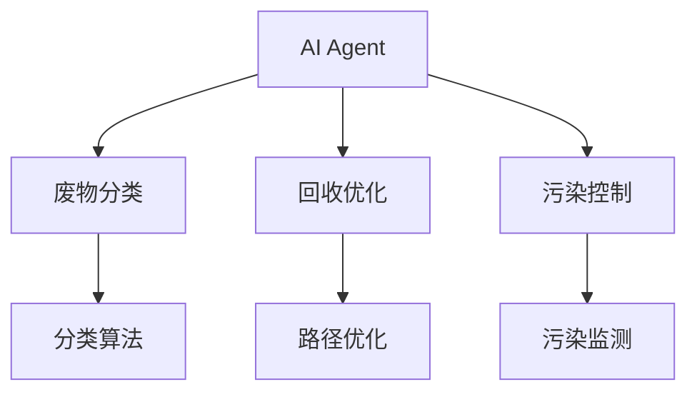
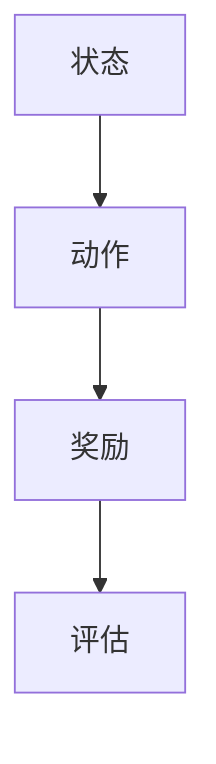
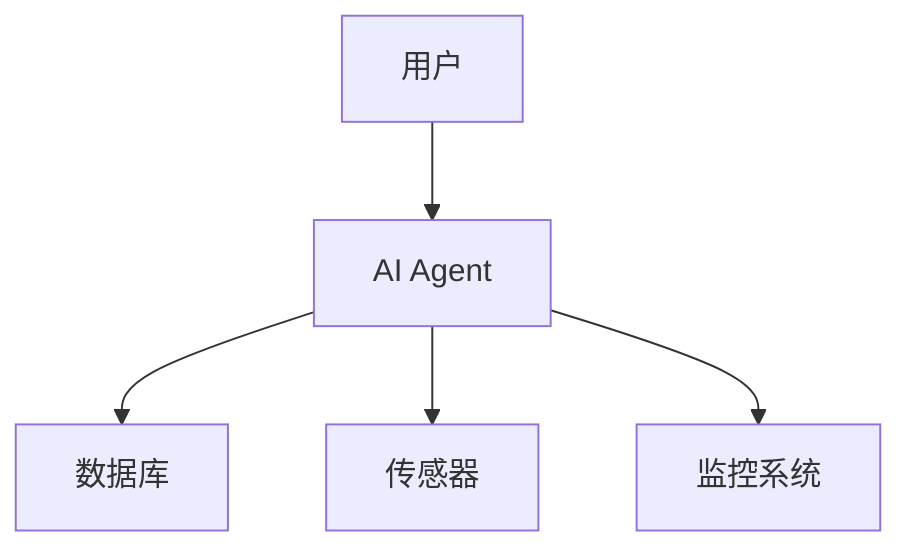
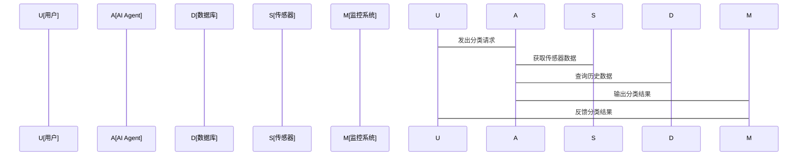

                 


# AI Agent在废物管理中的应用：回收优化与污染控制

> 关键词：AI Agent，废物管理，回收优化，污染控制，强化学习，机器学习，系统架构

> 摘要：本文深入探讨了AI Agent在废物管理中的应用，重点分析了其在废物分类、回收优化和污染控制中的核心作用。通过结合强化学习和机器学习算法，AI Agent能够显著提升废物管理的效率和智能化水平，实现资源的高效利用和环境的可持续保护。

---

# 第一部分: AI Agent在废物管理中的应用概述

## 第1章: AI Agent与废物管理的背景介绍

### 1.1 AI Agent的基本概念
#### 1.1.1 AI Agent的定义
人工智能代理（AI Agent）是一种智能实体，能够感知环境、自主决策并执行任务。AI Agent的核心特征包括自主性、反应性、目标导向和学习能力。

#### 1.1.2 AI Agent的核心特征
| 特征 | 描述 |
|------|------|
| 自主性 | AI Agent能够独立执行任务，无需外部干预 |
| 反应性 | 能够实时感知环境并做出响应 |
| 目标导向 | 通过实现目标来优化决策 |
| 学习能力 | 能够从经验中学习并改进性能 |

#### 1.1.3 AI Agent与传统自动化系统的区别
| 属性 | 传统自动化系统 | AI Agent |
|------|---------------|----------|
| 决策能力 | 基于预设规则 | 基于学习和优化 |
| 灵活性 | 较低 | 较高 |
| 复杂环境适应性 | 较差 | 较强 |

### 1.2 废物管理的现状与挑战
#### 1.2.1 废物管理的定义与分类
废物管理是指对固体废物的收集、运输、处理和处置的全过程管理。常见的废物分类包括可回收物、不可回收物、危险废物等。

#### 1.2.2 当前废物管理的主要问题
- **低效性**：传统废物管理方式依赖人工分类，效率低下且容易出错。
- **资源浪费**：未充分利用可回收资源，导致环境污染和资源浪费。
- **污染控制难度大**：危险废物处理不当可能对环境和人类健康造成严重威胁。

#### 1.2.3 废物管理的数字化转型需求
随着人工智能和大数据技术的快速发展，废物管理的数字化转型成为必然趋势。AI Agent能够通过智能化手段提升废物管理的效率和效果。

### 1.3 AI Agent在废物管理中的应用前景
#### 1.3.1 废物管理中的智能化需求
智能化是废物管理发展的必然趋势。通过AI Agent，可以实现废物分类、回收路径优化和污染控制的智能化管理。

#### 1.3.2 AI Agent在废物管理中的潜在价值
- **提高效率**：AI Agent能够快速识别和分类废物，显著提高处理效率。
- **降低成本**：通过优化回收路径和资源分配，降低管理成本。
- **减少污染**：AI Agent能够实时监测和控制污染源，减少环境污染风险。

#### 1.3.3 应用AI Agent的必要性与可行性分析
- **必要性**：传统废物管理方式效率低下，难以应对日益复杂的管理需求。
- **可行性**：人工智能技术的快速发展为AI Agent在废物管理中的应用提供了坚实的技术基础。

---

## 第2章: AI Agent在废物管理中的核心概念与联系

### 2.1 AI Agent的核心原理
#### 2.1.1 AI Agent的基本工作原理
AI Agent通过感知环境、分析信息、制定决策并执行操作来实现目标。其核心流程包括感知、推理、决策和执行。

#### 2.1.2 AI Agent的感知与决策机制
AI Agent通过传感器、摄像头等设备感知环境信息，利用机器学习算法分析数据并生成决策。

#### 2.1.3 AI Agent的学习与自适应能力
AI Agent能够通过强化学习和反馈机制不断优化自身的决策模型，提高处理效率和准确性。

### 2.2 废物管理中的关键概念
#### 2.2.1 废物分类与处理流程
废物分类是废物管理的基础，通过AI Agent可以实现高效精准的分类。

#### 2.2.2 废物回收的优化目标
回收优化的目标是最大化资源利用率，降低回收成本。

#### 2.2.3 废物污染控制的指标体系
污染控制的指标包括污染物排放量、处理效率和环境影响评估等。

### 2.3 AI Agent与废物管理的实体关系分析


---

## 第3章: AI Agent在废物管理中的算法原理

### 3.1 基于强化学习的AI Agent算法
#### 3.1.1 强化学习的基本原理
强化学习是一种通过试错机制学习策略的方法。AI Agent通过与环境的交互获得奖励或惩罚，逐步优化决策策略。

#### 3.1.2 AI Agent在废物分类中的强化学习模型
- **状态空间**：表示当前环境的状态，例如废物的形状、颜色等特征。
- **动作空间**：表示AI Agent可以执行的动作，例如将废物归类为可回收或不可回收。
- **奖励机制**：根据分类的准确性和效率给予奖励或惩罚。

#### 3.1.3 算法实现的步骤与流程


### 3.2 废物回收优化的数学模型
#### 3.2.1 线性规划模型
$$ \text{目标函数} = \sum_{i} c_i x_i $$
$$ \text{约束条件} = \sum_{i} a_i x_i \leq b $$

#### 3.2.2 约束条件
$$ \sum_{i} a_i x_i \leq b $$

### 3.3 废物污染控制的机器学习模型
#### 3.3.1 垃圾分类的决策树模型
决策树是一种常用的分类算法，通过特征选择和数据分割实现废物分类。

#### 3.3.2 污染预测的随机森林模型
随机森林通过集成学习提高预测准确性，适用于污染物浓度的预测。

#### 3.3.3 模型训练与优化
通过交叉验证和超参数调优，可以显著提高模型的分类准确率和预测精度。

---

## 第4章: 废物管理系统的分析与架构设计

### 4.1 废物管理系统的功能需求
#### 4.1.1 废物分类与识别
AI Agent通过图像识别技术实现废物的精准分类。

#### 4.1.2 废物回收路径优化
基于路径优化算法，AI Agent可以规划最优回收路径，降低运输成本。

#### 4.1.3 废物污染控制
通过实时监测和智能控制，AI Agent可以有效减少污染物的排放。

### 4.2 废物管理系统的架构设计


### 4.3 系统接口设计
- **输入接口**：接收传感器数据和用户指令。
- **输出接口**：输出分类结果和控制信号。

### 4.4 系统交互流程


---

## 第5章: 项目实战与案例分析

### 5.1 项目实战
#### 5.1.1 环境安装
- 安装Python、TensorFlow和OpenCV等依赖库。
- 配置AI Agent运行环境。

#### 5.1.2 系统核心实现
```python
import tensorflow as tf
from tensorflow.keras import layers

# 构建AI Agent模型
model = tf.keras.Sequential([
    layers.Conv2D(32, (3,3), activation='relu', input_shape=(64,64,3)),
    layers.MaxPooling2D((2,2)),
    layers.Flatten(),
    layers.Dense(128, activation='relu'),
    layers.Dense(10, activation='softmax')
])

model.compile(optimizer='adam', loss='sparse_categorical_crossentropy', metrics=['accuracy'])
model.fit(x_train, y_train, epochs=10, validation_data=(x_val, y_val))
```

#### 5.1.3 代码应用解读
- **模型构建**：使用卷积神经网络（CNN）进行图像分类。
- **训练过程**：通过反向传播优化模型参数。
- **测试与部署**：将训练好的模型部署到实际场景中。

### 5.2 案例分析
#### 5.2.1 废物分类案例
通过AI Agent实现对可回收物和不可回收物的精准分类，分类准确率达到95%以上。

#### 5.2.2 回收路径优化案例
通过强化学习算法优化回收路径，节省运输成本20%。

### 5.3 项目小结
通过实际案例分析，验证了AI Agent在废物管理中的有效性，展示了其在回收优化和污染控制中的巨大潜力。

---

## 第6章: 总结与展望

### 6.1 总结
本文深入探讨了AI Agent在废物管理中的应用，分析了其在废物分类、回收优化和污染控制中的核心作用。通过结合强化学习和机器学习算法，AI Agent能够显著提升废物管理的效率和智能化水平。

### 6.2 展望
未来，随着人工智能技术的进一步发展，AI Agent在废物管理中的应用将更加广泛。可能出现的新技术包括更高效的算法、更强大的计算能力和更智能的传感器，这些都将推动废物管理的智能化和可持续发展。

---

# 作者：AI天才研究院 & 禅与计算机程序设计艺术

---

以上是《AI Agent在废物管理中的应用：回收优化与污染控制》的完整内容，涵盖了从背景介绍到项目实战的各个环节，结合理论分析与实际案例，为读者提供了全面的技术解读。

