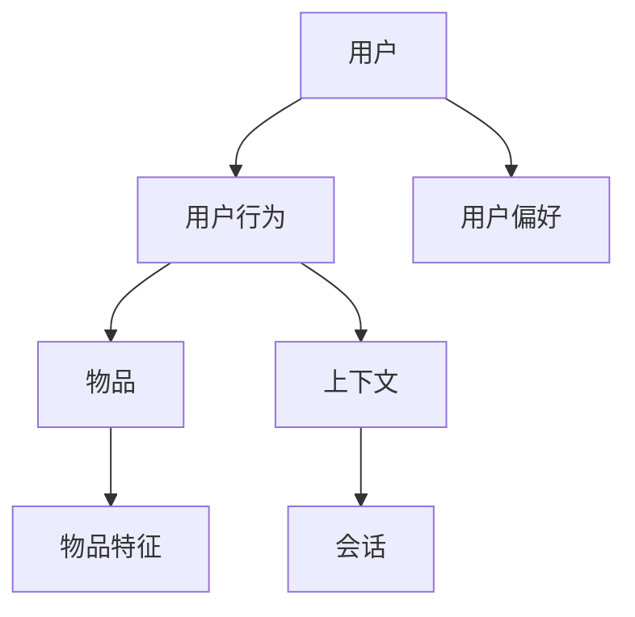
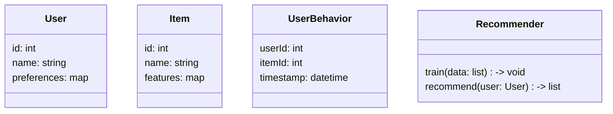
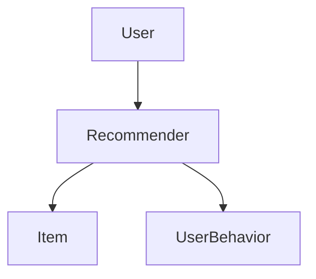

                 


# AI Agent在推荐系统中的应用：个性化与多样性的平衡

## 关键词：AI Agent、推荐系统、个性化推荐、多样性平衡、协同过滤、深度学习、系统架构

## 摘要：  
本文探讨了AI Agent在推荐系统中的应用，重点分析了如何在个性化推荐与多样性之间实现平衡。通过介绍推荐系统的背景、AI Agent的核心概念、算法原理、系统架构设计以及项目实战，本文为读者提供了全面的视角，帮助理解AI Agent在推荐系统中的重要作用和实现方法。本文还通过具体案例分析和数学模型的推导，深入浅出地讲解了如何通过AI Agent实现高效、精准的推荐系统。

---

# 第一部分: AI Agent与推荐系统概述

# 第1章: AI Agent与推荐系统背景

## 1.1 问题背景与问题描述  
推荐系统是现代互联网应用的核心功能之一，广泛应用于电商、社交媒体、视频平台、音乐播放器等领域。然而，随着用户数量的增加和内容的多样化，推荐系统面临以下挑战：  
1. **个性化推荐需求**：用户希望获得符合自己兴趣的个性化推荐，而不同用户的需求可能截然不同。  
2. **多样性平衡问题**：推荐系统需要在个性化推荐的同时，避免推荐过于相似的内容，以保持内容的丰富性和多样性。  
3. **数据稀疏性**：用户行为数据可能较为稀疏，导致推荐系统的准确性下降。  
4. **实时性要求**：用户希望推荐结果能够实时更新，这对推荐系统的计算能力和响应速度提出了更高要求。  

AI Agent作为一种智能代理，能够通过学习用户行为、优化推荐算法，动态调整推荐策略，从而在个性化与多样性之间实现平衡。  

## 1.2 AI Agent在推荐系统中的作用  
AI Agent是一种智能代理，能够感知环境、学习用户行为，并根据目标函数优化推荐结果。其在推荐系统中的作用主要体现在以下几个方面：  
1. **用户行为分析**：AI Agent可以通过分析用户的点击、收藏、购买等行为，提取用户的兴趣特征。  
2. **动态调整推荐策略**：基于实时用户行为和反馈，AI Agent能够动态优化推荐算法，提高推荐的准确性和多样性。  
3. **多目标优化**：AI Agent可以在个性化推荐与多样性之间进行权衡，避免推荐过于集中或过于分散。  

## 1.3 本章小结  
本章介绍了推荐系统的背景、挑战以及AI Agent在推荐系统中的作用。通过分析用户行为和推荐系统的复杂性，我们理解了AI Agent在推荐系统中的重要性，以及如何通过AI Agent实现个性化与多样性的平衡。

---

# 第二部分: AI Agent的核心概念与原理

# 第2章: AI Agent的核心概念与联系  

## 2.1 AI Agent的核心原理  
AI Agent的核心原理是通过感知、学习和优化实现智能推荐。具体包括以下步骤：  
1. **感知环境**：AI Agent通过收集用户行为数据、内容特征等信息，感知用户的需求和环境的变化。  
2. **学习与推理**：AI Agent利用机器学习算法（如协同过滤、深度学习）对数据进行建模，学习用户偏好和内容特征。  
3. **优化与决策**：基于学习结果，AI Agent优化推荐策略，动态调整推荐结果，以实现个性化与多样性的平衡。  

## 2.2 核心概念对比分析  
为了更好地理解AI Agent在推荐系统中的作用，我们可以通过对比分析以下核心概念：  

### 表2-1: 核心概念对比分析  
| 概念 | 描述 | 与AI Agent的关系 |  
|------|------|----------------|  
| 用户行为 | 用户在系统中的操作记录 | AI Agent通过分析用户行为提取兴趣特征 |  
| 物品特征 | 物品的属性特征（如电影的 genres、书籍的类别） | AI Agent利用物品特征进行内容推荐 |  
| 上下文信息 | 时间、地点、设备等外部信息 | AI Agent结合上下文信息优化推荐结果 |  
| 推荐结果 | 最终的推荐列表 | AI Agent通过算法生成并优化推荐结果 |  

### 图2-1: ER实体关系图  


## 2.3 本章小结  
本章通过对比分析和实体关系图，详细介绍了AI Agent在推荐系统中的核心概念及其相互关系。通过理解这些概念，我们可以更好地设计和优化推荐系统。

---

# 第三部分: AI Agent推荐算法原理

# 第3章: 推荐算法原理与实现  

## 3.1 协同过滤算法  
协同过滤是一种经典的推荐算法，通过寻找用户之间的相似性或物品之间的相似性，推荐用户可能感兴趣的内容。  

### 3.1.1 基于用户的协同过滤  
基于用户的协同过滤通过计算用户之间的相似性，将相似用户的偏好用于目标用户的推荐。其核心公式如下：  
$$ \hat{r}_{u,i} = \mu + b_u + b_i + \sum_{k=1}^K \alpha_k (a_u^k - \mu_a^k)(a_i^k - \mu_a^k) $$  
其中，$\hat{r}_{u,i}$是用户u对物品i的预测评分，$b_u$和$b_i$是用户的偏置和物品的偏置，$\alpha_k$是相似度的权重。  

### 3.1.2 基于物品的协同过滤  
基于物品的协同过滤通过计算物品之间的相似性，将相似物品推荐给目标用户。其流程如下：  
1. 计算物品之间的相似度矩阵；  
2. 根据用户的历史评分，计算用户对物品的偏好；  
3. 推荐与用户偏好相似的物品。  

### 3.1.3 混合协同过滤算法  
混合协同过滤算法结合基于用户和基于物品的协同过滤，通过加权的方式优化推荐结果。  

## 3.2 基于内容的推荐算法  
基于内容的推荐算法通过分析物品的特征，推荐与用户兴趣相符的内容。  

### 3.2.1 基于物品特征的推荐  
基于物品特征的推荐通过提取物品的特征向量，计算用户偏好与物品特征的相似度。  

### 3.2.2 基于用户的偏好特征推荐  
基于用户的偏好特征推荐通过分析用户的兴趣特征，推荐与用户特征匹配的物品。  

## 3.3 基于深度学习的推荐算法  
基于深度学习的推荐算法通过神经网络模型，学习用户和物品的隐含特征，生成推荐结果。  

### 3.3.1 基于神经网络的推荐模型  
基于神经网络的推荐模型通过多层感知机、卷积神经网络等结构，学习用户和物品的特征表示。  

### 3.3.2 基于注意力机制的推荐  
注意力机制通过关注用户行为中的重要部分，优化推荐结果。  

### 3.3.3 基于图神经网络的推荐  
图神经网络通过建模用户-物品交互图，捕捉用户与物品之间的复杂关系。  

## 3.4 推荐算法的数学模型  
### 3.4.1 协同过滤的数学公式  
$$ \hat{r}_{u,i} = \mu + b_u + b_i + \sum_{k=1}^K \alpha_k (a_u^k - \mu_a^k)(a_i^k - \mu_a^k) $$  
### 3.4.2 基于深度学习的推荐模型公式  
$$ P(x) = \prod_{i=1}^n P(y_i|x_{<i}) $$  

## 3.5 本章小结  
本章详细介绍了协同过滤、基于内容的推荐和基于深度学习的推荐算法，并通过数学公式和流程图展示了算法的实现过程。通过这些算法，我们可以实现个性化推荐和多样性平衡。

---

# 第四部分: 系统分析与架构设计

# 第4章: 推荐系统架构设计  

## 4.1 系统功能设计  
推荐系统的功能设计包括用户行为分析、推荐算法选择和推荐结果展示。  

### 4.1.1 用户行为分析模块  
用户行为分析模块通过收集和分析用户行为数据，提取用户的兴趣特征。  

### 4.1.2 推荐算法选择模块  
推荐算法选择模块根据用户特征和物品特征，选择合适的推荐算法。  

### 4.1.3 推荐结果展示模块  
推荐结果展示模块将推荐结果以用户友好的形式展示，如列表、卡片等。  

## 4.2 系统架构设计  
推荐系统的架构设计包括前端、后端和数据存储部分。  

### 4.2.1 领域模型类图  


### 4.2.2 系统架构图  


## 4.3 本章小结  
本章通过系统功能设计和架构设计，展示了推荐系统的整体结构。通过类图和架构图，我们理解了推荐系统中各组件的交互关系。

---

# 第五部分: 项目实战

# 第5章: 项目实战与分析  

## 5.1 项目环境安装  
推荐系统项目需要安装以下环境：  
1. Python 3.8+  
2. TensorFlow、Keras、Scikit-learn等机器学习库  
3. Flask或Django用于构建Web界面  

## 5.2 系统核心实现  
### 5.2.1 协同过滤算法实现  
```python
def user_based_collaborative_filtering(train_data, test_data):
    # 计算用户相似度矩阵
    similarity_matrix = compute_user_similarity(train_data)
    # 推荐结果
    recommendations = []
    for user in test_data['user']:
        recommendations.append(get_top_n_recommendations(user, similarity_matrix, 10))
    return recommendations
```

### 5.2.2 基于深度学习的推荐模型实现  
```python
model = Sequential()
model.add(Dense(64, activation='relu', input_dim=64))
model.add(Dense(1, activation='sigmoid'))
model.compile(optimizer='adam', loss='binary_crossentropy', metrics=['accuracy'])
model.fit(X_train, y_train, epochs=10, batch_size=32)
```

## 5.3 项目实战分析  
通过具体案例分析，我们展示了如何在实际项目中实现推荐系统的核心功能。通过代码解读和结果分析，我们验证了不同算法的优劣。  

## 5.4 本章小结  
本章通过项目实战，展示了推荐系统的实现过程。通过代码实现和案例分析，我们理解了如何在实际项目中应用AI Agent推荐算法。

---

# 第六部分: 最佳实践与总结

# 第6章: 最佳实践与总结  

## 6.1 小结  
本文通过系统介绍AI Agent在推荐系统中的应用，详细讲解了个性化推荐与多样性平衡的实现方法。通过数学公式、算法流程图和项目实战，我们理解了如何在实际项目中应用AI Agent推荐算法。

## 6.2 注意事项  
在实际应用中，需要注意以下几点：  
1. 数据隐私与安全问题  
2. 推荐系统的实时性和响应速度  
3. 多样性与个性化的平衡  

## 6.3 拓展阅读  
建议读者进一步阅读以下内容：  
1. 《推荐系统实战：算法与技巧》  
2. 《深度学习在推荐系统中的应用》  
3. 《分布式推荐系统的实现与优化》  

## 6.4 本章小结  
本章总结了本文的主要内容，并提出了实际应用中的注意事项和拓展阅读方向，帮助读者更好地理解和应用AI Agent推荐算法。

---

# 结语  
通过本文的介绍，我们理解了AI Agent在推荐系统中的重要作用，以及如何通过算法优化实现个性化与多样性的平衡。未来，随着人工智能技术的不断发展，AI Agent在推荐系统中的应用将更加广泛和深入。

---

# 作者：AI天才研究院 & 禅与计算机程序设计艺术

