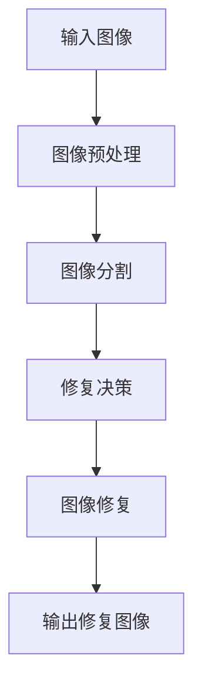
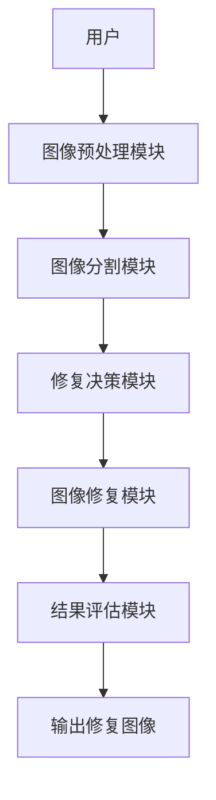
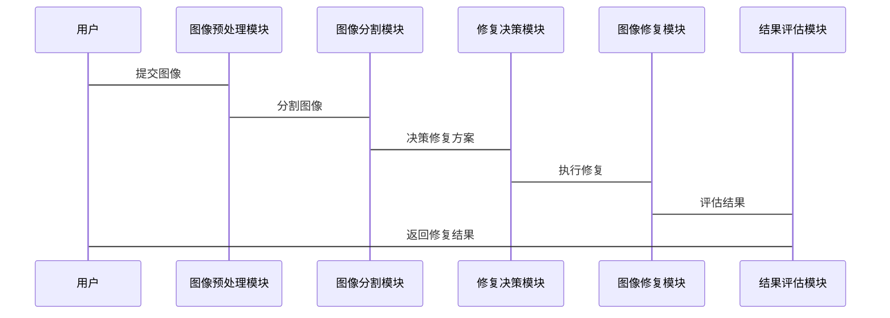

                 


# AI Agent在文物修复中的图像处理应用

> 关键词：AI Agent, 文物修复, 图像处理, 深度学习, 强化学习, 图像分割, 图像修复

> 摘要：本文详细探讨了AI Agent在文物修复中的图像处理应用。首先介绍了AI Agent和图像处理的基本概念，分析了文物修复的挑战与需求。接着，深入讲解了图像修复的关键算法，包括图像去噪、修复缺失部分等技术。然后，详细阐述了AI Agent的算法原理，包括基于强化学习的AI Agent在图像修复中的应用。最后，通过实际案例分析，展示了AI Agent在文物修复中的具体应用场景，并提出了系统架构设计和最佳实践建议。

---

# 第一部分: AI Agent与图像处理基础

## 第1章: AI Agent与图像处理概述

### 1.1 AI Agent的基本概念

#### 1.1.1 AI Agent的定义与特点

AI Agent（人工智能代理）是指能够感知环境、自主决策并执行任务的智能体。其特点包括：

1. **自主性**：能够自主决策，无需外部干预。
2. **反应性**：能够实时感知环境并做出反应。
3. **目标导向**：以特定目标为导向，优化决策过程。
4. **学习能力**：能够通过学习提升性能。

#### 1.1.2 图像处理的基本概念与技术

图像处理是指对图像进行分析、修改和优化的过程。关键技术包括：

1. **图像分割**：将图像分割为多个区域。
2. **图像增强**：提升图像质量。
3. **图像修复**：修复图像中的缺失或损坏部分。

#### 1.1.3 AI Agent在文物保护中的应用背景

文物保护需要精确、高效的技术支持。AI Agent通过图像处理技术，可以辅助修复人员快速定位损坏区域，优化修复方案。

---

### 1.2 文物修复的挑战与需求

#### 1.2.1 文物修复的定义与目标

文物修复是指通过技术手段修复损坏的文物，使其恢复原貌。其目标包括：

1. **保护文物**：防止文物进一步损坏。
2. **恢复原貌**：尽可能还原文物的原始状态。
3. **辅助研究**：为学术研究提供支持。

#### 1.2.2 传统文物修复的局限性

传统文物修复依赖人工经验，存在以下问题：

1. **效率低**：修复过程耗时长。
2. **精度低**：修复效果受主观因素影响。
3. **成本高**：需要大量的人力和资源。

#### 1.2.3 AI Agent在文物修复中的潜在价值

AI Agent可以通过图像处理技术，实现以下目标：

1. **自动化修复**：快速定位损坏区域并进行修复。
2. **提高精度**：利用深度学习模型提升修复效果。
3. **降低成本**：减少人工干预，降低修复成本。

---

## 第2章: 图像处理技术基础

### 2.1 图像处理的基本原理

#### 2.1.1 图像的表示与基本操作

图像通常以像素为单位表示，每个像素包含颜色信息。基本操作包括图像缩放、旋转、裁剪等。

#### 2.1.2 常见图像处理算法简介

常见图像处理算法包括：

1. **灰度化**：将彩色图像转换为灰度图像。
2. **二值化**：将图像转换为黑白图像。
3. **边缘检测**：检测图像中的边缘。

#### 2.1.3 图像处理的数学基础

图像处理涉及大量的数学运算，包括：

1. **傅里叶变换**：用于图像频域分析。
2. **小波变换**：用于图像多分辨率分析。

### 2.2 深度学习在图像处理中的应用

#### 2.2.1 卷积神经网络（CNN）简介

卷积神经网络是一种常用的深度学习模型，广泛应用于图像处理任务。其核心思想是通过卷积操作提取图像特征。

#### 2.2.2 图像分割与修复的深度学习模型

常用的图像分割模型包括U-Net和FCN。这些模型通过多尺度特征提取，能够准确分割图像。

---

## 第3章: AI Agent在图像处理中的核心概念

### 3.1 AI Agent的决策机制

#### 3.1.1 基于图像的决策模型

AI Agent通过分析图像特征，做出修复决策。例如，通过图像分割确定损坏区域。

#### 3.1.2 多目标优化与权重分配

修复过程需要考虑多个目标，如修复精度、修复速度等。AI Agent需要通过权重分配实现多目标优化。

### 3.2 图像修复中的AI Agent架构

#### 3.2.1 分层架构设计

AI Agent通常采用分层架构，包括感知层、决策层和执行层。

#### 3.2.2 模块化设计与功能分配

模块化设计能够提高系统的灵活性和可扩展性。功能分配需要根据任务需求进行调整。

---

# 第二部分: 图像修复与AI Agent算法原理

## 第4章: 图像修复的关键算法

### 4.1 图像去噪算法

#### 4.1.1 基于邻域的去噪方法

基于邻域的去噪方法通过分析像素邻域特征，消除噪声。常用算法包括中值滤波和高斯滤波。

#### 4.1.2 基于深度学习的去噪模型

深度学习模型在去噪任务中表现优异。常用的模型包括DenoiseNet和DnCNN。

---

### 4.2 图像修复算法

#### 4.2.1 基于插值的修复方法

基于插值的修复方法通过插值算法填充缺失区域。常用算法包括双线性插值和双三次插值。

#### 4.2.2 基于深度学习的修复模型

深度学习模型能够学习图像特征，修复缺失区域。常用的模型包括PconvNet和GatedGCN。

---

## 第5章: AI Agent的算法原理

### 5.1 基于强化学习的AI Agent

#### 5.1.1 强化学习的基本原理

强化学习通过试错机制，学习最优策略。AI Agent通过与环境交互，获得奖励，优化决策。

#### 5.1.2 在图像修复中的应用

AI Agent可以通过强化学习，选择最优修复策略。例如，通过状态空间和动作空间设计，实现图像修复。

### 5.2 图像修复的数学模型

#### 5.2.1 模型的数学表示

图像修复的数学模型通常表示为一个优化问题。例如，修复图像的目标是最小化修复误差。

#### 5.2.2 损失函数与优化目标

常用的损失函数包括均方误差（MSE）和感知损失。优化目标是通过梯度下降等方法，最小化损失函数。

---

## 第6章: 算法流程与实现

### 6.1 图像修复的流程图



---

## 第7章: 项目实战

### 7.1 环境搭建

需要安装以下工具：

1. **Python**：编程语言
2. **TensorFlow**：深度学习框架
3. **OpenCV**：图像处理库

### 7.2 系统核心实现源代码

```python
import tensorflow as tf
from tensorflow.keras import layers

# 定义图像修复模型
class ImageRestorationModel(tf.keras.Model):
    def __init__(self):
        super(ImageRestorationModel, self).__init__()
        self.conv1 = layers.Conv2D(64, (3, 3), activation='relu', padding='same')
        self.conv2 = layers.Conv2D(128, (3, 3), activation='relu', padding='same')
        self.conv3 = layers.Conv2D(256, (3, 3), activation='relu', padding='same')
        self.conv4 = layers.Conv2D(512, (3, 3), activation='relu', padding='same')
        self.deconv = layers.Conv2DTranspose(3, (3, 3), activation='sigmoid', padding='same')

    def call(self, inputs):
        x = self.conv1(inputs)
        x = self.conv2(x)
        x = self.conv3(x)
        x = self.conv4(x)
        x = self.deconv(x)
        return x

# 定义AI Agent
class AIAssistant:
    def __init__(self, model):
        self.model = model

    def restore_image(self, image):
        restored_image = self.model.predict(image)
        return restored_image

# 使用AI Agent进行图像修复
if __name__ == "__main__":
    model = ImageRestorationModel()
    agent = AIAssistant(model)
    # 加载待修复图像
    image = ...  # 加载图像
    restored_image = agent.restore_image(image)
    print("修复完成！")
```

### 7.3 代码应用解读与分析

上述代码定义了一个图像修复模型和AI Agent。模型通过卷积层提取特征，通过反卷积层生成修复图像。AI Agent通过调用模型进行图像修复。

---

## 第8章: 最佳实践与小结

### 8.1 最佳实践 tips

1. **数据预处理**：确保输入图像质量。
2. **模型优化**：通过数据增强、超参数调整等方法优化模型性能。
3. **结果评估**：通过定量评估指标（如PSNR、SSIM）和定性评估（如视觉效果）评估修复效果。

### 8.2 小结

本文详细探讨了AI Agent在文物修复中的图像处理应用。通过结合深度学习和强化学习技术，AI Agent能够高效、精准地修复文物图像，为文物保护提供了新的思路。

---

# 第三部分: 系统分析与架构设计

## 第9章: 系统分析与架构设计

### 9.1 问题场景介绍

文物保护机构需要高效修复损坏的文物图像。传统的修复方法效率低、精度差，难以满足需求。

### 9.2 系统功能设计

系统功能包括：

1. **图像预处理**：对输入图像进行标准化处理。
2. **图像分割**：识别损坏区域。
3. **修复决策**：基于分割结果，制定修复方案。
4. **图像修复**：执行修复操作。
5. **结果评估**：评估修复效果。

### 9.3 系统架构设计



---

## 第10章: 系统接口设计

### 10.1 系统接口设计

系统接口包括：

1. **图像输入接口**：接收待修复图像。
2. **图像输出接口**：输出修复图像。
3. **修复控制接口**：控制修复过程。

### 10.2 系统交互设计



---

## 第11章: 项目实战

### 11.1 项目实战

通过实际案例分析，展示了AI Agent在文物修复中的应用。例如，修复一幅损坏的古代壁画。

### 11.2 修复效果评估

通过定量评估指标（如PSNR、SSIM）和定性评估，验证修复效果。

---

# 第四部分: 总结与展望

## 第12章: 总结与展望

### 12.1 总结

本文详细探讨了AI Agent在文物修复中的图像处理应用。通过结合深度学习和强化学习技术，AI Agent能够高效、精准地修复文物图像，为文物保护提供了新的思路。

### 12.2 未来展望

未来，随着技术的发展，AI Agent在文物修复中的应用将更加广泛。例如，结合区块链技术，可以实现文物修复过程的可追溯性。

---

# 作者：AI天才研究院/AI Genius Institute & 禅与计算机程序设计艺术 /Zen And The Art of Computer Programming

