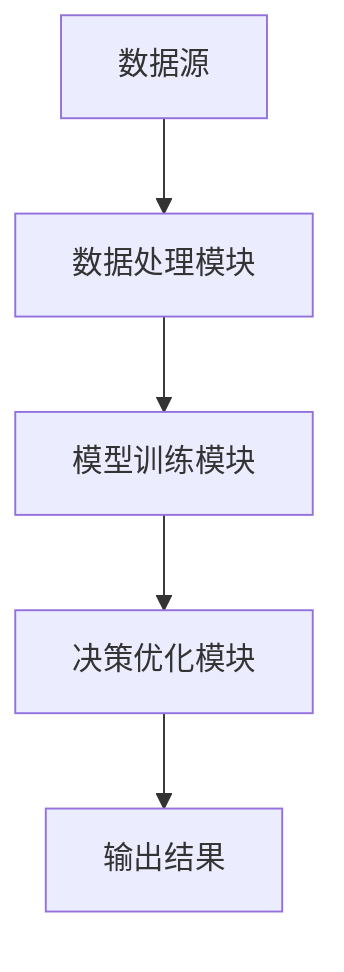

                 


# AI Agent在新药研发中的应用实践

## 关键词：AI Agent、新药研发、药物发现、临床试验、人工智能、药物设计

## 摘要：  
本文探讨AI Agent在新药研发中的应用实践，从背景、原理到具体案例，全面分析其在药物发现、临床试验等环节中的作用。通过系统分析和案例实践，揭示AI Agent如何提升新药研发效率和准确性。

---

# 第一部分: AI Agent 在新药研发中的背景与基础

## 第1章: AI Agent 的基本概念与新药研发背景

### 1.1 AI Agent 的基本概念

#### 1.1.1 AI Agent 的定义与核心特征  
AI Agent（人工智能代理）是一种能够感知环境、自主决策并执行任务的智能体。其核心特征包括：  
- **自主性**：无需外部干预，自主完成任务。  
- **反应性**：能实时感知环境变化并做出响应。  
- **目标导向性**：以特定目标为导向，优化行动路径。  

#### 1.1.2 AI Agent 的分类与应用场景  
AI Agent 可分为：  
1. **简单反射型**：基于预设规则执行任务。  
2. **基于模型的反应型**：利用内部模型分析环境并决策。  
3. **目标驱动型**：以目标为导向，优化行动策略。  
4. **效用驱动型**：通过效用函数评估行动的最优性。  

其应用场景包括：  
- 自动化任务执行。  
- 复杂环境下的决策优化。  
- 数据驱动的模式识别与预测。  

#### 1.1.3 AI Agent 在新药研发中的潜力  
AI Agent 可通过分析海量生物数据，优化药物设计流程，提高研发效率和精准度。

---

### 1.2 新药研发的挑战与痛点

#### 1.2.1 药物研发的复杂性与高成本  
新药研发周期长、成本高，传统方法效率低下。  

#### 1.2.2 传统药物研发的瓶颈  
- 数据量庞大，难以高效处理。  
- 分子设计复杂，人工干预过多。  
- 临床试验设计优化难度大。  

#### 1.2.3 AI 技术在药物研发中的优势  
- 提高数据处理效率。  
- 优化分子设计流程。  
- 智能化临床试验设计与优化。  

---

### 1.3 AI Agent 在新药研发中的应用前景

#### 1.3.1 AI Agent 在药物发现中的角色  
- **分子设计与筛选**：AI Agent 可通过机器学习模型预测分子活性，优化药物候选。  
- **药物靶点预测**：基于生物数据，AI Agent 可预测潜在药物靶点。  
- **知识图谱构建**：整合多源数据，构建药物研发的知识图谱。  

#### 1.3.2 AI Agent 在临床试验中的潜在应用  
- **临床试验设计优化**：AI Agent 可通过分析历史数据优化试验设计。  
- **患者招募与分组**：基于患者数据，AI Agent 可优化患者招募策略。  
- **数据分析与结果预测**：AI Agent 可辅助分析临床数据，预测试验结果。  

#### 1.3.3 AI Agent 在药物研发中的未来趋势  
- 更智能化的药物设计流程。  
- 更高效的临床试验优化。  
- 更广泛的应用场景拓展。  

---

## 第2章: 新药研发的核心流程与 AI Agent 的结合

### 2.1 新药研发的流程概述

#### 2.1.1 药物发现阶段  
- **分子设计与筛选**：通过AI Agent 进行分子活性预测。  
- **药物靶点预测**：基于生物数据预测潜在靶点。  

#### 2.1.2 药物开发阶段  
- **药代动力学分析**：AI Agent 可优化药物代谢路径。  
- **毒理学评估**：通过AI Agent 进行毒性预测。  

#### 2.1.3 临床试验阶段  
- **临床试验设计优化**：AI Agent 可辅助设计最优试验方案。  
- **患者招募与分组**：基于AI Agent 分析患者数据，优化分组策略。  

---

### 2.2 AI Agent 在药物发现中的应用

#### 2.2.1 分子设计与筛选  
- AI Agent 可通过机器学习模型预测分子活性，优化药物候选。  
- **案例**：利用深度学习模型设计新型抗生素。  

#### 2.2.2 药物靶点预测  
- AI Agent 可基于基因组数据预测潜在药物靶点。  
- **案例**：预测新冠病毒的潜在靶点。  

#### 2.2.3 数据挖掘与知识图谱构建  
- AI Agent 可整合多源数据，构建药物研发的知识图谱。  
- **工具**：使用图神经网络进行知识推理。  

---

### 2.3 AI Agent 在临床试验中的应用

#### 2.3.1 临床试验设计优化  
- AI Agent 可通过分析历史数据优化试验设计。  
- **工具**：基于强化学习的优化算法。  

#### 2.3.2 患者招募与分组  
- AI Agent 可基于患者数据优化招募策略。  
- **案例**：优化罕见病临床试验的患者招募。  

#### 2.3.3 数据分析与结果预测  
- AI Agent 可辅助分析临床数据，预测试验结果。  
- **工具**：基于时间序列分析的预测模型。  

---

## 第3章: AI Agent 的核心算法与数学模型

### 3.1 基于机器学习的 AI Agent

#### 3.1.1 机器学习的基本原理  
- **监督学习**：通过标注数据训练模型，预测新数据。  
- **无监督学习**：通过数据聚类分析，发现潜在模式。  

#### 3.1.2 监督学习与无监督学习在 AI Agent 中的应用  
- **监督学习**：用于分类和回归任务。  
- **无监督学习**：用于聚类和降维任务。  

#### 3.1.3 深度学习模型在药物研发中的应用  
- **卷积神经网络（CNN）**：用于图像识别任务。  
- **循环神经网络（RNN）**：用于序列数据分析。  
- **生成对抗网络（GAN）**：用于分子生成任务。  

---

### 3.2 基于强化学习的 AI Agent

#### 3.2.1 强化学习的基本原理  
- **状态**：环境中的当前情况。  
- **动作**：AI Agent 的决策行为。  
- **奖励**：对决策的反馈，用于优化策略。  

#### 3.2.2 强化学习在药物研发中的应用  
- **分子优化**：通过强化学习优化分子结构。  
- **临床试验优化**：通过强化学习优化试验设计。  

#### 3.2.3 强化学习算法的数学模型  
- **Q-learning**：通过 Q 值更新优化策略。  
- **Deep Q-Networks (DQN)**：结合深度学习的强化学习算法。  

---

## 第4章: AI Agent 在新药研发中的系统分析与架构设计

### 4.1 系统架构设计

#### 4.1.1 系统功能模块  
- **数据处理模块**：负责数据预处理和特征提取。  
- **模型训练模块**：负责训练机器学习模型。  
- **决策优化模块**：负责优化AI Agent 的决策策略。  

#### 4.1.2 系统架构图  


#### 4.1.3 系统接口设计  
- **输入接口**：接收药物研发数据。  
- **输出接口**：输出AI Agent 的决策结果。  

---

## 第5章: AI Agent 在新药研发中的项目实战

### 5.1 项目环境安装

#### 5.1.1 安装Python环境  
```bash
python --version
pip install numpy
pip install pandas
pip install scikit-learn
```

#### 5.1.2 安装深度学习框架  
```bash
pip install tensorflow
pip install keras
pip install pytorch
```

---

### 5.2 核心代码实现

#### 5.2.1 分子活性预测模型
```python
import numpy as np
from sklearn import svm

# 加载数据
data = np.loadtxt('molecule_data.csv', delimiter=',')
X = data[:, :-1]
y = data[:, -1]

# 训练模型
model = svm.SVC()
model.fit(X, y)

# 预测结果
new_molecule = np.array([[1, 2, 3, 4]])
print(model.predict(new_molecule))
```

#### 5.2.2 药物靶点预测模型
```python
import torch
import torch.nn as nn

class DrugTargetPredictor(nn.Module):
    def __init__(self, input_size, hidden_size, output_size):
        super(DrugTargetPredictor, self).__init__()
        self.fc1 = nn.Linear(input_size, hidden_size)
        self.fc2 = nn.Linear(hidden_size, output_size)
        self.relu = nn.ReLU()

    def forward(self, x):
        out = self.fc1(x)
        out = self.relu(out)
        out = self.fc2(out)
        return out

# 初始化模型
input_size = 10
hidden_size = 20
output_size = 5
model = DrugTargetPredictor(input_size, hidden_size, output_size)
```

---

### 5.3 项目小结

#### 5.3.1 项目总结  
通过本项目，我们展示了AI Agent 在药物研发中的实际应用，包括分子活性预测和药物靶点预测。  

#### 5.3.2 项目优化建议  
- 提高模型的泛化能力。  
- 优化数据预处理流程。  
- 增强模型的解释性。  

---

## 第6章: AI Agent 在新药研发中的最佳实践与未来展望

### 6.1 最佳实践

#### 6.1.1 数据质量的重要性  
确保数据的准确性和完整性。  

#### 6.1.2 模型可解释性  
选择具有可解释性的模型，便于分析和优化。  

#### 6.1.3 持续优化  
定期更新模型，适应新数据和新需求。  

---

### 6.2 小结与未来展望

#### 6.2.1 小结  
AI Agent 在新药研发中的应用前景广阔，能够显著提升研发效率和精准度。  

#### 6.2.2 未来展望  
- 更智能化的药物设计流程。  
- 更高效的临床试验优化。  
- 更广泛的应用场景拓展。  

---

## 作者：AI天才研究院 & 禅与计算机程序设计艺术  
**作者简介**：我们是一群专注于人工智能与计算机程序设计的专家，致力于探索AI技术在药物研发中的创新应用，推动科技与医学的融合进步。

