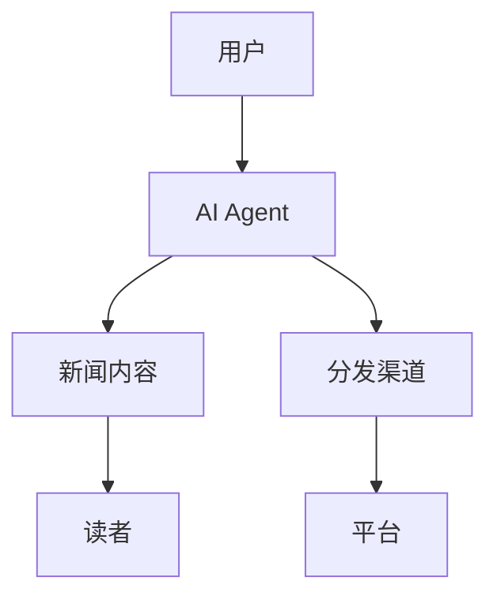
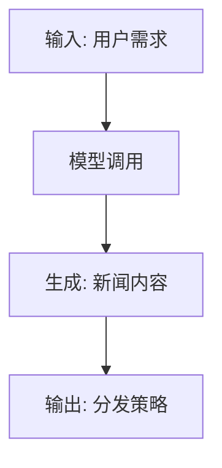

                 


# AI Agent在新闻媒体中的应用：自动写作与内容分发

## 关键词：AI Agent, 自动写作, 内容分发, 新闻媒体, 大语言模型, 智能分发

## 摘要：本文探讨AI Agent在新闻媒体中的应用，重点分析自动写作与内容分发的技术实现。通过背景介绍、核心概念、算法原理、系统架构、项目实战和最佳实践，详细阐述AI Agent如何提升新闻生成效率和分发效果。

---

## 第一部分: AI Agent在新闻媒体中的应用概述

### 第1章: 背景介绍

#### 1.1 AI Agent与新闻媒体的背景
- **1.1.1 AI Agent的定义与特点**  
  AI Agent是一种智能体，能够理解上下文、执行任务和优化结果。其特点包括自主性、反应性、目标导向和学习能力。

- **1.1.2 新闻媒体行业的现状与挑战**  
  新闻行业面临内容生产效率低、分发渠道多样化的挑战，AI Agent提供了解决方案。

- **1.1.3 AI Agent在新闻媒体中的应用背景**  
  AI Agent通过自动化生成和分发内容，提高新闻生产的效率和精准度。

#### 1.2 问题背景与描述
- **1.2.1 新闻内容生成的痛点**  
  传统新闻生产耗时长，效率低，难以满足海量需求。

- **1.2.2 内容分发的效率瓶颈**  
  分发渠道众多，用户需求多样，分发效率低下。

- **1.2.3 AI Agent如何解决问题**  
  AI Agent通过自动化生成和智能分发，解决新闻生产和分发的效率问题。

#### 1.3 问题解决与边界
- **1.3.1 AI Agent在新闻写作中的应用范围**  
  包括新闻标题生成、正文创作和编辑辅助。

- **1.3.2 AI Agent在内容分发中的边界**  
  专注于内容推荐和个性化分发，不涉及用户隐私和敏感内容。

- **1.3.3 核心要素与概念结构**  
  核心要素包括用户需求、内容生成、分发策略和反馈优化。

---

### 第2章: 核心概念与联系

#### 2.1 AI Agent的核心概念
- **2.1.1 AI Agent的基本原理**  
  AI Agent通过自然语言处理和机器学习技术，生成和分发新闻内容。

- **2.1.2 大语言模型在新闻写作中的应用**  
  大语言模型如GPT-3，能够生成高质量的新闻内容。

- **2.1.3 内容分发的智能化流程**  
  AI Agent根据用户行为分析，优化内容分发策略。

#### 2.2 核心概念之间的联系
- **2.2.1 AI Agent与新闻内容生成的关系**  
  AI Agent驱动内容生成，提高生产效率。

- **2.2.2 内容分发与用户行为分析的关联**  
  分发策略基于用户行为，提升内容到达率。

- **2.2.3 系统架构的核心要素**  
  包括生成模块、分发模块和反馈优化模块。

#### 2.3 核心概念属性特征对比表
- **表2-1: AI Agent与传统新闻生成工具的对比**

| 特性                | AI Agent                     | 传统新闻生成工具             |
|---------------------|------------------------------|------------------------------|
| 自动化程度          | 高                           | 低                           |
| 内容质量            | 高                           | 中                           |
| 生成速度            | 快                           | 慢                           |
| 适应性              | 强                           | 弱                           |

#### 2.4 ER实体关系图
- **图2-1: AI Agent在新闻媒体中的实体关系图**


---

### 第3章: 算法原理讲解

#### 3.1 生成式AI的算法原理
- **3.1.1 大语言模型的训练过程**  
  使用监督学习和无监督学习，训练模型理解和生成文本。

- **3.1.2 文本生成的推理机制**  
  基于上下文和目标，生成相关文本。

- **3.1.3 基于上下文的理解算法**  
  使用注意力机制和Transformer架构，提高文本理解能力。

#### 3.2 算法流程图


#### 3.3 算法实现
- **3.3.1 训练过程代码示例**
  ```python
  import torch
  import torch.nn as nn

  class GPT(nn.Module):
      def __init__(self, vocab_size, embedding_dim):
          super(GPT, self).__init__()
          self.embedding = nn.Embedding(vocab_size, embedding_dim)
          self.transformer = nn.Transformer(embedding_dim, embedding_dim)
          self.decoder = nn.Linear(embedding_dim, vocab_size)

      def forward(self, input_ids):
          embed = self.embedding(input_ids)
          output = self.transformer(embed, embed)
          logits = self.decoder(output)
          return logits
  ```

- **3.3.2 推理机制代码示例**
  ```python
  def generate_article(model, tokenizer, max_length=500):
      input_ids = torch.tensor([tokenizer.encode("最新新闻：")], dtype=torch.long)
      output = model.generate(input_ids, max_length=max_length, temperature=0.7)
      article = tokenizer.decode(output[0])
      return article
  ```

#### 3.4 数学模型和公式
- **3.4.1 概率分布模型**  
  $$ P(y|x) = \frac{P(y|x, z)}{E_z[P(z)]} $$
  
- **3.4.2 损失函数**  
  $$ \text{Loss} = -\sum_{i=1}^{n} \log P(y_i|x_{<i}) $$

---

### 第4章: 数学公式与模型推导

#### 4.1 生成模型的数学基础
- **4.1.1 概率生成模型**  
  使用大语言模型生成新闻内容的概率分布。

- **4.1.2 解码器的数学表达**  
  $$ y_{i} = \argmax_{y} P(y|x_{<i}) $$

- **4.1.3 注意力机制公式**  
  $$ \alpha_i = \frac{\exp(e_i)}{\sum_{j} \exp(e_j)} $$
  
  其中，$$ e_i = \text{similarity}(x_i, y_{i-1}) $$

#### 4.2 分发模型的数学推导
- **4.2.1 用户行为建模**  
  $$ P(u|c) = \frac{P(u, c)}{P(c)} $$

- **4.2.2 分发策略优化**  
  $$ \theta^* = \argmax_{\theta} \sum_{u} \log P(u|\theta) $$

---

### 第5章: 系统分析与架构设计

#### 5.1 问题场景介绍
- 新闻媒体的自动化生产与分发需求。

#### 5.2 系统功能设计
- **5.2.1 领域模型**  
  ```mermaid
  classDiagram
      class 新闻生成模块 {
          generate_title()
          generate_body()
      }
      class 分发管理模块 {
          distribute_content()
          track_performance()
      }
      新闻生成模块 --> 新闻内容
      分发管理模块 --> 分发渠道
  ```

- **5.2.2 系统架构设计**  
  ```mermaid
  architecture
      User --> AI Agent
      AI Agent --> News Generation
      News Generation --> News Database
      AI Agent --> Distribution Strategy
      Distribution Strategy --> News Channels
  ```

- **5.2.3 接口设计和交互流程图**  
  ```mermaid
  sequenceDiagram
      用户 --> AI Agent: 提供新闻主题
      AI Agent --> 新闻生成模块: 生成新闻
      新闻生成模块 --> 新闻分发模块: 分发新闻
      新闻分发模块 --> 用户: 接收新闻
  ```

---

### 第6章: 项目实战

#### 6.1 环境安装
- 安装必要的库：`torch`, `transformers`, `scikit-learn`.

#### 6.2 系统核心实现
- **6.2.1 新闻生成模块实现**
  ```python
  from transformers import GPT2LMHeadModel, GPT2Tokenizer

  model = GPT2LMHeadModel.from_pretrained('gpt2')
  tokenizer = GPT2Tokenizer.from_pretrained('gpt2')

  def generate_article(topic):
      input = f"Write a news article about {topic}."
      tokens = tokenizer.encode(input, return_tensors='pt')
      outputs = model.generate(tokens, max_length=500)
      article = tokenizer.decode(outputs[0])
      return article
  ```

- **6.2.2 分发管理模块实现**
  ```python
  import requests

  def distribute_article(article, audience):
      payload = {
          'article': article,
          'audience': audience
      }
      response = requests.post('http://newsistributor.com/api', json=payload)
      return response.json()
  ```

#### 6.3 案例分析
- **案例1**: 使用AI Agent生成一篇关于“气候变化”的新闻文章。
- **案例2**: 根据用户反馈优化分发策略，提高用户点击率。

#### 6.4 项目小结
- AI Agent显著提高了新闻生成和分发的效率，但仍需处理内容准确性和伦理问题。

---

### 第7章: 最佳实践与展望

#### 7.1 最佳实践
- 定期优化模型，保持内容质量。
- 结合人工审核，确保内容准确性。
- 根据用户反馈，动态调整分发策略。

#### 7.2 未来展望
- 更加智能化的内容生成，如多模态新闻。
- 更精准的用户行为分析，提升分发效果。
- 可解释性增强，确保透明和可信。

---

## 作者：AI天才研究院 / AI Genius Institute & 禅与计算机程序设计艺术 / Zen And The Art of Computer Programming

---

**本文通过详细分析AI Agent在新闻媒体中的应用，展示了其在自动写作与内容分发中的巨大潜力。从背景介绍到系统实现，再到项目实战，全面解析了AI Agent的技术细节和实际应用。未来，随着技术的进步，AI Agent将在新闻媒体中发挥更重要的作用，推动行业迈向智能化和高效化。**

