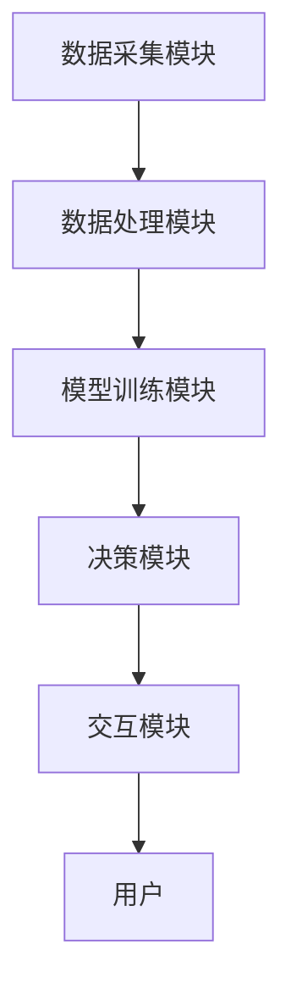
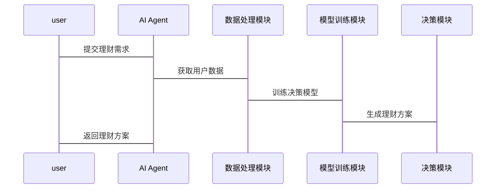

                 


# AI Agent在智能个人理财中的角色

## 关键词：AI Agent, 智能理财, 风险管理, 投资组合, 机器学习

## 摘要：  
本文探讨了AI Agent在智能个人理财中的角色，分析了其核心技术与原理，详细阐述了其在风险评估、投资组合管理、财务规划等场景中的应用，并通过系统架构设计与项目实战，展示了AI Agent如何助力个人理财的智能化与个性化。文章最后提出了优化与展望，为未来的研究与实践提供了方向。

---

# 第1章: AI Agent与智能个人理财的背景与概念

## 1.1 AI Agent的基本概念
### 1.1.1 AI Agent的定义与特点  
AI Agent（人工智能代理）是指能够感知环境、自主决策并执行任务的智能实体。其特点包括：  
- **自主性**：能够自主决策，无需人工干预。  
- **反应性**：能够实时感知环境并做出反应。  
- **学习能力**：通过数据与反馈不断优化自身能力。  

### 1.1.2 AI Agent的核心功能与能力  
AI Agent的核心功能包括：  
- 数据采集与处理  
- 智能决策与推理  
- 自然语言交互  

### 1.1.3 AI Agent与传统计算机程序的区别  
AI Agent的核心区别在于其具备感知环境和自主决策的能力，能够根据动态变化的环境调整行为，而传统程序仅基于预设规则执行任务。

---

## 1.2 智能个人理财的定义与特点
### 1.2.1 个人理财的基本概念  
个人理财是指个人或家庭通过科学的财务规划，实现资产保值、增值的目标。  

### 1.2.2 智能理财的核心要素  
智能理财的核心要素包括：  
- 数据驱动  
- 自动化决策  
- 个性化服务  

### 1.2.3 智能理财与传统理财的区别  
智能理财通过AI技术实现自动化与个性化服务，而传统理财依赖人工服务，效率较低且难以满足个性化需求。

---

## 1.3 AI Agent在智能个人理财中的角色
### 1.3.1 AI Agent在智能理财中的应用场景  
- 风险评估与管理  
- 投资组合优化  
- 财务规划与建议  

### 1.3.2 AI Agent的核心优势与价值  
- 提高效率：通过自动化处理海量数据，快速生成理财方案。  
- 个性化服务：基于用户需求与市场变化，提供定制化建议。  
- 持续优化：通过机器学习不断优化决策模型。  

### 1.3.3 AI Agent在智能理财中的发展趋势  
随着AI技术的不断进步，AI Agent在智能理财中的应用将更加广泛，从辅助决策到完全自动化服务的方向发展。

---

# 第2章: AI Agent的核心技术与原理

## 2.1 自然语言处理技术
### 2.1.1 NLP的基本概念与原理  
自然语言处理（NLP）是让计算机理解与生成人类语言的技术。其核心流程包括：  
1. **分词**：将文本分割为词语或短语。  
2. **词性标注**：为每个词语标注其词性。  
3. **句法分析**：分析句子的语法结构。  
4. **语义理解**：提取文本中的语义信息。  

### 2.1.2 NLP在智能理财中的应用  
- 用户需求分析：通过解析用户的语言，理解其理财需求。  
- 文档分析：分析财务报表、市场报告等文本数据。  

### 2.1.3 常用NLP模型与工具  
- **预训练模型**：如BERT、GPT等。  
- **工具库**：如spaCy、NLTK等。

---

## 2.2 机器学习与深度学习
### 2.2.1 机器学习的基本概念与原理  
机器学习（ML）是通过数据训练模型，使其具备特定任务的决策能力。其核心流程包括：  
1. 数据采集与预处理。  
2. 模型训练与优化。  
3. 模型评估与部署。  

### 2.2.2 深度学习的核心算法与模型  
- **神经网络**：如卷积神经网络（CNN）、循环神经网络（RNN）。  
- **深度学习框架**：如TensorFlow、PyTorch。  

### 2.2.3 机器学习在智能理财中的应用  
- 风险评估：基于历史数据训练模型，预测投资风险。  
- 投资组合优化：通过算法优化资产配置。  

---

## 2.3 知识图谱与推理
### 2.3.1 知识图谱的基本概念与构建方法  
知识图谱是一种结构化的知识表示方式，通常以实体-关系-实体的形式构建。  

### 2.3.2 知识图谱在智能理财中的应用  
- 实体关系分析：分析市场趋势、公司关系等。  
- 知识推理：基于知识图谱进行逻辑推理，辅助决策。  

### 2.3.3 基于知识图谱的推理与决策  
通过知识图谱的推理能力，AI Agent能够从海量数据中提取隐含信息，辅助制定最优理财策略。

---

# 第3章: AI Agent在智能个人理财中的应用场景

## 3.1 风险评估与管理
### 3.1.1 风险评估的基本原理  
风险评估是通过分析潜在风险因素，量化风险程度的过程。  

### 3.1.2 AI Agent在风险评估中的应用  
- 数据采集与清洗：收集市场数据、用户信息等。  
- 风险建模：基于机器学习算法构建风险评估模型。  
- 风险预警：实时监控市场变化，及时发出预警。  

### 3.1.3 风险管理的策略与优化  
通过AI Agent的实时监控与优化算法，实现风险的动态管理。

---

## 3.2 投资组合管理
### 3.2.1 投资组合管理的基本概念  
投资组合管理是通过优化资产配置，实现收益与风险的平衡。  

### 3.2.2 AI Agent在投资组合管理中的应用  
- 数据分析：分析市场趋势、资产价格波动等。  
- 算法优化：基于遗传算法、粒子群优化等算法优化投资组合。  
- 动态调整：根据市场变化实时调整投资策略。  

---

## 3.3 财务规划与建议
### 3.3.1 财务规划的基本原理  
财务规划是根据个人的财务状况与目标，制定合理的财务计划。  

### 3.3.2 AI Agent在财务规划中的应用  
- 用户需求分析：通过NLP技术理解用户需求。  
- 财务模型构建：基于机器学习算法构建财务规划模型。  
- 个性化建议：根据用户需求与市场变化，提供定制化财务建议。  

---

# 第4章: AI Agent的系统架构与技术实现

## 4.1 系统架构设计
### 4.1.1 系统模块划分  
AI Agent系统通常包括以下几个模块：  
- **数据采集模块**：负责采集用户数据与市场数据。  
- **数据处理模块**：对数据进行清洗、转换与分析。  
- **模型训练模块**：基于数据训练机器学习模型。  
- **决策模块**：根据模型输出制定决策。  
- **交互模块**：与用户进行自然语言交互。  

### 4.1.2 系统架构图  


---

## 4.2 数据流设计
### 4.2.1 数据采集与预处理  
- 数据源：用户数据（收入、支出、资产等）、市场数据（股票价格、经济指标等）。  
- 数据预处理：清洗、去重、标准化等。  

### 4.2.2 数据分析与建模  
- 数据分析：使用统计方法与机器学习算法分析数据。  
- 模型训练：基于训练数据训练AI Agent的决策模型。  

---

## 4.3 算法实现
### 4.3.1 风险评估算法  
- 算法流程：  
  1. 数据预处理。  
  2. 训练风险评估模型（如随机森林、逻辑回归）。  
  3. 预测风险等级。  

### 4.3.2 投资组合优化算法  
- 算法流程：  
  1. 数据采集与清洗。  
  2. 构建投资组合优化模型（如均值-方差模型）。  
  3. 优化投资组合。  

---

## 4.4 交互流程设计
### 4.4.1 用户交互流程  
1. 用户输入需求。  
2. AI Agent解析需求。  
3. AI Agent生成理财方案。  
4. 用户确认或调整方案。  

### 4.4.2 交互序列图  


---

# 第5章: 项目实战

## 5.1 环境配置
- **工具安装**：安装Python、TensorFlow、NLTK等工具。  
- **数据源**：获取用户数据与市场数据。  

---

## 5.2 核心代码实现
### 5.2.1 数据预处理代码  
```python
import pandas as pd

# 读取数据
data = pd.read_csv('finance_data.csv')

# 数据清洗
data.dropna(inplace=True)
data = data[~data.duplicated()]
```

### 5.2.2 风险评估模型实现  
```python
from sklearn.ensemble import RandomForestClassifier

# 训练模型
model = RandomForestClassifier()
model.fit(X_train, y_train)

# 预测风险等级
y_pred = model.predict(X_test)
```

---

## 5.3 案例分析与优化
### 5.3.1 案例分析  
- **案例背景**：用户A，30岁，收入稳定，希望实现资产增值。  
- **AI Agent建议**：投资组合配置为60%股票、30%债券、10%现金。  

### 5.3.2 算法优化  
- **参数优化**：调整随机森林模型的参数，提高预测精度。  
- **模型优化**：引入深度学习模型（如LSTM）进行时间序列预测。  

---

## 5.4 项目小结
通过项目实战，我们验证了AI Agent在智能理财中的可行性与有效性。同时，也发现了数据质量、模型优化等方面的改进空间。

---

# 第6章: 优化与展望

## 6.1 系统性能优化
- **数据优化**：提高数据采集的实时性与准确性。  
- **算法优化**：引入更先进的机器学习算法，如图神经网络。  

## 6.2 未来发展方向
- **生成式AI的应用**：利用生成式AI生成个性化的理财报告。  
- **多模态交互**：结合视觉、语音等多种交互方式，提升用户体验。  

## 6.3 实际应用中的注意事项
- **数据隐私**：确保用户数据的安全性与隐私性。  
- **模型解释性**：提高AI Agent决策的透明度，便于用户理解。  

---

# 第7章: 总结与展望

## 7.1 总结
本文详细探讨了AI Agent在智能个人理财中的角色，从技术原理到应用场景，再到系统实现，全面分析了其在智能理财中的价值与潜力。  

## 7.2 展望
随着AI技术的不断进步，AI Agent在智能理财中的应用将更加广泛与深入。未来的研究方向包括：  
- 更智能的交互方式。  
- 更高效的决策算法。  
- 更广泛的应用场景。  

---

# 作者：AI天才研究院 & 禅与计算机程序设计艺术

---

**感谢您的阅读！希望本文能为AI Agent在智能个人理财中的研究与实践提供有价值的参考与启发！**

