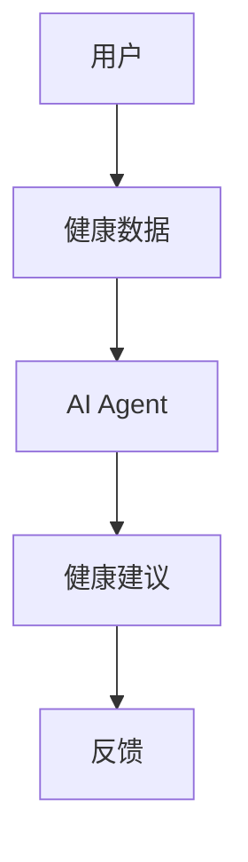
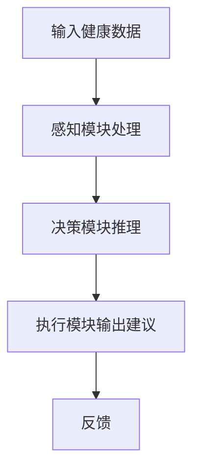
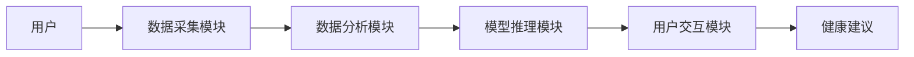

                 


# AI Agent在智能个性化健康建议中的应用

> 关键词：AI Agent、个性化健康建议、机器学习、自然语言处理、健康数据分析

> 摘要：AI Agent作为一种智能代理，通过结合机器学习、自然语言处理和数据分析等技术，能够在个性化健康建议领域发挥重要作用。本文将从AI Agent的核心概念、算法原理、系统架构设计到项目实战等方面，全面探讨其在智能个性化健康建议中的应用，并结合实际案例和代码示例，深入剖析其技术实现和应用场景。

---

# 第一部分: AI Agent在智能个性化健康建议中的背景概述

## 第1章: AI Agent与个性化健康建议的背景概述

### 1.1 AI Agent的基本概念

#### 1.1.1 AI Agent的定义
AI Agent（人工智能代理）是指能够感知环境、自主决策并执行任务的智能实体。它可以是一个软件程序或系统，通过数据输入、算法处理和输出建议或操作来实现特定目标。

#### 1.1.2 AI Agent的核心特征
- **自主性**：能够在没有人工干预的情况下独立运行。
- **反应性**：能够根据环境变化实时调整行为。
- **目标导向**：以明确的目标为导向，优化决策过程。

#### 1.1.3 AI Agent与传统算法的区别
| 特性 | AI Agent | 传统算法 |
|------|----------|----------|
| 决策方式 | 自主决策 | 确定性或概率性 |
| 学习能力 | 可以通过数据学习优化 | 通常不具有自适应性 |
| 交互能力 | 支持与环境或用户的交互 | 通常是单向执行 |

### 1.2 个性化健康建议的背景与意义

#### 1.2.1 个性化健康建议的需求背景
随着人们对健康关注度的提高，个性化健康建议的需求日益增长。传统的通用健康建议无法满足个体差异化的健康需求，因此需要借助AI技术实现精准化和个性化的健康指导。

#### 1.2.2 个性化健康建议的核心目标
- 提供基于个人健康数据的个性化建议。
- 实现实时健康监测与预警。
- 优化健康行为，促进用户健康目标的实现。

#### 1.2.3 AI Agent在个性化健康建议中的作用
AI Agent能够通过整合用户的健康数据（如饮食、运动、睡眠等），结合机器学习模型，提供实时、个性化的健康建议，并通过自然语言处理技术与用户进行交互。

### 1.3 本章小结
本章介绍了AI Agent的基本概念及其在个性化健康建议中的作用，为后续内容奠定了基础。

---

# 第二部分: AI Agent的核心概念与原理

## 第2章: AI Agent的核心概念与联系

### 2.1 AI Agent的核心概念

#### 2.1.1 感知模块
**感知模块**负责从环境中获取数据，例如用户的健康数据（如心率、血压、运动数据等）。这些数据是AI Agent进行后续决策的基础。

#### 2.1.2 决策模块
**决策模块**基于感知模块获取的数据，结合预训练的机器学习模型，生成健康建议。例如，根据用户的运动数据和饮食习惯，建议调整运动计划或饮食结构。

#### 2.1.3 执行模块
**执行模块**负责将决策模块生成的建议以用户友好的形式输出，例如通过APP或智能设备向用户推送健康建议或提醒。

### 2.2 AI Agent与个性化健康建议的关系

#### 2.2.1 个性化健康建议的输入要素
- 用户的基本信息（年龄、性别、体重等）。
- 用户的健康数据（运动数据、饮食记录、睡眠质量等）。
- 用户的健康目标（减重、增肌、改善睡眠等）。

#### 2.2.2 AI Agent如何处理健康数据
AI Agent通过感知模块获取数据后，利用机器学习算法对数据进行分析和建模，生成个性化的健康建议。

#### 2.2.3 AI Agent输出健康建议的逻辑
1. 数据采集与预处理。
2. 数据特征提取。
3. 模型训练与推理。
4. 生成健康建议并输出。

### 2.3 核心概念对比表
| 概念 | 描述 |
|------|------|
| 感知模块 | 数据采集与分析 |
| 决策模块 | 算法推理与决策 |
| 执行模块 | 建议输出与反馈 |

### 2.4 ER实体关系图


---

## 第3章: AI Agent的算法原理

### 3.1 算法原理概述

#### 3.1.1 感知模块的算法
感知模块主要负责数据的采集与预处理。例如，使用时间序列分析对用户的运动数据进行处理。

#### 3.1.2 决策模块的算法
决策模块通常采用监督学习或无监督学习算法。例如，使用随机森林或神经网络模型对用户的健康数据进行分类或回归分析。

#### 3.1.3 执行模块的算法
执行模块主要负责将健康建议以用户友好的形式输出。例如，使用自然语言处理技术生成个性化的健康建议文本。

### 3.2 算法流程图


### 3.3 数学模型与公式

#### 3.3.1 概率模型
贝叶斯定理常用于健康数据的概率分析：
$$ P(A|B) = \frac{P(B|A)P(A)}{P(B)} $$

#### 3.3.2 损失函数
在训练机器学习模型时，通常使用交叉熵损失函数：
$$ L = -\frac{1}{n}\sum_{i=1}^{n} y_i \log(p_i) + (1 - y_i)\log(1 - p_i) $$

---

## 第4章: AI Agent的系统架构设计

### 4.1 系统架构概述

#### 4.1.1 系统功能设计
- 数据采集模块：负责采集用户的健康数据。
- 数据分析模块：对健康数据进行处理和分析。
- 模型推理模块：基于机器学习模型生成健康建议。
- 用户交互模块：与用户进行健康建议的交互。

#### 4.1.2 系统架构图


### 4.2 系统接口设计

#### 4.2.1 数据接口
- 数据输入接口：用于接收用户的健康数据。
- 数据输出接口：用于输出健康建议。

#### 4.2.2 API设计
- 接收健康数据的API。
- 返回健康建议的API。

---

## 第5章: AI Agent的项目实战

### 5.1 环境安装与配置

#### 5.1.1 安装Python环境
```bash
python --version
pip install -r requirements.txt
```

#### 5.1.2 安装机器学习库
```bash
pip install numpy scikit-learn tensorflow
```

### 5.2 系统核心实现源代码

#### 5.2.1 数据预处理代码
```python
import pandas as pd
import numpy as np

# 读取健康数据
data = pd.read_csv('health_data.csv')

# 数据清洗
data.dropna(inplace=True)
data = pd.get_dummies(data)
```

#### 5.2.2 模型训练代码
```python
from sklearn.model import RandomForestClassifier
from tensorflow.keras import Sequential
from tensorflow.keras.layers import Dense

# 初始化随机森林模型
rf_model = RandomForestClassifier(n_estimators=100, random_state=42)
rf_model.fit(X_train, y_train)

# 初始化神经网络模型
nn_model = Sequential()
nn_model.add(Dense(64, activation='relu', input_dim=X_train.shape[1]))
nn_model.add(Dense(1, activation='sigmoid'))
nn_model.compile(optimizer='adam', loss='binary_crossentropy', metrics=['accuracy'])
nn_model.fit(X_train, y_train, epochs=10, batch_size=32)
```

#### 5.2.3 生成健康建议代码
```python
def generate_health_advice(user_data):
    # 预测健康建议
    prediction = model.predict(user_data)
    # 返回建议文本
    return "建议增加每天运动量至30分钟"

# 示例调用
user_data = ...  # 用户数据
advice = generate_health_advice(user_data)
print(advice)
```

### 5.3 实际案例分析
通过实际案例分析，展示AI Agent在个性化健康建议中的应用场景。例如，用户输入健康数据后，系统根据数据生成个性化的运动计划和饮食建议。

---

## 第6章: 最佳实践与注意事项

### 6.1 最佳实践
- 数据隐私保护：确保用户数据的安全性和隐私性。
- 模型可解释性：提升模型的可解释性，便于用户理解健康建议的依据。
- 持续优化：定期更新模型和算法，提升健康建议的准确性和实用性。

### 6.2 小结
本文从AI Agent的核心概念、算法原理到系统架构设计，全面探讨了其在智能个性化健康建议中的应用，并通过实际案例展示了其技术实现。

### 6.3 注意事项
- 数据来源的准确性。
- 模型的泛化能力。
- 用户交互的友好性。

---

# 结语

AI Agent在智能个性化健康建议中的应用前景广阔，通过不断优化算法和系统设计，未来将能够为用户提供更加精准和个性化的健康指导。

---

# 作者：AI天才研究院/AI Genius Institute & 禅与计算机程序设计艺术 /Zen And The Art of Computer Programming

---

通过以上目录大纲，您可以逐步展开每部分内容，深入探讨AI Agent在智能个性化健康建议中的具体应用和技术实现。

