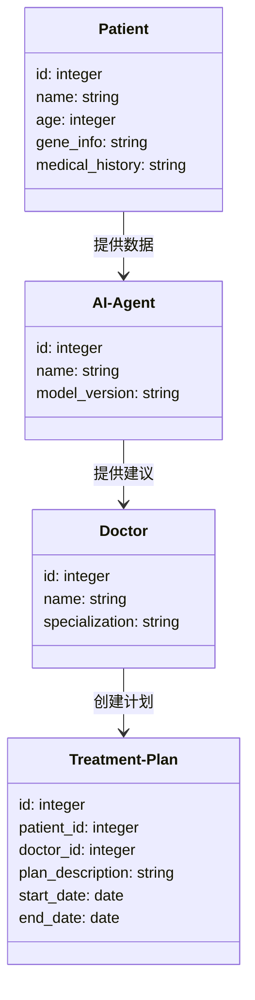
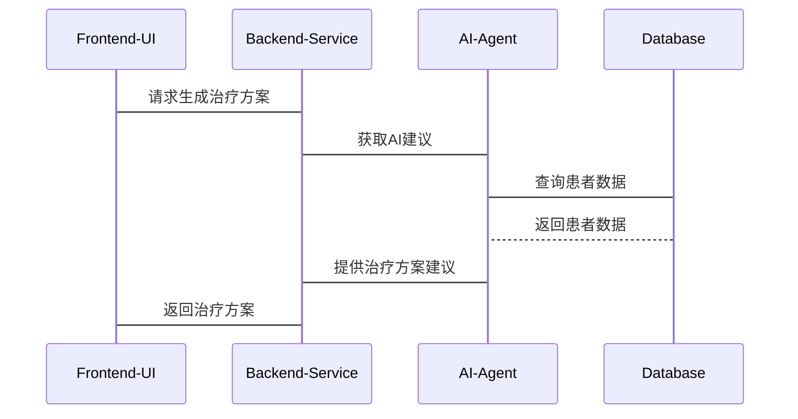

                 


# AI Agent在智能个性化医疗中的应用

## 关键词：
- AI Agent
- 智能个性化医疗
- 人工智能
- 医疗决策
- 机器学习

## 摘要：
本文探讨了AI Agent在智能个性化医疗中的应用，详细介绍了AI Agent的核心概念、算法原理、系统架构以及实际应用场景。通过分析AI Agent在个性化医疗中的作用，结合具体案例，展示了AI Agent如何通过数据驱动的智能决策，为患者提供精准、高效的医疗服务。本文还讨论了当前技术挑战及未来发展方向，为相关领域的研究和实践提供了参考。

---

# 第一部分: AI Agent在智能个性化医疗中的应用背景

## 第1章: AI Agent与智能个性化医疗概述

### 1.1 AI Agent的基本概念
#### 1.1.1 AI Agent的定义与特点
AI Agent（人工智能代理）是一种智能实体，能够感知环境、自主决策并执行任务。其特点包括：
- **自主性**：能够在没有外部干预的情况下运行。
- **反应性**：能够实时感知环境变化并做出反应。
- **目标导向性**：通过设定目标来优化决策。
- **学习能力**：能够通过数据和经验不断优化自身性能。

#### 1.1.2 智能个性化医疗的定义
智能个性化医疗是指根据患者个体的基因、生活习惯、病史等信息，提供定制化医疗方案的过程。其核心在于通过数据驱动的方法，实现精准诊断和治疗。

#### 1.1.3 AI Agent在智能个性化医疗中的作用
AI Agent通过分析海量医疗数据，帮助医生制定个性化治疗方案，优化医疗流程，提高诊断准确性和治疗效果。

---

### 1.2 智能个性化医疗的需求与挑战
#### 1.2.1 个性化医疗的需求背景
传统医疗模式基于通用标准，忽视了患者的个体差异。个性化医疗能够提高治疗效果，减少副作用，降低成本。

#### 1.2.2 AI Agent在医疗中的应用场景
- **疾病预测**：通过分析患者的基因和生活习惯，预测疾病风险。
- **诊断辅助**：帮助医生快速识别疾病，提高诊断准确率。
- **治疗方案优化**：根据患者的具体情况，推荐最优治疗方案。
- **药物研发**：加速新药开发，提高研发效率。

#### 1.2.3 当前医疗中的主要问题与挑战
- 数据隐私和安全问题。
- AI算法的可解释性问题。
- 医疗数据的多样性和复杂性。

---

### 1.3 AI Agent在智能个性化医疗中的应用现状
#### 1.3.1 国内外研究现状
国内外在AI Agent医疗应用方面已经取得了一些进展，但主要集中在单点技术的研究，缺乏系统性的整合。

#### 1.3.2 应用案例分析
例如，AI Agent在癌症治疗中的应用：通过分析患者的基因数据，推荐个性化化疗方案。

#### 1.3.3 技术发展趋势
未来，AI Agent将更加智能化，能够实时动态调整治疗方案，实现真正的个性化医疗。

---

## 第2章: AI Agent与个性化医疗的核心概念

### 2.1 AI Agent的核心原理
#### 2.1.1 状态感知
AI Agent通过传感器和数据源获取环境信息，如患者的生理指标、生活习惯等。

#### 2.1.2 目标设定
AI Agent根据患者的病情和目标（如延长寿命、缓解症状）设定个性化目标。

#### 2.1.3 决策与规划
AI Agent基于当前状态和目标，利用机器学习算法生成多种决策方案，并选择最优方案。

#### 2.1.4 执行与反馈
AI Agent执行决策方案，并根据反馈结果不断优化自身行为。

---

### 2.2 个性化医疗的核心要素
#### 2.2.1 基因信息
基因数据是个性化医疗的重要依据，例如癌症患者的基因突变信息。

#### 2.2.2 病理特征
患者的症状、病史等信息，帮助医生制定治疗方案。

#### 2.2.3 生活方式
饮食、运动等生活习惯会影响治疗效果。

#### 2.2.4 病史数据
患者过去的医疗记录，帮助医生了解病情变化。

---

### 2.3 AI Agent与个性化医疗的关系
#### 2.3.1 数据驱动的关联性
AI Agent通过分析海量数据，帮助医生制定个性化方案。

#### 2.3.2 智能决策的依赖性
AI Agent依赖先进的算法和模型，实现精准的医疗决策。

#### 2.3.3 人机协作的必要性
AI Agent作为辅助工具，与医生和患者协作，共同完成个性化医疗任务。

---

## 第3章: AI Agent在个性化医疗中的核心算法

### 3.1 状态表示与特征提取
#### 3.1.1 医疗数据的特征工程
通过特征工程提取有用的医疗数据，例如患者的年龄、性别、基因突变等。

#### 3.1.2 深度学习模型在特征提取
使用深度学习模型（如CNN、RNN）对医疗数据进行特征提取，生成高维特征向量。

---

### 3.2 AI Agent的决策算法
#### 3.2.1 基于Q-learning的决策算法
Q-learning是一种经典的强化学习算法，通过不断试错，找到最优决策策略。

#### 3.2.2 DQN算法的应用
DQN（Deep Q-Network）通过深度神经网络近似Q值函数，实现端到端的决策过程。

---

### 3.3 算法实现与优化
#### 3.3.1 算法实现
以下是DQN算法的伪代码：

```python
class DQN:
    def __init__(self, state_dim, action_dim):
        self.state_dim = state_dim
        self.action_dim = action_dim
        self.model = self.build_model()
    
    def build_model(self):
        model = Sequential()
        model.add(Dense(64, activation='relu', input_dim=self.state_dim))
        model.add(Dense(32, activation='relu'))
        model.add(Dense(self.action_dim, activation='linear'))
        model.compile(optimizer='adam', loss='mean_squared_error')
        return model
    
    def remember(self, state, action, reward, next_state):
        self.memory.append((state, action, reward, next_state))
    
    def act(self, state):
        q_values = self.model.predict(state)
        return np.argmax(q_values[0])
```

#### 3.3.2 算法优化
通过经验回放和目标网络等技术，优化DQN算法的性能，提高决策的准确性和效率。

---

# 第四部分: AI Agent在个性化医疗中的系统架构设计

## 第4章: 系统分析与架构设计方案

### 4.1 项目介绍
本项目旨在开发一个基于AI Agent的个性化医疗系统，帮助医生制定精准的治疗方案。

---

### 4.2 系统功能设计
#### 4.2.1 领域模型设计
以下是领域模型的Mermaid类图：



---

### 4.3 系统架构设计
以下是系统架构的Mermaid图：


---

### 4.4 系统接口设计
系统主要接口包括：
- `get_patient_info(patient_id)`：获取患者信息。
- `generate_treatment_plan(patient_id, doctor_id)`：生成治疗方案。
- `update_treatment_plan(plan_id)`：更新治疗方案。

---

### 4.5 系统交互设计
以下是系统交互的Mermaid序列图：



---

## 第5章: 项目实战

### 5.1 环境安装
安装必要的开发工具和库：
```bash
pip install numpy pandas tensorflow-keras scikit-learn mermaid4jupyter
```

---

### 5.2 系统核心实现
以下是AI Agent的核心代码：

```python
class AI-Agent:
    def __init__(self):
        self.model = self.build_model()
    
    def build_model(self):
        model = Sequential()
        model.add(Dense(64, activation='relu', input_dim=10))
        model.add(Dense(32, activation='relu'))
        model.add(Dense(1, activation='sigmoid'))
        model.compile(optimizer='adam', loss='binary_crossentropy', metrics=['accuracy'])
        return model
    
    def predict(self, patient_data):
        return self.model.predict(patient_data)
```

---

### 5.3 案例分析
案例：一名肺癌患者的个性化治疗方案制定。

---

### 5.4 项目小结
通过本项目，我们验证了AI Agent在个性化医疗中的应用可行性，并为后续研究提供了参考。

---

## 第6章: 最佳实践与总结

### 6.1 最佳实践
- 数据隐私保护：确保患者数据的安全性。
- 算法可解释性：提高AI决策的透明度。
- 模型泛化能力：增强算法的适应性。

### 6.2 小结
AI Agent在个性化医疗中的应用前景广阔，但需要克服数据隐私、算法解释性等挑战。

### 6.3 注意事项
- 在实际应用中，需结合医生的专业知识，避免过度依赖AI。
- 定期更新模型，保持算法的先进性。

### 6.4 拓展阅读
推荐阅读《Deep Learning》和《Reinforcement Learning》相关书籍。

---

## 作者
作者：AI天才研究院 & 禅与计算机程序设计艺术

---

通过本文的详细讲解，我们深入探讨了AI Agent在智能个性化医疗中的应用，从理论到实践，为读者提供了全面的指导和参考。希望本文能为相关领域的研究和实践提供有价值的启示。

