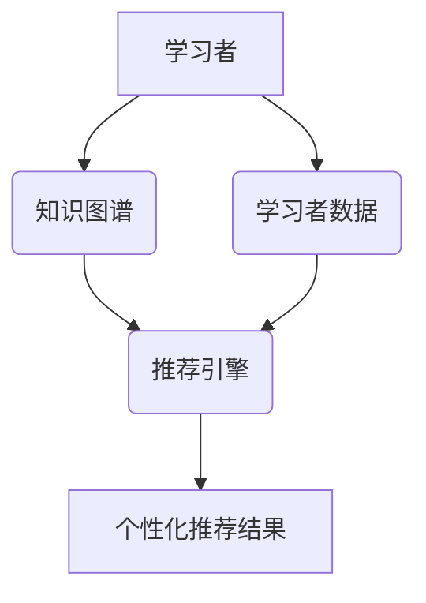

                 


# AI Agent在智能个性化学习中的应用

> 关键词：AI Agent, 个性化学习, 教育技术, 智能推荐, 机器学习

> 摘要：随着人工智能技术的快速发展，AI Agent（人工智能代理）在教育领域的应用逐渐成为研究热点。本文将探讨AI Agent在智能个性化学习中的应用，从理论基础到实际应用，深入分析其核心原理、系统架构以及实际案例，帮助读者理解如何通过AI技术实现高效、个性化的学习体验。

---

# 第1章: AI Agent与个性化学习的背景

## 1.1 AI Agent的基本概念

AI Agent是一种智能体，能够感知环境并采取行动以实现特定目标。在教育领域，AI Agent可以作为学习者的辅助工具，帮助其完成学习任务、优化学习路径。

## 1.2 个性化学习的背景与需求

个性化学习强调根据学习者的个性特征、学习目标和学习风格，提供定制化的学习方案。传统教育模式往往忽视个体差异，导致部分学生无法充分发挥潜能。AI Agent的引入为个性化学习提供了新的可能性。

## 1.3 AI Agent在教育中的应用价值

AI Agent可以通过数据分析和机器学习算法，实时分析学习者的行为数据，为其提供个性化的学习建议、资源推荐和进度跟踪。

---

# 第2章: AI Agent的核心原理与技术

## 2.1 知识建模与表示

### 2.1.1 知识图谱的构建

知识图谱是一种结构化的知识表示方式，通过节点和边描述实体及其关系。在教育场景中，知识图谱可以用于构建学科知识体系，帮助AI Agent理解知识点之间的关联。

### 2.1.2 知识表示的多样性

除了传统的文本表示，还可以利用向量空间模型（如Word2Vec）将知识点转化为向量形式，便于计算相似性。

## 2.2 学习者建模与画像

### 2.2.1 学习者特征的提取

通过分析学习者的在线行为数据（如点击率、停留时间、错误率等），提取其学习风格、知识掌握程度等特征。

### 2.2.2 学习者画像的构建

基于提取的特征，构建学习者画像，包括兴趣偏好、学习习惯、知识盲点等。

## 2.3 个性化推荐算法

### 2.3.1 基于协同过滤的推荐

协同过滤是一种常见的推荐算法，通过分析学习者的行为数据，找到与之相似的学习者，推荐其喜欢的资源。

公式表示：
$$ \text{相似度} = \frac{\sum_{i=1}^{n}(r_{ui} - \bar{r_u})(r_{vi} - \bar{r_v})}{\sqrt{\sum_{i=1}^{n}(r_{ui} - \bar{r_u})^2} \cdot \sqrt{\sum_{i=1}^{n}(r_{vi} - \bar{r_v})^2}} $$

### 2.3.2 基于内容的推荐

内容推荐基于资源本身的属性（如知识点、难度等）进行推荐，适用于知识图谱中的精准推荐。

公式表示：
$$ P(i|u) = \frac{\sum_{k=1}^{K} w_k \cdot f_k(u,i)}{\sum_{k=1}^{K} w_k} $$

## 2.4 AI Agent的决策机制

### 2.4.1 基于规则的决策

通过预定义的规则（如“如果学习者掌握A，推荐学习B”）进行决策。

### 2.4.2 基于机器学习的决策

使用分类模型（如随机森林、神经网络）进行学习者行为预测，优化推荐策略。

---

# 第3章: 系统架构与实现

## 3.1 系统功能模块划分

### 3.1.1 知识图谱构建模块

负责构建学科知识图谱，包括知识点的抽取、关联关系的建立等。

### 3.1.2 学习者建模模块

负责收集和分析学习者数据，构建学习者画像。

### 3.1.3 推荐引擎模块

基于知识图谱和学习者画像，生成个性化推荐结果。

## 3.2 系统架构设计



## 3.3 接口设计与交互流程

### 3.3.1 API接口

- `/api/knowledge_graph`: 获取知识图谱数据
- `/api/recommend`: 发起推荐请求
- `/api/learner_profile`: 获取学习者画像

### 3.3.2 交互流程

1. 学习者发起学习请求。
2. 系统收集学习者数据。
3. 知识图谱构建模块生成知识图谱。
4. 推荐引擎基于知识图谱和学习者数据生成推荐结果。
5. 系统返回推荐资源。

---

# 第4章: 项目实战与案例分析

## 4.1 环境配置

- **工具安装**：安装Python、TensorFlow、Keras等工具。
- **数据准备**：收集学习者数据和教育资源数据。

## 4.2 核心代码实现

### 4.2.1 知识图谱构建

```python
import networkx as nx

# 创建知识图谱
G = nx.Graph()
G.add_node("数学")
G.add_node("代数")
G.add_edge("数学", "代数")
```

### 4.2.2 学习者建模

```python
# 基于协同过滤的推荐算法
from sklearn.metrics.pairwise import cosine_similarity

# 计算相似度矩阵
similarity_matrix = cosine_similarity(user_item_matrix)
```

## 4.3 实际案例分析

### 4.3.1 案例背景

某在线教育平台希望通过AI Agent为学习者推荐个性化学习资源。

### 4.3.2 实施步骤

1. 收集学习者数据，包括学习行为、测试成绩等。
2. 构建学科知识图谱。
3. 基于协同过滤和深度学习算法生成推荐结果。
4. 实时跟踪学习者的学习进度，动态调整推荐策略。

---

# 第5章: 最佳实践与注意事项

## 5.1 实践中的关键点

- 数据质量：确保数据的准确性和完整性。
- 模型选择：根据具体场景选择合适的推荐算法。
- 及时反馈：实时跟踪学习者的行为数据，优化推荐策略。

## 5.2 注意事项

- 避免过度个性化：确保推荐结果的多样性和平衡性。
- 数据隐私：保护学习者的隐私数据，确保合规性。

## 5.3 小结

AI Agent在智能个性化学习中的应用前景广阔，但仍需在技术实现、数据处理和用户体验方面不断优化。

---

# 作者

作者：AI天才研究院/AI Genius Institute & 禅与计算机程序设计艺术 /Zen And The Art of Computer Programming

---

通过以上结构，您可以逐步扩展每个部分的内容，撰写一篇完整的博客文章。希望这个思考过程对您有所帮助！

