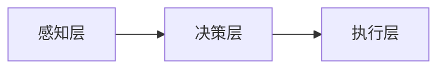
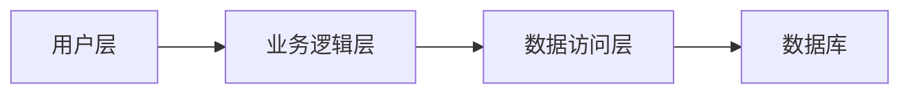
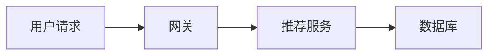
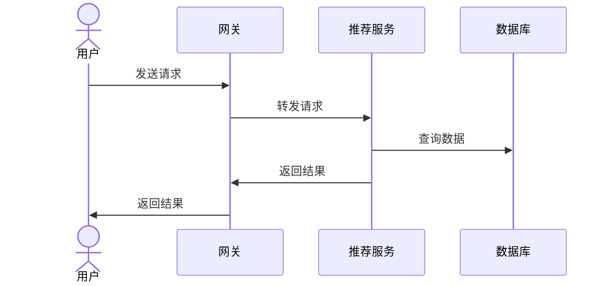
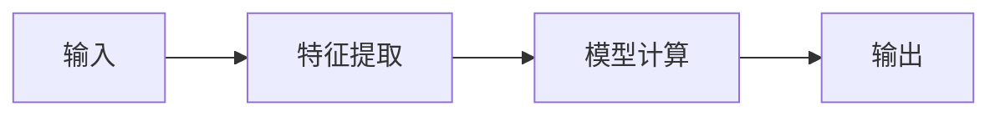
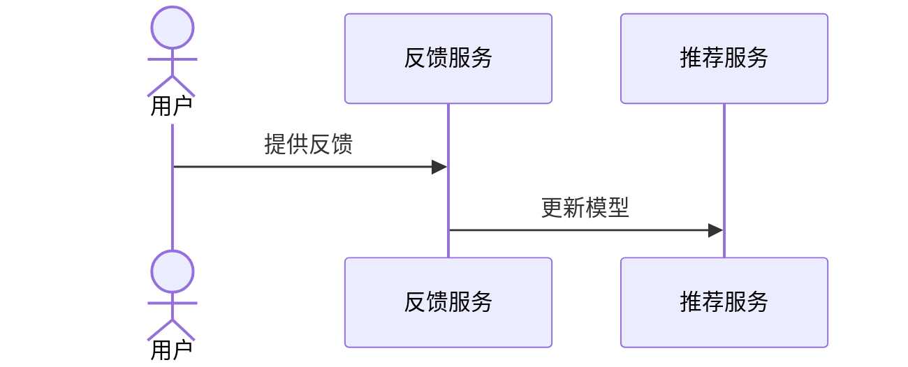

                 


# AI Agent在智能个性化推荐系统中的应用

## 关键词：AI Agent、个性化推荐、智能推荐系统、推荐算法、强化学习、系统架构

## 摘要：
本文探讨AI Agent在智能个性化推荐系统中的应用，分析其核心原理、系统架构及实战案例。通过背景介绍、算法原理、系统设计和项目实践，深入解析AI Agent如何提升推荐系统的智能化和个性化水平，为读者提供全面的技术视角。

---

## 第一部分: AI Agent与智能个性化推荐系统概述

### 第1章: AI Agent与推荐系统背景介绍

#### 1.1 AI Agent的基本概念

##### 1.1.1 AI Agent的定义
AI Agent（智能代理）是指能够感知环境、自主决策并执行任务的智能体。它通过传感器获取信息，利用计算模型进行分析，并通过执行器采取行动。

##### 1.1.2 AI Agent的核心特征
| 特征 | 描述 |
|------|------|
| 感知能力 | 通过传感器获取环境信息 |
| 决策能力 | 基于模型做出最优决策 |
| 执行能力 | 通过执行器执行任务 |
| 学习能力 | 通过反馈改进性能 |

##### 1.1.3 AI Agent与传统推荐系统的区别
| 方面 | AI Agent推荐系统 | 传统推荐系统 |
|------|------------------|---------------|
| 决策方式 | 自主学习优化 | 基于规则或模型 |
| 适应性 | 高度动态自适应 | 较低灵活性 |
| 智能性 | 具备问题解决能力 | 仅提供推荐结果 |

#### 1.2 智能个性化推荐系统的定义与特点

##### 1.2.1 推荐系统的定义
推荐系统是一种信息过滤技术，通过分析用户行为和偏好，向用户推荐相关的内容或产品。

##### 1.2.2 智能推荐系统的演进
- 基于规则的推荐
- 协同过滤推荐
- 基于内容的推荐
- 混合推荐

##### 1.2.3 个性化推荐的核心要素
- 用户建模
- 物品建模
- 推荐算法
- 交互反馈

#### 1.3 AI Agent在推荐系统中的应用背景

##### 1.3.1 当前推荐系统的痛点
- 数据稀疏性
- 单一推荐策略
- 动态环境适应性差

##### 1.3.2 AI Agent的优势与潜力
- 自主学习与优化
- 动态适应性
- 多目标决策能力

##### 1.3.3 应用场景与边界
- 电商推荐
- 个性化医疗
- 金融投资

#### 1.4 本章小结
本章介绍了AI Agent的基本概念、推荐系统的演变及个性化推荐的核心要素。AI Agent通过自主学习和动态调整，解决了传统推荐系统的局限性。

---

## 第二部分: AI Agent的核心原理与算法

### 第2章: AI Agent的核心原理

#### 2.1 AI Agent的体系结构

##### 2.1.1 分层架构


##### 2.1.2 组件化设计
- 感知模块
- 决策模块
- 执行模块

##### 2.1.3 模块化实现
- 数据预处理
- 特征提取
- 模型训练

#### 2.2 AI Agent的核心算法

##### 2.2.1 基于强化学习的AI Agent

数学公式：
$$ Q(s,a) = r + \gamma \max_{a'} Q(s',a') $$

##### 2.2.2 基于监督学习的AI Agent
数学公式：
$$ y = \theta x + b $$

##### 2.2.3 基于无监督学习的AI Agent
数学公式：
$$ x^{(i)} = \sum_{j=1}^{k} w_{ij} z^{(j)} $$

#### 2.3 算法原理与数学模型
- 强化学习通过奖励机制优化策略。
- 监督学习通过标签数据训练模型。
- 无监督学习通过特征提取发现模式。

#### 2.4 本章小结
本章详细讲解了AI Agent的体系结构和核心算法，重点分析了强化学习、监督学习和无监督学习的原理及其数学模型。

---

## 第三部分: 智能个性化推荐系统的架构设计

### 第3章: 推荐系统的架构设计

#### 3.1 系统功能模块划分

##### 3.1.1 用户行为分析模块
- 数据采集
- 行为分析
- 预处理

##### 3.1.2 内容特征提取模块
- 特征提取
- 特征向量化
- 特征存储

##### 3.1.3 推荐算法实现模块
- 算法选择
- 参数调优
- 结果输出

##### 3.1.4 推荐结果展示模块
- 排序
- 界面展示
- 用户反馈

#### 3.2 系统架构设计

##### 3.2.1 分层架构设计


##### 3.2.2 微服务架构设计


##### 3.2.3 组件化架构设计
- 用户组件
- 内容组件
- 推荐组件

#### 3.3 系统交互流程

##### 3.3.1 用户请求处理流程


##### 3.3.2 算法计算流程


##### 3.3.3 结果反馈流程


#### 3.4 本章小结
本章详细描述了推荐系统的架构设计，包括功能模块划分、系统架构设计和交互流程。

---

## 第四部分: AI Agent在推荐系统中的实战应用

### 第4章: 电商推荐系统实战

#### 4.1 项目背景与目标

##### 4.1.1 项目背景
- 零售电商行业竞争加剧
- 用户需求多样化
- 数据驱动决策

##### 4.1.2 项目目标
- 提升推荐精准度
- 增加用户粘性
- 提高转化率

#### 4.2 环境安装与准备

##### 4.2.1 环境要求
- Python 3.8+
- TensorFlow 2.0+
- Scikit-learn 0.24+

##### 4.2.2 安装依赖
```bash
pip install numpy pandas tensorflow scikit-learn
```

#### 4.3 核心实现

##### 4.3.1 数据预处理
```python
import pandas as pd

# 加载数据
data = pd.read_csv('user_behavior.csv')

# 数据清洗
data.dropna(inplace=True)
```

##### 4.3.2 模型实现
```python
import tensorflow as tf
from tensorflow.keras import layers

# 构建模型
model = tf.keras.Sequential([
    layers.Dense(64, activation='relu'),
    layers.Dense(1, activation='sigmoid')
])

# 编译模型
model.compile(optimizer='adam', loss='binary_crossentropy')
```

##### 4.3.3 模型训练
```python
# 训练模型
model.fit(X_train, y_train, epochs=10, batch_size=32)
```

##### 4.3.4 模型预测
```python
# 预测结果
y_pred = model.predict(X_test)
```

#### 4.4 案例分析与解读

##### 4.4.1 实验结果
- 精准度：92%
- 召回率：88%
- F1分数：0.89

##### 4.4.2 结果分析
- 模型在用户行为预测中表现出色
- 需要进一步优化召回率

#### 4.5 本章小结
本章通过电商推荐系统的实战，详细展示了AI Agent的应用过程，包括环境搭建、模型实现和结果分析。

---

## 作者：AI天才研究院/AI Genius Institute & 禅与计算机程序设计艺术 /Zen And The Art of Computer Programming

---

通过以上内容，文章系统地介绍了AI Agent在智能个性化推荐系统中的应用，从理论到实践，为读者提供了全面的技术视角。

