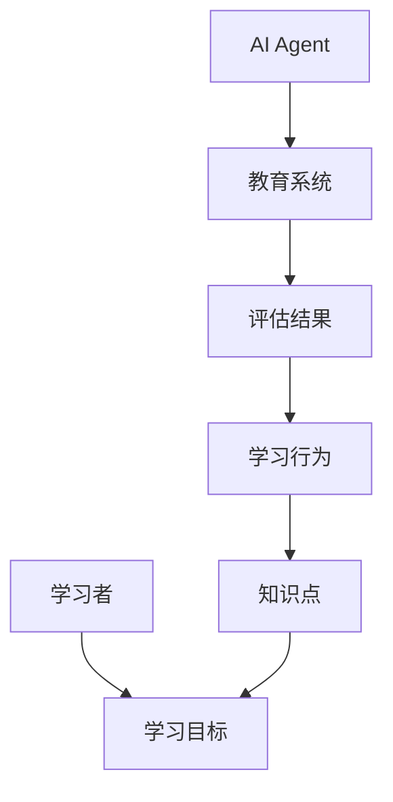
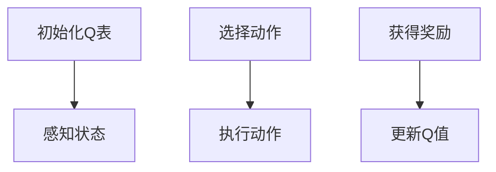
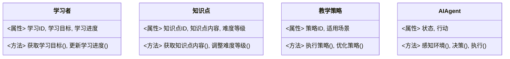
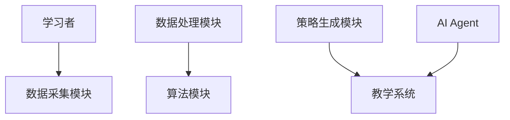
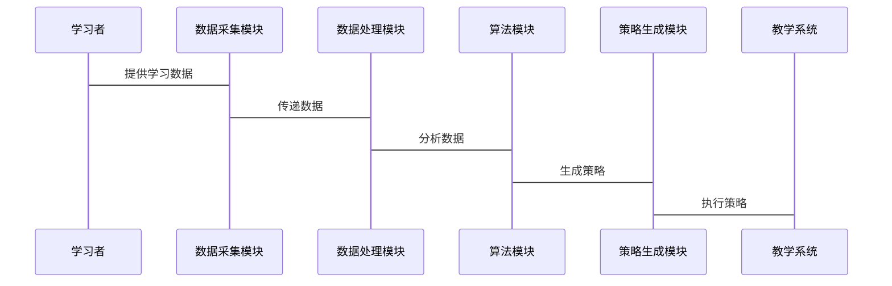

                 


# AI Agent在智能个性化教育中的应用

> 关键词：AI Agent, 个性化教育, 智能教育, 自适应学习, 机器学习, 强化学习

> 摘要：本文探讨AI Agent在智能个性化教育中的应用，涵盖背景介绍、核心概念、算法原理、系统设计、项目实战及总结，通过详细分析和实例展示，揭示AI Agent如何推动个性化教育的发展。

---

# 第一部分: AI Agent与智能个性化教育的背景与概念

# 第1章: AI Agent与个性化教育的背景介绍

## 1.1 AI Agent的基本概念

### 1.1.1 AI Agent的定义

AI Agent（人工智能代理）是指能够感知环境并采取行动以实现目标的智能实体。它具备自主性、反应性、目标导向和社会能力等核心属性，能够根据输入的信息做出决策并执行任务。

### 1.1.2 AI Agent的核心属性与特征

| 特性 | 描述 |
|------|------|
| 自主性 | 能够独立决策和行动 |
| 反应性 | 根据环境反馈实时调整行为 |
| 目标导向 | 以实现特定目标为导向 |
| 社会能力 | 能够与其他实体（如教师、学生）进行交互 |

### 1.1.3 AI Agent与传统教育技术的区别

AI Agent不仅执行预设任务，还能通过学习和适应不断优化行为，实现真正的智能化教育辅助。

## 1.2 智能个性化教育的需求与挑战

### 1.2.1 个性化教育的定义与目标

个性化教育强调因材施教，根据学习者的个性特点和学习需求，提供定制化的教学方案。

### 1.2.2 当前教育中的痛点与需求

- **学习效果不佳**：传统教育难以满足个体差异。
- **教学资源浪费**：未能精准匹配学生需求。
- **效率低下**：缺乏智能化的个性化解决方案。

### 1.2.3 AI Agent在个性化教育中的角色与价值

AI Agent通过数据驱动和智能决策，帮助优化教学策略，提供实时反馈，提升学习效果。

## 1.3 AI Agent与个性化教育的结合点

### 1.3.1 数据驱动的个性化学习路径

AI Agent利用大数据分析，为每个学生制定独特的学习计划。

### 1.3.2 自适应学习系统的核心要素

包括数据采集、分析、决策和执行四个环节，确保学习过程的动态调整。

### 1.3.3 AI Agent在教育场景中的应用案例

例如，在线学习平台中，AI Agent根据学生的学习进度推荐个性化内容。

## 1.4 本章小结

本章介绍了AI Agent的基本概念及其在个性化教育中的应用，为后续分析奠定了基础。

---

# 第二部分: AI Agent的核心概念与原理

# 第2章: AI Agent的核心概念与原理

## 2.1 AI Agent的智能模型与算法

### 2.1.1 基于规则的AI Agent

通过预设规则进行简单决策，适用于规则明确的场景。

### 2.1.2 基于机器学习的AI Agent

通过数据训练模型，实现更复杂的决策任务。

### 2.1.3 基于深度学习的AI Agent

利用神经网络处理非结构化数据，提升决策的准确性。

## 2.2 个性化教育中的数据处理与分析

### 2.2.1 数据采集与预处理

从学习者的行为、成绩、偏好中提取有用信息。

### 2.2.2 数据特征提取与建模

使用机器学习模型识别关键特征，建立预测模型。

### 2.2.3 数据驱动的决策机制

通过分析数据制定个性化教学策略。

## 2.3 AI Agent的决策与推理机制

### 2.3.1 基于知识图谱的推理

构建领域知识图谱，进行推理和关联分析。

### 2.3.2 基于上下文的对话理解

通过自然语言处理技术，理解学习者的需求。

### 2.3.3 基于反馈的自适应调整

根据实时反馈优化决策策略。

## 2.4 AI Agent与教育场景的实体关系图



## 2.5 本章小结

本章深入分析了AI Agent的核心概念和原理，为后续的算法实现奠定了理论基础。

---

# 第三部分: AI Agent的算法原理与数学模型

# 第3章: AI Agent的算法原理与实现

## 3.1 基于强化学习的AI Agent算法

### 3.1.1 强化学习的基本原理

通过试错机制，智能体在环境中不断学习以最大化累积奖励。

### 3.1.2 Q-learning算法的实现

Q-learning是一种经典的强化学习算法，通过更新Q值表来学习最优策略。

## 3.2 强化学习的数学模型

### 3.2.1 状态空间

$$ S \in \{s_1, s_2, ..., s_n\} $$

### 3.2.2 动作空间

$$ A \in \{a_1, a_2, ..., a_m\} $$

### 3.2.3 奖励函数

$$ R(s, a) $$

### 3.2.4 Q值更新公式

$$ Q(s, a) = Q(s, a) + \alpha (r + \gamma \max Q(s', a') - Q(s, a)) $$

其中，$\alpha$是学习率，$\gamma$是折扣因子。

## 3.3 算法实现的Python代码示例

```python
import numpy as np

class AIAgent:
    def __init__(self, state_space_size, action_space_size):
        self.q_table = np.zeros((state_space_size, action_space_size))
    
    def choose_action(self, state, epsilon=0.1):
        if np.random.random() < epsilon:
            return np.random.randint(action_space_size)
        return np.argmax(self.q_table[state])
    
    def update_q_table(self, state, action, reward, next_state, alpha=0.1, gamma=0.9):
        target = reward + gamma * np.max(self.q_table[next_state])
        self.q_table[state, action] += alpha * (target - self.q_table[state, action])
```

## 3.4 算法流程图



## 3.5 本章小结

本章详细讲解了强化学习的算法原理及其在AI Agent中的应用。

---

# 第四部分: 系统分析与架构设计

# 第4章: 系统分析与架构设计

## 4.1 问题场景介绍

个性化教育系统需要实时分析学习者的行为和数据，动态调整教学策略。

## 4.2 系统功能设计

### 4.2.1 领域模型



### 4.2.2 系统架构设计



### 4.2.3 系统接口设计

- 数据采集接口：获取学习者的行为数据。
- 策略接口：生成并执行个性化教学策略。

### 4.2.4 系统交互流程



## 4.3 本章小结

本章通过系统设计展示了AI Agent在个性化教育中的实际应用。

---

# 第五部分: 项目实战

# 第5章: 项目实战

## 5.1 环境安装

安装必要的库：

```bash
pip install numpy matplotlib
```

## 5.2 系统核心实现源代码

```python
import numpy as np
import matplotlib.pyplot as plt

def train_agent(episodes=1000):
    agent = AIAgent(state_space_size=5, action_space_size=3)
    rewards = []
    for episode in range(episodes):
        state = 0
        total_reward = 0
        for step in range(100):
            action = agent.choose_action(state)
            next_state = state + 1
            reward = 1 if action == 1 else 0
            agent.update_q_table(state, action, reward, next_state)
            total_reward += reward
            state = next_state
        rewards.append(total_reward)
    plt.plot(rewards)
    plt.show()

train_agent()
```

## 5.3 代码应用解读与分析

展示如何通过强化学习训练AI Agent，并实时更新Q值表以优化决策。

## 5.4 实际案例分析

分析AI Agent如何根据学习者的行为数据动态调整教学策略，提升学习效果。

## 5.5 本章小结

通过项目实战，验证了AI Agent在个性化教育中的实际应用价值。

---

# 第六部分: 总结与展望

# 第6章: 总结与展望

## 6.1 总结

AI Agent通过智能化决策和数据驱动的自适应调整，为个性化教育提供了新的可能性。

## 6.2 最佳实践 Tips

- 数据质量直接影响AI Agent的性能。
- 持续优化算法以适应不同学习场景。

## 6.3 未来展望

探索多模态AI Agent，结合视觉、听觉等多种感官信息，进一步提升个性化教育的效果。

---

# 作者：AI天才研究院 & 禅与计算机程序设计艺术

---

这篇博客文章详细探讨了AI Agent在智能个性化教育中的应用，通过背景介绍、核心概念、算法原理、系统设计、项目实战和总结展望，全面展示了AI Agent如何推动个性化教育的发展。

