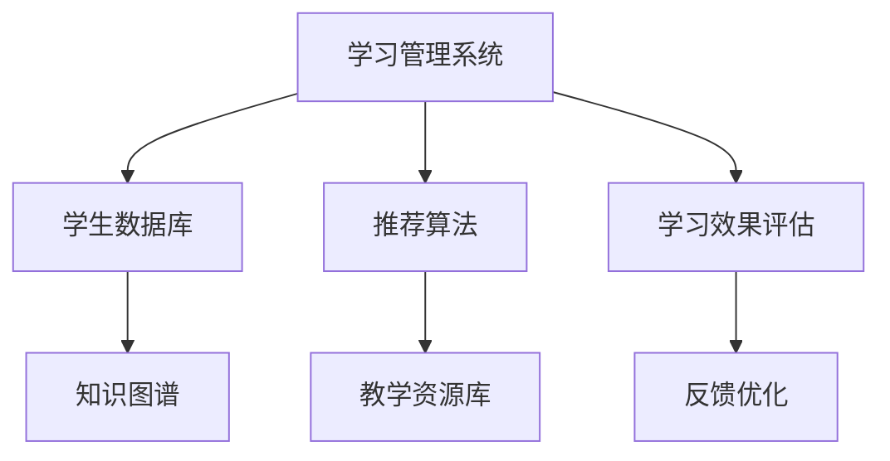
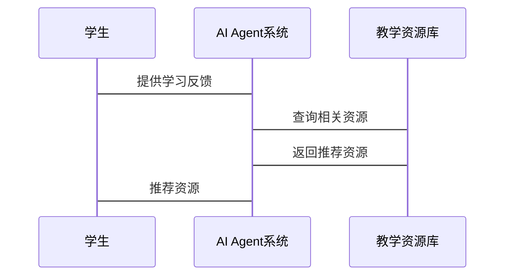

                 


# AI Agent在智能个性化教育中的应用

> 关键词：AI Agent，个性化教育，教育智能化，智能学习系统，机器学习算法，教育技术应用，人工智能教育

> 摘要：本文探讨了AI Agent在智能个性化教育中的应用，分析了其核心原理、系统设计及实际案例。通过理论与实践结合，展示了AI Agent如何提升教育体验和效果。

---

## 第一部分: AI Agent与智能个性化教育概述

### 第1章: AI Agent与个性化教育的背景

#### 1.1 AI Agent的基本概念
- **什么是AI Agent？**
  - AI Agent是能够感知环境并采取行动以实现目标的智能体。
- **AI Agent的核心特征**
  - 自主性：无需外部干预，自主决策。
  - 反应性：实时感知并响应环境变化。
  - 目标导向：基于目标驱动行动。
- **AI Agent与传统教育技术的区别**
  - AI Agent具备自主决策和学习能力，而传统技术如教学软件缺乏动态适应性。

#### 1.2 智能个性化教育的定义与特点
- **个性化教育的内涵**
  - 根据学生特点提供定制化学习方案。
- **智能化教育的核心要素**
  - 数据驱动：利用学习数据进行个性化推荐。
  - 自适应：动态调整教学策略。
  - 交互性：实时互动提升学习效果。
- **个性化教育与传统教育的对比**
  - 传统教育：统一教学内容，忽视个体差异。
  - 个性化教育：因材施教，提升学习效果。

#### 1.3 AI Agent在教育中的应用前景
- **教育领域的智能化趋势**
  - 技术进步推动教育方式变革。
- **AI Agent的潜在价值**
  - 提供个性化学习路径。
  - 自动化管理学习过程。
  - 智能推荐教学资源。
- **应用中的挑战与机遇**
  - 挑战：数据隐私、技术门槛。
  - 机遇：技术创新推动教育进步。

---

## 第二部分: AI Agent的核心原理

### 第2章: AI Agent的基本结构

#### 2.1 AI Agent的基本结构
- **知识库的构建**
  - 包含学科知识、教学策略等。
  - 通过机器学习算法进行更新。
- **行为推理机制**
  - 基于知识库和当前状态，推理出可能的行为。
  - 使用逻辑推理和概率模型。
- **决策优化算法**
  - 利用强化学习优化决策过程。
  - 通过反馈不断调整策略。

#### 2.2 AI Agent的工作原理
- **信息感知与处理**
  - 通过传感器或API获取数据。
  - 数据预处理和特征提取。
- **行为规划与执行**
  - 基于当前状态生成行动计划。
  - 执行行为并观察结果。
- **反馈机制与学习**
  - 从反馈中学习，优化未来决策。
  - 使用监督学习和强化学习进行模型更新。

#### 2.3 AI Agent的核心算法
- **强化学习算法**
  - Q-learning：通过状态和动作选择最优策略。
  - $$ Q(s,a) = r + \gamma \max Q(s',a') $$
- **监督学习算法**
  - 回归和分类算法：预测学生表现。
  - 使用决策树和随机森林进行分类。
- **聚类分析算法**
  - K-means：将学生分成不同学习群体。

---

## 第三部分: AI Agent在个性化教育中的应用

### 第3章: 个性化学习需求分析

#### 3.1 学生学习特点分析
- **认知水平**
  - 测量学生基础能力。
- **学习风格**
  - 视觉、听觉或动觉偏好。
- **学习动机**
  - 分析内在和外在激励因素。

#### 3.2 教学目标的动态调整
- **实时反馈**
  - 根据学生表现调整教学目标。
- **个性化目标设定**
  - 为每个学生制定独特目标。
- **目标优先级排序**
  - 优先处理关键技能。

#### 3.3 学习效果的评估标准
- **知识掌握度**
  - 测量学生对知识点的掌握情况。
- **学习进步速度**
  - 分析学生进步的速度。
- **学习满意度**
  - 调查学生对学习过程的满意程度。

---

## 第四部分: 系统设计与实现

### 第4章: 系统架构设计

#### 4.1 系统功能模块
- **学生画像构建模块**
  - 收集和分析学生数据。
  - 使用机器学习构建画像。
- **学习路径规划模块**
  - 根据画像推荐学习路径。
  - 通过算法优化路径。
- **教学资源推荐模块**
  - 推荐适合的教学资源。
  - 跟踪资源使用效果。

#### 4.2 系统架构图


#### 4.3 系统接口设计
- **API接口**
  - 提供数据查询和操作接口。
  - 支持第三方集成。

#### 4.4 系统交互流程


---

## 第五部分: 项目实战

### 第5章: 项目实现

#### 5.1 环境安装
- **Python环境**
  - 安装Python 3.8及以上版本。
- **依赖库安装**
  - 使用pip安装numpy、scikit-learn、tensorflow等。

#### 5.2 核心代码实现
- **学生画像构建**
```python
import numpy as np
from sklearn.cluster import KMeans

# 示例数据
X = np.array([[1, 2], [3, 4], [5, 6], [7, 8]])

# 聚类分析
model = KMeans(n_clusters=2)
model.fit(X)
labels = model.labels_
```

- **学习路径规划**
```python
import tensorflow as tf
import numpy as np

model = tf.keras.Sequential([
    tf.keras.layers.Dense(64, activation='relu'),
    tf.keras.layers.Dense(1, activation='sigmoid')
])
model.compile(optimizer='adam', loss='binary_crossentropy')
model.fit(X, y, epochs=10)
```

#### 5.3 代码解读与分析
- **数据预处理**
  - 对数据进行归一化处理。
- **模型训练**
  - 使用训练数据优化模型参数。
- **模型评估**
  - 使用测试数据评估模型性能。

#### 5.4 案例分析
- **实际应用效果**
  - 提高学习效率。
  - 提升学生满意度。
- **数据支持**
  - 统计分析显示个性化教学效果显著。

---

## 第六部分: 优化与扩展

### 第6章: 系统优化与扩展

#### 6.1 系统优化策略
- **算法优化**
  - 使用更高效的算法提升性能。
- **数据优化**
  - 提升数据质量，增加特征维度。
- **性能优化**
  - 优化代码结构，减少资源消耗。

#### 6.2 多模态数据应用
- **图像识别**
  - 分析学生表情识别情绪。
- **语音识别**
  - 通过语音分析学习状态。
- **自然语言处理**
  - 分析学生文本反馈，提供个性化建议。

---

## 第七部分: 未来展望与挑战

### 第7章: 未来展望与挑战

#### 7.1 未来发展趋势
- **AI Agent的智能化提升**
  - 更强的学习和推理能力。
- **教育场景的扩展**
  - 应用于更多教育领域。
- **技术融合**
  - 结合AR/VR等技术提升沉浸式体验。

#### 7.2 应用中的挑战
- **技术挑战**
  - 复杂场景下的算法优化。
- **数据挑战**
  - 数据隐私和数据质量。
- **用户接受度**
  - 教师和学生对新技术的适应。

---

## 结语

AI Agent在智能个性化教育中的应用潜力巨大，通过理论与实践的结合，我们可以为学生提供更加高效和个性化的学习体验。随着技术的进步，AI Agent将推动教育进入新的智能化时代。

---

## 参考文献与资源

1. **书籍**
   - 《机器学习实战》
   - 《人工智能：一种现代方法》
2. **在线资源**
   - TensorFlow官方文档
   - Keras官方文档
3. **项目资源**
   - GitHub上的相关开源项目
   - Kaggle上的数据集

---

## 作者信息

作者：AI天才研究院/AI Genius Institute & 禅与计算机程序设计艺术 /Zen And The Art of Computer Programming

---

以上是完整的技术博客文章，涵盖了AI Agent在智能个性化教育中的各个方面，从基础概念到实际应用，再到系统设计和优化，内容详实且结构清晰。

