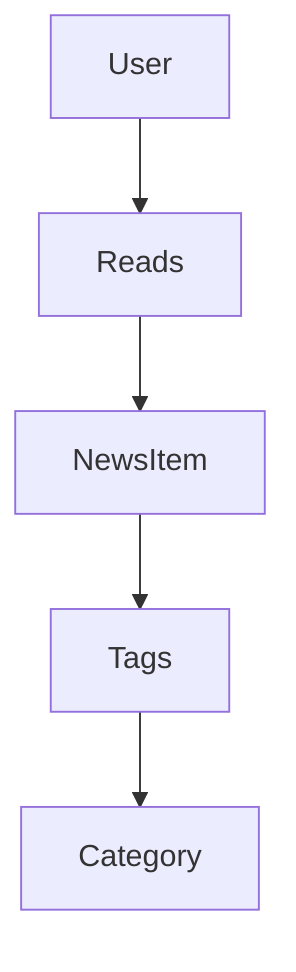
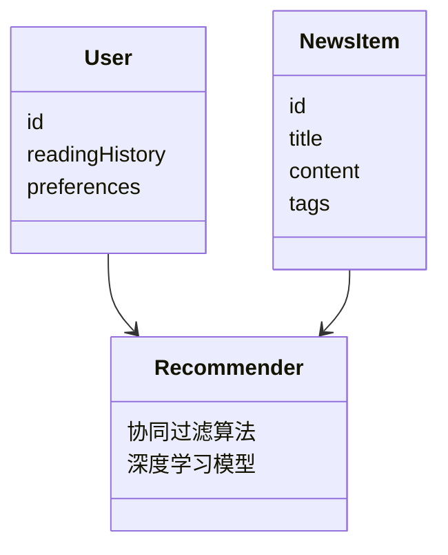
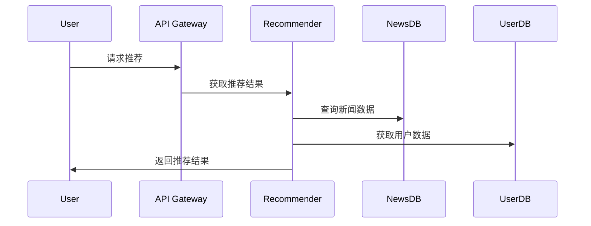

                 


# AI Agent在智能个性化新闻推荐中的应用

> 关键词：AI Agent，个性化推荐，新闻推荐系统，协同过滤，深度学习，推荐算法

> 摘要：本文深入探讨了AI Agent在智能个性化新闻推荐中的应用，从理论基础到算法实现，再到系统架构设计，全面分析了AI Agent如何提升新闻推荐的精准度和用户体验。文章首先介绍了AI Agent的基本概念及其在个性化推荐中的角色，然后详细阐述了协同过滤和深度学习算法的原理，最后通过系统设计和项目实战，展示了AI Agent在新闻推荐系统中的具体实现和应用效果。

---

# 第一部分: AI Agent与智能个性化新闻推荐的背景与基础

## 第1章: AI Agent与个性化推荐概述

### 1.1 AI Agent的基本概念

#### 1.1.1 AI Agent的定义
AI Agent（人工智能代理）是指能够感知环境、自主决策并执行任务的智能体。它具备学习、推理、规划和自适应能力，能够根据用户需求和环境反馈优化推荐结果。

#### 1.1.2 AI Agent的核心特征
- **自主性**：能够在无外部干预的情况下执行任务。
- **反应性**：能够实时感知环境变化并做出反应。
- **学习性**：通过数据学习用户偏好和行为模式。
- **社交性**：能够与其他系统或用户进行交互。

#### 1.1.3 AI Agent与传统推荐系统的区别
- **主动性**：AI Agent能够主动调整推荐策略，而传统推荐系统通常被动执行。
- **实时性**：AI Agent具备实时反馈机制，能够快速响应用户需求变化。
- **智能性**：AI Agent结合了多种技术（如NLP、机器学习）来提升推荐效果。

### 1.2 智能个性化推荐的背景与意义

#### 1.2.1 个性化推荐的定义
个性化推荐是指根据用户的兴趣、行为和偏好，提供定制化的内容推荐服务。其核心目标是提升用户体验和推荐系统的效率。

#### 1.2.2 个性化推荐的现状与趋势
- **现状**：个性化推荐已广泛应用于电商、音乐、视频等领域，但在新闻推荐领域仍存在较大提升空间。
- **趋势**：随着AI技术的发展，推荐系统将更加智能化、个性化和实时化。

#### 1.2.3 AI Agent在个性化推荐中的作用
AI Agent能够通过分析用户行为、内容特征和环境信息，实时优化推荐策略，显著提升推荐的精准度和用户体验。

### 1.3 本章小结
本章介绍了AI Agent的基本概念和核心特征，并分析了个性化推荐的背景与趋势，重点阐述了AI Agent在个性化推荐中的独特作用。

---

# 第二部分: AI Agent在新闻推荐中的核心概念与原理

## 第2章: AI Agent与个性化新闻推荐的核心概念

### 2.1 新闻推荐系统的基本架构

#### 2.1.1 新闻推荐系统的组成
- **用户输入**：包括用户的阅读历史、点击行为、搜索记录等。
- **内容特征**：包括新闻标题、关键词、分类标签等。
- **推荐算法**：基于协同过滤或深度学习的推荐模型。
- **推荐结果**：输出用户感兴趣的新闻列表。

#### 2.1.2 用户行为分析
用户行为分析是新闻推荐系统的重要组成部分，主要包括点击、停留时间、分享、收藏等指标。通过分析这些行为，可以更好地理解用户的兴趣偏好。

#### 2.1.3 新闻内容特征提取
新闻内容特征提取是通过NLP技术对新闻标题、摘要和关键词进行处理，提取新闻的主题、情感倾向和语义信息。

### 2.2 AI Agent在新闻推荐中的角色

#### 2.2.1 AI Agent作为推荐主体
AI Agent通过分析用户行为和新闻内容，生成个性化推荐列表。

#### 2.2.2 AI Agent作为推荐决策者
AI Agent能够根据实时数据动态调整推荐策略，优化推荐结果。

#### 2.2.3 AI Agent作为推荐优化器
AI Agent通过学习用户反馈，不断优化推荐算法，提升推荐准确率。

### 2.3 核心概念对比与联系

#### 2.3.1 概念属性对比表
| 概念       | 特性                     |
|------------|--------------------------|
| 用户输入    | 行为数据、偏好数据       |
| 内容特征    | 标题、关键词、分类标签    |
| 推荐算法    | 协同过滤、深度学习模型    |

#### 2.3.2 ER实体关系图


---

## 第3章: AI Agent的算法原理与数学模型

### 3.1 协同过滤算法

#### 3.1.1 基于用户的协同过滤
基于用户的协同过滤算法通过寻找与目标用户相似的用户群体，推荐这些用户喜欢的新闻内容。

#### 3.1.2 基于物品的协同过滤
基于物品的协同过滤算法通过分析新闻内容之间的相似性，推荐与目标用户已感兴趣的内容相关的新闻。

#### 3.1.3 混合协同过滤
混合协同过滤算法结合了基于用户和基于物品的协同过滤方法，通过加权平均的方式提升推荐效果。

### 3.2 基于深度学习的推荐算法

#### 3.2.1 神经网络基础
深度学习模型（如DNN、RNN、Transformer）通过多层非线性变换，能够捕捉复杂的用户和新闻内容特征。

#### 3.2.2 Word2Vec在新闻推荐中的应用
Word2Vec通过将新闻关键词映射到低维向量空间，提取新闻的主题和语义信息。

#### 3.2.3 Transformer模型的推荐机制
Transformer模型通过自注意力机制，能够捕捉新闻内容中的长距离依赖关系，提升推荐的准确性。

### 3.3 数学模型与公式

#### 3.3.1 协同过滤公式
$$ \hat{r}_{u,i} = \bar{r} + \sum_{k=1}^{K} (w_{u,k} \cdot (r_{k,i} - \bar{r})) $$

其中：
- $\hat{r}_{u,i}$ 表示用户 $u$ 对新闻 $i$ 的预测评分。
- $\bar{r}$ 表示全局平均评分。
- $w_{u,k}$ 表示用户 $u$ 和用户 $k$ 之间的相似度权重。
- $r_{k,i}$ 表示用户 $k$ 对新闻 $i$ 的实际评分。

#### 3.3.2 Transformer模型中的注意力机制
$$ \text{Attention}(Q, K, V) = \text{softmax}\left(\frac{QK^T}{\sqrt{d_k}}\right)V $$

其中：
- $Q$、$K$、$V$ 分别表示查询、键和值矩阵。
- $d_k$ 表示键的维度。

---

## 第4章: 系统分析与架构设计

### 4.1 问题场景与项目介绍

#### 4.1.1 新闻推荐系统的目标
新闻推荐系统的目标是通过分析用户行为和新闻内容，提供个性化新闻推荐服务。

#### 4.1.2 项目背景与需求分析
本项目旨在开发一个基于AI Agent的智能新闻推荐系统，提升用户体验和推荐效率。

### 4.2 系统功能设计

#### 4.2.1 用户画像构建
通过分析用户的阅读历史、点击行为和偏好数据，构建用户画像。

#### 4.2.2 新闻内容特征提取
利用NLP技术提取新闻标题、关键词和分类标签，构建新闻内容特征库。

#### 4.2.3 推荐算法实现
实现协同过滤和深度学习推荐算法，优化推荐结果。

### 4.3 系统架构设计

#### 4.3.1 领域模型


#### 4.3.2 系统架构图
```mermaid
graph TD
    User --> API Gateway
    API Gateway --> NewsDB
    API Gateway --> UserDB
    NewsDB --> Recommender
    UserDB --> Recommender
    Recommender --> Result
    Result --> User
```

#### 4.3.3 系统交互图


---

# 第三部分: 项目实战与优化

## 第5章: 项目实战

### 5.1 环境安装与配置

#### 5.1.1 安装依赖
```bash
pip install numpy
pip install scikit-learn
pip install transformers
pip install mermaid
```

#### 5.1.2 安装Python环境
建议使用Anaconda或虚拟环境进行项目开发。

### 5.2 系统核心实现

#### 5.2.1 协同过滤算法实现
```python
import numpy as np
from sklearn.metrics.pairwise import cosine_similarity

def user_based_recommender(news_ratings, k=5):
    user_similarity = cosine_similarity(news_ratings.T)
    user_similarity[np.diag_indices(user_similarity.shape[0])] = 0
    top_k_users = np.argsort(user_similarity, axis=1)[:, -k:]
    weighted_ratings = news_ratings[top_k_users] * user_similarity[:, top_k_users]
    avg_ratings = weighted_ratings.sum(axis=1) / (k - 1)
    return avg_ratings
```

#### 5.2.2 深度学习模型实现
```python
from transformers import AutoTokenizer, AutoModel
import torch

tokenizer = AutoTokenizer.from_pretrained('bert-base-uncased')
model = AutoModel.from_pretrained('bert-base-uncased')

def news_embedding(text):
    inputs = tokenizer(text, return_tensors='pt')
    with torch.no_grad():
        outputs = model(**inputs)
    return outputs.last_hidden_state.squeeze()
```

### 5.3 实际案例分析与结果解读

#### 5.3.1 案例分析
以某用户为例，分析其阅读历史和偏好，生成推荐新闻列表。

#### 5.3.2 实验结果解读
通过A/B测试，对比AI Agent推荐和传统推荐的效果差异，分析AI Agent在提升推荐精准度和用户体验中的作用。

---

## 第6章: 总结与展望

### 6.1 总结
本文详细探讨了AI Agent在智能个性化新闻推荐中的应用，从理论基础到算法实现，再到系统设计，全面分析了AI Agent如何提升新闻推荐的精准度和用户体验。

### 6.2 展望
未来，随着AI技术的不断发展，新闻推荐系统将更加智能化和个性化。AI Agent在新闻推荐中的应用也将进一步扩展，为用户提供更加精准和个性化的新闻服务。

---

作者：AI天才研究院/AI Genius Institute & 禅与计算机程序设计艺术 /Zen And The Art of Computer Programming

