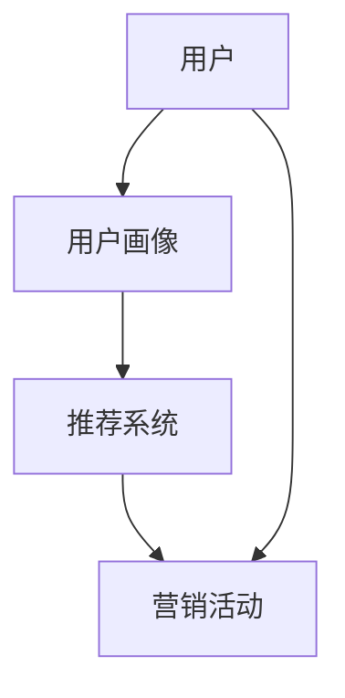
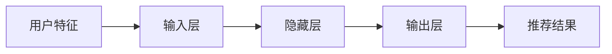
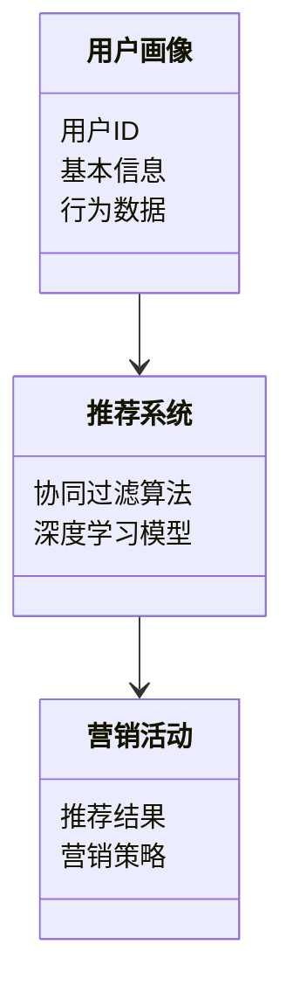
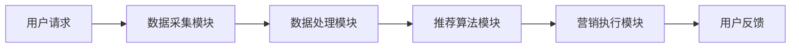

                 


# AI Agent在智能个性化营销中的应用

> 关键词：AI Agent, 智能个性化营销, 个性化推荐系统, 机器学习, 自然语言处理

> 摘要：本文深入探讨了AI Agent在智能个性化营销中的应用，分析了AI Agent的核心概念、技术原理、系统架构设计以及实际项目案例。通过详细的技术分析和实战演示，展示了如何利用AI Agent实现精准营销，提升客户体验和商业价值。

---

## 目录

1. [AI Agent与智能个性化营销的背景](#ai-agent与智能个性化营销的背景)
2. [AI Agent的核心概念与技术原理](#ai-agent的核心概念与技术原理)
3. [AI Agent的算法原理与数学模型](#ai-agent的算法原理与数学模型)
4. [AI Agent的系统架构设计](#ai-agent的系统架构设计)
5. [AI Agent在智能个性化营销中的项目实战](#ai-agent在智能个性化营销中的项目实战)
6. [AI Agent的应用总结与未来展望](#ai-agent的应用总结与未来展望)

---

## 1. AI Agent与智能个性化营销的背景

### 1.1 问题背景与描述

随着市场竞争的加剧，企业需要更高效地触达目标客户并提供个性化服务。传统的营销方式依赖人工操作，效率低下且难以满足大规模个性化需求。AI Agent（人工智能代理）作为一种智能化工具，能够通过数据驱动和自动化技术，实现精准的个性化营销。

#### 1.1.1 传统营销的局限性
- **数据处理能力有限**：传统营销难以处理海量数据，难以实现精准的客户画像。
- **个性化程度低**：营销策略多为通用化，难以满足客户的个性化需求。
- **效率低下**：人工操作耗时长，难以快速响应市场需求变化。

#### 1.1.2 智能营销的需求与目标
- **需求**：通过技术手段实现精准客户识别、个性化推荐和自动化营销。
- **目标**：提高客户满意度、增加转化率、降低营销成本。

#### 1.1.3 AI Agent在营销中的优势
- **数据处理能力强**：能够快速分析海量数据，生成精准客户画像。
- **自动化与智能化**：通过机器学习和自然语言处理技术，实现自动化的营销策略。
- **个性化推荐**：基于客户行为数据，提供个性化的推荐服务。

### 1.2 AI Agent的核心概念与特点

#### 1.2.1 AI Agent的定义与类型
- **定义**：AI Agent是一种能够感知环境、自主决策并执行任务的智能实体。
- **类型**：基于功能和应用场景的不同，AI Agent可以分为推荐型、决策型和执行型。

#### 1.2.2 个性化营销的核心要素
- **客户画像**：基于客户行为数据构建的用户画像。
- **推荐系统**：基于用户偏好进行个性化推荐的核心算法。
- **营销策略**：根据用户特征制定的个性化营销策略。

#### 1.2.3 AI Agent与传统营销的对比分析

| 对比维度         | 传统营销             | AI Agent驱动的智能营销       |
|------------------|----------------------|-----------------------------|
| 数据处理能力     | 有限，依赖人工分析    | 强大，支持海量数据处理       |
| 个性化程度       | 低，通用化策略为主    | 高，基于客户行为的个性化推荐 |
| 效率             | 低，人工操作为主      | 高，自动化与智能化操作       |
| 响应速度         | 慢，依赖人工判断      | 快，实时数据分析与反馈       |

---

## 2. AI Agent的核心概念与技术原理

### 2.1 AI Agent的核心原理

AI Agent的核心原理在于通过数据驱动和智能化算法，实现对客户行为的精准识别和预测。以下是AI Agent的主要技术流程：

1. **数据采集**：通过多种渠道（如网站、App、社交媒体）收集客户行为数据。
2. **数据处理**：对数据进行清洗、特征提取和标准化处理。
3. **模型训练**：基于机器学习算法（如协同过滤、深度学习）构建推荐模型。
4. **个性化推荐**：根据模型预测结果生成个性化推荐列表。
5. **营销执行**：通过自动化工具（如邮件营销、社交媒体广告）执行推荐策略。

#### 2.1.1 AI Agent的实体关系分析

以下是AI Agent在智能营销中的实体关系图：



### 2.2 AI Agent的核心技术原理

#### 2.2.1 个性化推荐算法

个性化推荐是AI Agent在智能营销中的核心应用之一。以下是推荐算法的对比分析：

| 推荐算法       | 基于协同过滤     | 基于内容推荐     | 基于深度学习     |
|----------------|------------------|------------------|------------------|
| 数据需求       | 用户行为数据     | 物品特征数据     | 用户行为与物品特征数据 |
| 算法原理       | 找出相似用户或相似物品推荐 | 基于物品特征生成推荐列表 | 基于神经网络模型预测用户偏好 |
| 优点           | 计算简单，易于实现 | 特定场景下效果好 | 高精度，适用于复杂场景 |
| 缺点           | 对冷启动问题敏感 | 物品特征提取困难 | 计算资源消耗大 |

---

## 3. AI Agent的算法原理与数学模型

### 3.1 协同过滤算法

协同过滤是一种基于用户相似性或物品相似性的推荐算法。以下是基于用户的协同过滤算法的数学公式：

$$
\hat{r}_{u,i} = \frac{\sum_{u' \in N(u)} w(u, u') \cdot r_{u',i}}{\sum_{u' \in N(u)} w(u, u')}
$$

其中：
- $\hat{r}_{u,i}$ 表示用户 $u$ 对物品 $i$ 的预测评分。
- $N(u)$ 表示与用户 $u$ 相似的用户集合。
- $w(u, u')$ 表示用户 $u$ 和用户 $u'$ 的相似度权重。

### 3.2 基于深度学习的推荐系统

基于深度学习的推荐系统通常采用神经网络模型，例如DNN（深度神经网络）或Transformer模型。以下是DNN模型的结构示意图：



---

## 4. AI Agent的系统架构设计

### 4.1 系统功能设计

以下是AI Agent驱动的智能营销系统的功能模块图：



### 4.2 系统架构设计

以下是系统的整体架构图：



---

## 5. AI Agent在智能个性化营销中的项目实战

### 5.1 项目背景与目标

以电商推荐系统为例，目标是通过AI Agent实现基于用户行为的个性化推荐。

### 5.2 环境安装与配置

```bash
pip install numpy pandas scikit-learn
```

### 5.3 核心代码实现

以下是协同过滤算法的Python实现示例：

```python
from sklearn.metrics.pairwise import cosine_similarity

# 用户行为数据矩阵
X = [[1, 2, 3],
     [4, 5, 6],
     [7, 8, 9]]

# 计算相似度矩阵
similarity_matrix = cosine_similarity(X)
```

### 5.4 项目案例分析

通过分析用户购买数据，生成个性化推荐列表，提升用户购买转化率。

### 5.5 项目总结与优化

- **总结**：协同过滤算法在推荐系统中表现良好，但对冷启动问题敏感。
- **优化**：结合深度学习模型（如 collaborative deep learning）提升推荐精度。

---

## 6. AI Agent的应用总结与未来展望

### 6.1 应用总结

AI Agent通过数据驱动和智能化算法，显著提升了营销的精准度和效率。其核心优势在于个性化推荐和自动化营销策略的实现。

### 6.2 未来展望

未来的AI Agent将更加智能化，可能结合区块链技术实现去中心化推荐系统，或利用边缘计算提升实时性。

---

## 作者信息

作者：AI天才研究院 & 禅与计算机程序设计艺术

--- 

**声明：本文为技术分享，转载请注明出处。**

