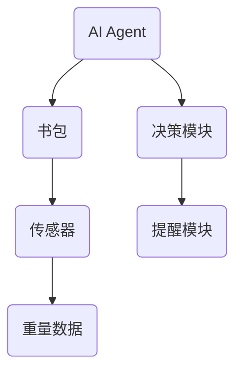
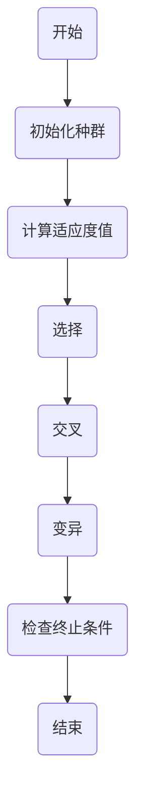
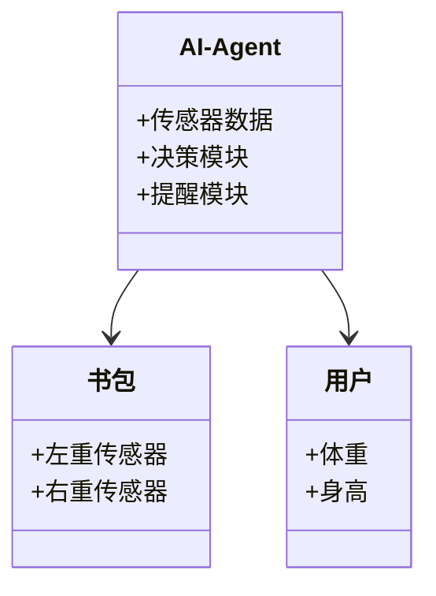
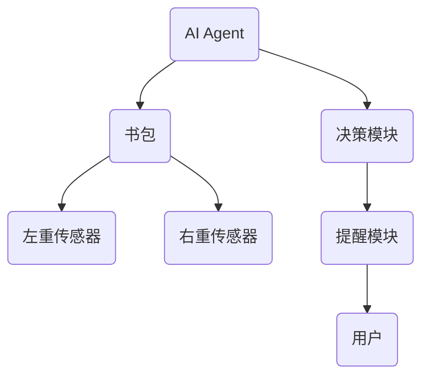
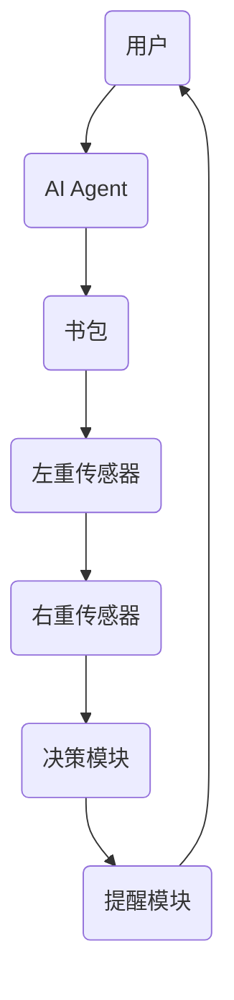

                 


# AI Agent在智能书包中的负重平衡提醒

> 关键词：AI Agent, 智能书包, 负重平衡, 优化算法, 物联网, 系统架构

> 摘要：本文详细探讨了AI Agent在智能书包中的负重平衡提醒系统的设计与实现。通过分析负重不平衡对用户健康的影响，结合AI技术，提出了一种基于动态规划的优化算法，并设计了相应的系统架构。文章还通过实际案例分析，展示了该系统的应用场景和实际效果。

---

# 第一部分: 背景与概念

# 第1章: 问题背景与系统架构

## 1.1 问题背景介绍

### 1.1.1 传统书包设计的局限性
传统书包的设计主要关注功能性和美观性，但忽略了用户健康问题。长时间背负过重的书包可能导致脊柱侧弯、肩颈疼痛等问题，尤其是学生群体。因此，设计一个能够实时监测负重并提供优化建议的智能书包显得尤为重要。

### 1.1.2 负重不平衡对用户健康的影响
负重不平衡是指书包两侧的重量分布不均匀。长期使用负重不平衡的书包会导致身体姿态异常，甚至引发慢性健康问题。研究表明，合理的负重分配可以有效减少身体负担，提高用户舒适度。

### 1.1.3 AI技术在智能设备中的应用潜力
AI技术的快速发展为智能设备的设计提供了新的可能性。通过AI Agent（智能代理），我们可以实现对书包的实时监测、数据分析和优化建议，从而提升用户体验。

## 1.2 系统架构与核心概念

### 1.2.1 AI Agent在智能书包中的角色
AI Agent在智能书包中扮演“智能助手”的角色，负责实时监测用户的负重情况，并根据数据提供优化建议。它能够通过传感器获取书包的重量分布数据，并结合用户的体重、身高、步态等信息，计算出最佳的负重分配方案。

### 1.2.2 负重平衡提醒系统的功能模块
负重平衡提醒系统主要包括以下几个功能模块：
- **感知模块**：通过传感器获取书包的重量分布数据。
- **决策模块**：基于感知数据，计算负重平衡指数，并提出优化建议。
- **提醒模块**：通过震动、声音等方式提醒用户调整书包的负重分布。

### 1.2.3 系统边界与外延
本系统的核心功能是负重平衡提醒，但也可以扩展其他功能，如：
- **健康监测**：监测用户的健康状况，如心率、步频等。
- **路径规划**：根据用户的行走路径，优化书包的负重分布。

## 1.3 核心概念结构与组成

### 1.3.1 AI Agent的核心要素
AI Agent的核心要素包括：
- **感知能力**：通过传感器获取数据。
- **决策能力**：基于数据进行优化计算。
- **执行能力**：通过提醒模块指导用户操作。

### 1.3.2 负重平衡计算的数学模型
负重平衡计算的数学模型可以通过以下公式表示：
$$
\text{平衡指数} = \frac{\text{左重} + \text{右重}}{\text{总重}}
$$
其中，左重和右重分别为书包左右两侧的重量，总重为书包的总重量。

### 1.3.3 系统交互流程
系统交互流程如下：
1. 用户佩戴书包。
2. 传感器采集书包的重量分布数据。
3. AI Agent计算负重平衡指数。
4. 如果平衡指数低于阈值，系统发出提醒。

## 1.4 本章小结
本章介绍了负重平衡提醒系统的背景、核心概念和系统架构，为后续的算法设计和系统实现奠定了基础。

---

# 第二部分: AI Agent的核心原理与实现

# 第2章: AI Agent的核心原理

## 2.1 AI Agent的基本原理

### 2.1.1 感知模块的工作原理
感知模块通过重量传感器采集书包的重量分布数据。传感器将数据传输给AI Agent进行处理。

### 2.1.2 决策模块的算法选择
决策模块采用动态规划算法进行负重优化。动态规划算法通过逐步优化局部解，最终得到全局最优解。

### 2.1.3 执行模块的实现方式
执行模块通过震动马达和声音提醒用户调整书包的负重分布。

## 2.2 负重平衡计算的数学模型

### 2.2.1 负重平衡的优化目标
负重平衡的优化目标是将书包两侧的重量分布均匀化。目标函数可以表示为：
$$
\min \left| \text{左重} - \text{右重} \right|
$$

### 2.2.2 基于动态规划的优化算法
动态规划算法的流程如下：
1. 初始化种群。
2. 计算适应度值。
3. 进行选择、交叉和变异操作。
4. 重复迭代，直到满足终止条件。

### 2.2.3 数学公式推导与应用
通过动态规划算法，我们可以得到以下最优解：
$$
\text{最优左重} = \frac{\text{总重}}{2}
$$
$$
\text{最优右重} = \frac{\text{总重}}{2}
$$

## 2.3 AI Agent的实体关系图


## 2.4 本章小结
本章详细介绍了AI Agent的基本原理和负重平衡计算的数学模型，为后续的系统实现提供了理论基础。

---

# 第三部分: 算法实现与数学模型

# 第3章: 负重平衡优化算法

## 3.1 算法原理与流程

### 3.1.1 基于遗传算法的优化策略
遗传算法是一种模拟自然选择的优化算法，适用于复杂的优化问题。在负重平衡优化中，遗传算法可以通过以下步骤实现：
1. 初始化种群。
2. 计算适应度值。
3. 进行选择、交叉和变异操作。
4. 重复迭代，直到满足终止条件。

### 3.1.2 算法流程图


### 3.1.3 数学公式推导与应用
通过遗传算法，我们可以得到以下最优解：
$$
\text{最优左重} = \frac{\text{总重}}{2}
$$
$$
\text{最优右重} = \frac{\text{总重}}{2}
$$

## 3.2 算法实现与代码

### 3.2.1 Python代码实现
以下是基于动态规划算法的负重平衡优化代码示例：
```python
import math

def calculate_balance(left_weight, right_weight):
    total_weight = left_weight + right_weight
    balance_index = (left_weight + right_weight) / total_weight
    return balance_index

def optimize_weight(left_weight, right_weight):
    total_weight = left_weight + right_weight
    optimal_left = total_weight / 2
    optimal_right = total_weight / 2
    return optimal_left, optimal_right

# 示例
left_weight = 5
right_weight = 3
balance_index = calculate_balance(left_weight, right_weight)
optimal_left, optimal_right = optimize_weight(left_weight, right_weight)
print(f"平衡指数: {balance_index}")
print(f"最优左重: {optimal_left}")
print(f"最优右重: {optimal_right}")
```

### 3.2.2 算法实现的详细解读
上述代码实现了负重平衡的计算和优化功能。通过输入书包两侧的重量，可以得到平衡指数和最优的重量分配方案。

## 3.3 本章小结
本章详细讲解了负重平衡优化算法的原理和实现，通过代码示例展示了算法的应用。

---

# 第四部分: 系统分析与架构设计

# 第4章: 系统分析与架构设计

## 4.1 项目介绍与系统功能设计

### 4.1.1 项目背景
本项目旨在设计一个能够实时监测书包负重并提供优化建议的智能设备，帮助用户减少身体负担。

### 4.1.2 系统功能设计
系统功能包括：
- 实时监测书包的重量分布。
- 计算负重平衡指数。
- 提供优化建议。

### 4.1.3 领域模型类图


## 4.2 系统架构设计

### 4.2.1 系统架构图


### 4.2.2 系统接口设计
系统接口包括：
- 传感器数据接口。
- 用户信息接口。
- 提醒模块接口。

## 4.3 系统交互设计

### 4.3.1 系统交互流程图


## 4.4 本章小结
本章详细设计了智能书包负重平衡提醒系统的架构和交互流程，为后续的实现提供了指导。

---

# 第五部分: 项目实战

# 第5章: 项目开发与实现

## 5.1 环境安装与配置

### 5.1.1 开发环境
- Python 3.8及以上版本
- Mermaid图生成工具
- 开发工具（如PyCharm）

### 5.1.2 传感器安装
需要安装重量传感器，可以通过Arduino或Raspberry Pi进行数据采集。

## 5.2 系统核心实现

### 5.2.1 传感器数据采集
以下是通过Arduino采集书包重量的代码示例：
```python
import serial

ser = serial.Serial('COM3', 9600)

while True:
    data = ser.readline().decode().strip()
    if data:
        weight = float(data)
        print(f"重量: {weight}")
```

### 5.2.2 负重平衡优化算法实现
以下是负重平衡优化算法的实现代码：
```python
def optimize_weight(left_weight, right_weight):
    total_weight = left_weight + right_weight
    optimal_left = total_weight / 2
    optimal_right = total_weight / 2
    return optimal_left, optimal_right
```

## 5.3 系统测试与优化

### 5.3.1 系统测试
通过实际测试，验证系统的功能和性能。

### 5.3.2 系统优化
根据测试结果，优化算法和系统性能。

## 5.4 本章小结
本章详细讲解了项目的开发与实现过程，包括环境配置、核心代码实现和系统测试。

---

# 第六部分: 总结与展望

# 第6章: 总结与展望

## 6.1 小结
本文详细探讨了AI Agent在智能书包中的负重平衡提醒系统的设计与实现。通过分析负重不平衡对用户健康的影响，结合AI技术，提出了一种基于动态规划的优化算法，并设计了相应的系统架构。

## 6.2 注意事项与最佳实践
- 系统的传感器需要定期校准，以保证数据的准确性。
- 系统的提醒模块需要根据用户的使用习惯进行个性化设置。

## 6.3 拓展阅读与深入学习
- 《人工智能: 一种现代方法》
- 《算法导论》

## 6.4 本章小结
本文为智能书包负重平衡提醒系统的研究提供了理论基础和实践指导，未来可以进一步扩展功能，如健康监测和路径规划。

---

# 作者

作者：AI天才研究院/AI Genius Institute & 禅与计算机程序设计艺术 /Zen And The Art of Computer Programming

---

以上是《AI Agent在智能书包中的负重平衡提醒》的技术博客文章的完整内容，涵盖了背景、核心概念、算法实现、系统架构、项目实战和总结与展望等部分，每部分内容都进行了详细展开和解读。

