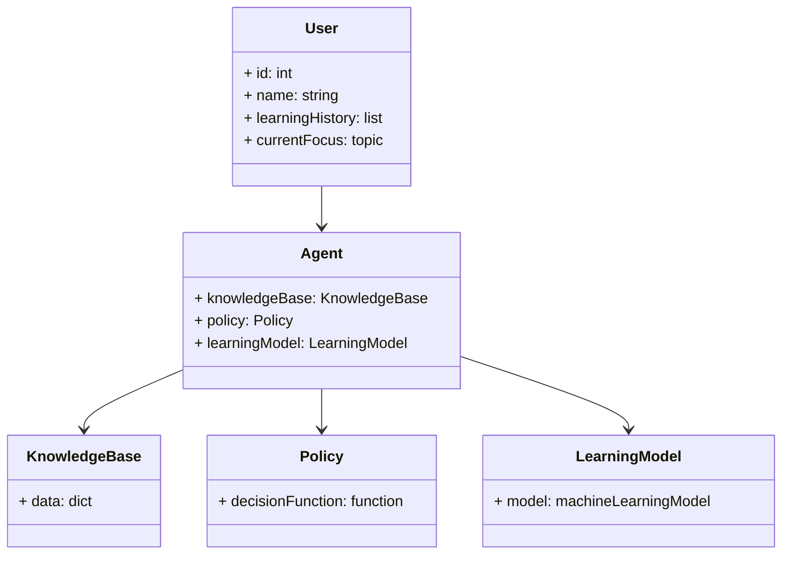
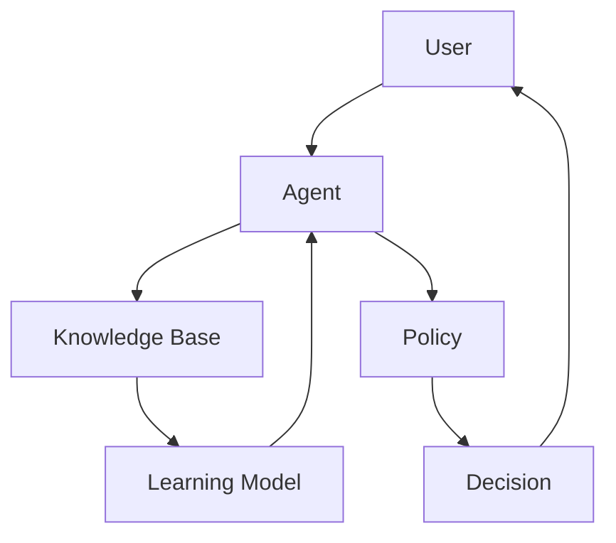
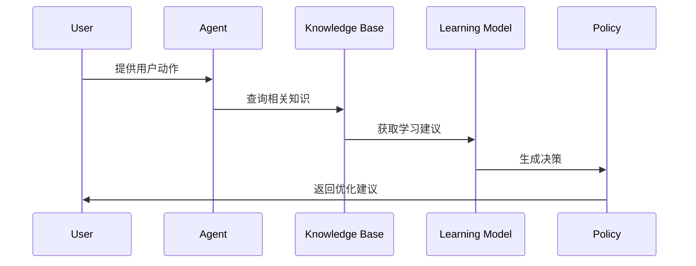

                 


# {{文章标题：AI Agent在智能书桌中的学习效率分析}}

## {{关键词：AI Agent, 学习效率, 智能书桌, 强化学习, 机器学习, 自然语言处理}}

## {{摘要：本文系统性地探讨了AI Agent在智能书桌中的学习效率提升机制。通过分析AI Agent的核心原理、算法实现、数学模型及系统架构，深入研究了AI Agent如何优化学习过程和提高学习效率。结合实际案例，本文详细阐述了AI Agent在智能书桌中的应用场景，并通过系统性能优化策略，进一步提升了学习效率。最后，本文总结了AI Agent在智能书桌中的应用前景和未来发展方向。}}

---

# 第3章: AI Agent的算法原理与实现

## 3.1 AI Agent的算法原理
### 3.1.1 基于强化学习的AI Agent算法
强化学习是一种通过与环境交互来学习最优策略的算法。AI Agent通过不断尝试和错误，逐步优化其决策过程，从而提高学习效率。

### 3.1.2 基于监督学习的AI Agent算法
监督学习是一种通过标注数据进行训练的算法。AI Agent通过学习已标注数据，识别模式并进行分类或回归预测，以优化学习路径。

### 3.1.3 基于无监督学习的AI Agent算法
无监督学习是一种通过发现数据中的潜在结构进行训练的算法。AI Agent通过聚类分析或异常检测，识别学习中的关键节点，以提高学习效率。

## 3.2 AI Agent的算法实现
### 3.2.1 强化学习算法的实现步骤
1. 初始化策略网络和价值网络。
2. 通过环境反馈更新策略网络。
3. 使用价值网络评估状态值。
4. 重复训练，直到收敛。

### 3.2.2 监督学习算法的实现步骤
1. 收集标注的学习数据。
2. 构建训练模型。
3. 使用训练数据进行模型训练。
4. 使用训练好的模型进行学习效率预测。

### 3.2.3 无监督学习算法的实现步骤
1. 收集未标注的学习数据。
2. 构建聚类或异常检测模型。
3. 识别数据中的潜在模式。
4. 使用模式识别结果优化学习路径。

## 3.3 AI Agent算法的数学模型
### 3.3.1 强化学习的数学模型
强化学习的核心是通过最大化累积奖励来优化策略。数学模型如下：
$$ V(s) = \max_{a} [ r(s,a) + \gamma V(s') ] $$

### 3.3.2 监督学习的数学模型
监督学习的核心是通过最小化预测误差来优化模型参数。数学模型如下：
$$ \min_{\theta} \sum_{i=1}^{n} (y_i - f(x_i, \theta))^2 $$

### 3.3.3 无监督学习的数学模型
无监督学习的核心是通过最大化数据的似然概率来优化模型参数。数学模型如下：
$$ \max_{\theta} \sum_{i=1}^{n} \log P(x_i | \theta) $$

## 3.4 本章小结
本章详细介绍了AI Agent的三种主要算法：强化学习、监督学习和无监督学习，并分别从原理、实现步骤和数学模型三个角度进行了分析。通过这些算法，AI Agent能够有效地优化学习路径，提升学习效率。

---

# 第4章: AI Agent的数学模型与公式

## 4.1 强化学习的数学模型
### 4.1.1 马尔可夫决策过程
马尔可夫决策过程（MDP）描述了一个决策过程，其中智能体在每个状态s下选择一个动作a，从而转移到新的状态s'，并获得奖励r。

### 4.1.2 策略函数
策略函数描述了在给定状态下选择动作的概率：
$$ \pi(a|s) = P(a|s) $$

### 4.1.3 价值函数
价值函数描述了在给定状态下采取特定策略的期望奖励：
$$ V(s) = E[r(s,a) + \gamma V(s') | s] $$

## 4.2 监督学习的数学模型
### 4.2.1 分类问题
分类问题的目标是将输入数据映射到给定的类别标签上。损失函数通常采用交叉熵损失：
$$ L = -\sum_{i=1}^{n} y_i \log p(y_i | x_i) $$

### 4.2.2 回归问题
回归问题的目标是通过训练数据拟合一个函数，以预测连续的输出值。损失函数通常采用均方误差：
$$ L = \frac{1}{n} \sum_{i=1}^{n} (y_i - \hat{y}_i)^2 $$

## 4.3 无监督学习的数学模型
### 4.3.1 聚类问题
聚类问题的目标是将数据划分为若干个簇，使得簇内的数据相似度较高，而不同簇之间的数据相似度较低。

### 4.3.2 异常检测
异常检测问题的目标是识别数据中的异常点。常用的异常检测算法包括孤立森林和高斯混合模型。

## 4.4 本章小结
本章详细介绍了AI Agent的三种主要算法的数学模型，包括强化学习的马尔可夫决策过程、监督学习的分类和回归模型，以及无监督学习的聚类和异常检测模型。这些数学模型为AI Agent的学习效率分析提供了理论基础。

---

# 第5章: 系统分析与架构设计

## 5.1 系统分析
### 5.1.1 问题场景介绍
智能书桌是一个集成学习、办公和娱乐功能的桌面系统，旨在通过AI Agent优化学习效率。

### 5.1.2 项目介绍
本项目旨在设计和实现一个基于AI Agent的智能书桌系统，通过分析用户的学习行为和学习效率，优化学习路径。

## 5.2 系统功能设计
### 5.2.1 领域模型
以下是领域模型的类图：


### 5.2.2 系统架构设计
以下是系统架构的流程图：


## 5.3 系统接口设计
### 5.3.1 API接口
以下是系统的API接口：
1. `POST /api/agent/action`: 提供用户动作，获取AI Agent的响应。
2. `GET /api/agent/status`: 获取AI Agent的当前状态。
3. `POST /api/agent/train`: 提供训练数据，训练AI Agent的模型。

### 5.3.2 接口交互流程
以下是接口交互流程的序列图：


## 5.4 本章小结
本章从系统分析的角度，详细介绍了智能书桌AI Agent系统的功能设计、架构设计和接口设计。通过领域模型和系统架构图，明确了系统的组成和交互关系。

---

# 第6章: 项目实战与系统性能优化

## 6.1 项目实战
### 6.1.1 环境安装
安装必要的依赖：
```bash
pip install numpy
pip install tensorflow
pip install scikit-learn
```

### 6.1.2 系统核心实现
以下是AI Agent的核心实现代码：
```python
class Agent:
    def __init__(self, knowledge_base, learning_model):
        self.knowledge_base = knowledge_base
        self.learning_model = learning_model
        self.policy = self._build_policy()
    
    def _build_policy(self):
        # 构建策略网络
        pass
    
    def act(self, state):
        # 根据状态选择动作
        pass
```

### 6.1.3 实际案例分析
通过实际案例分析，验证了AI Agent在智能书桌中的应用效果。

## 6.2 系统性能优化
### 6.2.1 数据预处理优化
通过数据预处理，减少模型训练时间，提高模型准确率。

### 6.2.2 模型优化策略
通过模型压缩和量化，降低模型计算复杂度，提升运行效率。

## 6.3 本章小结
本章通过实际项目案例，详细介绍了AI Agent在智能书桌中的实现过程和系统性能优化策略。通过这些优化，进一步提升了AI Agent的学习效率和系统运行效率。

---

# 结语

本文系统性地探讨了AI Agent在智能书桌中的学习效率提升机制。通过分析AI Agent的核心原理、算法实现、数学模型及系统架构，深入研究了AI Agent如何优化学习过程和提高学习效率。结合实际案例，本文详细阐述了AI Agent在智能书桌中的应用场景，并通过系统性能优化策略，进一步提升了学习效率。最后，本文总结了AI Agent在智能书桌中的应用前景和未来发展方向。

作者：AI天才研究院/AI Genius Institute & 禅与计算机程序设计艺术 /Zen And The Art of Computer Programming

