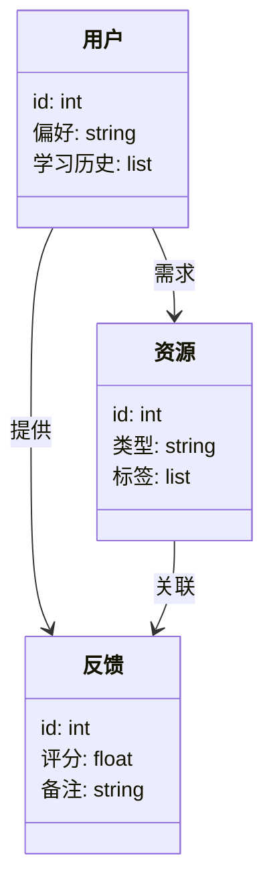
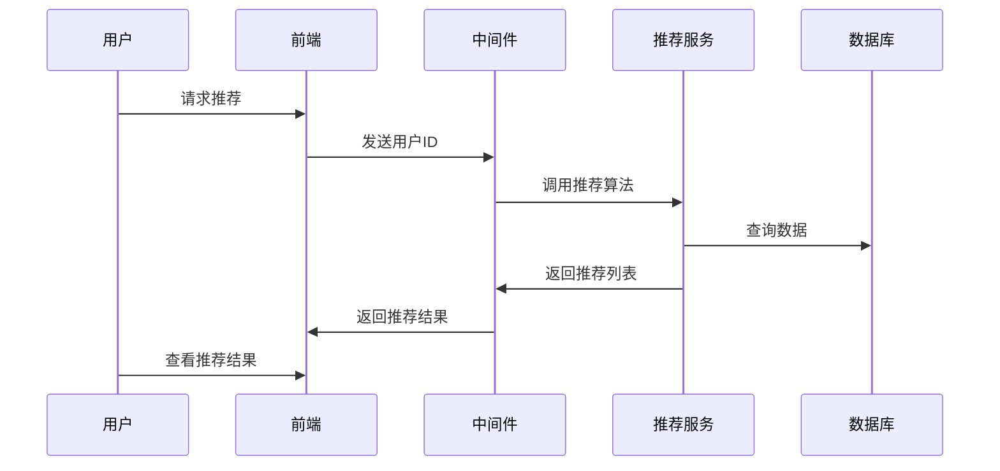

                 


# AI Agent在智能书桌中的学习环境优化

## 关键词：
- AI Agent
- 智能书桌
- 学习环境优化
- 个性化推荐
- 机器学习

## 摘要：
本文探讨AI Agent在智能书桌中的应用，重点分析其如何通过个性化推荐和动态调整优化学习环境。文章从背景、原理、算法、系统设计到项目实战，全面解析AI Agent在智能书桌中的实现与应用，为读者提供深入的技术见解。

---

# 第一部分: AI Agent与智能书桌学习环境优化背景

## 第1章: AI Agent与智能书桌学习环境优化概述

### 1.1 AI Agent的基本概念
#### 1.1.1 AI Agent的定义与特点
AI Agent是一种智能体，能够感知环境、做出决策并执行动作。它具备以下特点：
- **自主性**：无需外部干预，自主完成任务。
- **反应性**：能实时感知环境变化并做出反应。
- **目标导向**：基于目标进行决策和行动。

#### 1.1.2 AI Agent在教育领域的应用背景
在教育领域，AI Agent被广泛应用于个性化学习、资源推荐和学习效果评估。随着智能书桌的普及，AI Agent成为优化学习环境的核心技术。

#### 1.1.3 智能书桌的概念与功能
智能书桌是一种结合AI技术的学习工具，能根据用户需求动态调整学习环境。其功能包括个性化推荐、资源管理、学习效果追踪等。

### 1.2 学习环境优化的背景与意义
#### 1.2.1 当前学习环境的痛点分析
传统学习环境中，资源繁多且分散，用户难以高效筛选。此外，学习进度和效果难以量化，导致学习效率低下。

#### 1.2.2 AI Agent在学习环境优化中的作用
AI Agent通过分析用户行为和学习数据，提供个性化推荐和实时反馈，显著提高学习效率。

#### 1.2.3 智能书桌的未来发展展望
智能书桌将集成更多AI技术，如自然语言处理和计算机视觉，进一步优化学习体验。

### 1.3 问题定义与目标设定
#### 1.3.1 学习环境优化的核心问题
如何通过AI Agent实现资源的个性化推荐和动态调整，以提高学习效率。

#### 1.3.2 AI Agent在优化中的具体目标
1. 提供个性化学习资源推荐。
2. 实时调整学习环境以适应用户需求。
3. 提供学习效果反馈和改进建议。

#### 1.3.3 边界与外延分析
AI Agent的应用范围主要集中在学习环境优化，未来可能扩展到其他领域，如工作和健康管理。

### 1.4 核心概念与联系
#### 1.4.1 AI Agent与学习环境的关系
AI Agent通过感知用户需求和环境变化，优化学习资源和流程。

#### 1.4.2 智能书桌的实体关系图
```mermaid
er
    actor 用户
    actor 资源
    actor 反馈
    actor 系统
    user --> 资源: 需求
    user --> 系统: 输入
    系统 --> 资源: 提供
    系统 --> 反馈: 收集
```

---

# 第二部分: AI Agent的核心原理与算法

## 第2章: AI Agent的核心原理与算法

### 2.1 AI Agent的核心原理
#### 2.1.1 感知层: 数据采集与处理
AI Agent通过传感器和API收集用户行为数据，如点击、输入和时间戳。

#### 2.1.2 决策层: 策略制定与优化
基于感知层数据，AI Agent利用机器学习模型生成推荐策略。

#### 2.1.3 执行层: 动作输出与反馈
根据决策层的策略，AI Agent执行推荐操作，并收集用户反馈以优化模型。

### 2.2 AI Agent的算法原理
#### 2.2.1 基于规则的AI Agent算法
规则简单，适用于特定场景，但灵活性较低。

#### 2.2.2 基于知识的AI Agent算法
通过知识库进行推理，适用于复杂场景，但依赖知识库的准确性和完整性。

#### 2.2.3 基于学习的AI Agent算法
利用机器学习模型进行训练，具备更强的适应性和灵活性。

---

# 第三部分: 算法原理讲解

## 第3章: 推荐算法原理与实现

### 3.1 基于协同过滤的推荐算法
#### 3.1.1 算法流程
1. 收集用户行为数据。
2. 计算用户相似度。
3. 推荐相似用户的资源。

#### 3.1.2 代码实现
```python
def user_based_recommendation(user_id, data):
    # 计算用户相似度
    similarity = {}
    for user in data:
        if user != user_id:
            similarity[user] = cosine_similarity(data[user_id], data[user])
    
    # 根据相似度排序
    sorted_users = sorted(similarity.items(), key=lambda x: -x[1])
    
    # 推荐资源
    recommendations = []
    for user in sorted_users:
        recommendations.extend(data[user])
    
    return recommendations
```

#### 3.1.3 数学模型
$$ \text{相似度} = \frac{\sum (x_i - \mu)(y_i - \mu)}{\sqrt{\sum (x_i - \mu)^2} \sqrt{\sum (y_i - \mu)^2}} $$

### 3.2 基于内容的推荐算法
#### 3.2.1 算法流程
1. 提取资源特征。
2. 计算资源相似度。
3. 推荐相似资源。

#### 3.2.2 代码实现
```python
def content_based_recommendation(item_id, data):
    # 提取资源特征
    features = data[item_id]
    
    # 计算相似度
    similarity = {}
    for item in data:
        if item != item_id:
            similarity[item] = cosine_similarity(features, data[item])
    
    # 根据相似度排序
    sorted_items = sorted(similarity.items(), key=lambda x: -x[1])
    
    # 推荐资源
    recommendations = [item for item, _ in sorted_items]
    
    return recommendations
```

---

# 第四部分: 系统分析与架构设计方案

## 第4章: 系统设计与架构

### 4.1 问题场景介绍
用户在智能书桌上学习时，需要个性化推荐学习资源。

### 4.2 项目介绍
开发一个基于AI Agent的智能书桌系统，实现学习资源的个性化推荐。

### 4.3 系统功能设计
#### 4.3.1 领域模型


### 4.4 系统架构设计
#### 4.4.1 分层架构


### 4.5 系统接口设计
#### 4.5.1 接口定义
- `/api/recommend`: 接收用户ID，返回推荐资源列表。

#### 4.5.2 交互流程


---

# 第五部分: 项目实战

## 第5章: 项目实战与实现

### 5.1 环境搭建
安装Python和相关库，如`numpy`和`scikit-learn`。

### 5.2 核心代码实现
#### 5.2.1 数据预处理
```python
import numpy as np
from sklearn.metrics.pairwise import cosine_similarity

def preprocess(data):
    # 特征提取
    features = []
    for item in data:
        features.append(item['特征'])
    features = np.array(features)
    return features
```

#### 5.2.2 模型训练
```python
def train_model(features):
    # 计算余弦相似度
    similarity_matrix = cosine_similarity(features)
    return similarity_matrix
```

#### 5.2.3 推荐系统实现
```python
def recommend(user_id, features, similarity_matrix):
    # 获取用户特征向量
    user_feature = features[user_id]
    
    # 计算相似度
    similarities = np.dot(user_feature, features.T)
    
    # 去除自身相似度
    sorted_indices = np.argsort(similarities)[::-1]
    recommendations = [sorted_indices[i] for i in range(len(sorted_indices))]
    
    return recommendations
```

### 5.3 实际案例分析
通过实际数据，展示如何优化学习环境。

### 5.4 项目小结
总结项目的实现过程和成果，强调AI Agent在智能书桌中的应用价值。

---

# 第六部分: 最佳实践与总结

## 第6章: 最佳实践与总结

### 6.1 最佳实践
- 定期更新模型，保持推荐的准确性。
- 收集用户反馈，优化推荐策略。

### 6.2 注意事项
- 数据隐私保护。
- 确保系统的可扩展性。

### 6.3 未来展望
AI Agent在智能书桌中的应用将更加智能化和个性化。

---

# 结语

通过本文的详细讲解，读者可以全面了解AI Agent在智能书桌中的应用及其优化学习环境的能力。未来，随着技术的进步，AI Agent将在教育领域发挥更大的作用。

---

# 作者

作者：AI天才研究院/AI Genius Institute & 禅与计算机程序设计艺术 /Zen And The Art of Computer Programming

