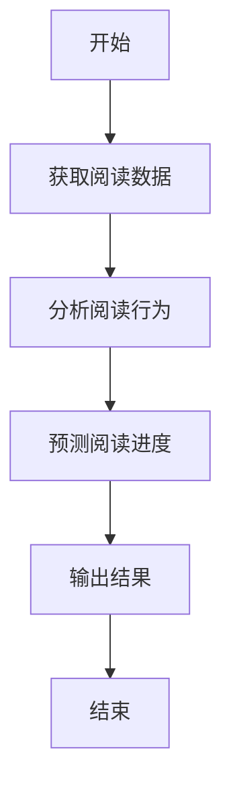
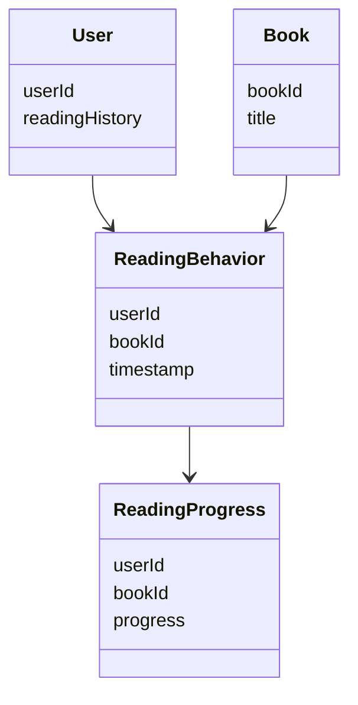
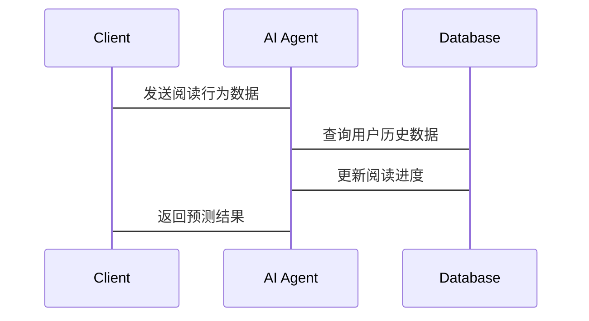

                 


# AI Agent在智能书立中的阅读进度追踪

## 关键词：AI Agent, 智能书立, 阅读进度, 进度追踪, 自然语言处理, 机器学习

## 摘要：  
本文探讨AI Agent在智能书立中如何实现阅读进度的追踪，分析其核心概念、算法原理及系统设计。通过介绍AI Agent的基本原理、阅读进度追踪的需求分析、算法实现和系统架构设计，展示AI技术在智能书立中的应用潜力。文章结合理论与实践，为智能书立的设计和优化提供参考。

---

# 第一部分: AI Agent与智能书立的背景介绍

## 第1章: AI Agent的基本概念与应用背景

### 1.1 AI Agent的定义与核心要素

#### 1.1.1 什么是AI Agent  
AI Agent（人工智能代理）是能够感知环境并采取行动以实现目标的智能实体。它通过传感器接收输入，利用推理机制处理信息，并通过执行器输出动作。AI Agent可以是软件程序、机器人或其他智能系统。

#### 1.1.2 AI Agent的核心要素  
- **感知能力**：通过传感器或数据接口获取环境信息。  
- **推理能力**：利用算法对信息进行分析和决策。  
- **行动能力**：根据推理结果执行操作。  
- **学习能力**：通过反馈优化自身的行为。  

#### 1.1.3 AI Agent的分类与特点  
AI Agent可以分为**反应式**和**认知式**两类：  
- **反应式AI Agent**：实时响应环境变化，通常用于简单任务。  
- **认知式AI Agent**：具备复杂推理和规划能力，适用于复杂场景。  

---

### 1.2 智能书立的定义与应用场景  

#### 1.2.1 智能书立的概念  
智能书立是一种结合了AI技术的书架，能够通过传感器和AI算法实时监测用户的阅读行为，并根据这些行为提供个性化的阅读建议和进度追踪。  

#### 1.2.2 智能书立的主要应用场景  
- **个性化推荐**：根据用户的阅读习惯推荐书籍。  
- **阅读进度管理**：帮助用户追踪阅读进度并制定阅读计划。  
- **行为分析**：分析用户的阅读习惯，提供改进建议。  

#### 1.2.3 智能书立与传统书架的区别  
传统书架仅用于存储和展示书籍，而智能书立通过AI技术实现与用户的互动，能够感知用户的阅读行为并提供智能化的服务。  

---

## 第2章: 阅读进度追踪的背景与问题分析  

### 2.1 阅读进度追踪的定义  
阅读进度追踪是指通过技术手段监测用户的阅读行为，记录用户对书籍的阅读情况，并提供相关的反馈和建议。  

### 2.2 阅读进度追踪的常见问题  
- **数据获取难度**：如何准确获取用户的阅读行为数据。  
- **数据处理复杂性**：如何高效处理和分析海量阅读数据。  
- **用户体验优化**：如何将技术结果转化为用户友好的反馈。  

### 2.3 阅读进度追踪的边界与外延  
- **边界**：仅关注用户的阅读行为，不涉及其他活动。  
- **外延**：结合用户的阅读习惯和兴趣，提供个性化服务。  

---

# 第二部分: AI Agent在阅读进度追踪中的核心概念与联系

## 第3章: AI Agent的核心原理与概念属性

### 3.1 AI Agent的核心原理  
AI Agent通过感知环境、分析信息和执行操作来实现目标。在阅读进度追踪中，AI Agent需要感知用户的阅读行为，分析这些行为以预测用户的阅读进度，并提供相应的反馈。  

### 3.2 AI Agent的概念属性特征对比  

| 属性       | 反应式AI Agent | 认知式AI Agent |  
|------------|----------------|----------------|  
| 感知能力   | 实时感知环境     | 具备上下文理解   |  
| 推理能力   | 基于当前状态     | 基于历史数据     |  
| 学习能力   | 无               | 具备学习能力     |  
| 应用场景   | 简单任务         | 复杂场景         |  

### 3.3 AI Agent的ER实体关系图  

```mermaid
erd
    title ER图
    User
    ReadingBehavior
    Book
    ReadingProgress
    User -|many-> ReadingBehavior
    ReadingBehavior -|many-> Book
    ReadingBehavior -|many-> ReadingProgress
```

---

## 第4章: AI Agent与阅读进度追踪的关联  

### 4.1 AI Agent在阅读进度追踪中的作用  
AI Agent能够实时监测用户的阅读行为，分析这些行为以预测用户的阅读进度，并提供个性化的反馈和建议。  

### 4.2 阅读进度追踪对AI Agent的需求  
- **实时监测**：需要快速响应用户的阅读行为。  
- **精准分析**：需要准确预测用户的阅读进度。  
- **个性化服务**：需要根据用户的行为提供定制化的建议。  

### 4.3 AI Agent与阅读进度追踪的结合方式  
AI Agent通过传感器获取用户的阅读行为数据，利用算法分析这些数据以预测阅读进度，并通过反馈机制为用户提供个性化的阅读建议。  

---

# 第三部分: AI Agent阅读进度追踪的算法原理与数学模型

## 第5章: 阅读进度追踪的算法原理  

### 5.1 算法原理概述  
阅读进度追踪算法主要基于用户的阅读行为数据，通过机器学习模型预测用户的阅读进度。  

### 5.2 算法流程图  



### 5.3 算法实现代码  

```python
def track_reading_progress(data):
    # 数据预处理
    processed_data = preprocess(data)
    # 行为分析
    behavior_analysis = analyze_behavior(processed_data)
    # 预测进度
    predicted_progress = predict_progress(behavior_analysis)
    return predicted_progress
```

---

## 第6章: AI Agent阅读进度追踪的数学模型与公式

### 6.1 阅读进度预测模型  

$$ P = \theta \cdot X + b $$  

其中，  
- \( P \) 表示预测的阅读进度，  
- \( \theta \) 表示模型参数，  
- \( X \) 表示输入的特征向量，  
- \( b \) 表示偏置项。  

### 6.2 模型优化公式  

$$ \theta = \theta - \alpha \cdot \frac{\partial L}{\partial \theta} $$  

其中，  
- \( \alpha \) 表示学习率，  
- \( L \) 表示损失函数。  

---

# 第四部分: 系统分析与架构设计方案

## 第7章: 系统分析与架构设计

### 7.1 问题场景介绍  
用户在智能书立中阅读书籍，系统需要实时监测用户的阅读行为，并预测用户的阅读进度。  

### 7.2 系统功能设计  

#### 7.2.1 领域模型设计  



---

### 7.3 系统架构设计  


---

### 7.4 系统接口设计  
- **输入接口**：接收用户的阅读行为数据。  
- **输出接口**：输出预测的阅读进度。  

### 7.5 系统交互流程  



---

# 第五部分: 项目实战

## 第8章: 项目实战

### 8.1 环境安装  
- Python 3.8+  
- TensorFlow 2.0+  
- Jupyter Notebook  

### 8.2 系统核心实现  

#### 8.2.1 数据预处理  

```python
def preprocess(data):
    # 数据清洗和特征提取
    processed_data = []
    for record in data:
        processed_record = {
            'userId': record['userId'],
            'bookId': record['bookId'],
            'timestamp': record['timestamp']
        }
        processed_data.append(processed_record)
    return processed_data
```

#### 8.2.2 行为分析  

```python
def analyze_behavior(data):
    # 统计用户阅读频率和时长
    user_behavior = {}
    for record in data:
        user_id = record['userId']
        book_id = record['bookId']
        timestamp = record['timestamp']
        if user_id not in user_behavior:
            user_behavior[user_id] = {'total_time': 0, 'book_count': 0}
        user_behavior[user_id]['total_time'] += timestamp
        user_behavior[user_id]['book_count'] += 1
    return user_behavior
```

#### 8.2.3 预测进度  

```python
def predict_progress(behavior):
    # 简单线性回归预测
    import numpy as np
    X = []
    y = []
    for user in behavior.values():
        X.append(user['book_count'])
        y.append(user['total_time'])
    X = np.array(X).reshape(-1, 1)
    y = np.array(y)
    from sklearn.linear_model import LinearRegression
    model = LinearRegression()
    model.fit(X, y)
    return model
```

### 8.3 案例分析  

#### 8.3.1 数据分析结果  
通过分析用户的阅读行为数据，我们可以预测用户的阅读进度，并为用户提供个性化的阅读建议。  

#### 8.3.2 项目小结  
本项目展示了AI Agent在智能书立中的应用潜力，通过算法实现阅读进度的预测和追踪，为用户提供智能化的阅读体验。  

---

# 第六部分: 最佳实践与小结

## 第9章: 最佳实践与小结

### 9.1 最佳实践 tips  
- 定期更新模型以保持预测精度。  
- 结合用户反馈优化阅读建议。  

### 9.2 小结  
本文详细介绍了AI Agent在智能书立中的阅读进度追踪的应用，通过理论分析和项目实践展示了其技术实现和实际价值。  

### 9.3 注意事项  
- 数据隐私保护是重要问题。  
- 算法的可解释性需要进一步优化。  

### 9.4 拓展阅读  
- 推荐阅读《AI系统设计》和《机器学习实战》以深入了解相关技术。  

---

作者：AI天才研究院/AI Genius Institute & 禅与计算机程序设计艺术 /Zen And The Art of Computer Programming

