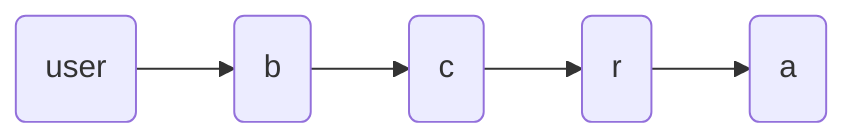
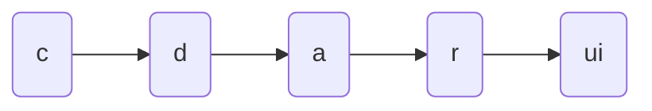

                 


# AI Agent在智能书签中的阅读习惯优化

> 关键词：AI Agent, 智能书签, 阅读习惯优化, 推荐算法, 系统架构

> 摘要：本文探讨了AI Agent在智能书签中的应用，通过分析阅读习惯优化的核心问题，详细讲解了AI Agent的感知、决策和执行模块，结合推荐算法和系统架构设计，展示了如何通过AI技术提升阅读效率和个性化体验。

---

## 第一部分: AI Agent与智能书签的背景介绍

### 第1章: AI Agent的基本概念与应用背景

#### 1.1 AI Agent的定义与核心特点
- **AI Agent的定义**：AI Agent（人工智能代理）是指能够感知环境、自主决策并执行任务的智能实体。它通过传感器获取信息，利用推理引擎进行分析，并通过执行器采取行动。
- **AI Agent的核心特点**：
  1. **自主性**：能够在没有外部干预的情况下独立运作。
  2. **反应性**：能够实时感知环境变化并做出相应调整。
  3. **目标导向**：以明确的目标为导向，优化决策过程。
  4. **学习能力**：能够通过数据和经验不断优化自身行为。
- **AI Agent与传统软件代理的区别**：
  | 特性 | AI Agent | 传统软件代理 |
  |------|----------|--------------|
  | 智能性 | 高       | 低           |
  | 自主性 | 高       | 低           |
  | 学习能力 | 高      | 无           |

#### 1.2 智能书签的定义与功能
- **智能书签的定义**：智能书签是一种结合人工智能技术的数字书签工具，能够根据用户的阅读行为和偏好，智能推荐相关内容，并优化用户的阅读习惯。
- **智能书签的功能**：
  1. **内容推荐**：根据用户的阅读历史和兴趣，推荐相关文章、书籍或网页。
  2. **阅读习惯分析**：通过分析用户的阅读时间、速度和偏好，提供个性化的阅读建议。
  3. **个性化阅读计划**：根据用户的阅读目标，制定并调整阅读计划。
- **智能书签的应用场景**：
  1. **个人阅读优化**：帮助用户更高效地阅读和学习。
  2. **企业知识管理**：用于组织和管理企业知识库中的文档。
  3. **在线教育平台**：为学习者推荐学习材料，提升学习效果。

### 第2章: 阅读习惯优化的背景与问题分析

#### 2.1 阅读习惯优化的背景
- **数字化阅读的普及**：随着互联网和移动设备的普及，数字化阅读已成为主要的阅读方式。
- **用户信息过载的问题**：用户每天面对海量信息，如何筛选出有价值的内容成为挑战。
- **阅读效率提升的需求**：用户希望在有限的时间内获取最大价值的信息。

#### 2.2 阅读习惯优化的核心问题
- **问题1：阅读内容的选择与推荐**：
  - 用户需要根据自己的兴趣和目标选择合适的阅读内容。
  - 传统书签无法根据用户的阅读习惯动态调整推荐内容。
- **问题2：阅读时间的合理分配**：
  - 用户可能在不合适的时间阅读不合适的内容，影响阅读效果。
  - 如何根据用户的空闲时间和阅读偏好推荐合适的内容。
- **问题3：阅读效果的评估与反馈**：
  - 如何评估用户的阅读效果，并根据反馈调整推荐策略。

#### 2.3 AI Agent在阅读习惯优化中的作用
- **AI Agent如何提升阅读效率**：
  - 通过分析用户的阅读历史和行为，推荐高质量的内容。
  - 根据用户的阅读速度和时间，优化阅读计划。
- **AI Agent如何个性化推荐阅读内容**：
  - 基于用户的兴趣和目标，实时调整推荐策略。
  - 利用协同过滤和内容推荐算法，提升推荐的准确性。
- **AI Agent如何分析阅读行为**：
  - 分析用户的阅读习惯，识别用户的阅读偏好。
  - 根据阅读行为数据，优化推荐算法。

### 第3章: AI Agent与智能书签的结合

#### 3.1 AI Agent在智能书签中的核心功能
- **功能1：内容推荐**：
  - 根据用户的阅读历史和兴趣，推荐相关文章和书籍。
  - 使用基于内容的推荐和协同过滤推荐算法。
- **功能2：阅读习惯分析**：
  - 分析用户的阅读时间、速度和偏好，提供个性化阅读建议。
  - 通过机器学习模型预测用户的阅读行为。
- **功能3：个性化阅读计划制定**：
  - 根据用户的阅读目标和习惯，制定个性化阅读计划。
  - 动态调整计划，确保用户高效完成阅读目标。

---

## 第二部分: AI Agent的核心概念与联系

### 第4章: AI Agent的核心概念与原理

#### 4.1 AI Agent的核心模块
- **感知模块**：
  - 通过传感器或API获取用户的阅读数据，包括阅读内容、时间、速度等。
  - 示例：使用Google Analytics获取用户的阅读行为数据。
- **决策模块**：
  - 根据感知模块获取的数据，利用推荐算法生成推荐内容。
  - 示例：基于用户的阅读历史，推荐相关文章。
- **执行模块**：
  - 根据决策模块生成的推荐结果，执行相应的操作，例如标记书签、发送通知等。
  - 示例：向用户的阅读列表中添加推荐文章。

#### 4.2 AI Agent的核心原理
- **感知-决策-执行循环**：
  - 感知模块获取数据 -> 决策模块生成推荐 -> 执行模块执行操作。
  - 通过不断循环优化推荐结果。

#### 4.3 AI Agent在智能书签中的实体关系图


---

## 第三部分: AI Agent的算法原理与数学模型

### 第5章: 推荐算法的原理与实现

#### 5.1 基于内容的推荐算法
- **算法原理**：
  - 根据用户的阅读历史和兴趣，推荐与已读内容相似的文章。
  - 使用余弦相似度或欧几里得距离计算内容的相关性。
  - 示例：
    ```python
    from sklearn.metrics.pairwise import cosine_similarity
    user_profile = [1, 2, 3, 4]
    content_profiles = [
        [2, 3, 4, 5],
        [1, 1, 1, 1],
        [3, 4, 5, 6]
    ]
    similarity = cosine_similarity([user_profile], content_profiles)
    ```
- **数学模型**：
  $$ \text{similarity} = \frac{\vec{u} \cdot \vec{v}}{||\vec{u}|| \cdot ||\vec{v}||} $$

#### 5.2 基于协同过滤的推荐算法
- **算法原理**：
  - 根据用户的行为数据，找到与用户兴趣相似的其他用户或内容。
  - 使用矩阵分解技术（如SVD）进行推荐。
  - 示例：
    ```python
    from sklearn.decomposition import TruncatedSVD
    user_ratings = [
        [4, 3, 2],
        [5, 1, 3],
        [3, 4, 2]
    ]
    svd = TruncatedSVD(n_components=2)
    user_factors = svd.fit_transform(user_ratings)
    ```
- **数学模型**：
  $$ \text{预测评分} = \vec{u}^T \vec{v} $$

---

## 第四部分: AI Agent的系统分析与架构设计

### 第6章: 系统分析与架构设计

#### 6.1 问题场景介绍
- **问题场景**：
  - 用户需要一个智能书签工具，帮助优化阅读习惯。
  - 工具需要支持内容推荐、阅读习惯分析和个性化阅读计划制定。
  - 系统需要处理大量的阅读数据，并实时更新推荐结果。

#### 6.2 系统功能设计
- **功能模块**：
  1. **数据采集模块**：收集用户的阅读数据，包括阅读时间、内容、速度等。
  2. **数据分析模块**：分析用户的阅读行为，生成阅读报告。
  3. **推荐算法模块**：基于分析结果，生成推荐内容。
  4. **用户界面模块**：展示推荐内容和阅读建议。

#### 6.3 系统架构设计


#### 6.4 接口设计与交互流程
- **接口设计**：
  - 数据采集模块通过API获取用户的阅读数据。
  - 推荐算法模块通过API向用户界面模块发送推荐结果。
- **交互流程**：
  1. 用户打开智能书签工具。
  2. 数据采集模块获取用户的阅读数据。
  3. 数据分析模块分析数据，生成阅读报告。
  4. 推荐算法模块根据分析结果生成推荐内容。
  5. 用户界面模块展示推荐内容和阅读建议。

---

## 第五部分: 项目实战与应用案例

### 第7章: 项目实战与应用案例

#### 7.1 环境安装与配置
- **开发环境**：
  - Python 3.8+
  - Jupyter Notebook
  - pip install scikit-learn
  - pip install mermaid

#### 7.2 系统核心实现
- **推荐算法实现**：
  ```python
  from sklearn.metrics.pairwise import cosine_similarity

  def content_based_recommendation(user_profile, content_profiles):
      similarity = cosine_similarity([user_profile], content_profiles)
      return similarity.argsort()[0][::-1][:3]
  ```

- **系统交互流程实现**：
  ```python
  def main():
      while True:
          user_input = input("请输入文章链接或退出(q): ")
          if user_input == "q":
              break
          print("推荐内容：", content_based_recommendation(user_profile, content_profiles))
  ```

#### 7.3 项目小结与经验总结
- **项目小结**：
  - 成功实现了一个基于内容的推荐算法，并将其应用于智能书签。
  - 通过系统架构设计，实现了推荐结果的实时更新和展示。
- **经验总结**：
  - 数据质量和多样性对推荐算法的效果至关重要。
  - 用户反馈是优化推荐算法的重要来源。
  - 系统设计需要充分考虑扩展性和可维护性。

---

## 第六部分: 最佳实践与拓展阅读

### 第8章: 最佳实践与注意事项

#### 8.1 最佳实践
- **数据预处理**：
  - 对用户数据进行清洗和归一化处理，确保数据质量。
- **模型调优**：
  - 使用交叉验证和网格搜索优化推荐算法的参数。
- **用户隐私保护**：
  - 确保用户数据的安全性和隐私性，避免数据泄露。

#### 8.2 注意事项
- **数据稀疏性**：
  - 在用户数量较少的情况下，基于协同过滤的推荐算法效果不佳。
- **计算效率**：
  - 对于大规模数据，需要优化推荐算法的计算效率，避免性能瓶颈。

### 第9章: 小结与展望

#### 9.1 小结
- 本文详细介绍了AI Agent在智能书签中的应用，通过背景介绍、核心概念、算法原理和系统架构设计，展示了如何通过AI技术优化用户的阅读习惯。

#### 9.2 未来展望
- **多模态推荐**：结合文本、图像和视频等多种模态信息，提升推荐的准确性。
- **个性化阅读计划**：根据用户的阅读目标和时间安排，动态调整阅读计划。
- **智能化反馈机制**：通过实时反馈优化推荐算法，提升用户体验。

---

## 作者：AI天才研究院 & 禅与计算机程序设计艺术

---

感谢您的阅读！如果需要进一步的技术支持或详细代码示例，请随时联系。

