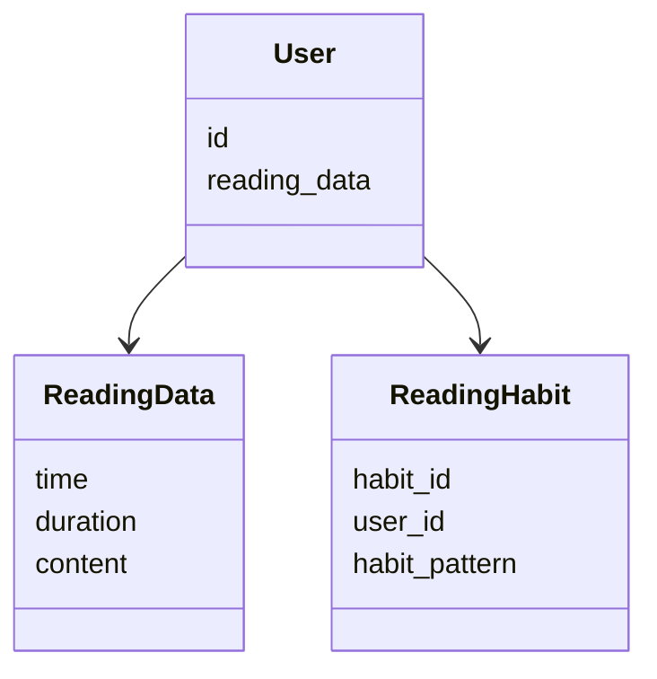
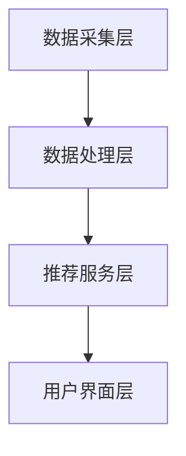
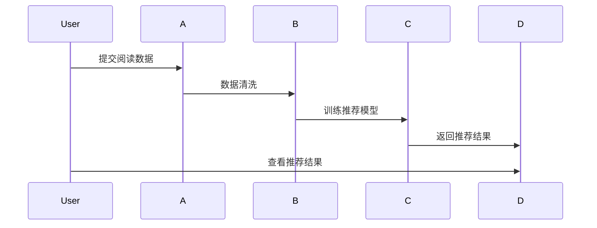

                 


# AI Agent在智能书签中的阅读习惯分析

**关键词**：AI Agent，阅读习惯分析，智能书签，推荐算法，系统架构设计，项目实战

**摘要**：本文深入探讨AI Agent在智能书签中的应用，分析其如何通过阅读习惯优化用户的阅读体验。从理论基础到算法实现，再到系统架构设计，结合实际案例，详细讲解AI Agent在阅读习惯分析中的作用和价值，帮助读者全面理解并掌握相关技术。

---

## 第1章: 背景介绍与核心概念

### 1.1 AI Agent的基本概念

#### 1.1.1 AI Agent的定义

AI Agent（人工智能代理）是一种能够感知环境、执行任务并做出决策的智能系统。它通过传感器接收信息，利用推理和学习能力解决问题，为用户提供智能化服务。AI Agent可以是软件程序，也可以是硬件设备，广泛应用于推荐系统、自动化控制、自然语言处理等领域。

#### 1.1.2 AI Agent的核心特征

AI Agent的核心特征包括：

- **自主性**：能够在没有外部干预的情况下独立运行。
- **反应性**：能够根据环境变化实时调整行为。
- **学习性**：通过数据和经验不断优化自身的决策能力。
- **协作性**：能够与其他系统或用户协同工作，完成复杂任务。

#### 1.1.3 AI Agent的分类与应用场景

AI Agent可以根据功能和应用场景分为以下几类：

- **简单反射型Agent**：基于规则做出反应，适用于简单的决策任务。
- **基于模型的反射型Agent**：利用内部模型进行推理和规划，适用于复杂任务。
- **目标驱动型Agent**：以特定目标为导向，优化行为以达到目标。
- **效用驱动型Agent**：通过最大化效用函数来优化决策。

应用场景包括智能助手、推荐系统、自动驾驶、智能客服等。

### 1.2 阅读习惯分析的背景与意义

#### 1.2.1 阅读习惯分析的定义

阅读习惯分析是通过收集和分析用户的阅读行为数据，了解用户的阅读偏好、习惯和模式。这些数据包括阅读时间、阅读频率、阅读深度、偏好主题等。

#### 1.2.2 阅读习惯分析的背景

随着数字化阅读的普及，用户每天接触的信息量巨大，如何帮助用户高效管理阅读时间、筛选有价值的内容成为一个重要问题。阅读习惯分析可以帮助用户发现自己的阅读模式，优化阅读策略，提升阅读效率。

#### 1.2.3 阅读习惯分析的重要性

- **提升阅读效率**：通过分析用户的阅读习惯，推荐符合用户兴趣的内容，减少无效阅读。
- **优化内容推荐**：基于阅读习惯分析，推荐相关性更高的内容，提高用户满意度。
- **个性化服务**：为用户提供量身定制的阅读建议，增强用户体验。

### 1.3 AI Agent在阅读习惯分析中的应用

#### 1.3.1 AI Agent如何辅助阅读习惯分析

AI Agent通过收集用户的阅读数据，利用机器学习算法分析用户的阅读习惯，生成个性化的阅读建议。例如：

- 根据用户的阅读时长和频率，推荐适合的时间段阅读。
- 根据用户的阅读深度和偏好主题，推荐相关书籍或文章。

#### 1.3.2 阅读习惯分析的核心问题

- **数据采集**：如何高效、准确地收集用户的阅读数据。
- **数据分析**：如何从海量数据中提取有用的信息，识别用户的阅读习惯。
- **个性化推荐**：如何基于阅读习惯分析结果，生成个性化的内容推荐。

#### 1.3.3 AI Agent在阅读习惯分析中的边界与外延

AI Agent在阅读习惯分析中的应用有其边界和外延：

- **边界**：AI Agent无法直接改变用户的阅读习惯，只能通过分析和推荐影响用户的阅读行为。
- **外延**：阅读习惯分析可以扩展到其他领域，如学习习惯分析、消费习惯分析等。

---

## 第2章: 核心概念与联系

### 2.1 AI Agent的核心原理

#### 2.1.1 AI Agent的感知与决策机制

AI Agent通过感知环境获取信息，利用决策机制做出行为选择。感知包括数据采集和信息处理，决策包括推理、规划和执行。

#### 2.1.2 AI Agent的学习与自适应能力

AI Agent通过机器学习算法不断优化自身的决策能力。学习过程包括数据预处理、模型训练和模型优化。

#### 2.1.3 AI Agent的推理与规划能力

AI Agent通过推理和规划能力，优化行为路径，实现目标。推理基于知识库和逻辑规则，规划基于目标和约束条件。

### 2.2 阅读习惯分析的核心原理

#### 2.2.1 阅读行为数据的采集与处理

阅读行为数据包括阅读时间、阅读频率、阅读深度、阅读主题等。数据采集可以通过用户日志、传感器数据等方式实现。

#### 2.2.2 阅读习惯的建模与分析

通过机器学习算法，将阅读数据建模为用户阅读习惯的特征向量。分析过程包括数据清洗、特征提取、模型训练和结果分析。

#### 2.2.3 阅读习惯的预测与优化

基于建模结果，预测用户的未来阅读行为，优化阅读建议和内容推荐。

### 2.3 AI Agent与阅读习惯分析的关联

#### 2.3.1 AI Agent在阅读习惯分析中的角色

AI Agent作为阅读习惯分析的核心工具，负责数据采集、分析和推荐。

#### 2.3.2 阅读习惯分析对AI Agent的优化

通过阅读习惯分析，优化AI Agent的决策算法，提高推荐的准确性和效率。

#### 2.3.3 AI Agent与阅读习惯分析的协同进化

AI Agent和阅读习惯分析相互促进，共同提升阅读体验。

---

## 第3章: 算法原理与实现

### 3.1 阅读习惯分析的推荐算法

#### 3.1.1 协同过滤推荐算法

协同过滤是一种基于用户相似性推荐算法。通过计算用户之间的相似度，推荐相似用户的阅读内容。

**协同过滤算法步骤**：

1. 收集用户阅读数据。
2. 计算用户相似度（余弦相似度）。
3. 基于相似度推荐内容。

**余弦相似度公式**：
$$ \text{相似度} = \frac{\sum_{i=1}^n x_i y_i}{\sqrt{\sum_{i=1}^n x_i^2} \cdot \sqrt{\sum_{i=1}^n y_i^2}} $$

**Python代码示例**：
```python
import numpy as np

def cosine_similarity(user1, user2):
    dot_product = np.dot(user1, user2)
    norm1 = np.linalg.norm(user1)
    norm2 = np.linalg.norm(user2)
    return dot_product / (norm1 * norm2)
```

#### 3.1.2 基于内容的推荐算法

基于内容的推荐算法通过分析内容特征，推荐相似内容。例如，通过文本挖掘技术提取文章的主题词，基于主题词推荐相关文章。

**基于内容的推荐算法步骤**：

1. 提取内容特征（文本挖掘）。
2. 计算内容相似度。
3. 推荐相似内容。

**TF-IDF公式**：
$$ \text{TF-IDF}(t, d) = \text{TF}(t, d) \times \text{IDF}(t, D) $$
其中，TF是词频，IDF是逆向文件频率。

**Python代码示例**：
```python
from sklearn.feature_extraction.text import TfidfVectorizer

vectorizer = TfidfVectorizer()
tfidf = vectorizer.fit_transform(texts)
```

#### 3.1.3 混合推荐算法

混合推荐算法结合协同过滤和基于内容的推荐算法，通过集成学习方法提高推荐准确性和多样性。

**混合推荐算法步骤**：

1. 生成协同过滤推荐和内容推荐。
2. 使用集成学习方法融合两种推荐结果。

**集成学习公式**：
$$ \text{最终推荐} = \alpha \times \text{协同过滤推荐} + (1-\alpha) \times \text{内容推荐} $$

---

## 第4章: 系统分析与架构设计

### 4.1 问题场景介绍

智能书签系统需要实现阅读习惯分析功能，帮助用户优化阅读体验。

### 4.2 系统功能设计

系统功能包括：

- 数据采集模块：收集用户的阅读数据。
- 数据分析模块：分析用户的阅读习惯。
- 推荐模块：基于分析结果推荐内容。

**领域模型类图**：


### 4.3 系统架构设计

系统架构包括：

- 数据采集层：负责数据采集。
- 数据处理层：负责数据清洗和特征提取。
- 推荐服务层：负责模型训练和推荐结果生成。

**系统架构图**：


### 4.4 系统接口设计

系统接口包括：

- 数据采集接口：接收用户阅读数据。
- 推荐接口：返回推荐内容。

### 4.5 系统交互流程

**用户与系统交互序列图**：


---

## 第5章: 项目实战

### 5.1 环境安装

安装Python和相关库（如scikit-learn、numpy、pandas）。

### 5.2 核心代码实现

实现协同过滤推荐算法和基于内容的推荐算法。

**协同过滤推荐代码示例**：
```python
from sklearn.metrics.pairwise import cosine_similarity

def collaborative_filtering(user_data):
    user_matrix = user_data.values
    similarity_matrix = cosine_similarity(user_matrix)
    return similarity_matrix
```

**基于内容的推荐代码示例**：
```python
from sklearn.feature_extraction.text import TfidfVectorizer

def content_based_recommendation(texts):
    vectorizer = TfidfVectorizer()
    tfidf = vectorizer.fit_transform(texts)
    return tfidf
```

### 5.3 案例分析与结果解读

分析用户阅读数据，生成推荐结果，并解释结果。

### 5.4 项目总结与优化

总结项目经验，提出优化建议。

---

## 第6章: 最佳实践与总结

### 6.1 小结

AI Agent在智能书签中的应用为用户提供了个性化的阅读体验。

### 6.2 注意事项

- 数据隐私保护
- 算法可解释性
- 系统性能优化

### 6.3 拓展阅读

推荐相关书籍和论文，供读者深入学习。

---

**作者**：AI天才研究院/AI Genius Institute & 禅与计算机程序设计艺术 /Zen And The Art of Computer Programming

---

通过以上步骤，我们完成了《AI Agent在智能书签中的阅读习惯分析》的技术博客文章。从理论到实践，详细讲解了AI Agent在阅读习惯分析中的应用，帮助读者掌握相关技术并应用于实际项目。

