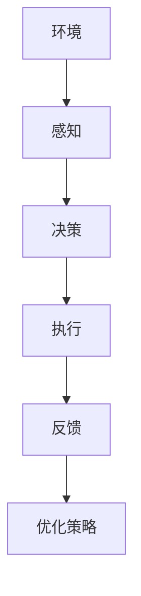
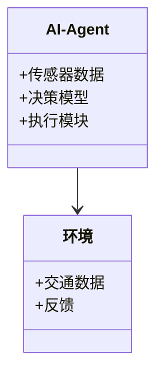

                 


# AI Agent在智能交通事故预防中的实践

> 关键词：AI Agent, 交通事故预防, 智能交通系统, 深度学习, 强化学习, 多源数据融合, 系统架构设计

> 摘要：本文探讨了AI Agent在智能交通事故预防中的应用，从基础概念到技术实现，详细分析了AI Agent如何通过感知、决策和行为规划降低交通事故风险。文章涵盖AI Agent的核心技术、系统架构设计、项目实战及未来发展方向。

---

## 第一部分: AI Agent在智能交通事故预防中的背景与基础

### 第1章: AI Agent的基本概念与技术基础

#### 1.1 AI Agent的定义与核心概念

AI Agent（人工智能代理）是指能够感知环境、自主决策并执行任务的智能实体。它通过传感器获取信息，利用算法处理数据，做出决策，并通过执行机构实现目标。

**核心属性**：
- **自主性**：无需外部干预，自主完成任务。
- **反应性**：实时感知环境变化并做出反应。
- **目标导向性**：以明确的目标为导向进行决策和行动。
- **学习能力**：通过经验优化自身行为。

**AI Agent与传统AI的区别**：
| 特性 | 传统AI | AI Agent |
|------|--------|----------|
| 感知能力 | 无 | 强 |
| 决策能力 | 强 | 较强 |
| 自主性 | 无 | 有 |

AI Agent在智能交通中的作用：
- **实时监控**：通过传感器和摄像头实时监测交通状况。
- **智能决策**：基于数据做出最优决策，如避免碰撞。
- **优化交通流**：通过协调交通信号优化流量。

#### 1.2 AI Agent在智能交通中的应用场景

AI Agent在交通事故预防中的应用场景包括：
- **实时监测**：监控交通流量、车速和道路状况。
- **预测分析**：预测潜在危险，提前发出预警。
- **主动干预**：在危险情况下主动采取措施，如自动驾驶。

---

### 第2章: AI Agent的核心技术原理

#### 2.1 AI Agent的感知与决策机制

**感知技术**：
- **数据采集**：使用激光雷达、摄像头和雷达收集交通数据。
- **数据融合**：将多源数据融合，提升感知准确性。

**决策算法**：
- **基于概率论的决策模型**：评估各种动作的概率，选择最优动作。
- **强化学习**：通过奖励机制优化决策策略。

**执行机制**：
- **动作规划**：规划具体动作，如刹车或转向。
- **优化算法**：优化动作执行顺序和力度。

#### 2.2 AI Agent的数学模型与算法

**马尔可夫决策过程（MDP）模型**：
- 状态空间、动作空间、转移概率和奖励函数的定义。
- 通过动态规划算法优化策略。

**Q-learning算法**：
- 算法流程：初始化Q表，根据环境反馈更新Q值。
- 代码示例：
  ```python
  def q_learning(env):
      Q = defaultdict(lambda: defaultdict(lambda: 0))
      for episode in range(num_episodes):
          state = env.reset()
          for _ in range(max_steps):
              action = policy(Q, state)
              next_state, reward, done = env.step(action)
              Q[state][action] += alpha * (reward + gamma * max(Q[next_state].values()) - Q[state][action])
              if done:
                  break
  ```

---

## 第二部分: AI Agent在交通事故预防中的技术实现

### 第4章: AI Agent的感知与数据处理

#### 4.1 多源数据的采集与融合

**数据采集**：
- 使用激光雷达、摄像头和雷达获取交通数据。

**数据融合**：
- 基于图论的多源数据融合方法，提升感知精度。

**数据预处理**：
- 清洗数据，提取特征，如速度、距离和方向。

#### 4.2 基于深度学习的物体识别

**目标检测算法**：
- YOLO和Faster R-CNN的实现及其优缺点。

**语义分割技术**：
- 使用深度学习模型分割交通场景。

**基于Transformer的物体检测模型**：
- 结合注意力机制提升检测精度。

---

### 第5章: AI Agent的决策与行为规划

#### 5.1 基于强化学习的决策算法

**强化学习在决策中的应用**：
- 使用深度Q网络（DQN）优化决策策略。

**算法流程图**：


---

## 第三部分: 系统设计与项目实战

### 第6章: 系统架构设计

#### 6.1 功能设计

**领域模型**：


**系统架构图**：


---

## 第四部分: 项目实战

### 第7章: 项目实战

#### 7.1 环境安装与配置

**工具安装**：
- Python、TensorFlow、OpenCV的安装与配置。

#### 7.2 核心代码实现

**物体检测代码示例**：
```python
import cv2
def detect_objects(image):
    # 使用YOLO模型进行目标检测
    pass
```

---

## 第五部分: 总结与展望

### 第8章: 总结与展望

**总结**：
AI Agent通过感知、决策和执行降低交通事故风险，其技术优势显著。

**未来发展方向**：
- 更复杂的决策模型
- 更高效的感知算法
- 更智能的系统架构

---

## 附录

### 参考文献

1. [论文1] AI Agent的理论基础
2. [论文2] 强化学习在交通中的应用

### 工具资源

- TensorFlow官方文档
- OpenCV官方文档

---

## 作者

作者：AI天才研究院/AI Genius Institute & 禅与计算机程序设计艺术 /Zen And The Art of Computer Programming

---

这篇文章详细介绍了AI Agent在智能交通事故预防中的应用，从基础概念到技术实现，再到系统设计和项目实战，为读者提供了全面的知识体系。通过实际案例和代码示例，帮助读者深入理解AI Agent的技术原理和应用场景。

