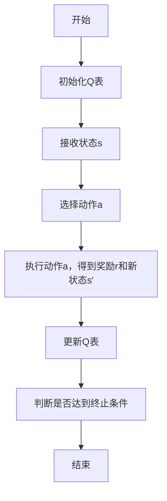
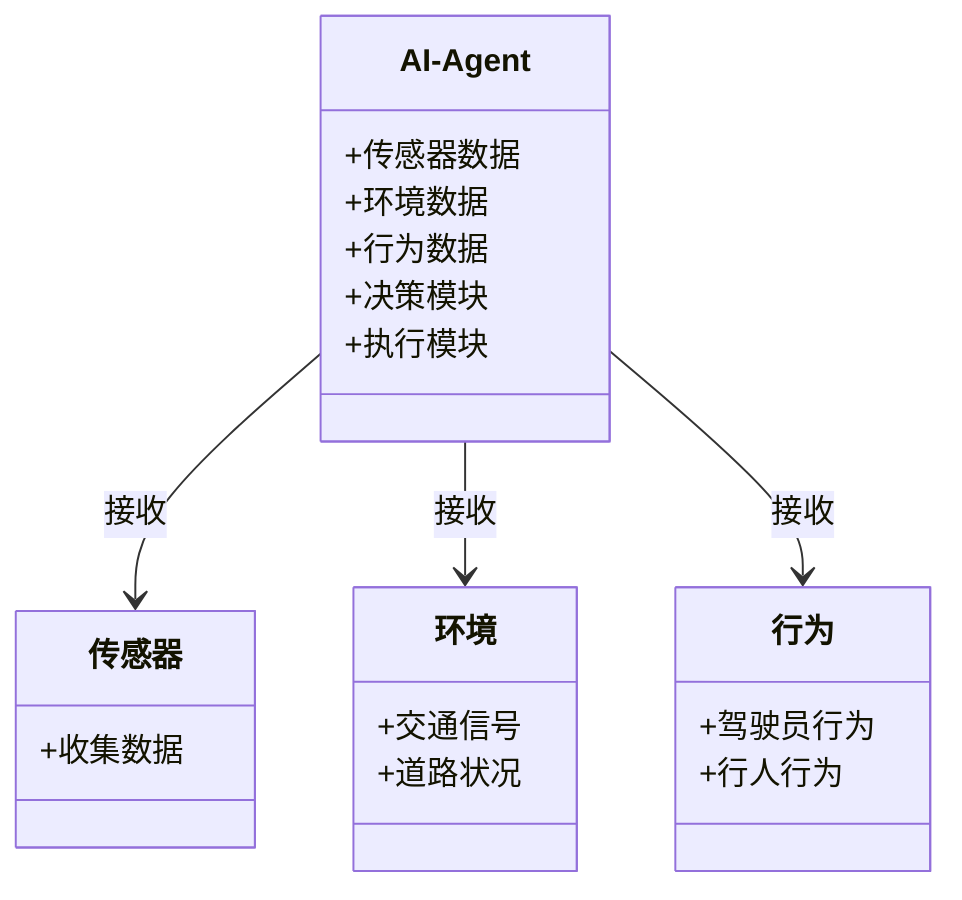
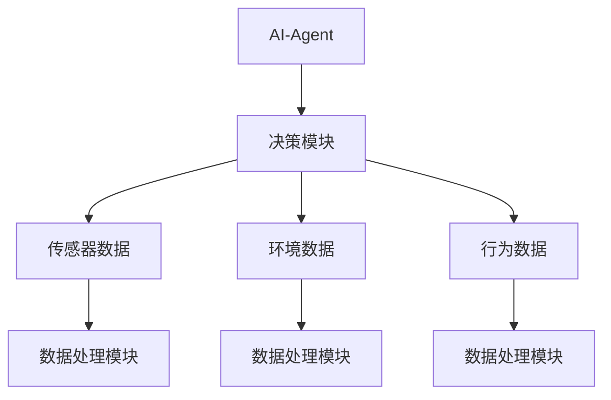
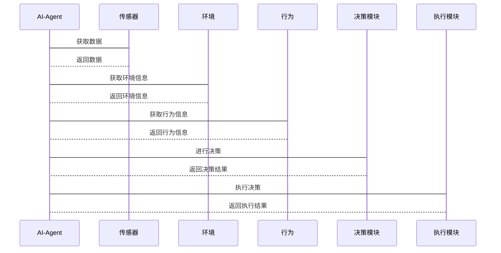

                 


# 第三章: AI Agent的算法原理

## 3.1 AI Agent的核心算法

### 3.1.1 强化学习算法

强化学习是一种通过智能体与环境交互来学习策略的方法。在交通事故预防中，AI Agent可以通过强化学习来优化决策过程。以下是强化学习的基本原理：

#### 3.1.1.1 强化学习的定义与特点
- **定义**: 强化学习是一种机器学习范式，其中智能体通过与环境交互，学习如何采取适当的行动以最大化累积的奖励。
- **特点**:
  - 延迟奖励: 智能体的行为可能在较长时间后才得到反馈。
  - 探索与利用: 在未知环境中，智能体需要在探索新策略和利用已知策略之间找到平衡。

#### 3.1.1.2 强化学习在交通事故预防中的应用
- **应用案例**: AI Agent可以通过强化学习学习如何在复杂的交通环境中做出最优决策，例如在十字路口选择最佳的转向时机，避免事故发生。

#### 3.1.1.3 强化学习的数学模型
强化学习的核心在于Q值的更新公式：
$$ Q(s, a) = Q(s, a) + \alpha \left(r + \gamma \max_{a'} Q(s', a') - Q(s, a) \right) $$
其中：
- \( Q(s, a) \): 状态s下采取行动a的Q值。
- \( \alpha \): 学习率。
- \( r \): 奖励。
- \( \gamma \): 折扣因子。
- \( s' \): 新状态。

#### 3.1.1.4 强化学习算法流程图


#### 3.1.1.5 强化学习的Python实现示例
```python
import numpy as np

# 初始化Q表
Q = np.zeros((4, 2))  # 状态空间大小为4，动作空间大小为2

# 超参数
learning_rate = 0.1
discount_factor = 0.9

def q_learning(state):
    # 探索与利用
    if np.random.random() < 0.9:  # 利用
        action = np.argmax(Q[state])
    else:  # 探索
        action = np.random.randint(0, 2)
    return action

# 训练过程
for episode in range(100):
    state = 0  # 初始状态
    while True:
        action = q_learning(state)
        next_state, reward, done = step(state, action)
        Q[state, action] += learning_rate * (reward + discount_factor * np.max(Q[next_state, :]) - Q[state, action])
        state = next_state
        if done:
            break
```

## 3.2 监督学习算法

监督学习是另一种常用算法，适用于有标签数据的情况。在交通事故预防中，AI Agent可以通过监督学习模型识别交通场景中的潜在危险。

### 3.2.1 监督学习的定义与特点
- **定义**: 监督学习是一种机器学习方法，通过训练数据（输入-输出对）来学习函数，从而对新的输入做出预测。
- **特点**:
  - 需要大量标注数据。
  - 适用于分类和回归任务。

### 3.2.2 监督学习在交通事故预防中的应用
- **应用案例**: 使用监督学习模型识别交通场景中的危险行为，如行人闯红灯、车辆超速等。

### 3.2.3 监督学习的数学模型
以线性回归为例，目标函数为：
$$ y = \theta^T x + b $$
其中：
- \( y \): 输出。
- \( \theta \): 权重向量。
- \( x \): 输入特征向量。
- \( b \): 偏置项。

### 3.2.4 监督学习的Python实现示例
```python
from sklearn.linear_model import LinearRegression

# 训练数据
X = [[1], [2], [3], [4]]  # 特征
y = [2, 4, 6, 8]  # 标签

# 训练模型
model = LinearRegression()
model.fit(X, y)

# 预测
print(model.predict([[5]]))  # 输出 [10]
```

## 3.3 算法的对比与选择

### 3.3.1 强化学习与监督学习的对比
| 特性                | 强化学习                     | 监督学习                     |
|---------------------|-----------------------------|-----------------------------|
| 数据需求            | 需要与环境交互，数据由智能体生成 | 需要大量标注数据             |
| 适用场景            | 适用于动态、未知环境          | 适用于静态、已知环境          |
| 决策实时性          | 高                          | 中                          |

### 3.3.2 算法选择的策略
- **任务需求**: 根据具体的任务需求选择合适的算法。例如，实时决策任务适合强化学习，而历史数据分析任务适合监督学习。
- **数据特性**: 根据数据特性选择算法。强化学习适用于生成数据的场景，而监督学习适用于已有标注数据的场景。

## 3.4 本章小结

在本章中，我们详细探讨了AI Agent在智能交通事故预防中常用的两种算法：强化学习和监督学习。通过对比分析，我们了解了每种算法的特点及其适用场景，为后续的系统设计和实现奠定了理论基础。

---

# 第四章: AI Agent的系统分析与架构设计

## 4.1 问题场景介绍

### 4.1.1 交通事故预防的场景分析
在智能交通系统中，AI Agent需要实时处理大量交通数据，识别潜在危险，并做出最优决策。例如，在自动驾驶中，AI Agent需要根据传感器数据和环境信息，实时调整行驶策略。

## 4.2 系统功能设计

### 4.2.1 领域模型设计
以下是交通事故预防系统的领域模型：


### 4.2.2 系统架构设计
以下是AI Agent的系统架构图：


### 4.2.3 系统接口设计
以下是AI Agent与外部系统的接口设计：


## 4.3 本章小结

在本章中，我们分析了交通事故预防的场景，设计了AI Agent的系统功能模块，并通过类图和序列图展示了系统的架构和接口设计，为后续的项目实现提供了详细的指导。

---

# 第五章: AI Agent的项目实战

## 5.1 环境安装

### 5.1.1 安装Python环境
使用Python 3.8及以上版本，安装必要的库：
```bash
pip install numpy scikit-learn matplotlib
```

### 5.1.2 安装AI框架
安装强化学习框架，如OpenAI Gym：
```bash
pip install gym
```

## 5.2 系统核心实现

### 5.2.1 强化学习实现
以下是基于强化学习的AI Agent实现：
```python
import gym
import numpy as np

env = gym.make('CartPole-v1')
env.seed(42)

# 初始化Q表
Q = np.zeros((env.observation_space.shape[0], env.action_space.n))

# 超参数
learning_rate = 0.1
discount_factor = 0.99

# 训练过程
for episode in range(1000):
    state = env.reset()
    while True:
        # 选择动作
        if np.random.random() < 0.9:  # 利用
            action = np.argmax(Q[state])
        else:  # 探索
            action = env.action_space.sample()
        
        # 执行动作
        next_state, reward, done, _ = env.step(action)
        
        # 更新Q值
        Q[state, action] += learning_rate * (reward + discount_factor * np.max(Q[next_state]) - Q[state, action])
        
        state = next_state
        if done:
            break

print("训练完成！")
```

### 5.2.2 监督学习实现
以下是基于监督学习的AI Agent实现：
```python
from sklearn import tree

# 数据集
X = [[1, 0, 0, 0],
     [0, 1, 0, 0],
     [0, 0, 1, 0],
     [0, 0, 0, 1]]
y = [1, 2, 3, 4]

# 训练决策树模型
model = tree.DecisionTreeClassifier()
model.fit(X, y)

# 预测
print(model.predict([[1, 0, 0, 0]]))  # 输出 [1]
```

## 5.3 项目实战案例分析

### 5.3.1 强化学习案例分析
在强化学习案例中，AI Agent通过与环境的交互，逐步优化Q值，最终能够稳定地控制小车保持平衡。

### 5.3.2 监督学习案例分析
在监督学习案例中，AI Agent能够准确地对输入的交通场景进行分类，识别潜在的危险行为。

## 5.4 项目小结

在本章中，我们通过具体的项目实战，详细展示了AI Agent在智能交通事故预防中的实现过程。通过强化学习和监督学习的对比，读者可以更好地理解不同算法的应用场景和优缺点。

---

# 第六章: 总结与展望

## 6.1 本章总结

通过本文的探讨，我们深入分析了AI Agent在智能交通事故预防中的背景、核心概念、算法原理、系统设计和项目实现。AI Agent作为一种强大的工具，能够在复杂的交通环境中实时做出最优决策，有效预防交通事故的发生。

## 6.2 未来展望

未来，随着AI技术的不断发展，AI Agent在智能交通事故预防中的应用将更加广泛和深入。我们期待看到更多创新的算法和技术，为交通安全做出更大的贡献。

---

# 作者

作者：AI天才研究院/AI Genius Institute & 禅与计算机程序设计艺术/Zen And The Art of Computer Programming

---

以上是《AI Agent在智能交通事故预防中的实践》的完整目录大纲和部分正文内容。如果需要进一步扩展或补充，请随时告知！

